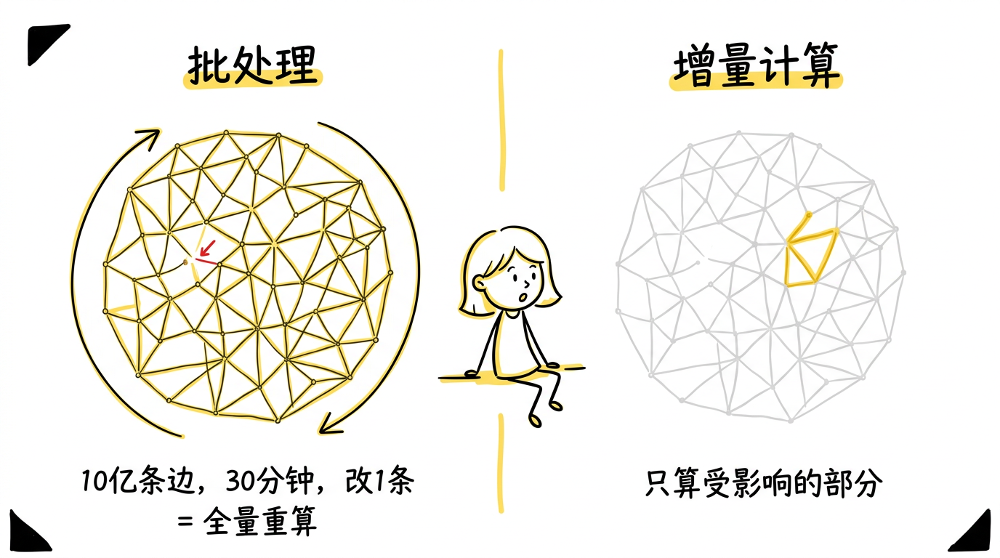
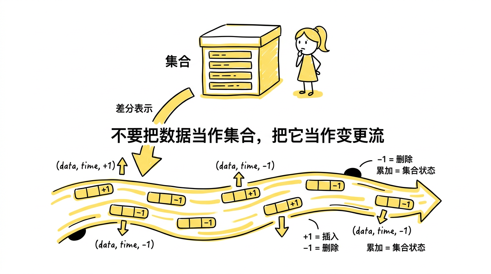
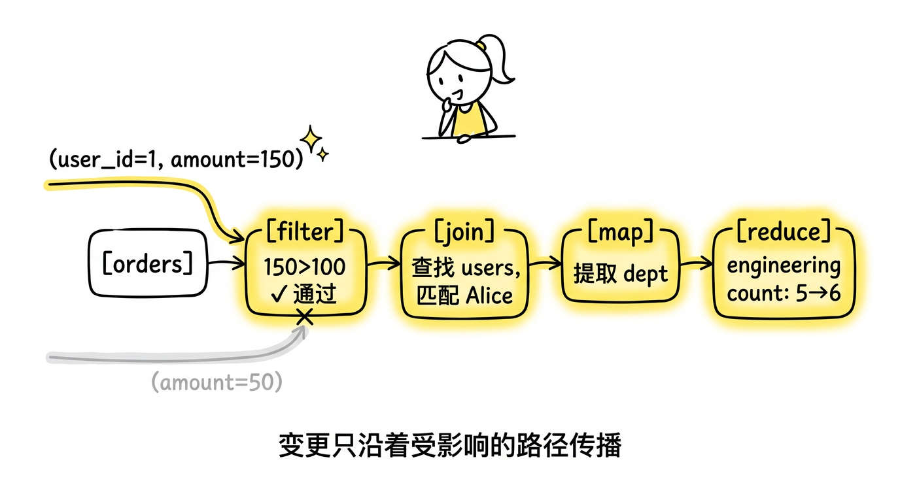
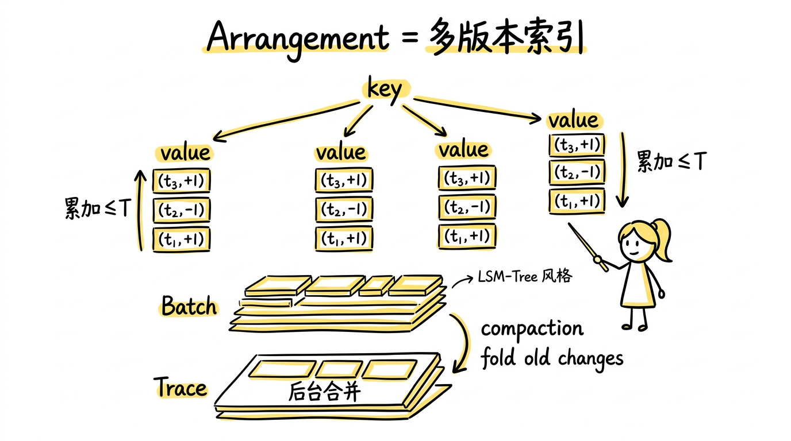
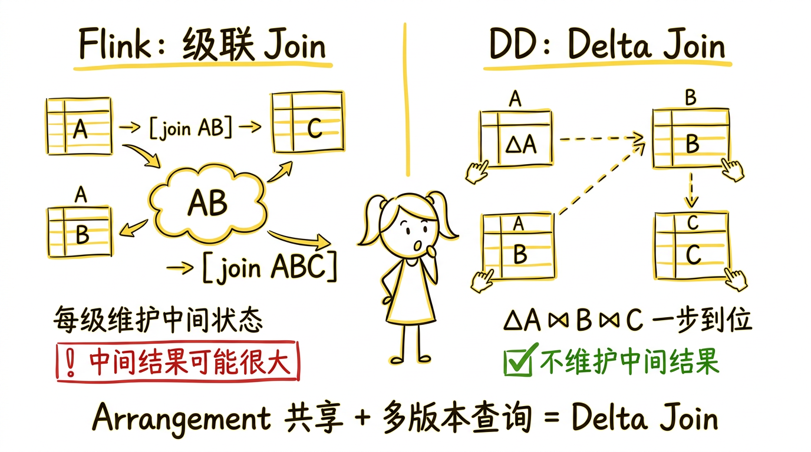

> 论文：*Differential Dataflow*
> 作者：Frank McSherry, Derek G. Murray, Rebecca Isaacs, Michael Isard
> 发表：CIDR 2013

这是系列文章的第二篇。

1. [Timely Dataflow](/posts/timely-dataflow用一个计算模型统一三种数据处理范式/)：用一个支持有环图的数据流模型，统一 batch、streaming 和 iterative 三种计算范式
2. **Differential Dataflow**（本篇）：如何在 timely dataflow 之上实现通用的增量计算
3. [Materialize](/posts/materialize用-dataflow-构建实时-sql-数据库/)：如何用 dataflow 引擎构建一个实时 SQL 数据库

---

## 为什么需要增量计算

上一篇文章介绍的 timely dataflow 用一个计算模型统一了 batch、streaming 和 iterative 三种范式。但它本身并不直接解决另一个同样重要的问题：**当输入数据变化时，如何避免从头重算？**

### 批处理的痛点

假设你在一个社交网络上运行 PageRank。你有 10 亿条边，计算需要 30 分钟。现在有一个用户新关注了另一个用户——增加了一条边。你需要重新计算整个 PageRank 吗？

在传统的批处理系统中，答案是：是的。即使输入只变化了 0.0000001%，整个计算也要从头做一遍。

### 流处理的局限

2013 年前后的流处理系统（Storm、S4）对 append-only 的数据流处理得很好——新消息到来，触发更新。但它们很难处理**撤回**（retraction）。

考虑一个简单的场景：你在维护一个 `SELECT count(*) FROM users WHERE age > 18` 的实时查询。一条新用户记录插入，count 加 1——很简单。但如果某个用户的年龄从 19 更新为 17 呢？你需要：

1. 知道这条记录之前满足过过滤条件
2. 将它从计数中减去
3. 对所有依赖这个计数的下游计算做相应更新

当查询更复杂——涉及多表 join、嵌套聚合、窗口函数——手动管理这些撤回的复杂度会爆炸式增长。每种算子都需要单独实现"如何处理输入变化"的逻辑。

**我们需要一种机制：当输入发生任意变化（插入、删除、修改）时，系统能自动地、通用地只重新计算受影响的部分。**

这就是 differential dataflow 要解决的问题。



---

## 核心思想：差分（Difference）

Differential dataflow 的核心洞察非常简洁：

**不要把数据当作"集合"来操作，把它当作"变更流"来操作。**

### 数据的三元组表示

在 differential dataflow 中，一条数据不再是简单的一行记录，而是一个三元组：

$$(data, time, diff)$$

- **data**：数据内容本身（例如一行记录 `("Alice", 25)`）
- **time**：这条变更发生的逻辑时间戳（继承自 timely dataflow 的偏序时间戳）
- **diff**：一个整数，表示这条数据的"变化量"
  - $+1$：插入一条记录
  - $-1$：删除一条记录
  - 更一般地，diff 可以是任意整数（甚至是其他满足阿贝尔群性质的类型）

为什么 diff 需要满足阿贝尔群？因为增量计算的核心操作是"累加"和"抵消"——插入 $(+1)$ 和删除 $(-1)$ 需要能互相抵消，而且累加的顺序不能影响结果（交换律）。整数加法天然满足这些要求。

### 集合 = 历史变更的累加

Differential dataflow 不存储集合本身，只存储变更。那么"某个时间点的集合长什么样"是怎么回答的？

答案是**累加**。在任意时间点 $T$，要判断一条数据 $d$ 是否在集合中，将所有时间 $\leq T$ 的 diff 求和：

$$\text{count}(d, T) = \sum_{t \leq T} \text{diff}(d, t)$$

- 累加结果为 **1**：$d$ 在集合中（经历过一次插入，没有被删除）
- 累加结果为 **0**：$d$ 不在集合中（要么从未插入，要么插入后又被删除，$+1$ 和 $-1$ 抵消了）
- 累加结果为 **2 或更大**：$d$ 在集合中出现了多份——这是多重集合（multiset）语义，在 SQL 中对应没有去重的场景（例如 `SELECT` 不带 `DISTINCT`）

一个简单的例子。假设数据 $d$ 的变更历史是：

| time | diff | 含义 |
|------|------|------|
| $t_1$ | $+1$ | 插入 |
| $t_2$ | $-1$ | 删除 |
| $t_3$ | $+1$ | 再次插入 |

那么：$\text{count}(d, t_1) = 1$（在），$\text{count}(d, t_2) = 1 - 1 = 0$（不在），$\text{count}(d, t_3) = 1 - 1 + 1 = 1$（又回来了）。

系统不需要记住"集合当前有哪些元素"，只需要记住所有的变更。任何时间点的集合状态都可以从变更历史中恢复。



注意公式中的 $\leq$ 是偏序关系，这意味着只有那些"肯定在 $T$ 之前或等于 $T$"的时间戳上的变更才会被累加。偏序中不可比较的时间戳上的变更不会被包含——这保证了并发处理时的一致性。

### 一个具体的例子

假设我们在维护一个图的边集合，并实时计算每个节点的出度。

初始状态（时间 $t_0$）：

| data | time | diff |
|------|------|------|
| (A→B) | $t_0$ | +1 |
| (A→C) | $t_0$ | +1 |
| (B→C) | $t_0$ | +1 |

此时 A 的出度 = 2，B 的出度 = 1，C 的出度 = 0。

现在在时间 $t_1$，删除边 A→C，增加边 C→A：

| data | time | diff |
|------|------|------|
| (A→C) | $t_1$ | -1 |
| (C→A) | $t_1$ | +1 |

对于出度计算来说，需要处理的增量是：

- A 的出度：因为 A→C 被删除，出度 -1，从 2 变为 1
- C 的出度：因为 C→A 被增加，出度 +1，从 0 变为 1
- B 的出度：**不受影响，无需重算**

这就是差分的威力：**变更只沿着受影响的路径传播**。B 的出度从未被涉及，所以零计算开销。

### 修改 = 删除 + 插入

值得强调的是，differential dataflow 中没有"修改"这个原子操作。一次修改被表示为**先删除旧值，再插入新值**。例如，用户 Alice 的年龄从 25 改为 26：

| data | time | diff |
|------|------|------|
| ("Alice", 25) | $t_2$ | -1 |
| ("Alice", 26) | $t_2$ | +1 |

这看起来冗余，但它使得整个系统只需要处理一种语义——累加差分——而不需要为"修改"单独设计逻辑。所有下游算子都用同样的方式处理插入和删除，修改的语义自然正确。

---

## 算子如何增量化

有了 $(data, time, diff)$ 的表示后，关键问题是：**关系代数的各种操作（map、filter、join、reduce）如何在这种变更流上正确工作？**

一个基本前提：在 differential dataflow 中，**算子的输入是变更流，输出也是变更流**。一个 map 算子消费 $(data, time, diff)$ 三元组，产出的也是 $(data', time', diff')$ 三元组。一个 join 算子消费两侧的变更流，产出的还是变更流。所有算子用同一种"语言"——$(data, time, diff)$——通信，所以它们可以任意串联组合。

答案取决于算子是否需要维护状态。

### 无状态算子：Map、Filter、Union、Negate

这些算子最简单，对每个输入增量独立计算输出增量，不需要任何历史状态：

**Map**：输入 $(d, t, +1)$，输出 $(f(d), t, +1)$。函数 $f$ 作用在 data 上，time 和 diff 原样传递。删除（$-1$）也完全对称——如果 $f$ 将 A 映射到 B，那么"删除一个 A"自然转化为"删除一个 B"。

**Filter**：输入 $(d, t, +1)$，如果 $d$ 满足谓词则原样输出，否则不输出。删除也对称——如果一条记录之前通过了过滤、现在被删除，filter 会传递这个删除。如果它之前就没通过过滤，删除也不会输出。

**Union**：将两侧的增量直接合并转发。两个集合的并集的增量，等于两侧增量的合并。

**Negate**：翻转 diff 符号。$(d, t, +1)$ 变成 $(d, t, -1)$。这个操作用于实现集合差（`EXCEPT`）——$A \setminus B = A \cup \text{Negate}(B)$。

这些算子的增量化是"免费"的——每条输入增量独立处理，不需要额外的存储或计算，无论数据量多大。

### 有状态算子：Join

Join 是关系代数中最核心的操作之一，也是增量化中最有趣的算子。两个 collection $A$ 和 $B$ 按 key 做 join，当一侧有新的增量时，需要在另一侧查找所有匹配的历史记录。

**这意味着 join 需要"记忆"——它必须知道对方 collection 中当前有哪些数据。** 这个记忆就是后面会详细介绍的 arrangement。

#### Join 的增量计算规则

当 A 侧收到一条增量 $(k, v_a, t_a, \Delta_a)$ 时：

1. 在 B 侧的 arrangement 中查找 key 为 $k$ 的所有历史变更
2. 对于每个匹配的 $(k, v_b, t_b, \Delta_b)$，输出 $((k, v_a, v_b),\ t_a \lor t_b,\ \Delta_a \cdot \Delta_b)$

反过来，当 B 侧有增量时，也用同样的方式探测 A 侧。

两个细节值得深入理解。

#### 为什么时间戳取最小上界

输出的时间戳是 $t_a \lor t_b$，即两个时间戳在偏序格上的**最小上界**（lattice join，也叫 least upper bound）。这个选择由正确性约束**唯一确定**。

回忆差分表示的语义：在任意时间 $T$，一条数据是否在集合中，取决于所有 $\leq T$ 的 diff 之和是否不为零。这意味着：

> **正确性约束**：对于任意查询时间 $T$，增量计算得到的 join 结果在 $T$ 时的累积值，必须等于"将 A 在 $T$ 时的完整集合与 B 在 $T$ 时的完整集合做 join"的结果。

假设 A 侧在时间 $t_a$ 插入了 $(k, v_a)$，B 侧在时间 $t_b$ 插入了 $(k, v_b)$。join 结果 $(k, v_a, v_b)$ 应该被赋予什么时间戳 $t_{out}$？

根据正确性约束，$t_{out}$ 必须满足：

- **当 $T \geq t_a$ 且 $T \geq t_b$ 时**：两侧的数据都存在于各自的集合中，所以 join 结果也应该存在。这要求 $t_{out} \leq T$——即 join 结果的时间戳不能晚于 $T$，否则它不会被累加进来。
- **当 $T \not\geq t_a$ 或 $T \not\geq t_b$ 时**：至少有一侧的数据还不存在，join 结果也不应该存在。这要求 $t_{out} \not\leq T$——即 join 结果的时间戳不能早于或等于 $T$。

综合这两条：$t_{out} \leq T$ 当且仅当 $t_a \leq T$ 且 $t_b \leq T$。

满足这个条件的 $t_{out}$ 是什么？正是 $t_a$ 和 $t_b$ 的最小上界 $t_a \lor t_b$。这是最小上界的定义本身：$t_a \lor t_b$ 是满足 $t_a \leq t_a \lor t_b$ 且 $t_b \leq t_a \lor t_b$ 的**最小**元素，因此对于任意 $T$：

$$t_a \lor t_b \leq T \iff t_a \leq T \text{ 且 } t_b \leq T$$

这不是"直觉上合理"——**这是数学上唯一正确的选择**。

##### 全序下的情况

当时间戳是全序的（例如简单的整数时间 $1, 2, 3, \ldots$），任意两个时间戳都可比较，最小上界就是 $\max$：

$$t_a \lor t_b = \max(t_a, t_b)$$

例如，A 侧的数据出现在时间 3，B 侧的数据出现在时间 5。join 结果的时间戳是 $\max(3, 5) = 5$。在时间 4 查询时，B 侧的数据还不存在（$5 \not\leq 4$），所以 join 结果也不存在（$5 \not\leq 4$），正确。在时间 5 查询时，两侧都存在了，join 结果也存在，正确。

##### 偏序下的情况

当时间戳是偏序的（例如 timely dataflow 的 $(epoch, \langle iteration \rangle)$），情况更有趣。两个不可比较的时间戳也有最小上界——各分量取 max：

$$(e_1, \langle c_1 \rangle) \lor (e_2, \langle c_2 \rangle) = (\max(e_1, e_2), \langle \max(c_1, c_2) \rangle)$$

具体例子：$(1, \langle 3 \rangle) \lor (2, \langle 1 \rangle) = (2, \langle 3 \rangle)$。

验证：

- $(2, \langle 3 \rangle) \geq (1, \langle 3 \rangle)$？$2 \geq 1$ 且 $3 \geq 3$，是。
- $(2, \langle 3 \rangle) \geq (2, \langle 1 \rangle)$？$2 \geq 2$ 且 $3 \geq 1$，是。
- 有没有更小的上界？试 $(2, \langle 2 \rangle)$：$\geq (1, \langle 3 \rangle)$？$2 \geq 1$ 但 $2 < 3$，不是。试 $(1, \langle 3 \rangle)$：$\geq (2, \langle 1 \rangle)$？$1 < 2$，不是。所以 $(2, \langle 3 \rangle)$ 确实是最小的上界。

##### 如果不用最小上界会怎样

假设我们错误地选择 $(2, \langle 1 \rangle)$ 作为输出时间戳（也许是因为"epoch 更大所以更晚"的直觉）。考虑在时间 $T = (2, \langle 2 \rangle)$ 查询：

- $T \geq (2, \langle 1 \rangle)$？$2 \geq 2$ 且 $2 \geq 1$，是。所以 join 结果**会出现在查询中**。
- 但 A 侧数据在 $(1, \langle 3 \rangle)$，$T \geq (1, \langle 3 \rangle)$？$2 \geq 1$ 但 $2 < 3$，**不是**。A 侧数据在 $T$ 时不存在。

**矛盾**：A 侧的数据还不存在，但 join 结果已经出现了——查询得到了一条"幽灵结果"，它引用了一条尚不存在的数据。这就是使用错误时间戳导致的不一致。

只有最小上界能保证：join 结果恰好在"两侧数据都已就绪"的最早时刻出现，不早也不晚。

#### 为什么 diff 相乘

两个 diff 相乘得到输出 diff，原因如下：

- 插入 × 插入 = 插入：$+1 \cdot +1 = +1$。A 侧新增一行，B 侧已有一行匹配，join 输出新增一行。
- 插入 × 删除 = 删除：$+1 \cdot (-1) = -1$。A 侧新增一行，但 B 侧的匹配行之前被删除了，join 结果中需要删除这个组合。
- 删除 × 删除 = 插入：$(-1) \cdot (-1) = +1$。这种情况在实际执行中不会直接出现（因为 A 侧和 B 侧的变更不会在同一次 join 中同时作为"新增量"），但它保证了数学上的一致性。

#### 一个具体的 Join 例子

假设有两个 collection，`users` 和 `orders`，按 `user_id` 做 join。下面逐步追踪每次变更时 join 的处理过程，**同时展示两侧 arrangement 的变化**。

**初始状态（时间 $t_0$）**

users 的 arrangement：

| key (user_id) | value (name) | time | diff |
|----------------|--------------|------|------|
| 1 | Alice | $t_0$ | +1 |
| 2 | Bob | $t_0$ | +1 |

orders 的 arrangement：

| key (user_id) | value (item) | time | diff |
|----------------|--------------|------|------|
| 1 | book | $t_0$ | +1 |
| 1 | pen | $t_0$ | +1 |

此时 join 的完整结果是：`{(1, Alice, book), (1, Alice, pen)}`。Bob 没有订单，所以不出现。

**时间 $t_1$：Bob 下了一个订单 (2, laptop)。**

orders 侧收到增量 $(2, \text{laptop}, t_1, +1)$。这条增量首先被写入 orders 的 arrangement：

orders 的 arrangement（新增一行）：

| key (user_id) | value (item) | time | diff |
|----------------|--------------|------|------|
| 1 | book | $t_0$ | +1 |
| 1 | pen | $t_0$ | +1 |
| **2** | **laptop** | **$t_1$** | **+1** |

然后 join 算子用这条增量去探测 users 的 arrangement：

1. 查找 key = 2，找到 $(2, \text{Bob}, t_0, +1)$
2. 输出 $((2, \text{Bob}, \text{laptop}),\ t_0 \lor t_1,\ +1 \cdot +1)$

因为 $t_0 < t_1$（假设全序时间），$t_0 \lor t_1 = t_1$。输出 $((2, \text{Bob}, \text{laptop}),\ t_1,\ +1)$——在时间 $t_1$ 新增了一个 join 结果。

**时间 $t_2$：Alice 退回了 book。**

orders 侧收到增量 $(1, \text{book}, t_2, -1)$。写入 orders 的 arrangement：

orders 的 arrangement（新增一行）：

| key (user_id) | value (item) | time | diff |
|----------------|--------------|------|------|
| 1 | book | $t_0$ | +1 |
| 1 | **book** | **$t_2$** | **-1** |
| 1 | pen | $t_0$ | +1 |
| 2 | laptop | $t_1$ | +1 |

注意 key=1, value=book 现在有两条变更记录。累加 diff：$+1 + (-1) = 0$，说明 book 在 $t_2$ 之后已不存在于 orders 中。但 arrangement **保留了两条历史记录**——它需要支持多版本查询。

join 算子用这条增量探测 users 的 arrangement：

1. 查找 key = 1，找到 $(1, \text{Alice}, t_0, +1)$
2. 输出 $((1, \text{Alice}, \text{book}),\ t_0 \lor t_2,\ (-1) \cdot (+1))$
3. 即 $((1, \text{Alice}, \text{book}),\ t_2,\ -1)$——在时间 $t_2$ 删除了一个 join 结果

**时间 $t_3$：Alice 改名为 Alicia。**

users 侧收到两条增量（修改 = 删除 + 插入）：$(1, \text{Alice}, t_3, -1)$ 和 $(1, \text{Alicia}, t_3, +1)$。写入 users 的 arrangement：

users 的 arrangement（新增两行）：

| key (user_id) | value (name) | time | diff |
|----------------|--------------|------|------|
| 1 | Alice | $t_0$ | +1 |
| 1 | **Alice** | **$t_3$** | **-1** |
| 1 | **Alicia** | **$t_3$** | **+1** |
| 2 | Bob | $t_0$ | +1 |

这次是 users 侧有变更，所以 join 算子用这两条增量去探测 **orders** 的 arrangement。

先处理删除 $(1, \text{Alice}, t_3, -1)$：
1. 在 orders 的 arrangement 中查找 key = 1
2. 找到两个 value 的变更历史：book 有 $(t_0, +1)$ 和 $(t_2, -1)$，pen 有 $(t_0, +1)$
3. 对于 book：两条历史都要参与计算，分别输出：
   - $((1, \text{Alice}, \text{book}),\ t_3,\ (-1) \cdot (+1) = -1)$（对应 $t_0$ 的 +1）
   - $((1, \text{Alice}, \text{book}),\ t_3,\ (-1) \cdot (-1) = +1)$（对应 $t_2$ 的 -1）
4. 对于 pen：输出 $((1, \text{Alice}, \text{pen}),\ t_3,\ (-1) \cdot (+1) = -1)$

再处理插入 $(1, \text{Alicia}, t_3, +1)$：
1. 同样在 orders 中查找 key = 1，同样的历史
2. 对于 book：
   - $((1, \text{Alicia}, \text{book}),\ t_3,\ (+1) \cdot (+1) = +1)$
   - $((1, \text{Alicia}, \text{book}),\ t_3,\ (+1) \cdot (-1) = -1)$
3. 对于 pen：输出 $((1, \text{Alicia}, \text{pen}),\ t_3,\ (+1) \cdot (+1) = +1)$

输出的增量看起来很多，但按 $(data, time)$ 分组累加后：

| data | time | 累加 diff |
|------|------|-----------|
| (1, Alice, book) | $t_3$ | $-1 + 1 = 0$ |
| (1, Alice, pen) | $t_3$ | $-1$ |
| (1, Alicia, book) | $t_3$ | $+1 + (-1) = 0$ |
| (1, Alicia, pen) | $t_3$ | $+1$ |

diff 为 0 的项可以消除（没有实际变化）。最终的净增量只有两条：

- $((1, \text{Alice}, \text{pen}),\ t_3,\ -1)$
- $((1, \text{Alicia}, \text{pen}),\ t_3,\ +1)$

效果：join 结果中 `(1, Alice, pen)` 被替换为 `(1, Alicia, pen)`。涉及 book 的变更互相抵消了——因为 book 在 $t_2$ 就已经不存在了，改名不影响它。Bob 的 join 结果也完全不受影响。

### 有状态算子：Reduce

Reduce（聚合）是最复杂的增量化算子。它按 key 分组后对每组的 values 应用聚合函数（如 count、sum、max、自定义函数等），并输出每个 key 的聚合结果。

#### Reduce 的增量计算逻辑

与 join 不同，reduce 的增量化不能简单地"用输入增量直接计算输出增量"。原因是聚合函数通常不是线性的——知道"新增了一个 value"并不总能直接推出"聚合结果变化了多少"。例如，`max` 操作：新增一个值时，如果它比当前最大值大，输出变化；如果比当前最大值小，输出不变。你必须知道当前最大值才能做判断。

因此 reduce 的增量化采取了一种**重算再做差**的策略：

1. 从输入的 arrangement 中获取 key $k$ 在时间 $t$ 的**完整输入集合**（通过累加所有 $\leq t$ 的历史变更）
2. 对完整集合重新计算聚合结果
3. 与之前缓存的输出结果比较
4. 输出新旧结果之间的差异

#### 一个具体的 Reduce 例子

假设我们在计算每个部门的员工人数：`SELECT dept, count(*) FROM employees GROUP BY dept`。

初始状态（时间 $t_0$），employees 的 arrangement：

| key (dept) | value (name) | time | diff |
|------------|--------------|------|------|
| engineering | Alice | $t_0$ | +1 |
| engineering | Bob | $t_0$ | +1 |
| engineering | Charlie | $t_0$ | +1 |
| sales | David | $t_0$ | +1 |

reduce 的初始输出：

| data | time | diff |
|------|------|------|
| (engineering, 3) | $t_0$ | +1 |
| (sales, 1) | $t_0$ | +1 |

**时间 $t_1$：Alice 从 engineering 转到 sales。** 输入增量：

| key (dept) | value (name) | time | diff |
|------------|--------------|------|------|
| engineering | Alice | $t_1$ | -1 |
| sales | Alice | $t_1$ | +1 |

Reduce 的处理过程：

**对 key = engineering：**
1. 累加所有 $\leq t_1$ 的变更：Alice $(+1, -1)$ = 0（不在了），Bob $(+1)$ = 1，Charlie $(+1)$ = 1
2. 新的完整集合 = {Bob, Charlie}，count = 2
3. 之前的输出是 (engineering, 3)
4. 输出增量：$((\text{engineering}, 3), t_1, -1)$ 和 $((\text{engineering}, 2), t_1, +1)$

**对 key = sales：**
1. 累加所有 $\leq t_1$ 的变更：David $(+1)$ = 1，Alice $(+1)$ = 1
2. 新的完整集合 = {David, Alice}，count = 2
3. 之前的输出是 (sales, 1)
4. 输出增量：$((\text{sales}, 1), t_1, -1)$ 和 $((\text{sales}, 2), t_1, +1)$

注意输出的增量格式：旧结果撤回（$-1$），新结果插入（$+1$）。这种"先撤后插"的模式使得下游算子——无论是另一个 reduce、一个 join 还是任何其他算子——都能用统一的差分语义正确处理变更。

**另一个关键点：只有受影响的 key 被重算。** engineering 和 sales 的 count 需要重新计算，但其他部门（如果有的话）完全不受影响。当 10 亿条记录中只有 1 条发生变化时，只有 1 个（或少数几个）key 的聚合需要重算——这就是 per-key 增量化的效率所在。

#### 特殊聚合的优化

虽然 reduce 的通用策略是"重算再做差"，但对于某些特定的聚合函数，可以做得更高效：

**可累加聚合（sum、count）：** 这些聚合函数是线性的——知道 diff 就能直接计算输出变化，不需要回溯历史。sum 的增量就是新增值 × diff，count 的增量就是 diff。

**层级聚合（min、max、top-k）：** 这些聚合不能直接从 diff 推导，但可以通过维护一个有序数据结构来加速。例如 max：维护一个有序列表，新增值只需检查是否超过当前最大值。

通用策略保证了正确性，特殊优化提高了效率。系统可以在编译时识别聚合函数的类型，自动选择最优的实现路径。

### 任意组合自动增量化

这里体现了 differential dataflow 最核心的设计：**增量化是在算子层面实现的，而不是为特定查询推导增量规则。**

每个算子独立地将输入增量转换为输出增量。算子之间通过 $(data, time, diff)$ 三元组通信，接口完全统一。无论你怎么组合这些算子——map 接 filter 接 join 接 reduce 再接另一个 join——增量会自动逐层传播。你不需要为每种新的查询模式去推导它应该如何增量维护。

举一个稍复杂的例子。假设查询是：

```sql
SELECT u.dept, count(*)
FROM users u JOIN orders o ON u.id = o.user_id
WHERE o.amount > 100
GROUP BY u.dept
```

对应的 dataflow pipeline是：`orders → filter(amount > 100) → join(users) → map(extract dept) → reduce(count)`

当 orders 中新增一条记录 $(user\_id=1, amount=150)$ 时，增量的传播路径：

1. **filter**：$150 > 100$，通过。输出增量：$((\text{user\_id}=1, \text{amount}=150), t, +1)$
2. **join**：在 users 的 arrangement 中查找 user_id = 1，找到 Alice（engineering 部门）。输出增量：$((\text{Alice}, \text{engineering}, 150), t, +1)$
3. **map**：提取 dept。输出增量：$(\text{engineering}, t, +1)$
4. **reduce**：engineering 的 count 从 5 变为 6。输出增量：$((\text{engineering}, 5), t, -1)$ 和 $((\text{engineering}, 6), t, +1)$

如果这条订单的 amount 是 50（不满足 filter），则在第 1 步就被丢弃，后续所有算子零开销。如果 user_id = 1 在 users 中不存在，join 在第 2 步不会产生匹配，后续也是零开销。**增量沿着受影响的路径传播，不受影响的路径完全静默。**



### Iterate：增量化的迭代

Differential dataflow 的迭代建立在 timely dataflow 的循环结构之上。上一篇文章详细介绍了 timely dataflow 如何用循环计数器和 pointstamp 追踪来支持有环图中的迭代——differential dataflow 在此之上加入了增量语义。

#### 迭代收敛

循环中的每一轮迭代对应 timely dataflow 的一个循环计数器增量。在循环内，differential dataflow 的算子正常处理增量——每轮迭代的输出变更流入下一轮作为输入。当某一轮迭代**不再产生任何新的增量**时，timely 的进度追踪机制自动检测到没有活跃的 pointstamp 了，frontier 推进，迭代终止。

这里 differential dataflow 和 timely dataflow 的配合非常精妙：

- **Timely** 负责判断"什么时候这一轮迭代的所有变更都已处理完"（通过 pointstamp 和 capability 追踪）
- **Differential** 负责判断"这一轮迭代是否产生了任何新的变更"（通过变更流是否为空）
- 当一轮迭代不再产生任何变更，迭代收敛

#### 增量化的迭代：外部输入变更时不必从头迭代

迭代的真正威力在于增量更新场景。考虑一个图的连通分量（connected components）计算——这是一个典型的迭代算法：每个节点不断将自己知道的最小标签传播给邻居，直到所有连通分量中的节点都持有相同的最小标签。

假设初始图有 100 万个节点，经过 10 轮迭代收敛后，连通分量计算完成。现在图中新增了一条边 $(u, v)$，连接了两个之前不连通的分量。

在传统批处理系统中，你需要从头开始：重新加载 100 万个节点，重新跑 10 轮迭代。

在 differential dataflow 中，系统将这条新边作为增量注入循环。假设 $u$ 所在分量的标签是 3，$v$ 所在分量的标签是 7。新边的增量导致 $v$ 的标签从 7 更新为 3——只有这一个节点的标签变了。这个变更传播到 $v$ 的邻居，它们的标签也可能更新……但传播只会影响 $v$ 所在的旧分量中的节点。$u$ 所在分量的节点标签不变，其他不相关的分量也完全不受影响。

最终，系统只重新迭代了受影响的那部分节点，迭代轮数也可能远少于初始计算——因为大部分结构已经稳定了。

---

## Arrangement：增量计算的核心数据结构

上一节提到 join 和 reduce 需要访问历史状态——join 需要查找对方 collection 中 key 匹配的记录，reduce 需要获取某个 key 的完整输入集合。这个"历史状态"就是 **arrangement**——differential dataflow 中最重要的数据结构。

### 为什么需要 Arrangement

考虑上面的 join 例子。当 orders 侧收到 $(1, \text{book}, t_2, -1)$ 时，系统需要在 users 侧查找 key = 1 的所有数据。这意味着 users 的数据必须以某种方式被**索引**，使得按 key 查找是高效的。

但仅仅有索引还不够。Timely dataflow 中不同时间戳的数据可能在同时处理（偏序时间戳允许并发）。考虑这种场景：在 epoch 1 的第 3 轮迭代正在进行时，epoch 2 的第 1 轮迭代也在同时进行。两者查询 arrangement 时，看到的数据应该不同——epoch 2 的查询应该看到 epoch 2 之前的所有变更，而 epoch 1 的查询只应该看到 epoch 1 之前的变更。

**Arrangement 需要是多版本的——它必须能回答"在时间 $t$ 时刻，key 为 $k$ 的数据有哪些？"这个问题，其中 $t$ 可以是偏序中的任意时间戳。**

### Arrangement 的结构

一个 arrangement 在逻辑上是一个从 $(key, value)$ 到变更历史的映射：

```
key → value → [(time₁, diff₁), (time₂, diff₂), ...]
```

对于每个 $(key, value)$ 对，arrangement 记录了它在不同时间点的所有变更。要查询时间 $T$ 时某个 key 的当前状态，需要：

1. 找到该 key 下的所有 $(value, time, diff)$ 三元组
2. 过滤出 $time \leq T$ 的变更
3. 按 $(value)$ 分组，对 diff 求和
4. 保留 sum 不为零的 value

在物理实现上，arrangement 由两部分组成：

**Batch**：一批新数据到来后形成的有序段。每个 batch 内部按 $(key, value, time)$ 排序，支持高效的二分查找。一个 batch 通常对应一个时间戳区间内的所有变更。

**Trace**：多个 batch 的集合，加上合并管理逻辑。随着时间推进，trace 中的 batch 会被逐步合并——两个相邻的 batch 可以归并排序为一个更大的 batch。合并时，相同 $(key, value, time)$ 的 diff 会被累加；如果累加结果为 0，这条记录可以删除。

这种 batch + trace 的分层结构类似于 LSM-Tree 的设计理念——新数据快速写入小的 batch，后台异步将 batch 合并为更大的段，保持读取效率。



### Compaction（压缩）

随着时间推进，arrangement 中累积的历史变更会越来越多。如果我们不再需要查询时间 $T$ 之前的历史状态，可以将旧的变更"折叠"。这就是 **logical compaction**。

具体来说，compaction frontier 是一个时间戳 $T_{since}$，表示"我们不再关心任何严格早于 $T_{since}$ 的时间点的状态"。Compaction 的操作是：对于每个 $(key, value)$，将所有 $time < T_{since}$ 的变更的 diff 累加，合并为一条时间戳为 $T_{since}$ 的变更。

例如，某个 $(key, value)$ 对的变更历史是：

```
(t₁, +1), (t₂, -1), (t₃, +1), (t₄, +1)
```

如果 compaction frontier 推进到 $t_3$，前三条记录合并为：

```
(t₃, +1), (t₄, +1)
```

因为 $+1 - 1 + 1 = +1$，在 $t_3$ 时刻的累积状态就是"存在一份"。$t_4$ 的变更在 frontier 之后，保持不变。

Compaction 后，你仍然可以正确查询 $t_3$ 及之后任意时间点的状态，但无法再查询 $t_1$ 或 $t_2$ 时的状态——那些信息已经被折叠了。在大多数场景下，我们只关心当前和最近的状态，不需要回溯很久以前的历史，所以 compaction 是一个很好的时间-空间权衡。

### Sharing（共享）

Arrangement 的另一个关键特性是**共享**。如果多个算子都需要按相同的 key 索引同一个 collection，它们可以共享同一个 arrangement，而不需要各自维护一份副本。

这在实际系统中极为重要。考虑一个场景：数据库中有一张 `users` 表，上面建了 10 个物化视图，其中 6 个都按 `user_id` 做 join。如果每个视图都维护自己的 `users` 按 `user_id` 索引的副本，内存用量是 6 倍。共享 arrangement 后，只需要一份。

共享也意味着当 `users` 表有更新时，arrangement 只需要更新一次，所有共享它的算子都能看到最新的数据。

---

## 时间戳与正确性

到这里，我们已经看到了 differential dataflow 的主要机制：差分表示、各类算子的增量化、arrangement。但还有一个关键问题没有讨论：**这些增量计算的结果一定是正确的吗？**

正确性的含义是：对于任意时间点 $t$，增量计算的结果必须与"用完整数据从头算"的结果完全一致。换句话说，增量计算是一种**优化**，不改变语义。

这个正确性保证来自两个层面：

**Timely dataflow 保证了执行顺序的正确性。** 通过 pointstamp 和 frontier 机制，系统确保一个算子在时间 $t$ 上的所有输入都到齐后，才会触发该时间戳的 notification。这意味着 reduce 在计算 key $k$ 在时间 $t$ 的聚合时，能看到所有 $\leq t$ 的输入变更——不会遗漏，也不会包含未来的变更。

**差分表示保证了数学上的正确性。** $(data, time, diff)$ 本质上是一个函数 $f: D \times T \to \mathbb{Z}$，每个算子对应一个在这个函数空间上的变换。只要每个算子的变换保持了差分语义的正确性（即输出的差分在累加后等于"对完整数据集应用该算子"的结果），那么任意组合也保持正确。这是通过归纳法证明的——每个基本算子的正确性独立验证，组合的正确性由此推出。

偏序时间戳在这里起着关键作用。它确保了并发处理不会引入不一致——两个不可比较的时间戳上的变更不会相互干扰，因为它们对应的是独立的计算路径。

---

## 与传统增量视图维护（IVM）的对比

关系型数据库中，增量视图维护（Incremental View Maintenance）是一个研究了几十年的课题。理解 differential dataflow 与 IVM 的区别，有助于看清它的创新之处。

### IVM 的方法

传统 IVM 的核心思路是按**算子类型**预先推导增量维护规则，然后在创建物化视图时根据查询结构套用这些规则。

数据库系统内置了一组规则，例如：

- **SELECT-PROJECT-JOIN 视图**：当基表 A 中插入一行 $\delta a$ 时，视图的增量是 $\delta a \bowtie B$；当 B 中删除一行 $\delta b$ 时，视图的增量是 $A \bowtie (-\delta b)$。
- **简单聚合视图**（COUNT、SUM）：维护一个计数器或累加器，基表变更时直接加减。
- **DISTINCT 视图**：维护每个值的出现次数，加减后判断是否跨越 0/1 边界。

对于这些基础模式，规则是通用的——不需要为每个 SQL 单独推导。但问题在于，当多种算子**组合**在一起时：

```sql
CREATE VIEW v AS
SELECT dept, avg(salary)
FROM employees e JOIN departments d ON e.dept_id = d.id
WHERE d.location = 'NYC'
GROUP BY dept
HAVING avg(salary) > 100000
```

系统需要把 JOIN 的增量规则、WHERE 的过滤规则、GROUP BY + AVG 的聚合规则、HAVING 的后过滤规则**串联**起来，推导出端到端的增量维护逻辑。这种组合推导的复杂度随算子种类增长而急剧上升：

**问题一：支持的查询模式有限。** 简单的 select-project-join 没问题，但一旦涉及外连接、窗口函数、子查询嵌套、DISTINCT + 聚合的组合，推导正确的组合规则越来越困难。结果是：**很多商业数据库遇到不支持的查询模式时，直接拒绝创建增量维护的物化视图。** PostgreSQL 的 `REFRESH MATERIALIZED VIEW` 至今是全量重算，不做增量维护。Oracle 的 `FAST REFRESH` 只支持一个有限的查询子集。

**问题二：嵌套视图。** 如果视图 V2 引用了视图 V1（`CREATE VIEW v2 AS SELECT ... FROM v1 JOIN ...`），增量维护需要跨视图推导——V1 的变更如何传播到 V2。每增加一层嵌套，推导复杂度都在增长。

**问题三：迭代。** 传统 IVM 完全不处理迭代计算。如果你的查询涉及递归 CTE 或图算法，IVM 无能为力。

### Differential Dataflow 的方法

Differential dataflow 采取了一种完全不同的路径：**不为每种查询推导特定的增量规则，而是让每个算子自己具备增量化能力。**

因为增量化是在算子层面实现的，任意算子的任意组合都自动支持增量计算。你不需要为新的查询模式写新的增量维护规则。外连接？用 join + negate 组合。子查询？展开为 join 和 reduce 的组合。递归？用 iterate。所有情况都被统一框架覆盖。

这种通用性的代价是 **arrangement 的内存开销**——join 和 reduce 需要维护输入数据的索引。传统 IVM 如果只处理简单查询，可能不需要这些索引。但考虑到 differential dataflow 带来的通用性和正确性保证（尤其是对复杂查询和迭代计算的支持），这个代价在大多数场景下是值得的。

---

## 与流处理引擎（Flink）的对比

Differential dataflow 和 Flink 这样的流处理引擎在表面上有很多相似之处——都处理变更流，都有有状态的算子（join、agg），都支持 retraction。但两者的底层模型有根本区别。

### 相似之处

对于简单的流式pipeline（filter → join → agg，不涉及迭代），两者的行为确实非常接近：

- 都是"变更进来，变更出去"——每个算子收到输入变更后，更新自己的状态，产出输出变更
- 有状态算子（join、agg）都需要维护索引——Flink 叫 state（存在 RocksDB 或堆内存中），DD 叫 arrangement
- 都支持撤回——Flink 用 `+I/-D/+U/-U` 消息类型，DD 用 $(data, time, diff)$ 中的 diff 正负

如果你只做简单的流式 ETL，两者的效果差别不大。

### 区别一：批量处理 vs 逐条处理

Flink 的模型是 **per-record** 的——每条记录到达时立即触发一次 state 查找、一次 state 更新、一次输出。100 条变更 = 100 次独立的 state 操作。

DD 的模型天然面向**变更的集合**。同一个时间戳上的所有变更构成一个 batch，arrangement 的数据结构围绕 batch 设计——新变更形成一个按 $(key, value, time)$ 排序的有序段，查找时可以批量做归并扫描，对缓存更友好。Compaction 也是 batch 级的操作。

Flink 后来在 Table API 中加了 mini-batch 优化（`table.exec.mini-batch.enabled`），可以缓冲记录后批量处理，但这是在 per-record 模型上的补丁，不是基础设计。

### 区别二：Delta Join

这是 arrangement 共享带来的关键能力。

考虑一个三路 join：`A ⋈ B ⋈ C`。

**Flink 的做法（linear join）**：级联两个二路 join。先算 `A ⋈ B` 得到中间结果 `AB`，再算 `AB ⋈ C`。处理 `A ⋈ B` 的算子看不到 C 的 state，处理 `AB ⋈ C` 的算子看不到 A 和 B 各自的 state——因为 Flink 的 state 是 per-operator 私有的。中间结果 `AB` 可能很大，需要额外的存储和维护开销。

**DD 的做法（delta join）**：不维护中间结果。当 A 有变更 $\Delta A$ 时，直接用 $\Delta A$ 探测 B 的 arrangement，得到的结果再探测 C 的 arrangement，一步到位算出最终增量 $\Delta A \bowtie B \bowtie C$。当 B 变更时，$A \bowtie \Delta B \bowtie C$。当 C 变更时，$A \bowtie B \bowtie \Delta C$。

Delta join 之所以可行，依赖两个前提：

1. **Arrangement 共享**——$\Delta A$ 的处理路径需要同时访问 B 和 C 的 arrangement，DD 的 arrangement 是跨算子共享的
2. **多版本查询**——探测 arrangement 时需要回答"在时间 $t$ 时 B 中有哪些数据"，arrangement 的多版本结构支持这种查询

在实际系统中，一个涉及 5 张表的 join 查询，delta join 只需要共享 5 张基表的 arrangement，不维护任何中间结果。同样的查询在 Flink 中需要 4 级级联 join，每级都有自己的中间状态。



### 区别三：迭代

这是最根本的功能差异。DD 的偏序时间戳（继承自 timely dataflow 的 $(epoch, \langle iteration \rangle)$ 结构）使得系统可以在有环图中精确追踪进度，支持迭代计算的增量更新——输入变了，不需要从头迭代，只重新处理受影响的部分。

Flink 的时间是全序的，没有 timely dataflow 那套基于 pointstamp 的进度追踪。Flink 的 `iterate()` 只是一条简单的反馈边，无法做到"输入变了，迭代增量更新"。正如 timely dataflow 的作者 Frank McSherry 在 [GitHub 上的回复](https://github.com/TimelyDataflow/timely-dataflow/issues/110) 中所说：Flink 的迭代限制是设计层面的（"absolutely part of their design"），不是工程上还没做完。

---

## 小结

Differential dataflow 的核心贡献是一个简洁而强大的抽象：**将数据表达为 $(data, time, diff)$ 三元组构成的变更流，在此之上实现通用的增量计算。**

它建立在 timely dataflow 之上：

- **Timely dataflow** 提供了精确的进度追踪——知道"什么时候一个时间点的所有变更都已处理完"
- **Differential dataflow** 在此基础上实现了增量语义——"输入变化时，只计算变化的部分"

两者配合的结果是：你可以像写批处理查询一样组合算子（map、filter、join、reduce），系统自动将其增量化执行。输入数据的任意变更（插入、删除、修改）会自动且正确地传播到最终输出。

但对于大多数用户来说，直接写 differential dataflow 程序还是太底层了。人们更熟悉 SQL，更习惯通过 `CREATE MATERIALIZED VIEW` 来表达持续更新的查询。

能不能在 differential dataflow 之上搭建一个 SQL 数据库，让用户用标准 SQL 来表达查询，系统自动将其编译为增量维护的 dataflow？

这就是下一篇文章的主题：[Materialize：用 Differential Dataflow 构建实时 SQL 数据库](/posts/materialize用-differential-dataflow-构建实时-sql-数据库/)。
