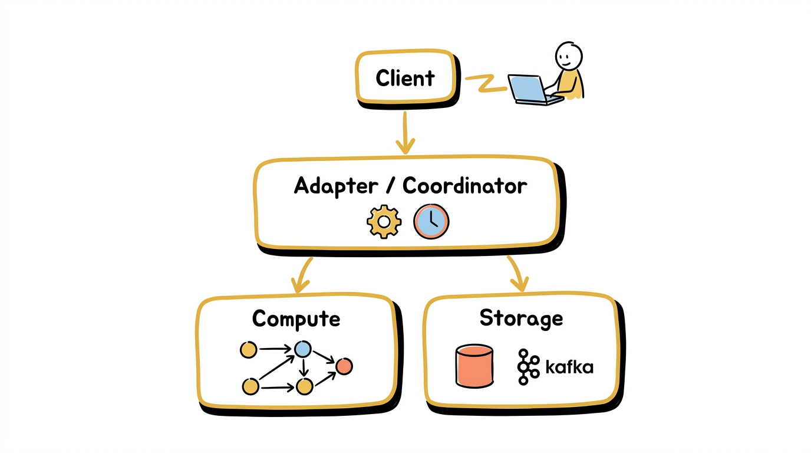
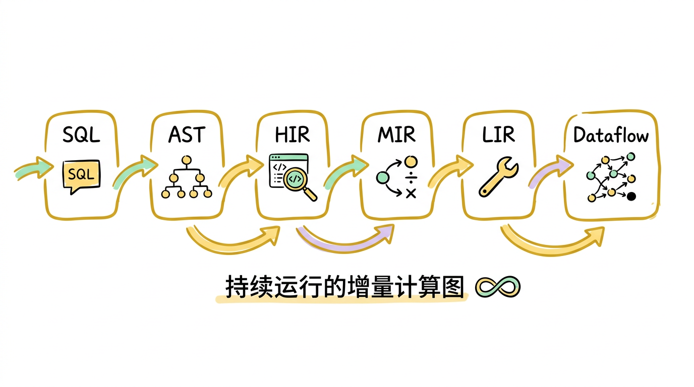
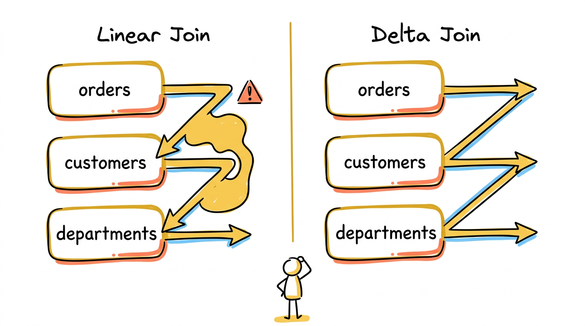
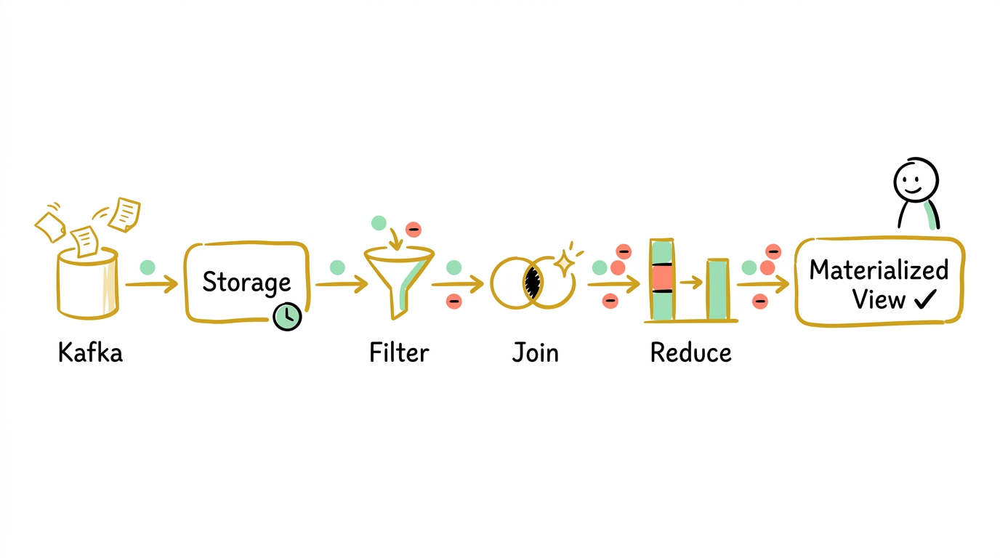
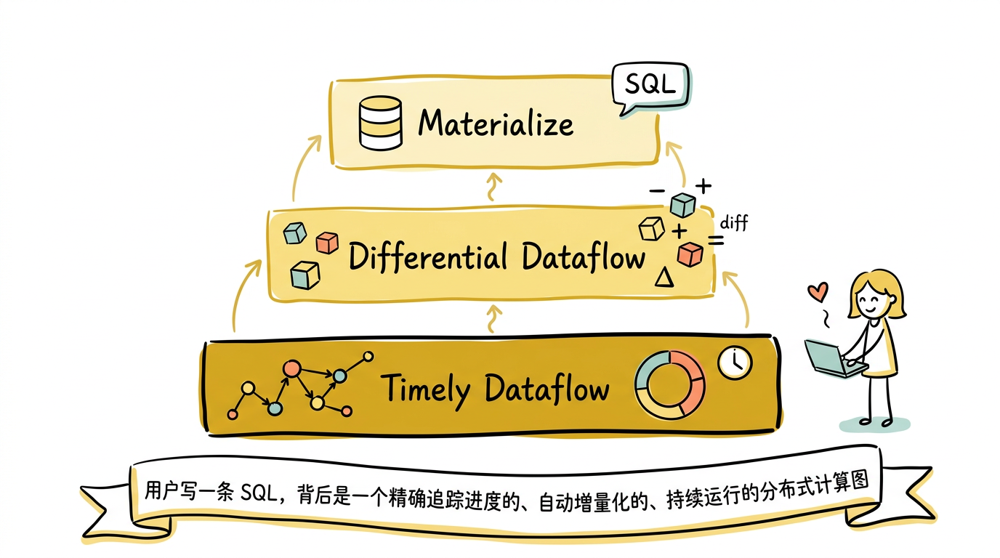

这是系列文章的第三篇，也是最后一篇。

1. [Timely Dataflow](/posts/timely-dataflow用一个计算模型统一三种数据处理范式/)：用一个支持有环图的数据流模型，统一 batch、streaming 和 iterative 三种计算范式
2. [Differential Dataflow](/posts/differential-dataflow让计算只做增量/)：如何在 timely dataflow 之上实现通用的增量计算
3. **Materialize**（本篇）：如何用 dataflow 引擎构建一个实时 SQL 数据库

---

## 为什么需要 Materialize

前两篇文章介绍了两个强大的基础设施：timely dataflow 提供精确的进度追踪，differential dataflow 提供通用的增量计算。但它们都是 Rust 库——使用者需要用 Rust 编写 dataflow 程序，手动定义算子、管理 arrangement、处理输入输出。

这对大多数数据工程师和分析师来说门槛太高了。人们更熟悉的是 SQL：写一条 `SELECT ... FROM ... WHERE ... GROUP BY ...`，数据库帮你搞定一切。

同时，现有的技术方案在"实时物化视图"这个需求上都有明显的短板：

**传统数据库的物化视图**：PostgreSQL、Oracle 都支持 `CREATE MATERIALIZED VIEW`，但更新通常需要手动触发 `REFRESH MATERIALIZED VIEW`，每次刷新都是全量重算。即使有些系统支持增量刷新（如 Oracle 的 `FAST REFRESH`），也只覆盖有限的查询类型。

**流处理引擎**（Flink、ksqlDB）：能做流式计算，但它们不是数据库。没有标准的 SQL 语义（比如 Flink SQL 的语义和传统 SQL 有微妙差异），没有事务隔离级别，没有一致性快照查询。你不能像用 PostgreSQL 一样用它们。

**Materialize 的定位是：一个用标准 SQL 接口操作的数据库，其物化视图在数据源变更时自动、实时、增量地更新。** 用户写 `CREATE MATERIALIZED VIEW`，Materialize 将这条 SQL 编译为一个 differential dataflow 程序，持续运行，当上游数据变化时自动更新视图内容。查询物化视图就像查询普通表一样——`SELECT * FROM my_view` 永远返回最新结果。

---

## 架构总览



Materialize 的整体架构分为三个层次：

- **pgwire 协议层**：兼容 PostgreSQL 客户端协议
- **Adapter 层（协调器）**：SQL 解析与编译、时间戳分配、dataflow 管理
- **Compute 层**：运行 timely + differential dataflow
- **Storage 层**：数据摄入与持久化

### pgwire 协议

Materialize 实现了 PostgreSQL 的网络协议（pgwire）。你可以用 `psql` 命令行、JDBC 驱动、任何 PostgreSQL 客户端库直接连接 Materialize，不需要学习新的客户端工具或协议。从客户端的视角来看，Materialize 就是一个 PostgreSQL 数据库。

这个设计选择降低了用户的迁移成本——现有的应用代码、BI 工具、监控面板，只需要改一下连接字符串就能接入 Materialize。

### Adapter 层（协调器）

协调器是整个系统的"大脑"，承担以下职责：

**SQL 解析与编译**：接收 SQL 语句，经过 解析 → AST → HIR → MIR → LIR → Dataflow 的完整编译pipeline（后面详细介绍）。

**时间戳分配**：这是保证一致性的核心。每个读查询和写操作都会被分配一个逻辑时间戳。协调器需要确保：分配给读查询的时间戳对应的所有变更都已经在 Compute 层处理完毕。这个机制后面会详细讨论。

**Dataflow 管理**：协调器知道系统中运行了哪些 dataflow（对应哪些物化视图和索引），管理它们的创建、删除和 arrangement 共享。

### Storage 层

Storage 层负责从外部数据源持续摄入数据。支持的数据源包括：

- **Kafka**：消费 Kafka topic，支持 Avro、Protobuf、JSON 等格式
- **PostgreSQL CDC**：通过逻辑复制（logical replication）持续捕获 PostgreSQL 的变更
- **Webhook**：接收 HTTP 推送的数据

Storage 层将外部数据源的变更转换为 differential dataflow 的 $(data, time, diff)$ 三元组。对于 Kafka，每条消息对应一条 $(data, t, +1)$ 插入；对于 PostgreSQL CDC，INSERT 对应 $(data, t, +1)$，DELETE 对应 $(data, t, -1)$，UPDATE 对应一条删除加一条插入。

一个关键问题是：**外部数据源的时间如何映射到 Materialize 的逻辑时间戳？** Kafka 消息有 offset，PostgreSQL CDC 有 LSN（Log Sequence Number）。Storage 层需要将这些外部时间戳映射到 Materialize 的全局逻辑时间线上，同时维护一个 frontier——告诉 Compute 层"所有小于这个时间戳的数据都已经摄入完毕"。这个 frontier 就是 timely dataflow 进度追踪的输入端。

### Compute 层

Compute 层运行 timely dataflow 和 differential dataflow 的 worker。所有的物化视图、索引、订阅都在这里以 dataflow 图的形式持续运行。

Compute 层的 worker 可以水平扩展——多个 worker 并行处理不同的数据分片（按 key 哈希分区）。Worker 之间通过 timely dataflow 的通信基础设施交换数据和进度信息。

---

## SQL 如何变成 Dataflow



一条 SQL 语句到最终的 dataflow 图，经历以下编译阶段：

**SQL → AST → HIR → MIR → LIR → Dataflow 图**

- **AST**：解析阶段，将 SQL 文本转为抽象语法树
- **HIR**：语义分析与高层中间表示
- **MIR**：关系代数表达式 + 优化
- **LIR**：物理计划选择
- **Dataflow 图**：渲染为 timely/differential 算子

这个pipeline和传统数据库的查询编译过程很像——从面向用户的 SQL 逐步降低（lowering）到面向机器的执行计划。区别在于最后一步：传统数据库生成一棵算子树供执行器执行一次后销毁，Materialize 生成的是一个**持续运行**的增量计算图。

### MIR：关系代数表达式

编译pipeline的核心中间表示是 **MIR（Mid-level Intermediate Representation）**。一条 SQL 查询在这一层被表达为关系代数表达式。

MIR 定义了以下核心算子：

| MIR 算子 | 含义 | SQL 对应 |
|----------|------|----------|
| `Get` | 引用一个已存在的 collection | `FROM table` |
| `Filter` | 过滤记录 | `WHERE ...` |
| `Map` | 计算新列 | `SELECT expr AS col` |
| `Project` | 选择列子集 | `SELECT col1, col2` |
| `Join` | 连接多个 collection | `JOIN ... ON ...` |
| `Reduce` | 按 key 聚合 | `GROUP BY ... + 聚合函数` |
| `TopK` | 取前 N 条 | `ORDER BY ... LIMIT N` |
| `Threshold` | 去重（保留 diff > 0 的记录） | `DISTINCT` |
| `Union` | 合并 | `UNION ALL` |
| `Negate` | 取反（翻转所有 diff） | 用于实现 `EXCEPT` |
| `Let` / `LetRec` | 局部/递归绑定 | CTE (`WITH ...`) |

这些算子和 differential dataflow 的算子几乎一一对应——MIR 的每一个节点都可以直接映射到一个或一组 differential dataflow 算子。这不是巧合，整个 MIR 的设计就是为了让编译的最后一步（渲染为 dataflow）尽可能直接。

一个简单的例子，SQL 查询：

```sql
SELECT region, count(*)
FROM orders
WHERE amount > 100
GROUP BY region
```

编译为 MIR（伪代码）：

```
Reduce[key=region, agg=count(*)]
  Filter[amount > 100]
    Get[orders]
```

一个更复杂的例子——多表 join 加聚合：

```sql
SELECT d.name, count(o.id), sum(o.amount)
FROM orders o
JOIN customers c ON o.customer_id = c.id
JOIN departments d ON c.dept_id = d.id
WHERE o.status = 'completed'
GROUP BY d.name
```

编译为 MIR：

```
Reduce[key=d.name, agg=[count(o.id), sum(o.amount)]]
  Project[d.name, o.id, o.amount]
    Join[o.customer_id = c.id AND c.dept_id = d.id]
      Filter[o.status = 'completed']
        Get[orders]
      Get[customers]
      Get[departments]
```

注意 MIR 中的 `Join` 是一个**多路 join**——它同时接受三个输入（orders、customers、departments），而不是拆成两个二路 join。具体如何拆分是后面物理计划阶段的事。

### MIR 优化

在转换为物理计划之前，MIR 会经过一系列优化变换。这些变换和传统数据库的查询优化类似：

**谓词下推**（Predicate Pushdown）：将 Filter 尽可能推到 Join 之前，减少参与 join 的数据量。上面例子中的 `o.status = 'completed'` 已经在 Join 之前了，但如果用户写成 `WHERE d.name = 'Engineering' AND o.status = 'completed'`，优化器会把 `d.name = 'Engineering'` 也推到 Join 之前，直接过滤 departments 表。

**投影下推**（Projection Pushdown）：尽早丢弃不需要的列。如果 orders 表有 20 个列，但查询只用到了 `id`、`amount`、`status`、`customer_id`，优化器会在 Get 之后立即丢弃其他 16 个列，减少后续算子的数据搬运量。

**Join 顺序优化**：对于多路 join，不同的执行顺序性能差异巨大。假如 orders 有 1 亿行，customers 有 100 万行，departments 有 100 行。先 join orders 和 departments 的中间结果可能非常大，但先 join customers 和 departments（结果最多 100 万行），再和 orders join，中间结果小得多。

**公共子表达式消除**：如果多个物化视图引用了相同的子查询，优化器会识别出来，在 dataflow 层面共享计算。

**单调性分析**（Monotonicity Analysis）：检测输入是否是 append-only 的（只有插入，没有删除和修改）。如果是，某些算子可以用更简单的实现——比如 append-only 的 `count` 只需要一个计数器，不需要维护完整的 arrangement。

### 从 MIR 到 LIR：物理计划

LIR（Low-level Intermediate Representation）是物理执行计划。MIR 描述的是"要做什么"（关系代数），LIR 描述的是"怎么做"（具体的执行策略）。关键的物理计划选择集中在 Join 和 Reduce 两个算子上。

#### Join 策略：Linear Join vs Delta Join



这是 Materialize 中最重要的物理计划选择。

**Linear Join**：将 N 路 join 分解为 N-1 个二路 join 的级联。每一步 join 的一侧是上一步的输出（变更流），另一侧是一个 arrangement（索引）。

以上面的三路 join 为例，linear join 分为两级：

```
Stage 1:  orders ⋈ customers  →  中间结果 AB
Stage 2:  AB ⋈ departments    →  最终结果
```

每一级是一个二路 join，两侧各有一个 arrangement。变更的传播取决于哪一侧发生了变化：

- **orders 变更时**：Stage 1 用 Δorders 探测 customers 的 arrangement，输出 ΔAB；ΔAB 流入 Stage 2，探测 departments 的 arrangement，输出最终增量。变更沿pipeline流过，不需要中间结果的 arrangement。
- **customers 变更时**：Stage 1 用 Δcustomers 探测 **orders 的 arrangement**，输出 ΔAB；ΔAB 同样流入 Stage 2。也不需要中间结果的 arrangement。
- **departments 变更时**：Δdepartments 到达 Stage 2。Stage 2 需要知道"哪些中间结果和这个 department 匹配"——这就需要探测 **AB 的 arrangement**。系统必须维护中间结果 `orders ⋈ customers` 的 arrangement。

中间结果可能非常大（orders 有 1 亿行，每条都关联一个 customer），维护它的 arrangement 内存开销显著。而且每当 orders 或 customers 任何一方变化，中间结果的 arrangement 都需要更新。

**Delta Join**：为每个输入源各建一条处理pipeline，不维护任何中间结果。

同样的三路 join，delta join 会生成三条pipeline：

```
当 orders 变更时:   Δorders  → 探测 customers 的 arrangement → 探测 departments 的 arrangement → 输出
当 customers 变更时: Δcustomers → 探测 orders 的 arrangement → 探测 departments 的 arrangement → 输出
当 departments 变更时: Δdepartments → 探测 orders 的 arrangement → 探测 customers 的 arrangement → 输出
```

每条pipeline只探测已有的基表 arrangement，不需要创建或维护中间结果的 arrangement。上一篇文章详细讨论了 delta join 的原理——它依赖 arrangement 的跨算子共享和多版本查询能力。

**选择策略**：Materialize 在大多数场景下倾向使用 delta join，因为它避免了中间结果的内存开销。Linear join 主要用于 delta join 无法适用的场景，比如输入不是持久化的 arrangement（而是一个临时的变更流）。

#### Reduce 策略

不同的聚合函数有不同的增量化效率。Materialize 将聚合函数分为三类，每类用不同的物理实现：

**Accumulable**（sum、count）：这些聚合满足结合律和交换律，可以直接通过累加增量来维护。输入变更 $(key, value, t, +1)$ 时 sum 加上 value，输入 $(key, value, t, -1)$ 时 sum 减去 value。不需要存储每个 key 的完整输入集合，只需要一个累加器。内存开销极低。

**Hierarchical**（min、max、top-k）：不能简单累加。考虑 `min`：如果当前最小值被删除了，你需要知道第二小的值是什么——这要求你存储了所有的值。Materialize 用分层结构（类似锦标赛树 / tournament tree）处理：将输入分成多层 bucket，每层维护局部聚合结果，变更从底层向上传播。比起全量重算，只有变更路径上的节点需要更新。

**Basic**（`jsonb_agg`、`array_agg`、`string_agg` 等）：无法有效增量化的聚合。当某个 key 的输入变化时，需要从 arrangement 中获取该 key 的完整输入集合，重新计算聚合结果，输出新旧结果的差异。这是 differential dataflow 中 reduce 的通用策略——"重算再做差"。

如果一个 `GROUP BY` 查询同时包含多种类型的聚合（例如 `SELECT key, sum(a), max(b), array_agg(c) GROUP BY key`），Materialize 会为每种类型的聚合分别选择最优策略，而不是统一用最保守的 Basic 策略。

### 从 LIR 到 Dataflow：渲染

最后一步是将 LIR 渲染（render）为实际的 timely/differential dataflow 算子。这一步发生在 Compute 层的 worker 上。

渲染过程递归地遍历 LIR 树，将每个节点转换为对应的 dataflow 算子：

- `Get` → 连接到已有的 collection 或 arrangement
- `Filter` → differential 的 `filter()` 算子
- `Map` / `Project` → differential 的 `map()` 算子
- `Join` → 根据策略，渲染为 linear join 或 delta join 的算子组合
- `Reduce` → 根据聚合类型，渲染为 accumulable / hierarchical / basic 的具体实现
- `Arrange` → 创建新的 arrangement，注册到全局的 arrangement manager，供其他 dataflow 共享

渲染的结果是一个活跃的 dataflow 图。这个图持续运行：当 Storage 层推入新的变更数据时，变更沿着 dataflow 图传播，最终更新物化视图的 arrangement。

---

## 关键设计决策

### 时间戳与一致性

Materialize 使用 timely dataflow 的时间戳来保证**严格可串行化**（strict serializability）。这是最强的一致性级别——每个查询都看到一个一致的快照，且这个快照反映了查询开始之前所有已提交的写操作。

#### 时间戳如何分配

协调器维护一个全局递增的逻辑时间戳。每个操作被分配一个时间戳：

- **写操作**（外部数据源的变更进入系统）：由 Storage 层分配时间戳。变更按照数据源的顺序被赋予递增的逻辑时间戳。
- **读查询**（`SELECT * FROM my_view`）：协调器选择一个时间戳 $T_{read}$，这个 $T_{read}$ 必须满足两个条件：
  1. $T_{read}$ 对应的所有变更已经在 Compute 层处理完毕——即 Compute 层的 frontier 已经推进到 $T_{read}$ 之后
  2. $T_{read}$ 足够新，能反映最近的写操作

当 Compute 层的 frontier 还没有推进到 $T_{read}$ 时，读查询会**等待**，直到 frontier 推进。这就是 timely dataflow 的进度追踪在数据库层面的直接体现——进度追踪不再只是内部优化，而是用户可见的一致性保证。

#### 为什么不会看到"半更新"

考虑一个物化视图 `SELECT u.name, o.total FROM users u JOIN orders o ON u.id = o.user_id`。假设在时间 $t_5$，users 表中 Alice 的名字被改为 Alicia，同时 orders 表中 Alice 的订单金额被更新。

如果系统在 users 更新完但 orders 还没更新时返回查询结果，用户会看到不一致的状态——名字已经变了但金额还没变。

Materialize 通过时间戳避免了这种情况。协调器分配给读查询的时间戳 $T_{read}$ 必须等到 Compute 层的 frontier 推进到 $T_{read}$ 之后才能返回。而 frontier 推进意味着 $T_{read}$ 之前**所有源**的**所有变更**都已经处理完毕——包括 users 和 orders 两侧的变更。查询要么看到两侧都更新前的状态，要么看到两侧都更新后的状态，不会看到中间状态。

### Arrangement 管理

#### 索引即 Arrangement

在传统数据库中，索引（`CREATE INDEX`）和查询执行是两个独立的概念——优化器可能选择使用索引，也可能不用。但在 Materialize 中，**索引就是 arrangement**。

```sql
CREATE INDEX idx_customers_id ON customers (id);
```

这条语句创建一个以 `id` 为 key 的 arrangement。这个 arrangement 可以被多个物化视图的 join 算子共享——任何需要按 `id` 查找 customers 数据的 dataflow 都可以直接读取这个 arrangement，而不需要各自维护一份副本。

#### 共享的影响

Arrangement 共享是 Materialize 的核心优势之一，但也是最重要的资源管理挑战。

考虑这个场景：数据库中有一张 `orders` 表，上面建了 10 个物化视图。其中 6 个按 `customer_id` 做 join，3 个按 `region` 做 join，1 个按 `product_id` 做 join。Materialize 只需要维护 3 个 arrangement（按 `customer_id`、`region`、`product_id` 分别索引），而不是 10 个。当 orders 有更新时，每个 arrangement 只更新一次，所有共享它的物化视图都能看到最新数据。

但 arrangement 也是 Materialize 最主要的内存消耗来源。每个 arrangement 存储了对应 collection 的完整历史变更（compaction frontier 之后的部分）。如果一张表有 1 GB 数据，为它建了 3 个不同 key 的 arrangement，就需要约 3 GB 内存（加上索引结构的开销）。用户需要在"更多的 arrangement = 更多的查询可以高效执行"和"更多的 arrangement = 更多的内存消耗"之间做权衡。

### 错误处理：并行的 oks/errs 流

SQL 执行中会遇到各种运行时错误：除以零、类型转换失败、溢出等。在传统数据库中，这些错误会中止查询。但在 Materialize 中，dataflow 是持续运行的——你不能因为一条数据的除以零就停掉整个物化视图。

Materialize 的解决方案是**并行错误流**。每个 dataflow 算子同时产生两个输出：

- **oks 流**：成功处理的记录
- **errs 流**：遇到错误的记录（记录错误信息和导致错误的数据）

这两个流在 dataflow 中并行传播。错误被当作一种特殊的数据，有自己的 $(error, time, diff)$ 三元组。如果一条导致除以零的记录后来被撤回（比如用户修正了数据），错误也会被自动撤回（$diff = -1$）。

查询物化视图时，如果 errs 流中有内容，Materialize 会返回错误信息而不是结果。当导致错误的数据被修正后，errs 流为空，查询正常返回。整个过程对用户是透明的——"错误"和"数据"一样是可增量维护的。

### SUBSCRIBE：流式输出

除了传统的 `SELECT` 查询，Materialize 提供了一个独特的功能：`SUBSCRIBE`。

```sql
SUBSCRIBE (TABLE regional_revenue);
```

这条命令会持续输出物化视图的**变更流**——每当 `regional_revenue` 的内容发生变化，SUBSCRIBE 会推送一条变更记录给客户端，包含变更的时间戳、变更的内容和 diff（插入还是删除）。

这实际上是把 differential dataflow 的 $(data, time, diff)$ 变更流直接暴露给了用户。它使得 Materialize 可以用作实时事件源——下游系统可以订阅物化视图的变更，实时响应数据变化，而不需要轮询。

### Compaction：管理历史数据

Differential dataflow 的 arrangement 会保留数据的完整历史变更。随着时间推移，这些历史数据会消耗大量内存。

Materialize 通过 **logical compaction** 来管理：设定一个 compaction frontier，将 frontier 之前的所有变更合并为一个快照。Frontier 之前的历史细节被丢弃，但当前状态的正确性不受影响。

Compaction 与一致性的交互需要小心处理。如果一个读查询被分配了时间戳 $T_{read}$，但 compaction frontier 已经推进到 $T_{read}$ 之后（历史已被丢弃），这个查询就无法执行——因为系统已经无法重建 $T_{read}$ 时刻的快照了。Materialize 的协调器在分配时间戳时会考虑 compaction frontier，确保分配的时间戳不会落在已被 compaction 的范围内。

### 容错：持久化数据 vs 持久化索引

Timely dataflow 本身没有内置的容错机制。Frank McSherry 在 [GitHub issue](https://github.com/TimelyDataflow/timely-dataflow/issues/110) 中明确说过：timely dataflow 提供的是进度追踪和 fail-stop 行为，不提供端到端的容错。

Materialize 作为一个需要在生产环境运行的数据库，必须解决这个问题。它和 Flink 都将持久化数据写入对象存储（S3），但**持久化的内容不同**，这导致了完全不同的权衡。

#### 持久化什么

| | Flink Checkpoint | Materialize Persist |
|--|------------------|---------------------|
| **持久化的内容** | 算子的内部状态（join 的 hash map、agg 的累加器等）——本质上是**索引/计算状态** | Source 摄入的数据 + 物化视图的计算结果——$(data, time, diff)$ 三元组——本质上是**数据** |
| **持久化方式** | 定期快照（基于 Chandy-Lamport 算法），通过一致性 barrier 协调所有算子同时写入 S3；支持全量快照和增量快照（仅写入变化部分） | 持续增量追加，每批新数据作为不可变文件写入 S3，不需要全局 barrier |
| **不持久化什么** | checkpoint 之间的 state 变化（崩溃时丢失，需要从数据源重放） | Arrangement（内存中的按 key 索引结构） |

虽然 source 数据"已经在 Kafka 里了"，Materialize 仍然会把摄入的 source 数据持久化到自己的 persist 层（S3）。原因有几个：

- **Kafka 有 retention**。Kafka topic 通常设置了保留策略（比如保留 7 天），过期数据会被删除。如果 Materialize 崩溃后需要恢复，而 Kafka 中的老数据已经被清理了，就无法从 Kafka 重新消费。
- **Reclocking 必须持久化**。Source 摄入时，Materialize 需要将外部时间戳（Kafka offset、PostgreSQL LSN）映射到自己的逻辑时间戳——这个过程叫 reclocking。时间戳映射一旦做出就必须持久化，否则重启后重新消费同一条 Kafka 消息可能被分配到不同的逻辑时间戳，导致下游计算结果不一致。
- **避免重复连接**。多个物化视图可能引用同一个 source。持久化后，下游的 dataflow 直接从 persist 层读取，不需要各自维护到 Kafka 的连接。

| 概念 | 存储位置 | 内容 |
|------|----------|------|
| Source 数据 | 持久化（S3） | 从外部系统摄入的数据，包含 reclocking 后的逻辑时间戳 |
| 物化视图数据 | 持久化（S3） | 物化视图的计算结果，$(data, time, diff)$ 三元组 |
| Arrangement（索引） | 仅内存 | 按 key 索引的多版本数据结构，用于 join 和 reduce 的快速查找 |

#### 崩溃恢复与 Hydration

**Flink**：从最近的 checkpoint 加载算子 state → 索引直接恢复 → 从 Kafka 重放 checkpoint 之后的少量数据。恢复快，因为大部分 state 直接从快照加载，只需要重放一小段数据。

**Materialize**：Compute replica 崩溃后，恢复过程叫做 **hydration**——从 persist 层（S3）读取 source 数据，把整个 dataflow **从头跑一遍**，重建所有 arrangement（source 的、中间结果的、MV 输出的）。这是完整的重新计算，不只是读数据建索引。

为什么要从头计算，而不是像 Flink 一样持久化中间状态（arrangement）然后直接加载？因为 Materialize 把 compute 层设计成**完全无状态**的——所有持久状态都在 persist 层（S3），compute replica 只有内存中的 arrangement，没有本地磁盘状态。这个设计带来了几个好处：

- **多副本容错**。可以为同一组 dataflow 运行多个 compute replica。一个 replica 挂了，其他 replica 继续服务查询，用户无感知。新 replica 从 S3 hydrate 即可，不需要从挂掉的 replica 拷贝 state。
- **弹性伸缩**。加副本、扩容只需要起一个新 replica，让它从 S3 hydrate。不需要迁移或重分布任何 state。甚至可以临时起一个更大的 replica 来加速 hydration，完成后撤掉。
- **正常运行零 checkpoint 开销**。Persist 层只做增量追加写入（source 数据和 MV 结果），不需要定期遍历所有算子 state 做全量快照、不需要全局 barrier 对齐。

代价是 hydration 较重。数据量大时（比如 100 GB），需要从 S3 加载全部 source 数据并重新执行所有计算（filter、join、reduce 等），耗时可能很长。Hydration 期间，依赖这些 dataflow 的查询会阻塞等待。

Hydration 完成后，replica 继续从 persist 层读取崩溃期间 Storage 层新写入的增量数据，进入正常的增量处理模式。

#### 权衡

**Flink 在正常运行时持续付出代价，换取崩溃时的快速恢复。Materialize 在正常运行时不付出 checkpoint 代价，接受崩溃时较慢的恢复，但通过多副本避免恢复期间的服务中断。**

Flink checkpoint 的代价是持续的：

- 定期遍历所有算子 state 做快照，state 越大（比如大的 join state），checkpoint 越慢
- checkpoint 期间可能产生反压，造成处理延迟抖动
- 需要协调所有算子在同一个 barrier 上对齐

Materialize 的代价集中在恢复时：

- 正常运行时只做增量追加写入，无 checkpoint 开销
- 崩溃后需要完整的 hydration（从 S3 读数据 + 重新计算），时间取决于数据量和查询复杂度
- 通过多副本缓解：只要还有一个 replica 存活，服务不中断

---

## 端到端的例子

让我们用一个多表场景串联整个流程，展示 Materialize 的完整工作方式。

### 1. 创建数据源

```sql
CREATE CONNECTION kafka_conn TO KAFKA (BROKER 'kafka:9092');
CREATE CONNECTION csr_conn TO CONFLUENT SCHEMA REGISTRY (URL 'http://schema-registry:8081');

CREATE SOURCE orders
FROM KAFKA CONNECTION kafka_conn (TOPIC 'orders')
FORMAT AVRO USING CONFLUENT SCHEMA REGISTRY CONNECTION csr_conn;

CREATE SOURCE customers
FROM KAFKA CONNECTION kafka_conn (TOPIC 'customers')
FORMAT AVRO USING CONFLUENT SCHEMA REGISTRY CONNECTION csr_conn;
```

Storage 层建立两个 Kafka consumer，持续消费 orders 和 customers topic 的消息，将它们转换为 $(data, time, diff)$ 三元组注入系统。

### 2. 创建物化视图

```sql
CREATE MATERIALIZED VIEW customer_spending AS
SELECT c.name, c.region, sum(o.amount) AS total_spent
FROM orders o
JOIN customers c ON o.customer_id = c.id
WHERE o.status = 'completed'
GROUP BY c.name, c.region;
```

这条 SQL 经历完整的编译pipeline：

**MIR 阶段**：

```
Reduce[key=(c.name, c.region), agg=sum(o.amount)]
  Project[c.name, c.region, o.amount]
    Join[o.customer_id = c.id]
      Filter[o.status = 'completed']
        Get[orders]
      Get[customers]
```

**MIR 优化**：谓词 `o.status = 'completed'` 已经在 Join 之前，投影下推丢弃不需要的列。

**LIR 阶段**（物理计划选择）：

- Join 策略：选择 **delta join**。生成两条pipeline：
  - 当 orders 有变更时：$\Delta \text{orders}$ → 探测 customers 的 arrangement
  - 当 customers 有变更时：$\Delta \text{customers}$ → 探测 orders 的 arrangement
- Reduce 策略：`sum` 是 **accumulable**，用累加器实现

**渲染阶段**：在 Compute 层创建 dataflow 图。需要两个 arrangement：orders 按 `customer_id` 索引，customers 按 `id` 索引。如果这两个 arrangement 已经存在（被之前的物化视图创建过），直接共享，不需要重复创建。

### 3. 数据变更的传播



**场景一：新订单到来。**

Kafka 的 orders topic 收到一条新消息：`{id: 5001, customer_id: 42, amount: 300, status: "completed"}`。

变更传播路径（沿 delta join 的 orders pipeline）：

```
Kafka 消息
  → Storage 层: (row, t₁, +1)
  → Filter[status='completed']: 满足条件，通过
  → Delta Join: 探测 customers 的 arrangement，查找 customer_id = 42
      找到 (id=42, name="Alice", region="east")
      输出: (("Alice", "east", 300), t₁, +1)
  → Reduce[sum]:
      key ("Alice", "east") 的累加器 += 300
      旧值 2000 → 新值 2300
      输出: (("Alice", "east", 2000), t₁, -1)
             (("Alice", "east", 2300), t₁, +1)
  → 物化视图 arrangement 更新
```

**场景二：客户信息变更。**

Alice 从 east 区域调到 west 区域。Kafka 的 customers topic 收到更新：

```
旧记录撤回: (id=42, name="Alice", region="east", t₂, -1)
新记录插入: (id=42, name="Alice", region="west", t₂, +1)
```

变更传播路径（沿 delta join 的 customers pipeline）：

先处理撤回 $(42, \text{"Alice"}, \text{"east"}, t_2, -1)$：

```
Delta Join: 探测 orders 的 arrangement，查找 customer_id = 42
    找到 Alice 的所有已完成订单（假设总金额 2300）
    输出 join 增量，经过 Reduce 后:
      key ("Alice", "east") 的 sum 变为 0
      输出: (("Alice", "east", 2300), t₂, -1)
```

再处理插入 $(42, \text{"Alice"}, \text{"west"}, t_2, +1)$：

```
Delta Join: 同样探测 orders 的 arrangement
    找到 Alice 的所有已完成订单（同样的 2300）
    输出 join 增量，经过 Reduce 后:
      key ("Alice", "west") 的 sum 变为 2300
      输出: (("Alice", "west", 2300), t₂, +1)
```

最终效果：物化视图中 `("Alice", "east", 2300)` 被删除，`("Alice", "west", 2300)` 被插入——Alice 的消费总额从 east 区域"转移"到了 west 区域。全程不需要重算任何其他客户的数据。

### 4. 查询

```sql
SELECT * FROM customer_spending WHERE region = 'east';
```

协调器分配时间戳 $T_{read}$，等待 Compute 层的 frontier 推进到 $T_{read}$ 之后，从物化视图的 arrangement 中直接查找 `region = 'east'` 的记录。结果立即返回，无需重新计算。

### 5. 流式订阅

```sql
SUBSCRIBE (TABLE customer_spending) WITH (SNAPSHOT = false);
```

客户端会持续收到物化视图的变更：

```
timestamp  | diff | name    | region | total_spent
-----------+------+---------+--------+------------
t₁         |   -1 | Alice   | east   | 2000
t₁         |    1 | Alice   | east   | 2300
t₂         |   -1 | Alice   | east   | 2300
t₂         |    1 | Alice   | west   | 2300
```

下游系统可以实时消费这些变更，触发告警、更新仪表盘、或写入另一个数据库。

---

## 与 Flink SQL 的对比

Flink SQL 也支持流式查询和物化视图语义，表面上和 Materialize 做的事情相似。但两者从定位到实现都有本质区别。

### 定位不同：数据库 vs 流处理引擎

Materialize 是一个**数据库**。你用 psql 连接它，`CREATE TABLE`、`CREATE MATERIALIZED VIEW`、`SELECT`、`SUBSCRIBE`——交互方式和 PostgreSQL 一样。物化视图创建后持续存在，随时可以查询，返回一致性快照。

Flink 是一个**流处理引擎**。你编写一个流处理作业（Java 代码或 Flink SQL 脚本），提交到集群运行。作业的输出写入外部 sink（Kafka、数据库、文件系统）。你不能随时 `SELECT` 一个正在运行的 Flink SQL 查询的中间结果——结果在 sink 中，不在 Flink 中。

这个区别看起来是接口层面的，但它影响了整个系统的设计选择。

### 一致性

Materialize 提供**严格可串行化**。每个 `SELECT` 返回的是某个逻辑时间点的一致性快照——协调器分配时间戳，等待 Compute 层的 frontier 推进，确保所有源的所有变更都已处理完毕后才返回结果。你不会看到"join 的左侧已经更新但右侧还没有"这种半更新状态。

Flink SQL 没有这种全局一致性保证。每个算子独立处理到达的记录，输出的结果在传播过程中可能处于不同的"进度"。Flink 的 watermark 机制保证的是事件时间的进度推进，不是跨算子的一致性快照。对于很多流处理场景来说这足够了，但如果你需要的是"任意时刻查询都返回一致结果"，Flink 做不到。

### State 共享与 Delta Join

上一篇文章已经详细讨论了这个区别。Flink 的 state 是 per-operator 私有的，多路 join 只能级联二路 join，每级维护自己的中间状态。Materialize 的 arrangement 跨算子共享，支持 delta join——多路 join 不需要中间结果的 arrangement，直接探测基表的共享索引。

在实际场景中，一个 Materialize 实例上可能运行着几十个物化视图，它们共享底层表的 arrangement。新增一个物化视图时，如果它需要的 arrangement 已经存在，不需要额外的内存开销。在 Flink 中，每个作业的 state 是独立的，即使两个作业引用同一张表，也各自维护一份 state。

### 容错策略

前面已经详细讨论过：Flink 用 Chandy-Lamport checkpoint（定期快照所有算子 state），Materialize 用 persist 层持久化数据 + 重建 arrangement。两种方案各有权衡。

### 查询能力

Flink SQL 和标准 SQL 有一些语义差异。例如 Flink 的流式 `GROUP BY` 聚合默认产生的是 retraction 流（不断更新的结果），而不是标准 SQL 中 `GROUP BY` 返回的确定性结果。Flink 需要通过 window 或其他机制来定义"什么时候结果是最终的"。

Materialize 的 SQL 语义与 PostgreSQL 对齐。`SELECT * FROM my_materialized_view` 返回的就是当前时刻的确定性结果，和查一张普通表没有区别。这种"看起来就是个普通数据库"的体验是 Materialize 的核心设计目标。

### 适用场景

**选 Materialize 的场景**：你需要一个"实时更新的数据库"——物化视图持续维护，随时可以用标准 SQL 查询，需要一致性保证，多个视图共享底层数据。典型场景：实时仪表盘、实时特征工程、事件驱动的业务逻辑。

**选 Flink 的场景**：你需要一个"流式数据管道"——从 Kafka 读数据，经过复杂的流式 ETL（窗口聚合、CEP、异步 I/O），写到另一个系统。Flink 的生态更成熟，connector 更丰富，窗口语义更完善，容错经过了大规模生产验证。

两者解决的是不同层面的问题。Materialize 可以用 Flink 的 Kafka 输出作为自己的数据源——Flink 做流式 ETL，Materialize 做实时物化视图，各自发挥优势。

---

## 三层抽象的价值



回顾整个系列，三个系统各自解决了一个关键问题，层层递进：

**Timely Dataflow** 解决了**"如何知道计算完成了"**。在有环的分布式数据流图中，通过 pointstamp 和 could-result-in 关系精确追踪进度。没有这个基础，你无法在有迭代的场景中做正确的计算。

**Differential Dataflow** 解决了**"如何只算变化的部分"**。通过 $(data, time, diff)$ 三元组和 arrangement 数据结构，让任意关系代数操作都能增量化执行。没有这个基础，每次数据变化都要全量重算。

**Materialize** 解决了**"如何让用户用 SQL 表达增量计算"**。通过一条完整的编译pipeline（SQL → MIR → LIR → Dataflow），将用户的 SQL 查询自动转换为持续运行的增量计算图。用户不需要理解 dataflow、arrangement、pointstamp 这些底层概念——写一条 `CREATE MATERIALIZED VIEW`，系统自动完成剩下的一切。

这种分层的设计也让每一层可以独立演进。Timely dataflow 可以优化进度追踪的效率而不影响 differential dataflow 的语义。Differential dataflow 可以改进 arrangement 的数据结构而不影响 SQL 层的编译。Materialize 可以增加新的 SQL 功能而不需要修改底层的增量计算引擎。

最终的结果是：用户写一条 SQL，背后是一个精确追踪进度的、自动增量化的、持续运行的分布式计算图。

---

## 参考资料

- Murray et al., *Naiad: A Timely Dataflow System*, SOSP 2013
- McSherry et al., *Differential Dataflow*, CIDR 2013
- [timely-dataflow GitHub 仓库](https://github.com/TimelyDataflow/timely-dataflow)
- [differential-dataflow GitHub 仓库](https://github.com/TimelyDataflow/differential-dataflow)
- [Materialize 文档](https://materialize.com/docs/)
- [Materialize GitHub 仓库](https://github.com/MaterializeInc/materialize)
