# Ray：为 AI 工作负载设计的分布式 Python 运行时

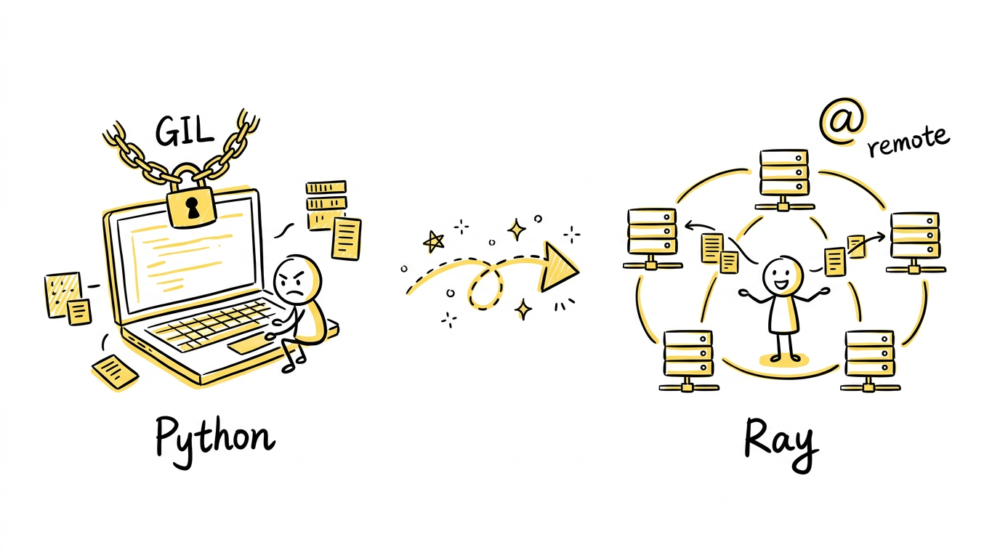

## 从一个真实问题说起

假设你在训练一个大模型。你的数据预处理管道需要对 1000 万条文本做 tokenize、清洗、采样；你的超参搜索要同时跑 200 组实验；训练完之后，你需要把模型部署成一个在线服务，自动伸缩应对流量高峰。

这三件事——数据处理、训练调参、模型服务——传统上需要三套不同的基础设施：数据管道用 Spark，超参搜索用自己攒的脚本跑多进程，模型服务用 TensorFlow Serving 或 Triton。三套技术栈，三种抽象，三组运维。

问题不止是工具碎片化。更深层的矛盾是：**Python 是 AI 的母语，但 Python 天生是单机的。** GIL 让多线程形同虚设，multiprocessing 的 IPC 开销巨大，而且一旦你想跨机器——对不起，请重写你的代码，用分布式框架的 API 重新表达你的逻辑。

想想 Spark 的用法：你得把思维翻译成 RDD 或 DataFrame 的算子链，你的 Python 函数变成了序列化的黑盒 UDF，在 JVM 和 Python 进程之间来回搬运。Dask 好一些，但调度器是单点瓶颈，而且你仍然需要用它特有的 Delayed / Futures API。

这不应该这么难。一个 Python 函数就是一个计算单元，一个 Python 类就是一个有状态的服务。如果有一种方式，让你**在函数定义上加一行装饰器，它就能自动调度到集群上的任意节点执行，返回一个引用让你异步获取结果**——那分布式计算就不再是基础设施问题，而只是一个函数调用问题。

这就是 Ray 做的事。

---

## 一个最小的例子：感受魔法

先看一段代码，不到 10 行：

```python
import ray

ray.init()

@ray.remote
def square(x):
    return x * x

futures = [square.remote(i) for i in range(4)]
print(ray.get(futures))  # [0, 1, 4, 9]
```

`@ray.remote` 把一个普通函数变成了一个分布式任务。`.remote()` 提交任务并立即返回一个 `ObjectRef`（对象引用），`ray.get()` 阻塞等待结果。就这样——没有 RDD，没有 DataFrame，没有 executor 配置。

但这不是语法糖。这 10 行代码触发了 Ray 底层一整套精密的机械：

1. 函数被序列化（pickle），存入全局控制存储（GCS）
2. `CoreWorker` 构建 `TaskSpecification`，通过 gRPC 向本地 `Raylet` 请求 worker 租约
3. `Raylet` 根据资源可用性和数据局部性选择一个 worker 节点
4. 任务被推送到目标 worker，worker 从 GCS 拉取函数字节码，反序列化参数，执行函数
5. 返回值存入 Plasma 对象存储（大对象）或内联在 RPC 响应中（小对象）
6. `ray.get()` 从本地或远程对象存储拉取结果

一个函数调用，穿越了 5 个组件、3 种 RPC、2 层存储。用户看到的是一行装饰器，系统看到的是一套完整的分布式任务生命周期。

有状态的场景也一样自然：

```python
@ray.remote
class Counter:
    def __init__(self):
        self.n = 0
    def increment(self):
        self.n += 1
    def read(self):
        return self.n

counter = Counter.remote()
[counter.increment.remote() for _ in range(10)]
print(ray.get(counter.read.remote()))  # 10
```

`@ray.remote` 加在类上，就变成了一个 **Actor**——一个有状态的常驻 worker 进程。所有方法调用按序到达同一个进程，状态在方法之间保持。这不是 RPC 框架——是一等公民的分布式对象模型。

---

## What：Ray 是什么

一句话：**Ray 是一个把 Python 函数和类原语（function 和 class）提升为分布式计算原语（task 和 actor）的通用框架。**

它不是又一个 MapReduce。它的野心更大：提供一个通用的分布式计算底座，让任何 Python 程序——无论是数据处理、模型训练、超参搜索还是在线推理——都能透明地扩展到集群。

技术上，Ray 是一个 Python API + C++ 引擎的混合体。用户面对的是 `@ray.remote`、`ray.get`、`ray.put` 这些极简 API，底层是大量 C++ 构成的分布式运行时，通过 Cython（`_raylet.pyx`，超过 200KB）桥接 Python 和 C++。

架构上，Ray 由三层组成：

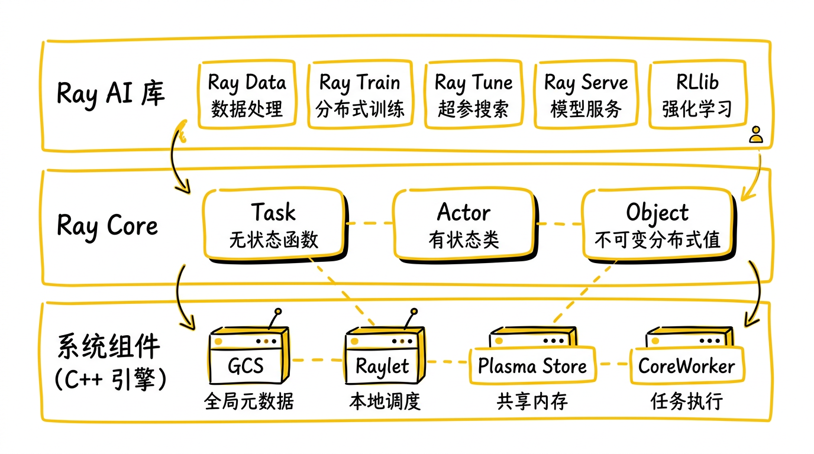

**Ray Core**——分布式运行时的基座。三个核心抽象：
- **Task**：无状态的远程函数调用，支持声明 CPU / GPU / 自定义资源需求
- **Actor**：有状态的远程类实例，方法调用保序执行
- **Object**：不可变的分布式对象，存储在共享内存（Plasma）中，通过 `ObjectRef` 引用

**系统组件**——撑起 Core 的分布式基础设施：
- **GCS（Global Control Store）**：集群的"大脑"，管理节点、Actor、任务、Placement Group 的元数据
- **Raylet**：每个节点一个的守护进程，负责本地任务调度和对象管理
- **Plasma Object Store**：每个节点一个的共享内存对象存储，基于 Apache Arrow 内存格式
- **CoreWorker**：长期运行的 worker 进程，执行 task 和 actor 方法

**Ray AI Libraries**——构建在 Core 之上的 AI 工具库：
- **Ray Data**：分布式数据处理，可处理 TB 级数据集
- **Ray Train**：分布式训练，支持 PyTorch DDP / DeepSpeed / Horovod
- **Ray Tune**：超参搜索，20+ 搜索算法
- **Ray Serve**：模型服务，支持自动伸缩和模型组合
- **Ray RLlib**：强化学习，50+ 算法

这个分层设计的关键在于：**AI Libraries 是 Core 的用户，不是 Core 的特例。** 任何人都可以用同样的 Task / Actor / Object 原语构建自己的分布式应用。Ray 不是一个特化的数据处理引擎或训练框架——它是一个通用的分布式计算操作系统。

---

## Why：已有工具哪里不够

### Python 的并行困境

Python 的 GIL 让多线程对 CPU 密集型任务形同虚设。`multiprocessing` 能绕过 GIL，但每个进程有独立的内存空间，数据传递靠序列化——把一个 1GB 的 NumPy 数组从一个进程搬到另一个，你得先 pickle 成字节流，再 unpickle 回来，内存翻倍，速度砍半。

更致命的是，`multiprocessing` 止步于单机。跨机器？请自己搭 RPC，自己管连接，自己处理故障。

Ray 的 Plasma 对象存储从根本上解决了这个问题：对象存在共享内存里，多个 worker 进程通过 memory-mapped file **零拷贝**访问同一块数据。一个 1GB 的 NumPy 数组，`ray.put()` 放进去之后，所有同节点的 worker 直接读，不需要任何序列化。跨节点？对象通过 gRPC 传输，但只传一次，然后缓存在本地 Plasma 里，后续访问同样零拷贝。

### Spark 的语义鸿沟

Spark 是为 ETL 和 SQL 分析设计的——它的抽象是 DataFrame 和 RDD，它的执行模型是 BSP（Bulk Synchronous Parallel，批同步并行）。这在数据分析场景下工作得很好，但在 AI 场景下处处碰壁：

- **有状态计算**：训练一个模型需要在迭代间保持参数状态。Spark 的核心抽象更偏批处理数据流，跨迭代的训练状态通常需要通过缓存、checkpoint 或外部存储显式管理，不像 Ray Actor 那样把长生命周期进程作为一等抽象。
- **异构资源**：AI 工作负载同时需要 CPU（数据预处理）和 GPU（模型推理/训练），且两者的比例随任务变化。Ray 的 task/actor 资源声明（`num_gpus=0.3`）更贴近 Python 函数和服务化 AI 工作负载的粒度，资源分配可以细到单个函数调用级别。
- **任务粒度**：超参搜索需要同时跑几百个独立的训练实验，每个实验持续几分钟到几小时。Spark 的 BSP 模型要求所有 task 同步推进——一个慢 task 拖慢整个 stage。
- **Python 开销**：PySpark 的每次 UDF 调用都需要在 JVM 和 Python 进程之间序列化/反序列化数据。对于 AI 管道中频繁的模型推理调用，这个开销是致命的。

Ray 的 Actor 模型天然支持有状态计算——一个 Actor 就是一个常驻进程，参数保持在进程内存里。资源声明是细粒度的——`@ray.remote(num_gpus=0.5)` 意味着一块 GPU 可以同时跑两个任务。调度是异步的——200 个超参实验各自独立推进，互不阻塞。

### Dask 的调度瓶颈

Dask 是 Python 生态中最接近 Ray 的工具——它也试图让 Python 透明地分布式化。但它有一个架构瓶颈：**中心化调度器**。所有任务的调度决策都由单个进程做出，当任务数量达到百万级时，调度器的 CPU 和内存成为瓶颈。

Ray 的调度是分层的：GCS 管全局元数据，Raylet 管本地调度。每个节点的 Raylet 独立做调度决策，只有跨节点的资源协调才需要 GCS 介入。调度压力不会全部压到单个中心调度器上，具备更好的横向扩展空间。

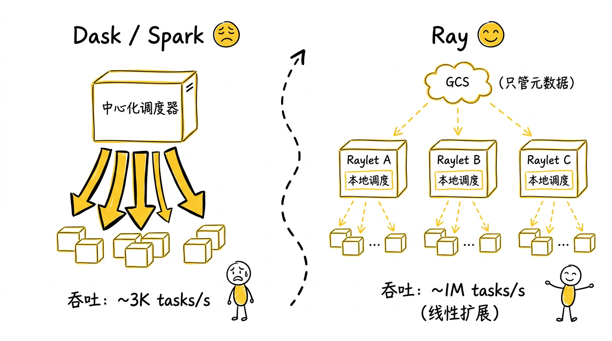

---

## How：Ray 怎么做到的

### 层次化 ID 体系：每个对象都知道自己从哪来

分布式系统的第一个问题是：**怎么命名一切？** 任务、Actor、对象、Job——它们之间有复杂的归属关系（一个 Job 包含多个 Actor，一个 Actor 发起多个 Task，一个 Task 产生多个 Object），你需要高效地编码这些关系。

Ray 的解法是一个层次化的 ID 编码方案：

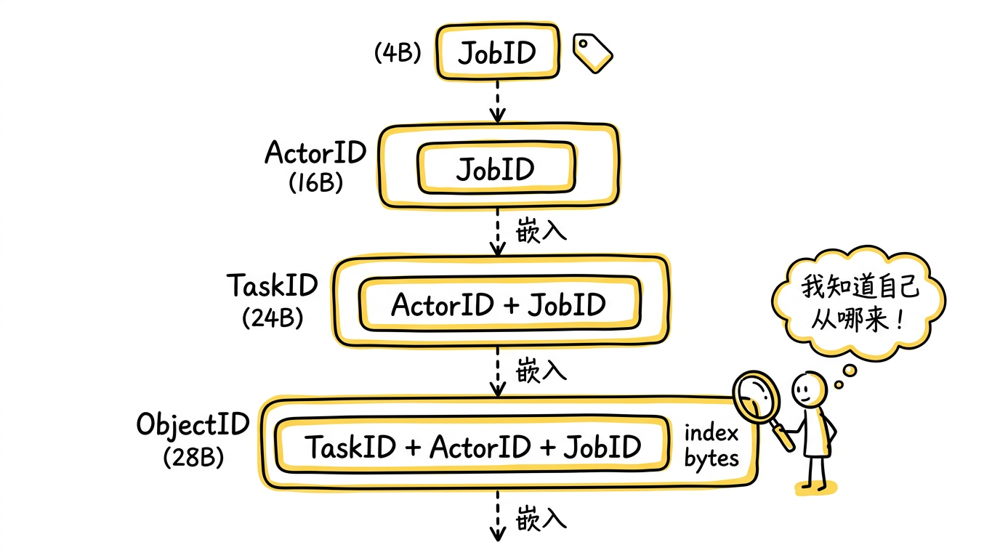

`JobID` 4 字节，由 GCS 生成；`ActorID` 16 字节，末尾嵌入 `JobID`；`TaskID` 24 字节，末尾嵌入 `ActorID`；`ObjectID` 28 字节，末尾嵌入 `TaskID`，前 4 字节是对象在该任务返回值中的索引。

这个设计的精妙之处：**给你一个 ObjectID，你不需要查任何外部存储，就能从中解析出它属于哪个 Task、哪个 Actor、哪个 Job。** 一个 28 字节的 ID 编码了整条 lineage 链。这让分布式追踪、引用计数、故障恢复都变得高效——不需要额外的一次 RPC 查询归属关系，ID 本身就是答案。

对于普通函数任务（非 Actor 方法），TaskID 中的 ActorID 部分使用 `ActorID::NilFromJob(job_id)` 作为 dummy ActorID，其 unique bytes 为 nil 值，末尾仍嵌入 JobID。这样所有类型的任务——普通任务、Actor 方法调用、Actor 创建任务——共享同一套 ID 布局，简化了整个系统的 ID 处理逻辑。

### 集群拓扑：各组件如何协作

在一个多节点的 Ray 集群中，各组件的物理分布如下：

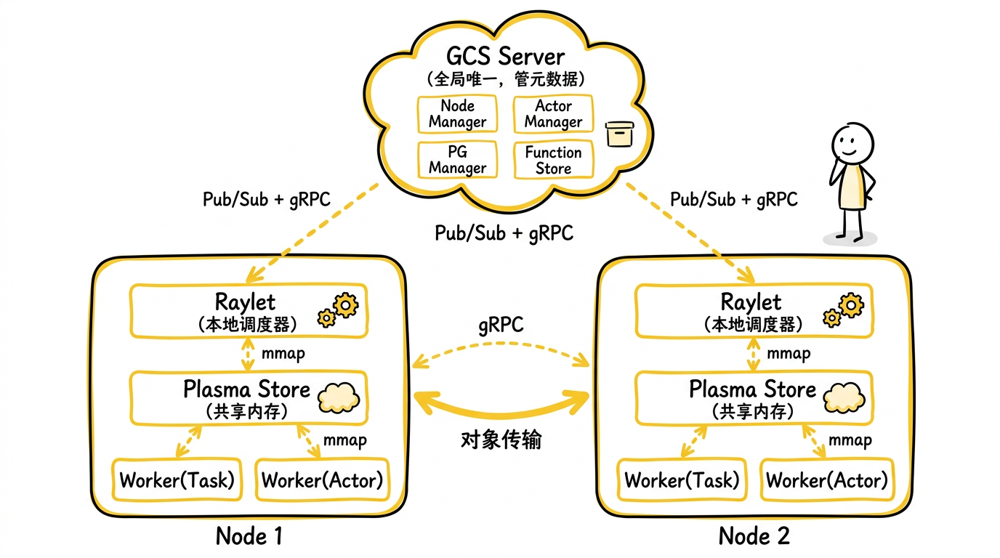

关键数据流：
- **控制面（细线）**：GCS ↔ Raylet，通过 gRPC + Pub/Sub，传递元数据（节点状态、Actor 生命周期）
- **调度面**：CoreWorker → Raylet，`RequestWorkerLease` RPC
- **数据面（粗线）**：Plasma ↔ Plasma，跨节点对象传输；Worker ↔ Plasma，同节点零拷贝

### 一个 Task 的完整生命周期：从 .remote() 到 ray.get()

用户写 `my_task.remote("Ray")` 这一行代码时，下面发生了什么？让我们一步步拆解。

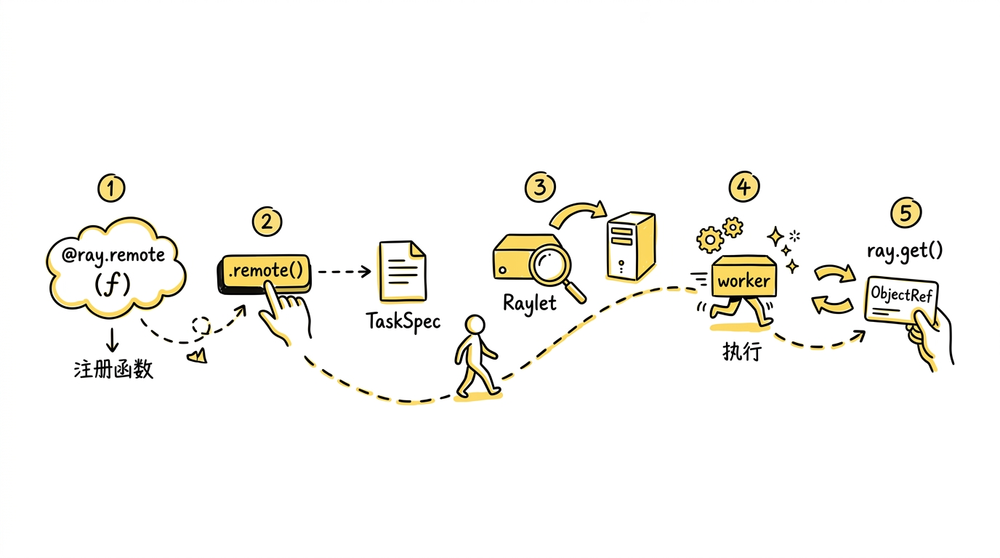

**第一步：定义——`@ray.remote` 的 "记忆"**

`@ray.remote` 包装原始函数，生成一个 `RemoteFunction` 实例（定义在 `python/ray/remote_function.py`）。它存储了函数引用和所有用户指定的 Ray 选项（`num_cpus`、`num_gpus` 等）。关键的是，函数本身还没有被序列化或发送到任何地方——`@ray.remote` 只是注册，不执行。

**第二步：提交——`.remote()` 的异步启动**

调用 `.remote("Ray")` 时，真正的工作开始了：

1. **序列化函数**：首次调用时，Python 函数被 pickle 成字节流，通过 gRPC 存入 GCS 的 Key-Value 存储。Key 是函数的 `FunctionID`。这只做一次——后续调用直接复用。

2. **处理参数**：参数有三种传递方式：
   - **引用传递**：参数本身是 `ObjectRef`，直接传递引用
   - **内联值传递**：小对象（默认 < 100KB）直接 pickle 后嵌入 RPC 消息
   - **非内联值传递**：大对象先 `ray.put()` 到 Plasma 存储，再传递生成的 `ObjectRef`

3. **构建 TaskSpecification**：包含函数 ID、参数列表、资源需求等全部信息。这个结构体在 C++ 层的 `CoreWorker::SubmitTask` 中构建。

4. **异步提交**：TaskSpec 被异步提交给 `NormalTaskSubmitter`。`.remote()` 立即返回 `ObjectRef`，不等待执行。

**第三步：调度——Raylet 的资源博弈**

`NormalTaskSubmitter` 先等待所有 `ObjectRef` 参数就绪（即产生这些对象的上游任务已完成），然后向 Raylet 发送 `RequestWorkerLease` RPC 请求一个 worker。

Raylet 的调度策略是这样的：`NormalTaskSubmitter` 首先向本地 Raylet 发送请求——所谓"本地 Raylet"就是调用 `.remote()` 的进程所在节点上的那个 Raylet（每个节点恰好运行一个 Raylet，CoreWorker 启动时就绑定到它，不需要寻找）。如果任务参数对象在其他节点上，也可能直接发给那个数据局部性更优的 Raylet。Raylet 检查本地资源是否满足任务需求。如果满足，分配一个 worker 返回其地址；如果不满足，Raylet 不会自己转发请求，而是回复一个 spillback 响应，告诉 `NormalTaskSubmitter` 应该去找哪个节点。`NormalTaskSubmitter` 收到后，再向目标节点的 Raylet 发起新的 `RequestWorkerLease`。这个过程一直持续到找到一个有资源的节点为止。

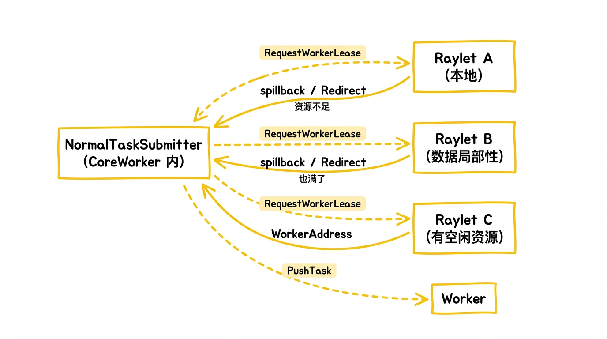

注意：Raylet 之间不直接转发调度请求。调度重定向是"客户端重试"模式——发请求的始终是 `NormalTaskSubmitter`（CoreWorker 内部），Raylet 只负责告诉它该去哪。这样设计避免了中心化调度的瓶颈和 Raylet 之间的级联调用，每个 Raylet 只做本地决策，保持了调度路径的简洁。

**第四步：执行——Worker 的完整工作**

拿到 worker 租约后，`NormalTaskSubmitter` 向目标 worker 发送 `PushTask` RPC（包含 TaskSpec）。Worker 端的执行流程：

1. 从 Plasma 拉取所有按引用传递的参数（跨节点时，先把远程 Plasma 上的对象拉到本地 Plasma）
2. 从 GCS Key-Value 存储拉取函数字节码，反序列化
3. 反序列化内联参数
4. 调用用户函数

**第五步：返回——大小对象的分流**

函数执行完毕后，返回值的处理取决于大小：
- **小返回值**：直接内联在 `PushTask` RPC 响应中返回给调用者，存入调用者的 memory store
- **大返回值**：先存入 worker 本地的 Plasma 对象存储，调用者在 `ray.get()` 时从远程 Plasma 拉取

这个分流策略避免了小对象走 Plasma 的额外开销（共享内存分配、IPC 通知），同时保证大对象不会撑爆 RPC 消息。

`ray.get(obj_ref)` 内部的逻辑：先查本地 memory store（内联返回值已经在这里了），如果没有则查本地 Plasma，如果还没有则向远程 Plasma 拉取。三层存储，逐级查找。

### GCS：集群的"大脑"

GCS（Global Control Store）是 Ray 集群唯一的中心化组件——但它被精心设计为**只管元数据，不管数据流**。

GCS 管理以下资源：

- **节点管理**（`GcsNodeManager`）：跟踪集群中所有节点的存活状态、资源清单、心跳监控
- **Actor 生命周期**（`GcsActorManager`）：创建、调度、重启、死亡——Actor 的状态机由 GCS 全局管理
- **Placement Group**（`GcsPlacementGroupManager`）：原子性地预留一组跨节点资源，支持 PACK（紧凑）和 SPREAD（分散）策略
- **任务元数据**（`GcsTaskManager`）：任务状态追踪、lineage 记录（用于故障恢复时重建任务链）
- **函数存储**：GCS 的 Key-Value 存储保存了所有 `@ray.remote` 函数的序列化字节码

GCS 默认使用内存存储元数据；如果需要 GCS 容错，可以配置 Redis 作为外部持久化后端。它通过 Pub/Sub 机制向各组件推送状态变更——不用轮询，订阅即可。Actor 状态变了？所有订阅者收到通知。节点挂了？GCS 广播。

关键设计决策：**GCS 不参与数据面（data plane）的任何操作。** 对象存取走 Plasma，任务推送走 CoreWorker 之间的直连 RPC。GCS 只在控制面（control plane）上活跃——创建 Actor、注册节点、记录 lineage。GCS 不在数据面路径上，但默认不具备容错——GCS 数据存在内存中，GCS 进程失败会导致整个集群不可用。生产环境需要配置 HA Redis 作为 GCS 的持久化后端，GCS 重启后才能从 Redis 恢复控制面状态。

### Raylet：每个节点的"管家"

Raylet 是运行在每个节点上的守护进程。它的核心职责：

**任务调度**：Raylet 接收 `RequestWorkerLease` RPC，根据本地可用资源决定是否分配 worker。调度策略考虑三个因素：
- 资源匹配：任务声明的 CPU / GPU / 自定义资源是否满足
- 数据局部性：任务依赖的对象是否在本节点的 Plasma 中
- Placement Group 约束：是否有 gang scheduling 要求

如果本地资源不足，Raylet 返回 spillback 节点地址，由提交端（NormalTaskSubmitter）重试目标 Raylet。

**Worker 进程池**：管理 worker 进程的启动、回收、健康检查。Worker 是长期运行的 Python 进程——不是每个 task 启动一个新进程，而是从池中租借一个空闲 worker，执行完毕后归还。这避免了进程启动的开销，也意味着 Python 解释器的预热（import 库等）只做一次。

**对象管理**：Raylet 通过 `LocalObjectManager` 跟踪本节点 Plasma 中所有对象的状态——哪些是 pinned 的（不能被驱逐），哪些是 spilled 的（已溢写到磁盘），哪些可以被回收。

整个 Raylet 采用事件驱动架构，基于 Boost.ASIO 实现异步 I/O——单线程事件循环处理所有 RPC，不依赖线程池，能够高效处理上万个并发请求。

### Plasma 对象存储：零拷贝的秘密

Plasma 是 Ray 的共享内存对象存储，源自 Apache Arrow 项目。它在每个节点上运行，通过 Unix domain socket 接受客户端连接，用单线程服务所有请求。

核心机制是 **memory-mapped file**：对象存储在 `/dev/shm`（tmpfs）上的内存映射文件中。多个 worker 进程可以同时映射同一块共享内存，直接读取对象数据——**零拷贝、零序列化**。一个 worker 做 `ray.put(numpy_array)` 写入的 NumPy 数组，另一个 worker 做 `ray.get()` 读出来时拿到的是完全相同的那块内存。

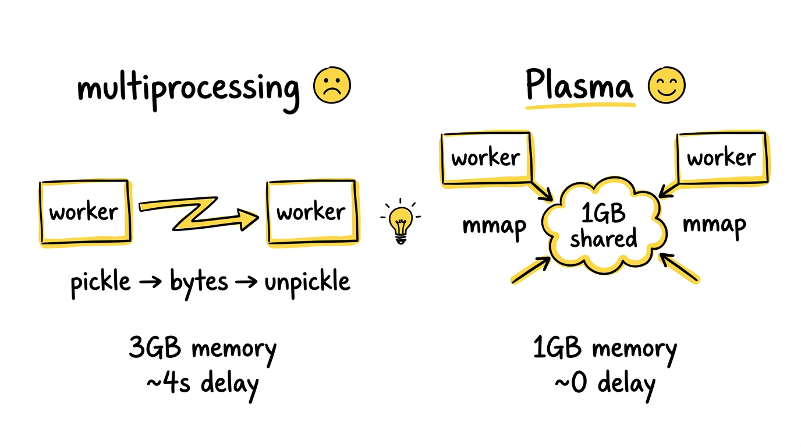

对象在 Plasma 中是**不可变的**。创建分两步：先 `Create`（分配空间），写入数据，然后 `Seal`（封印）。一旦 Seal，对象永远不会被修改——这是零拷贝安全的前提（如果对象可变，两个 reader 会看到不一致的数据）。

当本地 Plasma 没有所需对象时，系统会自动从远程节点拉取。`PullManager`（`src/ray/object_manager/pull_manager.cc`）管理拉取请求，`PushManager` 管理推送。跨节点的对象传输走 gRPC，传输完成后缓存在本地 Plasma 中作为**二级副本**（Secondary Copy），供后续访问使用。

### 对象溢写：内存不够时的优雅降级

真实场景中，对象存储的数据量经常超过物理内存。Ray 的解法是**对象溢写（Object Spilling）**——当 Plasma 内存压力超过阈值（默认 80%），自动把对象溢写到外部存储（本地磁盘或 S3），需要时再恢复。

溢写架构被精心设计为三层，每层运行在不同线程/进程上，互不阻塞：

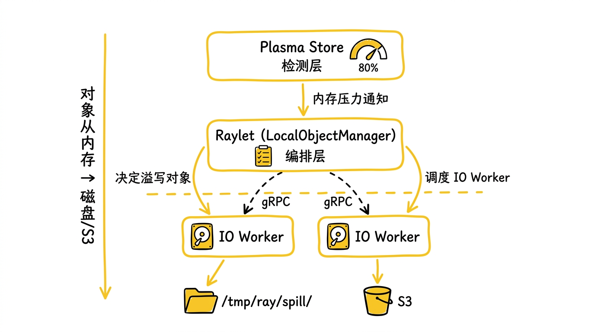

1. **检测层（Plasma Store 线程）**：`CreateRequestQueue` 在内存分配失败时触发回调。Plasma Store 是单线程的——如果让它直接做 I/O，所有对象创建都会被阻塞。所以它只做一件事：通知 Raylet "内存紧张了"。

2. **编排层（Raylet 主线程）**：`LocalObjectManager` 决定**溢写什么**和**什么时候溢写**。它采用"乐观批处理"策略：有空闲 IO Worker 就立刻溢写当前可用的对象，如果已经有溢写任务在跑，小批次就推迟——等积攒更多对象一起处理更高效。

3. **执行层（Python IO Worker 进程）**：实际的磁盘/网络 I/O 由独立的 Python 进程执行，通过 gRPC 与 Raylet 通信。这意味着即使 S3 写入很慢，Raylet 的主事件循环也不会被阻塞——心跳、调度、其他 RPC 照常处理。

一个值得细说的设计：**对象融合（Object Fusion）**。多个对象被合并写入同一个文件，每个对象前面有一个 24 字节的头部（3 个 8 字节字段：owner 地址长度、元数据长度、数据长度）。每个对象通过 URL 中的 `offset` 和 `size` 参数独立寻址：

```
/tmp/ray/spill/ray_spilled_objects_<node_id>/<uuid>-multi-<count>?offset=<N>&size=<M>
```

融合文件用引用计数管理生命周期——只有当文件中所有对象都被释放后，文件本身才会被删除。这避免了每个对象一个文件带来的文件系统碎片和 syscall 开销。

溢写还有两道保护线：
- **被动触发**：Plasma 分配失败时触发溢写，然后进入"宽限期"（`oom_grace_period_s`），等待溢写释放空间。宽限期过后如果仍然不够，启用 **fallback allocator**——用 `mmap` 直接在文件系统上分配内存，比共享内存慢但不会死锁。
- **主动触发**：每秒检查一次内存使用率，超过阈值就预防性溢写，不等 OOM。每次有新对象 `Seal` 时也会检查。主动触发确保系统不会突然从"正常"跳到"OOM"，而是平滑过渡。

什么时候需要恢复？当有 Worker 需要访问已溢写的对象时——比如用户调用 `ray.get(ref)` 取值，或者某个任务的参数依赖指向了一个已溢写的对象。如果一个对象溢写后再也没人用它，它就一直待在磁盘/S3 上，等引用计数归零后被删除，永远不会读回内存。

这里需要澄清：Plasma 不是外部存储，而是节点本地的共享内存（基于 `/dev/shm`），Worker 通过 mmap 零拷贝访问其中的对象。溢写到磁盘/S3 后，数据离开了内存；恢复的最终目标是把数据写入**请求方节点**的 Plasma，让该节点的 Worker 能通过 mmap 访问。

恢复路径取决于存储类型：

- **本地文件系统**：对象只溢写在某个节点的磁盘上。如果请求方就在该节点，直接从磁盘读取写入本地 Plasma。如果请求方是远程节点，则先把请求发到溢写节点，溢写节点从磁盘读取后通过网络直接推送给请求方——不写入溢写节点自己的 Plasma，避免给溢写节点增加内存压力。请求方收到数据后写入自己的 Plasma。
- **S3 存储**：任何节点都可以直接从 S3 读取，写入本地 Plasma，不需要经过溢写节点中转。

### 分布式引用计数：不依赖 GC 的对象生命周期管理

在分布式系统中，垃圾回收是一个出了名的难题。对象可能分散在多个节点上，被多个任务引用——什么时候可以安全地删除？

Ray 的解法是 `ReferenceCounter`（`src/ray/core_worker/reference_counter.h`），一个线程安全的分布式引用计数系统。它的核心思想是 **ownership 模型**：每个对象有一个唯一的 **owner**（创建它的 CoreWorker），owner 负责追踪所有引用并决定对象何时可以被删除。

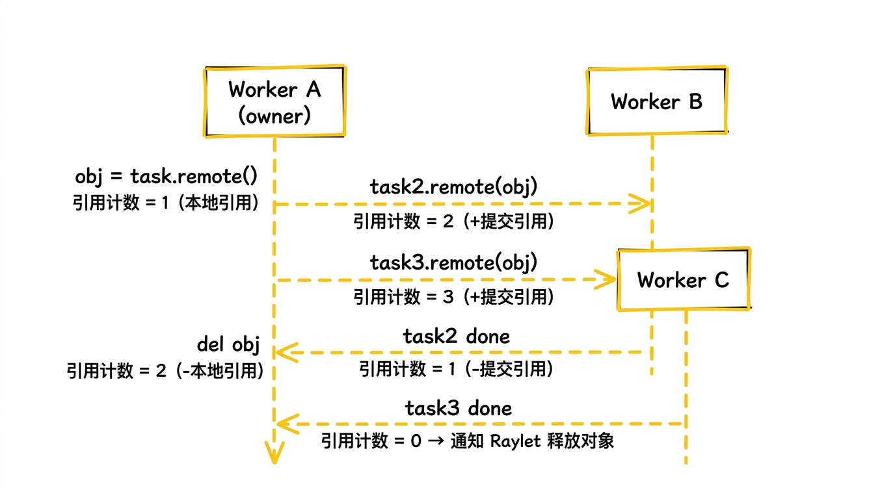

引用的来源有多种：
- **本地引用**：Python 代码中持有 `ObjectRef` 变量
- **提交引用**：对象被作为参数传给另一个 task，task 完成前引用保持
- **序列化引用**：对象被 pickle 进另一个对象内部（嵌套引用）

当所有引用都被释放后（本地引用删除 + 所有下游 task 完成），owner 通过 Pub/Sub 通知 Raylet 释放对象。Raylet 从 Plasma 中 unpin 对象，如果对象已溢写则加入删除队列。

这个系统还支持 **lineage pinning**：即使对象本身已经被删除，如果它的创建任务的信息还被需要（比如用于故障恢复时重建对象），lineage 信息会被保留。这让 Ray 能在 task 失败时自动重新执行上游任务链来重建丢失的对象。

### Actor 的状态机：5 个状态，完整的生命周期

Actor 是 Ray 中复杂度最高的抽象——它是有状态的、长期运行的、可能跨节点恢复的。GCS 用一个 5 状态的状态机管理每个 Actor 的生命周期：

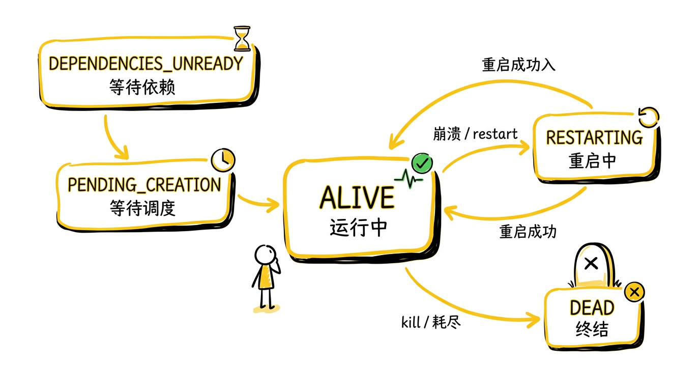

- **DEPENDENCIES_UNREADY**：Actor 的构造函数参数中有未就绪的 `ObjectRef`
- **PENDING_CREATION**：依赖就绪，等待 GCS 调度到某个节点
- **ALIVE**：正在运行，接受方法调用
- **RESTARTING**：进程崩溃，正在另一个节点重启（如果配置了 `max_restarts`）
- **DEAD**：终结状态，所有排队的方法调用返回错误

默认单线程 Actor 会串行执行方法调用：同一 Actor handle 上提交的方法按顺序进入 Actor，多个调用者并发提交时，Actor 仍然一次只执行一个方法，状态更新按 Actor 端排队顺序发生。这通过 `ActorTaskSubmitter` 维护的序列号机制实现。如果启用 async actor、threaded actor 或 concurrency groups（`max_concurrency > 1`），则方法可以并发执行，顺序语义需要按配置理解。

**Detached Actor** 是一个特殊变体——它的生命周期不绑定到创建者。普通 Actor 在创建者进程退出时会被 GCS 标记为 DEAD，但 Detached Actor 会一直存活，直到被显式 kill 或集群关闭。这对长期运行的服务（如 Ray Serve 的模型副本）至关重要。

### Placement Group：原子性的跨节点资源预留

在分布式训练中，你通常需要保证一组 Actor 被部署到同一台物理机上（数据并行的通信开销），或者相反——分散到不同机器上（容错）。Placement Group 就是为此设计的。

```python
from ray.util.placement_group import placement_group

# 在同一节点上预留 2 个 GPU
pg = placement_group([{"GPU": 1}, {"GPU": 1}], strategy="PACK")

@ray.remote(num_gpus=1)
class Trainer:
    ...

# 两个 Trainer 保证在同一台机器上
t1 = Trainer.options(placement_group=pg, placement_group_bundle_index=0).remote()
t2 = Trainer.options(placement_group=pg, placement_group_bundle_index=1).remote()
```

Placement Group 的关键语义是**原子性（atomicity）**：要么所有 bundle 都成功预留，要么全部失败。这就是 gang scheduling——不会出现预留了一半资源、另一半等不到的死锁。

GCS 的 `GcsPlacementGroupManager`（`src/ray/gcs/gcs_placement_group_manager.cc`，47KB）负责全局的 Placement Group 调度。两种策略：
- **PACK**：尽量把所有 bundle 放在同一个节点上，减少网络通信
- **SPREAD**：把 bundle 分散到不同节点上，提高容错性

---

## 一些值得展开的设计决策

### 为什么 Worker 是长期运行的进程，而不是每 Task 一个进程？

启动一个 Python 进程的代价不容小觑：`fork` + `exec` + Python 解释器初始化 + import 常用库（NumPy、PyTorch），这个过程可能花费数秒。如果每个 task 启动一个新进程，当你提交 10000 个轻量 task 时，进程启动的总开销可能远超实际计算时间。

Ray 的 Worker Pool 预先启动一组 worker 进程，task 执行完毕后 worker 不退出，而是归还到池中等待下一个任务。只有当并发需求超过当前 worker 数量时，才会按需启动新 worker（受 `max_workers` 限制）。

这也解释了为什么 Ray 的函数序列化策略是"首次调用时存入 GCS，后续直接拉取"——worker 可以缓存已经反序列化的函数，同一个函数的多次调用不需要重复 unpickle。

### 为什么参数传递要区分"内联"和"非内联"？

小对象走 RPC 内联传递，大对象走 Plasma 对象存储——这个分流策略背后的权衡是：

- **小对象**：如果把一个 100 字节的整数也放进 Plasma，你需要一次 IPC 通知、一次 memory map、一次 IPC 确认，开销远大于数据本身。直接塞进 RPC 消息更快。
- **大对象**：如果把一个 1GB 的 tensor 内联到 RPC 消息里，protobuf 的序列化和 gRPC 的缓冲区管理会崩溃。放进 Plasma 后只传递引用（28 字节的 ObjectID），接收端从本地 Plasma 零拷贝读取。

阈值是可配置的，默认约 100KB。这个数字是经验值——在典型网络和 IPC 延迟下，小于此值内联更快，大于此值走 Plasma 更优。

### 为什么 GCS 选择了 Pub/Sub 而不是轮询？

在大规模集群中（数百节点、数百万对象），如果每个 Raylet 每秒向 GCS 轮询"有没有新的 Actor 创建？有没有节点挂掉？"，GCS 的 RPC 压力会是 `O(节点数 × 事件类型数 × 频率)`。

Pub/Sub 把这个关系反转：组件只订阅自己关心的事件频道，GCS 在状态变更时推送通知。一个节点挂掉，只有持有该节点上 Actor 引用的组件会收到通知——其他节点完全不受影响。这把 GCS 的负载从 `O(N²)` 降到了 `O(affected)`。

---

## 什么时候用 Ray，什么时候不用

**适合 Ray 的场景**：

- 你的 Python 程序需要跨多个 CPU 核心或多台机器并行——Ray 让你不需要重写代码
- 你在做 ML/AI 工作——训练、调参、推理、数据预处理都有对应的 Ray 库
- 你有异构资源需求——同时需要 CPU 和 GPU，需要细粒度资源分配
- 你需要有状态的分布式服务——Actor 模型比裸 RPC 框架更自然
- 你的工作负载是异步的——成百上千个独立任务需要并发执行

**不适合的场景**：

- 纯 SQL 分析——Spark / DuckDB / Polars 在这个赛道上更成熟
- 小规模数据、单机场景——`multiprocessing` 甚至 `asyncio` 就够了，Ray 的运行时本身有初始化开销
- 实时流处理——Flink / Kafka Streams 的流处理语义（窗口、watermark、exactly-once）更完善
- 你的团队没有 Python——Ray 的 C++ 和 Java API 存在但远不如 Python 成熟

一些真实的数字：OpenAI 用 Ray 做 ChatGPT 的 RLHF 训练；Uber 用 Ray 做 Michelangelo 平台的 ML 基础设施；Spotify 用 Ray 做推荐系统的特征计算；Ant Group 用 Ray 支撑大规模图计算和强化学习。

---

## 谁在用 Ray，用来做什么

理论讲完了，看看真实世界里 Ray 在干什么。

### LLM 训练：OpenAI

OpenAI 用 Ray 协调 ChatGPT 的分布式训练——数千块 GPU 的任务调度、数据分发、容错恢复。Greg Brockman 的原话："Ray was by far the winner among distributed computing solutions." 核心价值是：研究人员本地写的代码，不用改就能提交到千卡集群跑。

> 参考：[How Ray, a Distributed AI Framework, Helps Power ChatGPT](https://thenewstack.io/how-ray-a-distributed-ai-framework-helps-power-chatgpt/)

### 大规模批量推理：ByteDance

ByteDance 用 Ray Data 对 **200TB** 多模态数据做离线推理。模型超过 100 亿参数，单 GPU 装不下，按层切分到 3 块 GPU 上。Ray Data 的流式执行让 CPU 预处理和 GPU 推理同时进行，不需要把 200TB 中间结果全量写磁盘——这类 CPU/GPU 流水线不是 Spark 的强项。

> 参考：[How ByteDance Scales Offline Inference with Multi-Modal LLMs to 200TB Data](https://www.anyscale.com/blog/how-bytedance-scales-offline-inference-with-multi-modal-llms-to-200TB-data)

### 异构集群省成本：Uber & Netflix

Uber 把训练管道拆成 CPU 节点（数据加载）和 GPU 节点（梯度计算），**成本降低 50%**。Netflix 做了同样的事——把数据预处理 offload 到独立 CPU 节点，训练吞吐量翻了 **3-5 倍**。本质是：用 Ray 的异构调度让 GPU 不再等 CPU。

> 参考：[Elastic Deep Learning with Horovod on Ray - Uber Blog](https://www.uber.com/us/en/blog/horovod-ray/)、[Heterogeneous Training Cluster with Ray at Netflix](https://www.anyscale.com/blog/heterogeneous-training-cluster-with-ray-at-netflix)

### ML 平台：Spotify

Spotify 的 ML 基础设施原来只支持 TensorFlow。迁移到 Ray 之后，PyTorch、XGBoost、PyG（图神经网络）都能跑。一个 GNN 推荐系统从开发到上线 A/B 测试只用了 3 个月。

> 参考：[Unleashing ML Innovation at Spotify with Ray](https://engineering.atspotify.com/2023/02/unleashing-ml-innovation-at-spotify-with-ray)

### 模型在线服务：蚂蚁集团

全球最大的 Ray 生产集群——**24 万核**。双十一峰值 **137 万 TPS**。用 Ray Serve 做 serverless 模型服务：用户提交模型代码，平台自动部署、隔离、弹性伸缩。

> 参考：[How Ant Group Uses Ray to Build a Large-Scale Online Serverless Platform](https://www.anyscale.com/blog/how-ant-group-uses-ray-to-build-a-large-scale-online-serverless-platform)

### LLM 推理引擎：vLLM

vLLM 多节点推理**默认使用 Ray 作为分布式执行后端**。2 节点 16 卡的典型配置：tensor parallel = 8（节点内），pipeline parallel = 2（跨节点）。Ray Serve LLM 在 vLLM 之上增加了 prefix-aware routing（TTFT 降低 60%）、多 LoRA 热切换、自动伸缩。

> 参考：[vLLM Distributed Inference and Serving](https://docs.vllm.ai/en/stable/serving/distributed_serving.html)、[Announcing Native LLM APIs in Ray Data and Ray Serve](https://www.anyscale.com/blog/llm-apis-ray-data-serve)

### RLHF 训练：OpenRLHF

70B 模型做 RLHF 需要 4 个模型同时在线（actor / critic / reward / reference）。OpenRLHF 用 Ray 把它们分布到不同的 GPU 组——16 卡跑 vLLM 生成、16 卡跑 Actor 训练、16 卡跑 Critic 训练。Ray 负责模型间的数据协调和 GPU 资源动态分配。

> 参考：[OpenRLHF: An Easy-to-use, Scalable and High-performance RLHF Framework](https://github.com/OpenRLHF/OpenRLHF)

### 自动驾驶数据管道：Applied Intuition

TB 级传感器日志（激光雷达、摄像头、雷达）经过 CPU 坐标变换后送入 GPU 做目标检测。Ray Data 的 streaming + 异构调度让 CPU 和 GPU worker 独立伸缩。

> 参考：[Ray Summit 2025 - Applied Intuition: Powering Large-Scale Batch Inference Pipelines](https://www.anyscale.com/ray-summit/2025)

---

## 一个共同的模式

这些案例的共同点是：**Ray 几乎从不单独做"计算"本身**——训练用 PyTorch/DeepSpeed，推理用 vLLM，数据处理用 Arrow/Pandas。Ray 做的是把这些东西**粘在一起、放到集群上跑、处理故障、管理资源**。

它是分布式计算的"操作系统层"，不是"应用层"。

---

## 回到开头

1000 万条文本的预处理、200 组超参实验、弹性伸缩的模型服务——这些任务的共同点是：它们本质上都是 Python 函数和类，只是需要在多台机器上并行运行。

Ray 做的事情，是让这个跨越变得几乎透明：`@ray.remote` 让函数变成 task，让类变成 actor；层次化 ID 让每个对象都能追溯 lineage；两阶段调度让任务高效地找到合适的节点；Plasma 对象存储让数据零拷贝共享；对象溢写让内存不够时优雅降级而不是崩溃；引用计数让垃圾回收在分布式环境下正确工作。

这就是 Ray 的核心主张：**分布式计算不应该要求你用另一种语言思考。**

函数就是 task，类就是 actor，变量就是 object。你写的是 Python，跑的是集群。工具应该适应程序员的思维方式，而不是反过来。
