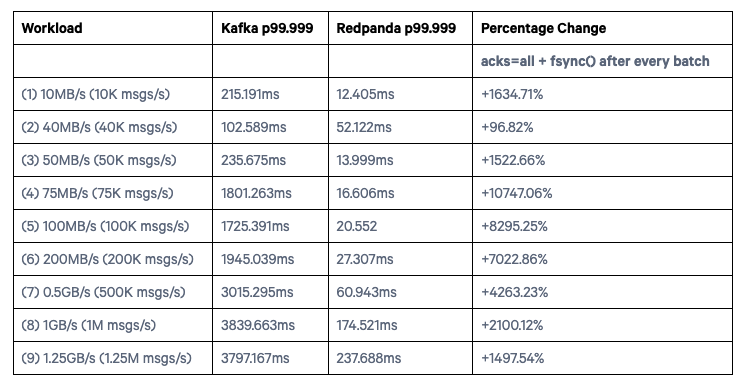
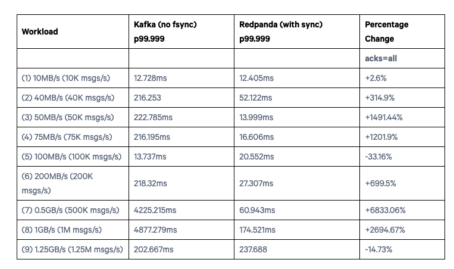
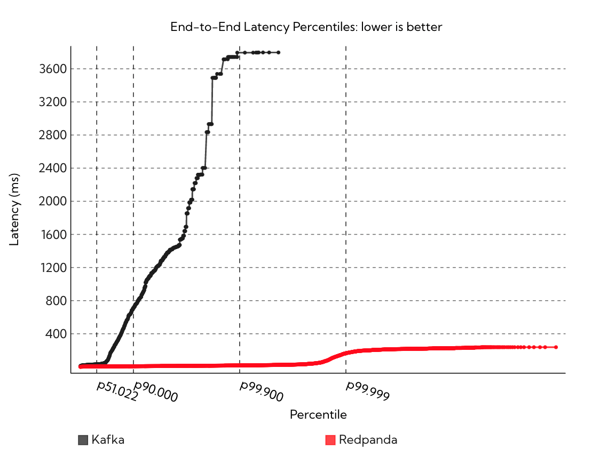
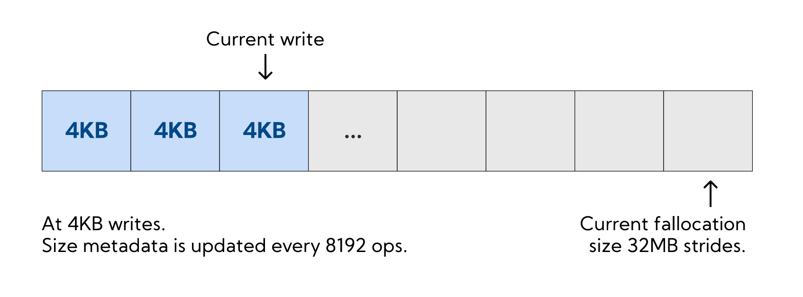
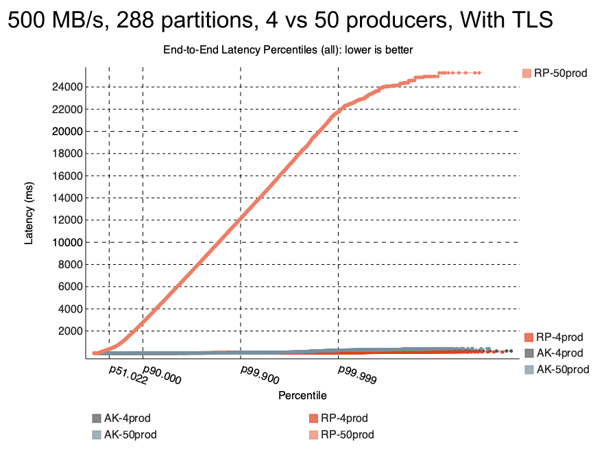
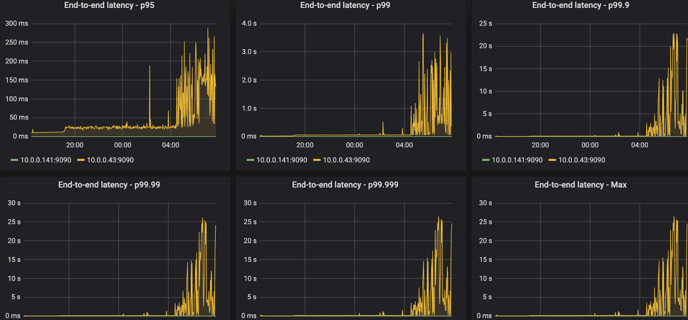
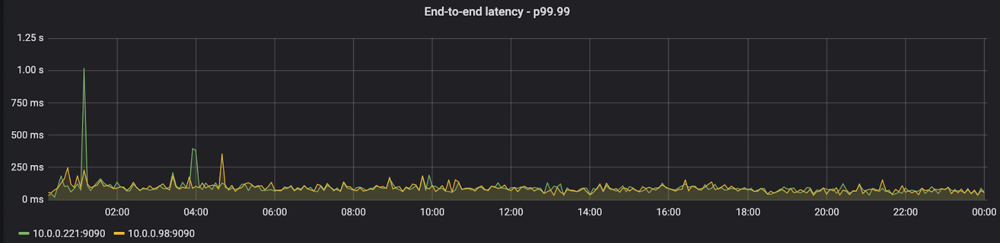
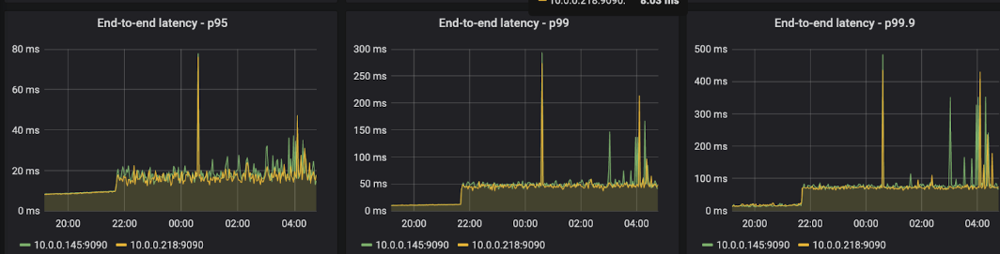
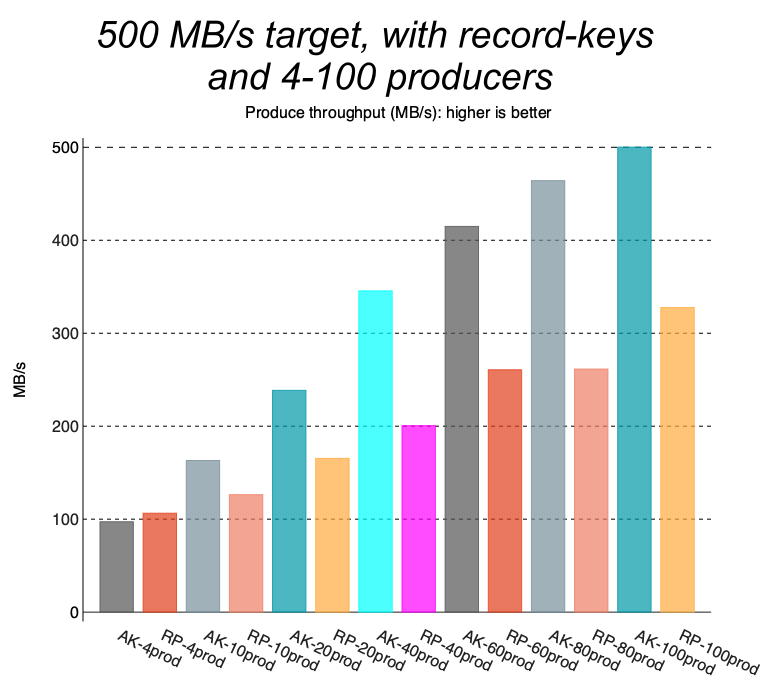
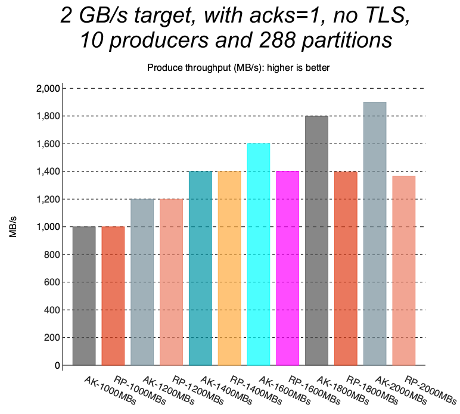

## RedPanda 的官方评测

### RedPanda 的 Benchmark 结果

[RedPanda](https://github.com/redpanda-data/redpanda/) 宣称自己兼容 Kafka 协议的，用 C++ 写的，比 Kafka 快 10 倍。然后写了篇[博客](https://www.redpanda.com/blog/redpanda-faster-safer-than-kafka)说了一下自己 benchmark 的结果。

做了两组实验：

一组的是让 Kafka 每写一批数据就强行 Flush 到磁盘（不使用 PageCache），Redpanda 也 Flush 到磁盘（注：Redpanda Raft 协议的实现本身就要求每写一批数据就 Flush 到磁盘进行持久化），benchmark 结果如下

- Fsync with every batch



可以看到 Redpanda 是比 Kafka 好不少。

另外一组是让 Kafka 使用 PageCache，不显式 Flush 数据到磁盘，让操作系统自己控制 Flush 数据到磁盘。这个其实是用户部署 Kafka 的通常做法，我觉得这个才有参考意义。于是 benchmark 结果如下

- Page cache & no explicit flushes



对于workload 5，redpanda 说是因为他们实现的一个 bug，但是现在已经修复了。不过我总感觉它这个 benchmark 结果有点问题，因为我不理解 Kafka 在 从 200MB/s 到 0.5 GB/s，1GB/s，延迟升高了这么多，而到 1.25 GB/s，延迟又恢复正常了。

根据 benchmark 结果（Fsync with every batch，[red panda 认为这才是 safe workloads](https://www.redpanda.com/blog/why-fsync-is-needed-for-data-safety-in-kafka-or-non-byzantine-protocols)，即数据不会丢失；虽然其实 [kafka 并不依赖 fsync](https://jack-vanlightly.com/blog/2023/4/24/why-apache-kafka-doesnt-need-fsync-to-be-safe)），于是 red panda 画了个图：



结论就是 RedPanda 的 P99 延迟比 Kafka 好非常多。

### RedPanda 的技术实现

实现 RedPanda 的初衷：

1. 需要一个可靠的复制协议，选择 Raft，因为 Raft 有一个严格的数学正确性的论证，并且简单容易理解

对于 Kafka 的ISR复制协议，个人感觉确实并没有一个严谨的关于正确性的论证，而且 Kafka 也不断地给这个复制协议打了不少补丁，去年也还是有一个补丁 [KIP-966](https://cwiki.apache.org/confluence/display/KAFKA/KIP-966%3A+Eligible+Leader+Replicas)，只能说确实没那么可靠，问题还是不少。可以参考我写的 Kafka 复制协议不可不知的技术内幕 - 关于 Kafka 踩过的坑。

2. Predictable 的延迟

Kafka 由于对 Page Cache 的使用，可以达到较低的延迟，但是如果 Page Cache 被污染了，比如在冷读的场景下 ，延迟就会变高，延迟很大程度取决于 Page Cache。Page Cache 这个确实也是个问题，所以很多厂商基于 Apache Kafka 提供云服务的话，都会魔改一下 Apache Kafka ，搞个冷热 Cache 隔离之类的。

RedPanda 主要采用了如下技术：

1. No Page Cache

不使用 OS 的 general Page Cache，而是自己实现 Cache，这样 RedPanda 也可以根据访问 pattern，内存的使用量等来更好地 cache 数据；绕过了OS 的 page cache 也避免了 un-predictable 的延迟

2. 操作系统内核层面的调优

   - 禁用 Linux 的 Block-IO 自动合并 IO，减少昂贵的检查操作。给 Redpanda 提供确定性的内存占用，避免I/O过程中的内存波动。这个优化看起来有点反直觉，因为 IO 合并能 减少磁盘寻道时间，减少I/O操作次数，减少中断处理次数。但是 IO 合并也有一定的代价：内存连续性检查，检测请求的内存地址是否连续；重新分配和调整内存缓冲区，导致不确定的内存占用。而且RedPanda 是面向 SSD 设备的，在 SSD 设备上，IO 合并带来的好处则并没有那么明显，寻道时间基本为 0，并且 IO 不合并的话，可以带来更多的并行 IO，提高吞吐。

   - 合并中断（Coalescing interrupts）来平摊上下文切换的开销。将多个中断合并处理，减少CPU在用户态和内核态之间的切换次数。

   - 中断亲和（Interrupt affinity） ，强制 I/O 中断通知到最初发起请求的CPU核心，提高缓存局部性，减少跨核心通信开销

这一堆优化看起来比较硬核，可以带来 10 ～30%的提升。

3. 减少文件的 metadata 更新的开销

正常的文件写入，每次写入数据都需要更新文件的 metadata，有一定的开销。为了减少这样的开销，RedPanda 的解决思路也很直接，就是预先分配一个比较大的 chunk，分配 chunk 的时间更新一次 metadata，往这个 chunk 里面写数据的时候就不需要再更新文件的 metadata 了。

如下图所示，预先分配了一个 32 M 的chunk，每次写都写 4KB 的数据，这样写完一个 chunk 后，才会去分配下一个 chunk，更新一次文件的 metadata。



4. DMA 写入优化

Redpanda 使用 Direct Memory Access（DMA） 来写入数据到磁盘中（注：DMA 写入需要和文件系统块做对齐，不然会对写入性能造成影响），DMA 写入操作是异步的，以最大化吞吐。

5. Raft 指令重排序以减少 Flush 次数

受 CPU 处理指令的 pipeline 技术启发，decode 一系列 raft operation 的时候，调整指令的顺序，人为地减少 flush 操作，如下图所示：


可以看到，之前需要 Flush 三次。优化后只需要 Flush 一次。

6. 每个线程绑定一个 CPU 核心

传统的多线程模型下：

```
CPU核心0: 线程1, 线程2, 线程3, 线程4 (共享)
CPU核心1: 线程5, 线程6, 线程7, 线程8 (共享)
CPU核心2: 线程9, 线程10, 线程11, 线程12 (共享)
CPU核心3: 线程13, 线程14, 线程15, 线程16 (共享)
```

多个线程竞争同一个核心的资源

ReadPanda 每个线程绑定一个 CPU 核心模型下：

```
CPU核心0: 线程1 (独占)
CPU核心1: 线程2 (独占)  
CPU核心2: 线程3 (独占)
CPU核心3: 线程4 (独占)
```

优势：每个线程独占一个核心，无竞争，减少线程上下文切换的开销，用的是 [Seastar](https://github.com/scylladb/seastar) 这个 C++ 写的框架。

不过这篇博客还提了下其他优化，比如 预读，Write-behind buffering，Fragmented-buffer parsing，整数解码优化（Integer decoding），Streaming compressors，Cache-friendly lookup structures 等。

## Kafka 的非官方回应

Confluent 的首席架构师 [Jack Vanlightly](https://jack-vanlightly.com/?author=56894e5669a91ac1e4c9ec1b) 写了一篇博客回应了一下 RedPanda 的 Benchmark 结果，并不是以 Confluent 的立场，而是以个人的立场回击了一下。

首先作者有几点疑问：

- 对于 Kafka，我们通常根据网络和磁盘 IO 能力来调整云实例的大小，CPU 优化过的 Broker 真的会带来如此大的不同吗？Kafka 通常瓶颈都是在 IO 上，CPU 优化后真的会有很大效果吗？

- 虽然 RedPanda 说他们做了很多优化，但是RedPanda 真的可以更快地写数据到磁盘吗？

- 相比于 Kafka 目前的基于锁的并发模型，RedPanda 的 thread-per-core 真的可以很大地减少延迟吗？

RedPanda 说对于 1G/s 的workload，Kafka 需要 9 个 i3en.6xlarge instance，但是 redpanda 只需要 3个，并且性能更高；不过作者并没有测试 9个，而是直接就用3个来测试；

总结，RedPanda 宣称的比 Kafka 好被大幅夸大了，而在某些场景下，Kafak 比 RedPanda 更好；

- 如果用 50 个而不是4个 producer，RedPanda 性能就会大幅下降

- 运行超过 12 小时后，RedPanda 的性能也会大幅下降

- 如果发生了 log 过期，RedPanda 延迟也会大幅上升

- 如果 RedPanda 的record有key，RedPanda 性能也不行；因为需要根据key shuffle 不同的 partition，RedPanda 攒批效果会比较差

- 设置 ack = 1，RedPanda 并不能达到 NVMe 的极限，但是 Kafka 可以

- Kafka 也可以很好地处理消息堆积，但是 RedPanda 不可以

首先，作者观察到，Redpanda 的 benchmark 代码有几个问题：

- log.flush.interval.messages = 1，导致kafka每写一批数据都会 flush，Redpanda 说是为了数据不丢失，但是 Kafka并不依赖这个来保证数据不丢失。

- 使用了 Java11，但 Kafka 在 Java 17 的表现更好，特别是对于开启了 TLS 的场景

- RedPanda 的 client 每 5 s 提交 offset，但是 kafka 默认是每次 poll 都提交

于是作者修复后，得到了如下的 benchmark 结果

Finding1



ReadPanda 在 50 个 producer 下表现很差；

Finding2

Red Panda 在跑了很久（12小时）之后延迟就会很大



而kafka 影响很小



作者认为是在 RedPanda 的随机 IO 的 access pattern下，SSDs 的性能下降，随机 IO 会给 SSD 带来比较大写放大（SSD driver 需要rewrite block 来进行 GC）。

Finding3

触发 segment 删除后，性能会陡增



删除文件会对 ReadPanda 的性能造成影响

Finding4

设置了 record key 后，Red Panda 性能也比不上kafka了



Finding5

RedPanda 始终无法达到 IO 上限（2G/s），但是在 ack=1，no TLS 下，Kafka 可以达到



Finding6

RedPanda 无法很好地处理消息堆积；

首先暂停 consumer，然后 produce 一批数据，来模拟消息堆积的情况；

之后再恢复 consumer，对于RedPanda，总是会有消息堆积，即 consumer 总是无法即时地消费到最新的数据；但是 kafka 可以；

作者也没解释原因，猜测可能是是 RedPanda 要从磁盘 load 数据，并且 cache 利用率不高，导致消费比较慢。

总结

RedPanda 的 benchmark 对应的 workload 不是足够通用的，并且在其他 workload 上，表现也是差于 Kafka 的。

不过作者也承认，在某些 workload 上，RedPanda 的表现确实很惊艳。

“Batch sizes need to be not too small, throughput shouldn’t be too high on high partition workloads and the drives need to be adequately provisioned with enough empty space to allow for the random IO nature of its storage layer. ”

翻译一下就是：batch size 不能太小，吞吐量不应该太高，驱动器需要充分配置足够的空闲空间，以适应其存储层的随机I/O特性。

RedPanda 宣称自己是下一代的 log 系统，thread-per-core架构，利用现代的 NVMe driver 等；但是作者不认为它的存储架构对 log 系统来说是最优的，甚至可能还是一个弊端；将一个partition map 成一个 segment file，然后在大量单独的 partition（segment file）上进行 flush 还是比较废。

虽然 Kafka 也使用 one partition one file 的存储架构，但是 kafka 利用 OS 的 page cache 避免随机 IO。

作者作为 Bookeeper 的 committer，也提到了 Bookeeper的思路，是将多个 partition 映射成一个文件，这样就完全是顺序 IO 了，不过也是一种 trade off，因为这样就意味着数据需要写两遍了，多一遍将 partition 拆分，来优化对单个 partition 的读；

最后，作者总结 RedPanda 可以展示他们在某些 benchmark下比 kafka 好，kafka 也可以展示在其他 benchmark 下，Kafka 比 RedPanda 好；所以只有你用自己的场景去验证，才能知道哪个好；竞争是好的，但是虚假的宣传是没有帮助的。
