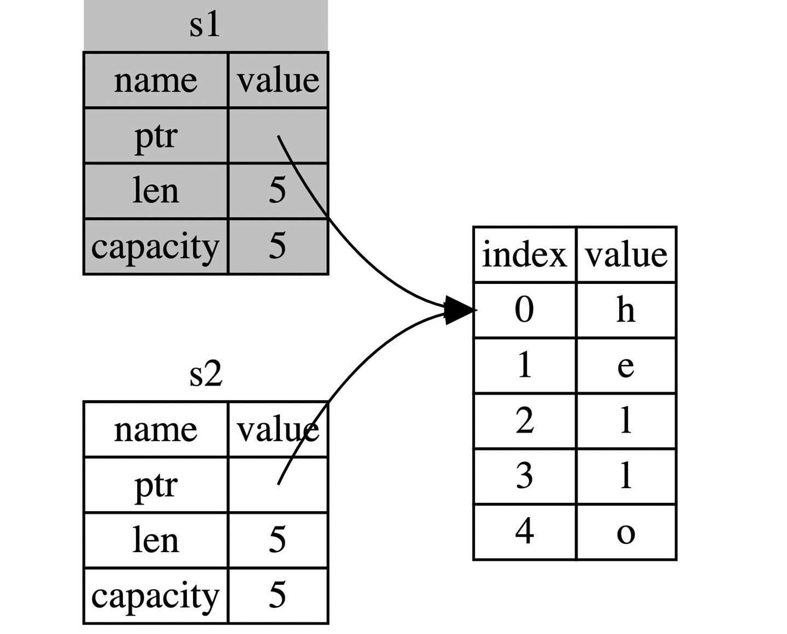
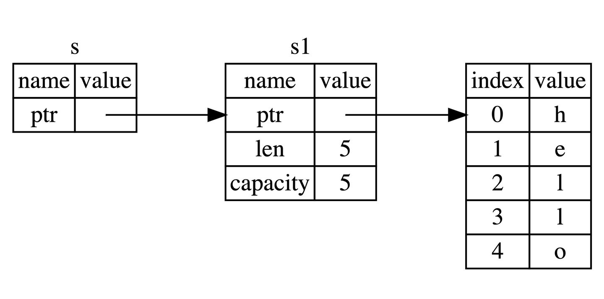

## 内存管理

程序在运行过程中申请了内存，要能够释放掉不需要的内存，否则程序将会耗尽计算机的内存。

### 其他语言

#### 程序员手动释放

代表语言：C，C++；

由程序员自己写代码来释放掉不需要的内存，通过函数调用的方式来申请和释放内存

**C++**

```
 ObjecT* obj = new ObjecT();
// do some thing;
...
// no need any more, release the momory obj occupy
delete obj;
```

程序员自己知道哪些对象不再被需要，理解上是可以做到非常准确的内存管理的。但是会存在程序员忘了释放对象的情况，导致内存泄漏。

#### 语言的 runtime 自动释放

代表语言：Java，Go

在程序运行过程中，语言的 runtime 会不断地寻找不再被使用的内存，然后自动释放掉，不需要程序员自己写代码去释放；简单，但是会存在 stop the world 的问题。

### Rust

内存管理核心就是 释放掉不会再被使用的内存。而 Rust 可以在编译的时候，通过静态分析的方法知道什么时候可以安全地释放掉这块内存；

这块内存对应的就是在这块内存中存放的对象，或者说 值；

注：Rust 用 值 这个概念来表示，以后我们也统一用 值 来表示；

## Rust 语言内存管理

Rust 如何释放内存，简单总结思路就是，当一个值（指向该值的变量）离开作用域后，这个值就可以被释放掉；其实和 C++ 的智能指针很像；

如下例子：

```rust
{                      // s 在这里无效，它尚未声明
    let s = "hello";   // 从此处起，s 是有效的
    // 使用 s
} // 此作用域已结束，s不再有效
```

当离开了作用域的时候，s 就可以被 drop 掉了

### 所有权

但是如果只是简单地判断某个值对应的变量离开了作用域，就 drop 掉的话，就会存在两次 drop 同一块内存，比如，如果 s1 和 s2 都 指向同一块内存，当 s1 和 s2 都离开作用域了，就会释放相同的内存两次。

所以，rust 保证同一块内存只能有一个所有者， 这样保证了只有所有者离开了作用域，才会 drop 掉这块内存；

即 当 s1 被赋予 s2 后，Rust 认为 s1 不再有效，因此也无需在 s1 离开作用域后 drop 任何东西，这就是把所有权从 s1 转移给了 s2，s1 在被赋予 s2 后就马上失效了。当 s2 离开作用域后才会释放这块内存。

于是，如下的代码就会报错：

```rust
let s1 = String::from("hello");
let s2 = s1; // s1 拥有的 "hello" 被转移到 s2 了，

println!("{}, world!", s1); // s1不再拥有 "hello"了，再使用 s1 就会有问题；
```

let s2 = s1 发生的所有权转移如下图所示，不做数据的 copy，只是在栈上创建了一个新的变量，指向该值；可以理解为浅拷贝。



注意：并不是 s2 = s1 这种写法都等于 浅拷贝，对于rust 内置的基础类型这种 栈中存储的类型，比如 bool，u32 等，这种在 s2 = s1 对应的还是深拷贝。

总结一下就是：

1. 一个值只能被一个变量所拥有，或者说一个值只能拥有一个所有者

2. 当所有者(变量)离开作用域范围时，这个值将被丢弃(drop)

### 引用和借用

如果只有通过获得所有权的方式来获得一个值，程序就会变得复杂，特别是在函数调用的时候，

```rust
fn main() {
    let s2 = String::from("hello");     // s2 进入作用域

    let s3 = takes_and_gives_back(s2);  // s2 被移动到
                                        // takes_and_gives_back 中,
                                        // 它也将返回值移给 s3
} // 这里, s3 移出作用域并被丢弃。s2 也移出作用域，但已被移走，
  // 所以什么也不会发生。s1 移出作用域并被丢弃

// takes_and_gives_back 将传入字符串并返回该值
fn takes_and_gives_back(a_string: String) -> String { // a_string 进入作用域

    a_string  // 返回 a_string 并移出给调用的函数
}
```

如果在 give\_ownership 这个函数内不把传进来的 a\_string 传回去，那么 takes\_and\_gives\_back 函数调用结束后， a\_string 对应的值就会被释放掉。

于是Rust 允许使用某个变量的引用来访问该值，避免了不必要的所有权转移

这个获取变量的引用的过程，称为借用（borrowing）

比如 下面的代码，我们用 `s1` 的引用作为参数传递给 `calculate_length` 函数，而不是把 `s1` 的所有权转移给该函数：

```rust
fn main() {
    let s1 = String::from("hello");

    let len = calculate_length(&s1);

    println!("The length of '{}' is {}.", s1, len);
}

fn calculate_length(s: &String) -> usize {
    s.len()
}
```

&s1 可以理解为一个指向 s1 这个变量的 变量，并不拥有这个"hello"值本身，如下图所示：



但是通过 &s1 没法对这个值进行修改，比如：

```rust
fn main() {
    let s = String::from("hello");

    change(&s);
}

fn change(some_string: &String) {
    some_string.push_str(", world"); // 会报错
}
```

需要可变引用才行，&mut s

```rust
fn main() {
    let mut s = String::from("hello");

    change(&mut s);
}

fn change(some_string: &mut String) {
    some_string.push_str(", world");
}
```

但是使用可变引用，有如下限制：

- 同一个作用域内，一个值只能由一个可变引用：

```rust
let mut s = String::from("hello");

let r1 = &mut s;
let r2 = &mut s;

println!("{}, {}", r1, r2);

// 报错
error[E0499]: cannot borrow `s` as mutable more than once at a time 同一时间无法对 `s` 进行两次可变借用
 --> src/main.rs:5:14
  |
4 |     let r1 = &mut s;
  |              ------ first mutable borrow occurs here 首个可变引用在这里借用
5 |     let r2 = &mut s;
  |              ^^^^^^ second mutable borrow occurs here 第二个可变引用在这里借用
6 |
7 |     println!("{}, {}", r1, r2);
  |                        -- first borrow later used here 第一个借用在这里使用
```

这种限制的好处就是使 Rust 在编译期就避免数据竞争，因为现在只有一个可变引用可以被用来修改一个值；

- 可变引用与不可变引用不能同时存在

这也是为了避免数据竞争，防止一个不可变引用在使用过程中被其他人（引用）修改。

对于使用引用来说，还有一个非常重要的限制：

引用不能引用一个无效（被释放掉）的值，比如：

```rust
fn main() {
    let reference_to_nothing = dangle();
}

fn dangle() -> &String {
    let s = String::from("hello");
    // s 会在函数调用结束后被释放，返回一个被释放的值的引用是无效的
    &s
}

// 报错
error[E0106]: missing lifetime specifier
 --> src/main.rs:5:16
  |
5 | fn dangle() -> &String {
  |                ^ expected named lifetime parameter
  |
  = help: this function's return type contains a borrowed value, but there is no value for it to be borrowed from
help: consider using the `'static` lifetime
  |
5 | fn dangle() -> &'static String {
  |                ~~~~~~~~
```

### 生命周期（lifetime）

上面提到，引用不能引用一个被释放掉的值，但是值的释放是和值的 拥有者 有关的，只要值的 拥有者 离开作用域了，值就会被释放，那么这个时候 引用 不就引用了一个无效的值吗？

于是 Rust 提出了生命周期 和 借用检查器(Borrow checker) 来检查我们的 借用是否合法，简而言之就是如果一个变量引用了一个作用域（life time）更小的值，编译的时候就会报错。

比如如下代码就会报错：

```rust
{
    let r;                // ---------+-- 'a
                          //          |
    {                     //          |
        let x = 5;        // -+-- 'b  |
        r = &x;           //  |       |
    }                     // -+       |
                          //          |
    println!("r: {}", r); //          |
}
```

编译器发现 `r` 明明拥有生命周期 `'a`，但是却引用了一个小得多的生命周期 `'b`，在这种情况下，编译器会认为我们的程序存在风险，因此拒绝运行。

#### 函数中的生命周期

大部分时间，编译器会自动帮我们推断出变量的生命周期（只有一个参数的话，直接用这个参数的生命周期作为返回值的生命周期），但是依然有例外：

```rust
fn main() {
    let string1 = String::from("abcd");
    let string2 = "xyz";

    let result = longest(string1.as_str(), string2);
    println!("The longest string is {}", result);
}

fn longest(x: &str, y: &str) -> &str {
    if x.len() > y.len() {
        x
    } else {
        y
    }
}

// 报错
error[E0106]: missing lifetime specifier
 --> src/main.rs:9:33
  |
9 | fn longest(x: &str, y: &str) -> &str {
  |               ----     ----     ^ expected named lifetime parameter // 参数需要一个生命周期
  |
  = help: this function's return type contains a borrowed value, but the signature does not say whether it is
  borrowed from `x` or `y`
  = 帮助： 该函数的返回值是一个引用类型，但是函数签名无法说明，该引用是借用自 `x` 还是 `y`
help: consider introducing a named lifetime parameter // 考虑引入一个生命周期
  |
9 | fn longest<'a>(x: &'a str, y: &'a str) -> &'a str {
  |           ^^^^    ^^^^^^^     ^^^^^^^     ^^^
```

Rust 无法知道返回函数 longest 返回的 &str 的生命周期是哪个，但是编译器需要知道这些，来确保函数调用后的引用生命周期分析。

此时就需要我们手动去标注，通过为参数标注合适的生命周期来帮助编译器进行借用检查的分析。

#### 生命周期标注语法

标记的生命周期只是为了取悦编译器，让编译器不要难为我们，并不会改变任何引用的实际作用域。

**标注语法**

```rust
&i32        // 一个引用
&'a i32     // 具有显式生命周期的引用
&'a mut i32 // 具有显式生命周期的可变引用
```

对于之前的例子，我们可以通过如下的生命周期标注来解决：

```rust
fn longest<'a>(x: &'a str, y: &'a str) -> &'a str {
    if x.len() > y.len() {
        x
    } else {
        y
    }
}
```

在通过函数签名指定生命周期参数时，我们并没有改变传入引用或者返回引用的真实生命周期，而是告诉编译器当不满足此约束条件时，就拒绝编译通过。比如如果其他变量使用了这个函数的返回值 ，但是这个变量的生命周期大于我们标注的这个函数的返回值的生命周期，就会拒绝编译。

当把具体的引用传给 `longest` 时，那生命周期 `'a` 的大小就是 `x` 和 `y` 的作用域的重合部分，换句话说，`'a` 的大小将等于 `x` 和 `y` 中较小的那个。由于返回值的生命周期也被标记为 `'a`，因此返回值的生命周期也是 `x` 和 `y` 中作用域较小的那个。

比如：

```rust
fn main() {
    let string1 = String::from("long string is long");
    let result;
    {
        let string2 = String::from("xyz");                  
        result = longest(string1.as_str(), string2.as_str());    
    }
    // 虽然我们自己清楚地知道 result 是引用 string1 的，生命周期不冲突，
    // 但是编译器并不知道
    println!("The longest string is {}", result);
}

// 报错：
error[E0597]: `string2` does not live long enough
 --> src/main.rs:6:44
  |
6 |         result = longest(string1.as_str(), string2.as_str());
  |                                            ^^^^^^^ borrowed value does not live long enough
7 |     }
  |     - `string2` dropped here while still borrowed
8 |     println!("The longest string is {}", result);
  |                                          ------ borrow later used here
```

编译器认为返回函数 longest 的返回的引用 result 的生命周期是 string1 和 string2 更小的那个，最小的是 string2， 其生命周期是 5 ～ 6 行代码。于是编译器认为 result 的生命周期是 5 ～ 6 行代码。 但是在第10 行还在使用 result，于是就直接报错了。

总结一下关于函数的返回值：

函数的返回值如果是一个引用类型，那么它的生命周期只会来源于：

- 函数参数的生命周期

- 函数体中某个新建引用的生命周期

但是如果 返回值是来自 “函数体中某个新建引用的生命周期” 的话，会导致悬垂引用，Rust 会拒绝编译。所以实际上，对 Rust 来说，返回值的生命周期只会来源函数参数的生命周期。

#### 结构体中的生命周期

一个结构体中也可能引用一个值，在结构体引用值，只要为结构体中的每一个引用标注上生命周期即可：

```rust
struct ImportantExcerpt<'a> {
    part: &'a str,
}

fn main() {
    let novel = String::from("Call me Ishmael. Some years ago...");
    let first_sentence = novel.split('.').next().expect("Could not find a '.'");
    let i = ImportantExcerpt {
        part: first_sentence,
    };
}
```

该生命周期标注说明，结构体 `ImportantExcerpt` 所引用的字符串 `str` 生命周期需要大于等于该结构体的生命周期。

上述述代码满足生命周期要求，可以通过编译，但是如下代码就无法通过编译：

```rust
#[derive(Debug)]
struct ImportantExcerpt<'a> {
    part: &'a str,
}

fn main() {
    let i;
    {
        let novel = String::from("Call me Ishmael. Some years ago...");
        let first_sentence = novel.split('.').next().expect("Could not find a '.'");
        i = ImportantExcerpt {
            part: first_sentence,
        }; // i 的生命周期 大于 first_sentence 生命周期，
    }
    println!("{:?}",i);
}

// 出错
error[E0597]: `novel` does not live long enough
  --> src/main.rs:10:30
   |
10 |         let first_sentence = novel.split('.').next().expect("Could not find a '.'");
   |                              ^^^^^^^^^^^^^^^^ borrowed value does not live long enough
...
14 |     }
   |     - `novel` dropped here while still borrowed
15 |     println!("{:?}",i);
   |                     - borrow later used here
```

#### 生命周期消除

在很多情况下，我们并不需要手动标注生命周期，比如如下的代码：

```rust
fn first_word(s: &str) -> &str {
    let bytes = s.as_bytes();

    for (i, &item) in bytes.iter().enumerate() {
        if item == b' ' {
            return &s[0..i];
        }
    }

    &s[..]
}
```

这是因为编译器为了简化用户的使用，运用了生命周期消除大法。

##### 三条消除规则

1. 每一个引用参数都会获得独自的生命周期

2. 若只有一个输入生命周期(函数参数中只有一个引用类型)，那么该生命周期会被赋给所有的输出生命周期

3. 若存在多个输入生命周期，且其中一个是 `&self` 或 `&mut self`，则 `&self` 的生命周期被赋给所有的输出生命周期

   - 拥有 `&self` 形式的参数，说明该函数是一个 `方法`，该规则让方法的使用便利度大幅提升。

规则应用案例：

- 函数的规则：

```rust
fn first_word(s: &str) -> &str { // 实际项目中的手写代码

-> 
fn first_word<'a>(s: &'a str) -> &str { // 编译器自动为参数添加生命周期

-> 
fn first_word<'a>(s: &'a str) -> &'a str { // 编译器自动为返回值添加生命周期
```

- 结构体方法中的规则：

```rust
impl<'a> ImportantExcerpt<'a> {
    fn announce_and_return_part(&self, announcement: &str) -> &str {
        println!("Attention please: {}", announcement);
        self.part
    }
}

-> 每个输入参数一个生命周期

impl<'a> ImportantExcerpt<'a> {
    fn announce_and_return_part<'b>(&'a self, announcement: &'b str) -> &str {
        println!("Attention please: {}", announcement);
        self.part
    }
}

-> 将 &self 的生命周期赋给返回值 &str
impl<'a> ImportantExcerpt<'a> {
    fn announce_and_return_part<'b>(&'a self, announcement: &'b str) -> &'a str {
        println!("Attention please: {}", announcement);
        self.part
    }
}
```

如果我们手动将返回的引用生命周期改为 'b 呢

```rust
impl<'a> ImportantExcerpt<'a> {
    fn announce_and_return_part<'b>(&'a self, announcement: &'b str) -> &'b str {
        println!("Attention please: {}", announcement);
        self.part
    }
}
```

编译器会报错，因为编译器无法知道 `'a` 和 `'b` 的关系，这个方法返回的 `self.part`的生命周期大于等于 `'a`，但是它不知道和`'b`之间的关系，编译器无法保证 `self.part`在`'b`生命周期始终有效。

有一点很容易推理出来：由于 `&'a self` 是被引用的一方，因此引用它的 `&'b str` 必须要活得比它短，否则会出现悬垂引用，即保证在`'b`生命周期内，`self.part`始终有效，所以只需要标注 `'b`生命周期小于等于`'a`即可。

通过如下的标注语法可解决：

```rust
impl<'a: 'b, 'b> ImportantExcerpt<'a> {
    fn announce_and_return_part(&'a self, announcement: &'b str) -> &'b str {
        println!("Attention please: {}", announcement);
        self.part
    }
} 
// 'a: 'b 标注 'a 必须比 'b 活得久
```
