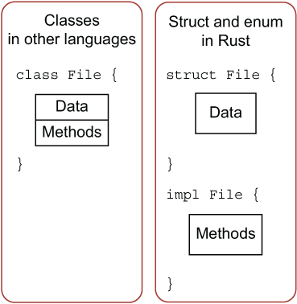
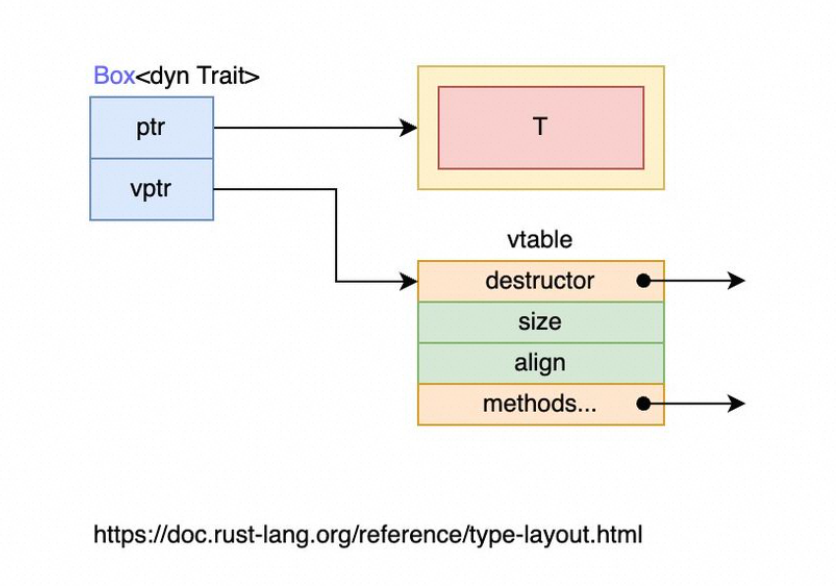
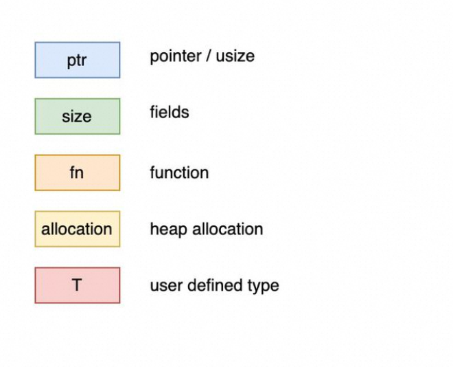

## 基本语法

### 变量绑定与解构

声明变量的时候不需要声明类型， Rust 编译器可以根据变量的值和上下文中的使用方式来自动推导出变量的类型，在无法推导出变量类型的时候，就需要手动标注类型，比如 `let a: i16 = 1;`

**变量绑定**

```rust
fn main() {
    // 不可变变量
    let a = 1;
  
    // 可变变量
    let mut x = 5;
    println!("The value of x is: {}", x);
    x = 6;
    println!("The value of x is: {}", x);
}
```

**变量解构**

```rust
fn main() {
    let (a, mut b): (bool,bool) = (true, false);
    // a = true,不可变; b = false，可变
    println!("a = {:?}, b = {:?}", a, b);

    b = true;
    assert_eq!(a, b);
}
```

### 数据类型

#### 基本类型

数值类型：


字符类型，布尔类型，单元类型（）；

#### 复合类型

字符串

**字符串**

```rust
// 一个 string 类型
let s = String::from("hello world");

// 一个 字符串切片
let slice = &s[4..len];
let slice = &s[4..];
```

元组（Tuple）

**Tuple**

```rust
let tup: (i32, f64, u8) = (500, 6.4, 1);
```

结构体

**Struct**

```rust
struct User {
    active: bool,
    username: String,
    email: String,
    sign_in_count: u64,
}

let user1 = User {
        email: String::from("someone@example.com"),
        username: String::from("someusername123"),
        active: true,
        sign_in_count: 1,
};

let user2 = User {
        email: String::from("another@example.com"),
        ..user1 // 将 user1 的其他字段转移到 user2 中，user1 不能再被使用了，但是user1 email 字段还是可以使用
    };

使用 #[derive(Debug)] 对结构体进行了标记，这样就可以使用 println!("{:?}", s); 的方式对其进行打印输出
#[derive(Debug)]
struct Rectangle {
    width: u32,
    height: u32,
}
```

枚举

**enum**

```rust
enum PokerSuit {
  Clubs,
  Spades,
  Diamonds,
  Hearts,
}

let heart = PokerSuit::Hearts;
let diamond = PokerSuit::Diamonds;

enum Message {
    Quit,
    Move { x: i32, y: i32 },
    Write(String),
    ChangeColor(i32, i32, i32),
}

fn main() {
    let m1 = Message::Quit;
    let m2 = Message::Move{x:1,y:1};
    let m3 = Message::ChangeColor(255,255,0);
}
```

Rust 没有 null 关键字， null 虽然好用，但是我们在使用的时候需要特别小心，不然动不动就 NPE 了。Rust 不引入 null 关键字，对于这种可能为空的情况，使用 Optiion 枚举，类似 Java 里面的 Optional，显式表明这个值可能为空；

**Option**

```rust
enum Option<T> {
    Some(T),
    None,
}
let some_number = Some(5);
let absent_number: Option<i32> = None;
```

数组

```rust
let a = [1, 2, 3, 4, 5];

let a: [i32; 5] = [1, 2, 3, 4, 5];

let first = a[0];
```

### 语句 + 表达式

Rust 的函数体是由一系列语句组成，最后由一个表达式来返回值，

语句： statement；

表达式：expression

```rust
fn add_with_extra(x: i32, y: i32) -> i32 {
    let x = x + 1; // 语句
    let y = y + 5; // 语句
    x + y // 表达式，不用加 return
}
```

### 模式匹配

**模式匹配**

```rust
enum Direction {
    East,
    West,
    North,
    South,
}

fn main() {
    let dire = Direction::South;
    match dire {
        Direction::East => println!("East"),
        Direction::North | Direction::South => {
            println!("South or North");
        },
        _ => println!("West"),
    };
}
```

**模式绑定**

```rust
#[derive(Debug)]
enum UsState {
    Alabama,
    Alaska,
    // --snip--
}

enum Coin {
    Penny,
    Nickel,
    Dime,
    Quarter(UsState), // 25美分硬币
}

// 捕获 UsState 值
fn value_in_cents(coin: Coin) -> u8 {
    match coin {
        Coin::Penny => 1,
        Coin::Nickel => 5,
        Coin::Dime => 10,
        Coin::Quarter(state) => {
            println!("State quarter from {:?}!", state);
            25
        },
    }
}
```

对于只有一个模式的值需要被处理，其它值直接忽略的场景，可以写成如下：

**if let 匹配**

```rust
let v = Some(3u8);
    match v {
        Some(3) => println!("three"),
        _ => (),
}
```

**match guard**

```rust
let num = Some(4);

match num {
    Some(x) if x < 5 => println!("less than five: {}", x),
    Some(x) => println!("{}", x),
    None => (),
}
```

### 方法

即与对象（rust 中可以是 struct， enum，trait）绑定的函数

```rust
struct Circle {
    x: f64,
    y: f64,
    radius: f64,
}

impl Circle {
    // new是Circle的关联函数，因为它的第一个参数不是self，且new并不是关键字
    // 这种方法往往用于初始化当前结构体的实例
    fn new(x: f64, y: f64, radius: f64) -> Circle {
        Circle {
            x: x,
            y: y,
            radius: radius,
        }
    }

    // Circle的方法，&self表示借用当前的Circle结构体
    fn area(&self) -> f64 {
        std::f64::consts::PI * (self.radius * self.radius)
    }
}
```

内存的摆放：



#### self，&self 和 &mut self

`self` 指代的是 `Rectangle` 结构体实例，`self` 依然有所有权的概念：

1. self 表示 Rectangle 的所有权转移到该方法中，这种形式用的较少

2. &self 表示该方法对 Rectangle 的不可变借用

3. &mut self 表示可变借用，可以通过 self 来修改struct 中的成员

#### 为枚举实现方法

```rust
#![allow(unused)]
enum Message {
    Quit,
    Move { x: i32, y: i32 },
    Write(String),
    ChangeColor(i32, i32, i32),
}

impl Message {
    fn call(&self) {
        // 在这里定义方法体
    }
}

fn main() {
    let m = Message::Write(String::from("hello"));
    m.call();
}
```

### 泛型和特征

#### 泛型

**泛型**

```rust
fn add<T>(a:T, b:T) -> T {
    a + b
}

fn main() {
    println!("add i8: {}", add(2i8, 3i8));
    println!("add i32: {}", add(20, 30));
    println!("add f64: {}", add(1.23, 1.23));
}
```

#### 特征

**特征**

```rust
// 定义一个 trait
pub trait Summary {
    fn summarize(&self) -> String;
}

// 定义不同的 trait 对象
pub struct Post {
    pub title: String, // 标题
    pub author: String, // 作者
    pub content: String, // 内容
}

impl Summary for Post {
    fn summarize(&self) -> String {
        format!("文章{}, 作者是{}", self.title, self.author)
    }
}

pub struct Weibo {
    pub username: String,
    pub content: String
}

impl Summary for Weibo {
    fn summarize(&self) -> String {
        format!("{}发表了微博{}", self.username, self.content)
    }
}
```

特征（trait）类似 java 里面的接口，也可以有默认实现。

特征作为函数参数如下所示：

```rust
pub fn notify(item: &impl Summary) {
    println!("Breaking news! {}", item.summarize());
}
```

我们还可以约束某个参数实现了多个特征：

```rust
pub fn notify(item: &(impl Summary + Display)) {}

pub fn notify<T: Summary + Display>(item: &T) {}
```

##### 特征对象

如果我们想在一个函数里面返回不同的特征实现的对象，可能会写出类似如下的代码：

```rust
fn returns_summarizable(switch: bool) -> impl Summary {
    if switch {
        Post {
           // ...
        }
    } else {
        Weibo {
            // ...
        }
    }
}
```

但这样是不行的，因为函数并不支持返回多种不同的类型，在编译的时候就会报错；

Rust 允许我们返回一个特征对象的引用，该引用指向实现了不同特征类型的实例；我们可以直接通过 & 引用，或者 Box<T> 智能指针的方式来引用特征对象。

**返回特征对象**

```rust
fn returns_summarizable(switch: bool) -> Box<dyn Summary> {
    if switch {
        Box::new(Post {
           // ...
        })
    } else {
        Box::new(Weibo {
            // ...
        })
    }
}
```

内存布局如下所示：





### 集合类型

**动态数组 Vector**

```rust
fn main() {
    let mut v = Vec::with_capacity(10);
    v.extend([1, 2, 3]);    // 附加数据到 v
    println!("Vector 长度是: {}, 容量是: {}", v.len(), v.capacity());

    v.reserve(100);        // 调整 v 的容量，至少要有 100 的容量
    println!("Vector（reserve） 长度是: {}, 容量是: {}", v.len(), v.capacity());

    v.shrink_to_fit();     // 释放剩余的容量，一般情况下，不会主动去释放容量
    println!("Vector（shrink_to_fit） 长度是: {}, 容量是: {}", v.len(), v.capacity());
}
```

**KV 存储 HashMap**

```rust
use std::collections::HashMap;

// 创建一个HashMap，用于存储宝石种类和对应的数量
let mut my_gems = HashMap::new();

// 将宝石类型和对应的数量写入表中
my_gems.insert("红宝石", 1);
my_gems.insert("蓝宝石", 2);
my_gems.insert("河边捡的误以为是宝石的破石头", 18);
```

### 错误处理

Rust 中的错误主要分为两类：

- 可恢复错误，通常用于从系统全局角度来看可以接受的错误，例如处理用户的访问、操作等错误，这些错误只会影响某个用户自身的操作进程，而不会对系统的全局稳定性产生影响。对应 Rust 的 Result<T, E>

- 不可恢复错误，刚好相反，该错误通常是全局性或者系统性的错误，例如数组越界访问，系统启动时发生了影响启动流程的错误等等，这些错误的影响往往对于系统来说是致命的。对应 Rust 的 panic!

注：java 不会区分这两种错误，统一使用异常（Exception）的方式去处理；

#### 不可恢复错误

在某些场景，我们可以向主动抛出一个异常，终止程序。Rust 为我们提供了 `panic!` 宏，当调用执行该宏时，程序会打印出一个错误信息，展开报错点往前的函数调用堆栈，最后退出程序。

**panic**

```rust
 panic!("crash and burn");
```

线程 panic 后，程序是否会终止？

如果是 `main` 线程，则程序会终止，如果是其它子线程，该线程会终止，但是不会影响 `main` 线程。

何时使用 panic

可能导致全局有害状态时，比如 非预期的错误，后续代码的运行会受到显著影响，内存安全的问题等。

当启动时某个流程发生了错误，对后续代码的运行造成了影响，那么就应该使用 `panic`，而不是处理错误后继续运行，当然你可以通过重试的方式来继续。

#### 可恢复错误

Rust 有一个统一的类用来表示调用某一个方法，是正常还是出现了异常：

```rust
enum。Result<T, E> {
    Ok(T), // 正常
    Err(E), // 异常
}
```

比如，open 一个文件：

**open 文件**

```rust
use std::fs::File;
use std::io::ErrorKind;

fn main() {
    let f = File::open("hello.txt");

    let f = match f {
        Ok(file) => file,
        Err(error) => match error.kind() {
            // 处理异常的类型
            ErrorKind::NotFound => match File::create("hello.txt") {
                Ok(fc) => fc,
                Err(e) => panic!("Problem creating the file: {:?}", e),
            },
            other_error => panic!("Problem opening the file: {:?}", other_error),
        },
    };
}
```

##### 异常传播

程序几乎不太可能只有 `A->B` 形式的函数调用，一个设计良好的程序，一个功能涉及十几层的函数调用都有可能。而错误处理也往往不是哪里调用出错，就在哪里处理，实际应用中，大概率会把错误层层上传然后交给调用链的上游函数进行处理，错误传播将极为常见。

**错误传播**

```rust
fn read_username_from_file() -> Result<String, io::Error> {
    // 打开文件，f是`Result<文件句柄,io::Error>`
    let f = File::open("hello.txt");

    let mut f = match f {
        // 打开文件成功，将file句柄赋值给f
        Ok(file) => file,
        // 打开文件失败，将错误返回(向上传播)
        Err(e) => return Err(e),
    };
    // 创建动态字符串s
    let mut s = String::new();
    // 从f文件句柄读取数据并写入s中
    match f.read_to_string(&mut s) {
        // 读取成功，返回Ok封装的字符串
        Ok(_) => Ok(s),
        // 将错误向上传播
        Err(e) => Err(e),
    }
}
```

**用 ？ 简化错误传播**

```rust
fn read_username_from_file() -> Result<String, io::Error> {
    let mut f = File::open("hello.txt")?;
    let mut s = String::new();
    f.read_to_string(&mut s)?; // ? 表示如果有了异常，就直接返回异常，read_to_string 的异常会隐式类型转换 转成 io::Error 异常
    Ok(s)
}

// 链式调用
fn read_username_from_file() -> Result<String, io::Error> {
    let mut s = String::new();

    File::open("hello.txt")?.read_to_string(&mut s)?;

    Ok(s)
}
```

### 包和模块

Rust 也提供了相应概念用于代码的组织管理，

- 项目(Packages)：一个 `Cargo` 提供的 `feature`，可以用来构建、测试和分享包

- 包(Crate)：一个由多个模块组成的树形结构，可以作为三方库进行分发，也可以生成可执行文件进行运行

- 模块(Module)：可以一个文件多个模块，也可以一个文件一个模块，模块可以被认为是真实项目中的代码组织单元

使用第三方包也很简单，在 cargo.toml 文件中 \[dependencies\] 区域中 添加第三方包，然后就可以直接使用了

```rust
use rand::Rng;

fn main() {
    let secret_number = rand::thread_rng().gen_range(1..101);
}
```

[https://course.rs/basic/crate-module/intro.html](https://course.rs/basic/crate-module/intro.html)

## 高级语法

### 函数式编程

Rust 支持函数式编程，即

- 使用函数作为参数进行传递

- 使用函数作为函数返回值

- 将函数赋值给变量

#### 闭包

闭包是一种匿名函数，它可以赋值给变量也可以作为参数传递给其它函数，不同于函数的是，它允许捕获调用者作用域中的值，例如：

```rust
fn main() {
   let x = 1;
   let sum = |y| x + y;

    assert_eq!(3, sum(2));
}
```

通过闭包，可以写出如下更灵活，更内聚的代码：

```rust
fn workout(intensity: u32, random_number: u32) {
    // 无论要修改什么，只要修改闭包 action 的实现即可，其它地方只负责调用；
    // 不然可能需要修改散落在代码各处的逻辑，
    let action = || {
        println!("muuuu.....");
        thread::sleep(Duration::from_secs(2));
        intensity
    };

    if intensity < 25 {
        println!(
            "今天活力满满，先做 {} 个俯卧撑!",
            action()
        );
        println!(
            "再来 {} 组卧推!",
            action()
        );
    } else if random_number == 3 {
        println!("昨天练过度了，今天还是休息下吧！");
    } else {
        println!(
            "昨天练过度了，今天干干有氧，跑步 {} 分钟!",
            action()
        );
    }
}

fn main() {
    // 动作次数
    let intensity = 10;
    // 随机值用来决定某个选择
    let random_number = 7;

    // 开始健身
    workout(intensity, random_number);
```

##### 闭包对内存的影响

闭包捕获变量有三种途径，恰好对应函数参数的三种传入方式：转移所有权、可变借用、不可变借用，因此相应的 `Fn` 特征也有三种：

1. `FnOnce`，该类型的闭包会拿走被捕获变量的所有权。`Once` 顾名思义，说明该闭包只能运行一次，因为第一次调用已经拿走了所有权，接下来的调用尝试拿走所有权就会出错；

```rust
fn fn_once<F>(func: F)
where
    F: FnOnce(usize) -> bool,
{
    println!("{}", func(3));
    println!("{}", func(4));
}

fn main() {
    let x = vec![1, 2, 3];
    fn_once(|z|{z == x.len()})
}
// 错误
error[E0382]: use of moved value: `func`
 --> src\main.rs:6:20
  |
1 | fn fn_once<F>(func: F)
  |               ---- move occurs because `func` has type `F`, which does not implement the `Copy` trait
                  // 因为`func`的类型是没有实现`Copy`特性的 `F`，所以发生了所有权的转移
...
5 |     println!("{}", func(3));
  |                    ------- `func` moved due to this call // 转移在这
6 |     println!("{}", func(4));
  |                    ^^^^ value used here after move // 转移后再次用
```

仅实现 `FnOnce` 特征的闭包在调用时会转移所有权，所以显然不能对已失去所有权的闭包变量进行二次调用：

2. `FnMut`，它以可变借用的方式捕获了环境中的值，因此可以修改该值

```rust
fn main() {
    let mut s = String::new();

    // 注意，不能写成 let update_string = |str| s.push_str(str);
    let mut update_string =  |str| s.push_str(str);
  
    update_string("hello");

    println!("{:?}",s);
}
```

3. `Fn` 特征，它以不可变借用的方式捕获环境中的值

```rust
fn main() {
    let s = "hello, ".to_string();

    let update_string =  |str| println!("{},{}",s,str);

    exec(update_string);

    println!("{:?}",s);
}
```

##### 闭包作为函数返回值

**错误版本**

```rust
fn factory(x:i32) -> impl Fn(i32) -> i32 {

    let num = 5;

    if x > 1{
        move |x| x + num
    } else {
        move |x| x - num
    }
}
```

**正确版本**

```rust
fn factory(x:i32) -> Box<dyn Fn(i32) -> i32> {
    let num = 5;

    if x > 1{
        Box::new(move |x| x + num)
    } else {
        Box::new(move |x| x - num)
    }
}
```

#### 迭代器 iterator

几种 for 迭代的写法

```rust
let arr = [1, 2, 3];

// 写法1
for v in arr {
    println!("{}",v);
}

// 写法2
for i in 1..10 {
    println!("{}", i);
}

// 写法3
let arr = [1, 2, 3];
for v in arr.into_iter() {
    println!("{}", v);
}
```

只要实现了 IntoIterator 特征，就可以通过 into\_iter 将其转换成迭代器

除了 into\_iter 方法，还有 iter，iter\_mut 方法来迭代，三者的区别如下：

- `into_iter` 会夺走所有权

- `iter` 是借用

- `iter_mut` 是可变借用

```rust
fn main() {
    let values = vec![1, 2, 3];

    for v in values.into_iter() {
        println!("{}", v)
    }

    // 下面的代码将报错，因为 values 的所有权在上面 `for` 循环中已经被转移走
    // println!("{:?}",values);

    let values = vec![1, 2, 3];
    let _values_iter = values.iter();

    // 不会报错，因为 values_iter 只是借用了 values 中的元素
    println!("{:?}", values);

    let mut values = vec![1, 2, 3];
    // 对 values 中的元素进行可变借用
    let mut values_iter_mut = values.iter_mut();

    // 取出第一个元素，并修改为0
    if let Some(v) = values_iter_mut.next() {
        *v = 0;
    }

    // 输出[0, 2, 3]
    println!("{:?}", values);
}
```

### 智能指针

#### Box

`Box<T>` 允许你将一个值分配到堆上，然后在栈上保留一个智能指针指向堆上的数据。

使用场景：

1. 将本应该在栈上的数据（基本类型）存储在堆上；但很少有这种需求，因为一个简单的值分配到堆上并没有太大的意义

2. 避免栈上数据的拷贝，栈上数据转移所有权时，实际上是把数据拷贝了一份，比如对应数组来说：

```rust
// 在栈上创建一个长度为1000的数组
    let arr = [0;1000];
    // 将arr所有权转移arr1，由于 `arr` 分配在栈上，因此这里实际上是直接重新深拷贝了一份数据
    let arr1 = arr;

    // arr 和 arr1 都拥有各自的栈上数组，因此不会报错
    println!("{:?}", arr.len());
    println!("{:?}", arr1.len());

   // 在堆上创建一个长度为1000的数组，然后使用一个智能指针指向它
    let arr = Box::new([0;1000]);
    // 将堆上数组的所有权转移给 arr1，由于数据在堆上，因此仅仅拷贝了智能指针的结构体，底层数据并没有被拷贝
    // 所有权顺利转移给 arr1，arr 不再拥有所有权
    let arr1 = arr;
    println!("{:?}", arr1.len());
    // 由于 arr 不再拥有底层数组的所有权，因此下面代码将报错
    // println!("{:?}", arr.len());
```

3. 将动态大小类型变为 Sized 固定大小类型

Rust 需要在编译时知道类型占用多少空间，如果一种类型在编译时无法知道具体的大小，那么被称为动态大小类型 DST。

比如如下代码：

```rust
enum List {
    Cons(i32, List),
    Nil,
}

// 报错
error[E0072]: recursive type `List` has infinite size //递归类型 `List` 拥有无限长的大小
 --> src/main.rs:3:1
  |
3 | enum List {
  | ^^^^^^^^^ recursive type has infinite size
4 |     Cons(i32, List),
  |               ---- recursive without indirection

// rust 认为 List 是一个 DST 类型，因为它可以无限递归下去，
// 但是可以改成
enum List {
    Cons(i32, Box<List>), // Box<T> 是一个固定size的类型
    Nil,
}
```

4. 特征对象

让一个数组包含特征的不同实现 以及函数可以返回特征的不同实现。

**1\. 特征对象**

```rust
trait Draw {
    fn draw(&self);
}

struct Button {
    id: u32,
}
impl Draw for Button {
    fn draw(&self) {
        println!("这是屏幕上第{}号按钮", self.id)
    }
}

struct Select {
    id: u32,
}

impl Draw for Select {
    fn draw(&self) {
        println!("这个选择框贼难用{}", self.id)
    }
}

fn main() {
    let elems: Vec<Box<dyn Draw>> = vec![Box::new(Button { id: 1 }), Box::new(Select { id: 2 })];

    for e in elems {
        e.draw()
    }
}
```

其实，特征也是 DST 类型，而特征对象在做的就是将 DST 类型转换为固定大小的类型。

#### Rc 和 Arc

##### Rc（Reference Count）

Rc<T> 主要用于同一堆上所分配的数据区域需要有多个只读访问的情况。虽然也可以用多个引用的方式，但是在一些场景中，引用的生命周期也会带来一定的复杂性。因为你可能需要频繁地标注生命周期，比较繁琐。

Rc 的使用如下所示：

**Rc 使用示例**

```rust
use std::rc::Rc;
fn main() {
    let a = Rc::new(String::from("hello, world"));
    let b = Rc::clone(&a);

    assert_eq!(2, Rc::strong_count(&a));
    assert_eq!(Rc::strong_count(&a), Rc::strong_count(&b))
}
```

这里的 `clone` 仅仅复制了智能指针并增加了引用计数，并没有克隆底层数据，因此 `a` 和 `b` 是共享了底层的字符串 `s`，这种复制效率是非常高的。

当 `a`、`b` 超出作用域后，引用计数会变成 0，最终智能指针和它指向的底层字符串都会被清理释放

#### Arc

但在多线程下，就无法使用 Rc 了。比如，如下代码将会报错：

**多线程下使用 Rc**

```rust
use std::rc::Rc;
use std::thread;

fn main() {
    let s = Rc::new(String::from("多线程漫游者"));
    for _ in 0..10 {
        let s = Rc::clone(&s);
        let handle = thread::spawn(move || {
           println!("{}", s)
        });
    }
}
```

`Rc<T>` 需要管理引用计数，但是该计数器并没有使用任何并发原语，因此无法实现原子化的计数操作，最终会导致计数错误。

这个时候可以使用 Arc（Atomic Rc），Arc 可以在多线程的场景下使用，是因为它加了锁，保证引入计数增加的原子性，也因此存在一定的锁的性能损耗。使用如下所示：

**Arc 的使用示例**

```rust
use std::sync::Arc;
use std::thread;

fn main() {
    let s = Arc::new(String::from("多线程漫游者"));
    for _ in 0..10 {
        let s = Arc::clone(&s);
        let handle = thread::spawn(move || {
           println!("{}", s)
        });
    }
}
```

总结：

1. `Rc/Arc` 是不可变引用，你无法修改它指向的值，只能进行读取。

2. 一旦最后一个拥有者消失，则资源会自动被回收，这个生命周期是在编译期就确定下来的

3. Rc 只能用于同一线程内部，Arc 可以用于线程之间的对象共享

#### Cell 和 RefCell

上面说到的 Rc/Arc 都无法修改内部的值，这个时候就可以使用 Cell 和 RefCell。

`Cell` 和 `RefCell` 在功能上没有区别，区别在于 `Cell<T>` 适用于 `T` 实现 `Copy` 的情况；

可以通过 Cell 来修改一个 &str 类型的值，但不能修改 String 类型的值；因为 &str 实现了 Copy 特征，但是 String 类型没有实现 Copy 特征

**Cell**

```rust
use std::cell::Cell;
fn main() {
  let c = Cell::new("asdf");
  let one = c.get();
  c.set("qwer");
  let two = c.get();
  println!("{},{}", one, two);
}
```

将所有权、借用规则与这些智能指针做一个对比：

Rust 规则

智能指针带来的额外规则

一个数据只有一个所有者

`Rc/Arc`让一个数据可以拥有多个所有者

要么多个不可变借用，要么一个可变借用

`RefCell`实现编译期可变、不可变引用共存

违背规则导致编译错误

违背规则导致运行时`panic`

`RefCell` 看起来可以解决可变引用和引用可以共存的问题，但是它只是将报错从编译期推迟到运行时，从编译器错误变成了 `panic` 异常，比如如下代码：

```rust
use std::cell::RefCell;

fn main() {
    let s = RefCell::new(String::from("hello, world"));
    let s1 = s.borrow(); 
    let s2 = s.borrow_mut();
    // 同时存在 s 的一个不可变引用和一个可变引用，违背了 Rust 借用规则，
    // 虽然在编译期不会报错，但是会在运行期报错
    println!("{},{}", s1, s2);
}
// 报错
// thread 'main' panicked at 'already borrowed: BorrowMutError', src/main.rs:6:16
// note: run with `RUST_BACKTRACE=1` environment variable to display a backtrace
```

#### RefCell 简单总结

- 与 `Cell` 用于可 `Copy` 的值不同，`RefCell` 用于引用

- `RefCell` 只是将借用规则从编译期推迟到程序运行期，并不能帮你绕过这个规则

- `RefCell` 适用于编译期误报或者一个引用被在多处代码使用、修改以至于难于管理借用关系时

- 使用 `RefCell` 时，违背借用规则会导致运行期的 `panic`

`RefCell` 适用于编译器误报或者一个引用被在多个代码中使用、修改以至于难于管理借用关系时，还有就是需要内部可变性时。

一个典型场景是 一个值可以在其方法内部被修改，同时对于其它代码不可变，是很有用的；比如：

```rust
// 定义在外部库中的特征
pub trait Messenger {
    fn send(&self, msg: String);
}

// --------------------------
// 我们的代码中的数据结构和实现
struct MsgQueue {
    msg_cache: Vec<String>,
}

impl Messenger for MsgQueue {
    // &self 是不可变引用，但是我也不想修改成 &mut，因为这个接口是别的库定义的
    fn send(&self, msg: String) {
        self.msg_cache.push(msg) // 这里会报错，因为修改了 msg_cache 本身；
    }
}
```

于是，我们可以修改为：

```rust
use std::cell::RefCell;
pub trait Messenger {
    fn send(&self, msg: String);
}

pub struct MsgQueue {
    // msg_cache 本身没变，只是里面包含的这个值变了
    msg_cache: RefCell<Vec<String>>,
}

impl Messenger for MsgQueue {
    fn send(&self, msg: String) {
        self.msg_cache.borrow_mut().push(msg)
    }
}

fn main() {
    let mq = MsgQueue {
        msg_cache: RefCell::new(Vec::new()),
    };
    mq.send("hello, world".to_string());
}
```

### 多线程

#### 使用多线程

**使用多线程**

```rust
use std::thread;
use std::time::Duration;

fn main() {
    thread::spawn(|| {
        for i in 1..10 {
            println!("hi number {} from the spawned thread!", i);
            thread::sleep(Duration::from_millis(1));
        }
    });

    for i in 1..5 {
        println!("hi number {} from the main thread!", i);
        thread::sleep(Duration::from_millis(1));
    }
}
```

通过 move 来将一个值的所有权从一个线程转移到另一个线程

```rust
use std::thread;

// 不 move 值的所有权
fn main() {
    let v = vec![1, 2, 3];

    let handle = thread::spawn(|| {
        // 这里会报错，因为 v 的所有权还是 main 线程的，
       // Rust 无法确定新的线程会活多久（多个线程的结束顺序并不是固定的），所以也无法确定新线程所引用的 v 是否在使用过程中一直合法：
        println!("Here's a vector: {:?}", v);
    });

    handle.join().unwrap();
}

error[E0373]: closure may outlive the current function, but it borrows `v`, which is owned by the current function
 --> src/main.rs:6:32
  |
6 |     let handle = thread::spawn(|| {
  |                                ^^ may outlive borrowed value `v`
7 |         println!("Here's a vector: {:?}", v);
  |                                           - `v` is borrowed here
```

需要改成 move v 的所有权的写法：

```rust
use std::thread;

fn main() {
    let v = vec![1, 2, 3];

    let handle = thread::spawn(move || {
        println!("Here's a vector: {:?}", v);
    });

    handle.join().unwrap();

    // 下面代码会报错borrow of moved value: `v`
    // println!("{:?}",v);
}
```

总结：

1. Rust 的线程模型是 1:1 模型（每个用户线程正好拥有映射到它的一个内核线程），因为 Rust 要保持尽量小的运行时。

2. main 线程若是结束，则所有子线程都将被终止，如果希望等待子线程结束后，再结束 main 线程，你需要使用创建线程时返回的句柄的 join 方法。

#### 线程同步

##### 消息传递

**通过通道std::sync::mpsc 传递数据**

```rust
use std::sync::mpsc;
use std::thread;

fn main() {
    // 创建一个消息通道, 返回一个元组：(发送者，接收者)
    let (tx, rx) = mpsc::channel();

    // 创建线程，并发送消息
    thread::spawn(move || {
        // 发送一个数字1, send方法返回Result<T,E>，通过unwrap进行快速错误处理
        tx.send(1).unwrap();

        // 下面代码将报错，因为编译器自动推导出通道传递的值是i32类型，那么Option<i32>类型将产生不匹配错误
        // tx.send(Some(1)).unwrap()
    });

    // 在主线程中接收子线程发送的消息并输出
    println!("receive {}", rx.recv().unwrap());
}
```

注：使用通道来传输数据，一样要遵循 Rust 的所有权规则：

1. 若值的类型实现了`Copy`特征，则直接复制一份该值，然后传输过去，例如之前的`i32`类型

2. 若值没有实现`Copy`，则它的所有权会被转移给接收端，在发送端继续使用该值将报错

如下的代码，违反了规则2，所有编译的时候就会报错

```rust
use std::sync::mpsc;
use std::thread;

fn main() {
    let (tx, rx) = mpsc::channel();

    thread::spawn(move || {
        let s = String::from("我，飞走咯!");
        tx.send(s).unwrap();
        //报错，因为 不能再使用 s 了
        println!("val is {}", s);
    });

    let received = rx.recv().unwrap();
    println!("Got: {}", received);
}
```

##### 锁、Condvar 和信号量

上面介绍的是使用消息传递来实现同步，还可以使用共享内存来实现同步性，例如通过锁和原子操作等并发原语来实现多个线程同时且安全地去访问一个资源。

共享内存和消息传递的比较：

共享内存

- 共享内存相对消息传递能节省多次内存拷贝的成本

- 共享内存的实现简洁的多

- 共享内存的锁竞争更多

消息传递

- 需要可靠和简单的(简单不等于简洁)实现时

- 需要模拟现实世界，例如用消息去通知某个目标执行相应的操作时

- 需要一个任务处理流水线(管道)时，等等

###### 互斥锁 Mutex

**单线程使用互斥锁 Mutex**

```rust
use std::sync::Mutex;

fn main() {
    // 使用`Mutex`结构体的关联函数创建新的互斥锁实例
    let m = Mutex::new(5);

    {
        // 获取锁，然后deref为`m`的引用
        // lock返回的是Result
        let mut num = m.lock().unwrap();
        *num = 6;
// 锁自动被drop
    } 通过作用域的方式释放锁

    println!("m = {:?}", m);
}
```

**多线程中使用 Mutex**

```rust
use std::sync::{Arc, Mutex};
use std::thread;

fn main() {
    // 需要使用 Arc，而不是 Rc，Rc::clone 是线程不安全的
    let counter = Arc::new(Mutex::new(0));
    let mut handles = vec![];

    for _ in 0..10 {
        let counter = Arc::clone(&counter);
        let handle = thread::spawn(move || {
            let mut num = counter.lock().unwrap();

            *num += 1;
        });
        handles.push(handle);
    }

    for handle in handles {
        handle.join().unwrap();
    }

    println!("Result: {}", *counter.lock().unwrap());
}
```

###### 用条件变量(Condvar)控制线程的同步

`Mutex`用于解决资源安全访问的问题，但是我们还需要一个手段来解决资源访问顺序的问题。而 Rust 考虑到了这一点，为我们提供了条件变量(Condition Variables)，它经常和`Mutex`一起使用，可以让线程挂起，直到某个条件发生后再继续执行

```rust
use std::sync::{Arc,Mutex,Condvar};
use std::thread::{spawn,sleep};
use std::time::Duration;

fn main() {
    let flag = Arc::new(Mutex::new(false));
    let cond = Arc::new(Condvar::new());
    let cflag = flag.clone();
    let ccond = cond.clone();

    let hdl = spawn(move || {
        let mut lock = cflag.lock().unwrap();
        let mut counter = 0;

        while counter < 3 {
            while !*lock {
                // wait方法会接收一个MutexGuard<'a, T>，且它会自动地暂时释放这个锁，使其他线程可以拿到锁并进行数据更新。
                // 同时当前线程在此处会被阻塞，直到被其他地方notify后，它会将原本的MutexGuard<'a, T>还给我们，即重新获取到了锁，同时唤醒了此线程。
                lock = ccond.wait(lock).unwrap();
            }
            
            *lock = false;

            counter += 1;
            println!("inner counter: {}", counter);
        }
    });

    let mut counter = 0;
    loop {
        sleep(Duration::from_millis(1000));
        *flag.lock().unwrap() = true;
        counter += 1;
        if counter > 3 {
            break;
        }
```

###### 信号量

在多线程中，另一个重要的概念就是信号量，使用它可以让我们精准的控制当前正在运行的任务最大数量。

**Semaphore**

```rust
use std::sync::Arc;
use tokio::sync::Semaphore;

#[tokio::main]
async fn main() {
    let semaphore = Arc::new(Semaphore::new(3));
    let mut join_handles = Vec::new();

    for _ in 0..5 {
        let permit = semaphore.clone().acquire_owned().await.unwrap();
        join_handles.push(tokio::spawn(async move {
            //
            // 在这里执行任务...
            //
            drop(permit);
        }));
    }

    for handle in join_handles {
        handle.await.unwrap();
    }
}
```

上面代码创建了一个容量为 3 的信号量，当正在执行的任务超过 3 时，剩下的任务需要等待正在执行任务完成并减少信号量后到 3 以内时，才能继续执行。

##### Atomic 原子类型与内存顺序

原子指的是一系列不可被 CPU 上下文交换的机器指令，这些指令组合在一起就形成了原子操作。在多核 CPU 下，当某个 CPU 核心开始运行原子操作时，会先暂停其它 CPU 内核对内存的操作，以保证原子操作不会被其它 CPU 内核所干扰。

原子类型是无锁类型，但是无锁不代表无需等待，因为原子类型内部使用了`CAS`循环，当大量的冲突发生时，该等待还是得[等待](https://course.rs/advance/concurrency-with-threads/thread.html#%E5%A4%9A%E7%BA%BF%E7%A8%8B%E7%9A%84%E5%BC%80%E9%94%80)！但是总归比锁要好。

**Atomic 使用示例**

```rust
use std::ops::Sub;
use std::sync::atomic::{AtomicU64, Ordering};
use std::thread::{self, JoinHandle};
use std::time::Instant;

const N_TIMES: u64 = 10000000;
const N_THREADS: usize = 10;

static R: AtomicU64 = AtomicU64::new(0);

fn add_n_times(n: u64) -> JoinHandle<()> {
    thread::spawn(move || {
        for _ in 0..n {
            R.fetch_add(1, Ordering::Relaxed);
        }
    })
}

fn main() {
    let s = Instant::now();
    let mut threads = Vec::with_capacity(N_THREADS);

    for _ in 0..N_THREADS {
        threads.push(add_n_times(N_TIMES));
    }

    for thread in threads {
        thread.join().unwrap();
    }

    assert_eq!(N_TIMES * N_THREADS as u64, R.load(Ordering::Relaxed));

    println!("{:?}",Instant::now().sub(s));
}
```

###### 内存顺序

内存顺序是指 CPU 在访问内存时的顺序，该顺序可能受以下因素的影响：

- 代码中的先后顺序

- 编译器优化导致在编译阶段发生改变(内存重排序 reordering)

- 运行阶段因 CPU 的缓存机制导致顺序被打乱

Rust 提供了`Ordering::Relaxed`用于限定内存顺序了，事实上，该枚举有 5 个成员:

- Relaxed， 这是最宽松的规则，它对编译器和 CPU 不做任何限制，可以乱序

- Release 释放，设定内存屏障(Memory barrier)，保证它之前的操作永远在它之前，但是它后面的操作可能被重排到它前面

- Acquire 获取, 设定内存屏障，保证在它之后的访问永远在它之后，但是它之前的操作却有可能被重排到它后面，往往和`Release`在不同线程中联合使用

- AcqRel, 是 Acquire 和 Release 的结合，同时拥有它们俩提供的保证。比如你要对一个 `atomic` 自增 1，同时希望该操作之前和之后的读取或写入操作不会被重新排序

- SeqCst 顺序一致性， `SeqCst`就像是`AcqRel`的加强版，它不管原子操作是属于读取还是写入的操作，只要某个线程有用到`SeqCst`的原子操作，线程中该`SeqCst`操作前的数据操作绝对不会被重新排在该`SeqCst`操作之后，且该`SeqCst`操作后的数据操作也绝对不会被重新排在`SeqCst`操作前。

#### 基于 Send 和 Sync 的线程安全

之前说过 Rc、RefCell 和裸指针不可以在多线程间使用

**Rc 在多线程中使用**

```rust
use std::thread;
use std::rc::Rc;
fn main() {
    let v = Rc::new(5);
    let t = thread::spawn(move || {
        println!("{}",v);
    });

    t.join().unwrap();
}

error[E0277]: `Rc<i32>` cannot be sent between threads safely
------ 省略部分报错 --------
    = help: within `[closure@src/main.rs:5:27: 7:6]`, the trait `Send` is not implemented for `Rc<i32>
```

看报错是 Rc 没有实现 trait \`Send\`，那么 trait `Send`是什么？

从Rc 和 Arc 的源码看为什么 Rc 不可以在多线程间使用，而 Arc 可以：

```rust
// Rc源码片段
impl<T: ?Sized> !marker::Send for Rc<T> {}
impl<T: ?Sized> !marker::Sync for Rc<T> {}

// Arc源码片段
unsafe impl<T: ?Sized + Sync + Send> Send for Arc<T> {}
unsafe impl<T: ?Sized + Sync + Send> Sync for Arc<T> {}
```

上面代码中`Rc<T>`的`Send`和`Sync`特征被特地移除了实现，而`Arc<T>`则相反，实现了`Sync + Send`，再结合之前的编译器报错，大概可以明白了：`Send`和`Sync`是在线程间安全使用一个值的关键。

##### Send and Sync

- 实现`Send`的类型可以在线程间安全的传递其所有权

- 实现`Sync`的类型可以在线程间安全的共享(通过引用)

如果 T 为 Sync 则 &T 为 Send，如果 &T 为 Send 则 T 为 Sync。

看一个可以在多线程间使用的 RwLock 的例子，RwLock 的定义如下所示：

```rust
unsafe impl<T: ?Sized + Send + Sync> Sync for RwLock<T> {}
```

首先`RwLock`可以在线程间安全的共享，那它肯定是实现了`Sync`。

`RwLock`可以并发的读，说明其中的值`T`必定也可以在线程间共享，那`T`必定要实现`Sync`。

而对于 Mutex 不需要并发地读，T 则不需要实现 Sync，只需要实现 Send 即可以；如果不实现 Send，那么是无法让多个线程访问的；Mutex 代码如下所示：

```rust
unsafe impl<T: ?Sized + Send> Sync for Mutex<T> {}
```

##### 实现`Send`和`Sync`的类型

如果我们需要跨多个线程通过引用访问一个值，则需要为这个值 `Sync`。如果需要跨多个线程转移一个值的所有权，则需要为这个值实现 `Send`。

在 Rust 中，几乎所有类型都默认实现了`Send`和`Sync`，而且由于这两个特征都是可自动派生的特征(通过`derive`派生)，意味着一个复合类型(例如结构体), 只要它内部的所有成员都实现了`Send`或者`Sync`，那么它就自动实现了`Send`或`Sync`。

- 裸指针两者都没实现，因为它本身就没有任何安全保证

- `UnsafeCell`不是`Sync`，因此`Cell`和`RefCell`也不是

- `Rc`两者都没实现(因为内部的引用计数器不是线程安全的)

如果是自定义的复合类型，那没实现那哥俩的就较为常见了：只要复合类型中有一个成员不是`Send`或`Sync`，那么该复合类型也就不是`Send`或`Sync`。

手动实现 `Send` 和 `Sync` 是不安全的，通常并不需要手动实现 Send 和 Sync trait，实现者需要使用`unsafe`小心维护并发安全保证。

###### 为裸指针实现 Send 和 Sync 特征

实现 Send

**实现 Send**

```rust
use std::thread;

#[derive(Debug)]
struct MyBox(*mut u8);
unsafe impl Send for MyBox {}
fn main() {
    // 这里是直接使用 p，而不是 &p
    let p = MyBox(5 as *mut u8);
    let t = thread::spawn(move || {
        println!("{:?}",p);
    });

    t.join().unwrap();
}
```

实现 Sync

```rust
use std::thread;
use std::sync::Arc;
use std::sync::Mutex;

#[derive(Debug)]
struct MyBox(*const u8);
unsafe impl Sync for MyBox {}

fn main() {
    let b = &MyBox(5 as *const u8);
    let v = Arc::new(Mutex::new(b));
    let t = thread::spawn(move || {
        let _v1 =  v.lock().unwrap();
    });

    t.join().unwrap();
}
```

其实 ，这样只是取悦编译器，告诉编译器我确保这个类型是 Send & Sync 的；如果不是的话，在运行的时候可能会出现 panic 或者未定义行为；

总结：

1. 实现`Send`的类型可以在线程间安全的传递其所有权, 实现`Sync`的类型可以在线程间安全的共享(通过引用)

2. 可以为自定义类型实现`Send`和`Sync`，但是需要`unsafe`代码块

3. 可以为部分 Rust 中的类型实现`Send`、`Sync`，但是需要使用`newtype`，例如文中的裸指针例子

### Macro 宏编程

宏是通过一种代码来生成另一种代码，宏可以帮我们减少所需编写的代码，也可以一定程度上减少维护的成本，虽然函数复用也有类似的作用，但是宏依然拥有自己独特的优势。

比如 Rust 的函数签名是固定的：定义了两个参数，就必须传入两个参数，多一个少一个都不行。

而宏就可以拥有可变数量的参数，例如可以调用一个参数的 `println!("hello")`，也可以调用两个参数的 `println!("hello {}", name)`。

由于宏会被展开成其它代码，且这个展开过程是发生在编译器对代码进行解释之前。因此，宏可以为指定的类型实现某个特征：先将宏展开成实现特征的代码后，再被编译。

而函数就做不到这一点，因为它直到运行时才能被调用，而特征需要在编译期被实现。

宏是将一个值跟对应的模式进行匹配，且该模式会与特定的代码相关联。宏里的值是一段 Rust 源代码(字面量)，模式用于跟这段源代码的结构相比较，一旦匹配，传入宏的那段源代码将被模式关联的代码所替换，最终实现宏展开。值得注意的是，所有的这些都是在编译期发生，并没有运行期的性能损耗。

比如 如下的 vec! 宏，可以方便地来初始化一个数组，并且支持任何元素类型，也并没有限制数组的长度，如果使用函数，我们是无法做到这一点的。

```rust
let v: Vec<u32> = vec![1, 2, 3];
```

vec! 也是用宏实现的，其宏的代码如下所示：

```rust
#[macro_export]
macro_rules! vec {
    ( $( $x:expr ),* ) => {
        {
            let mut temp_vec = Vec::new();
            $(
                temp_vec.push($x);
            )*
            temp_vec
        }
    };
}
```
