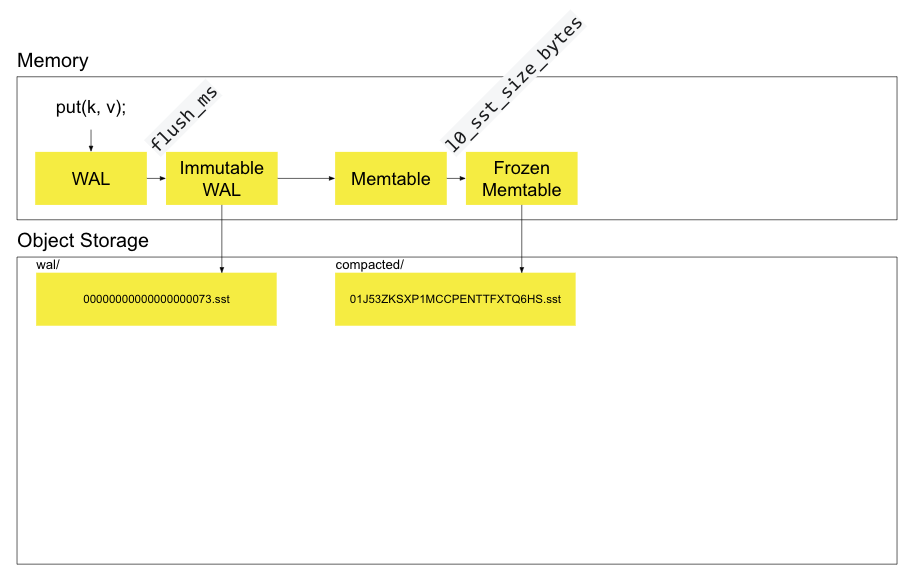
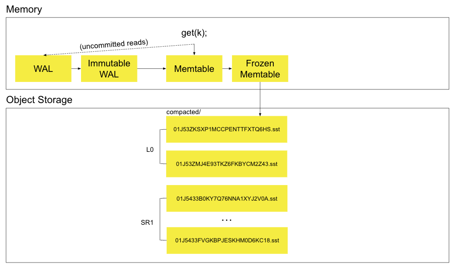

## 介绍

[SlateDB](https://github.com/slatedb/slatedb) 是面向对象存储设计的，用 Rust 写的，基于 LSM-Tree 结构的 Embedded KV 存储 。SlateDB 整体设计类似 RocksDB，单 Writer，多 Readers，不同于 RocksDB 将数据写入本地磁盘，SlateDB 直接由 Writer 将数据写入对象存储中。

## 为什么不直接基于 RocksDB

SlateDB 是由 Kafka Streams 的那帮人搞的，Kafka Streams 类似于 Flink，在 Kafka 上做计算，也是用的 RocksDB 作为 state。但是他们发现直接用 RocksDB 作为 state 有一堆问题，恢复时间长，依赖本地存储各种问题。最佳方案就是把 state 都放到远程存储上去。

Kafka Streams 的那帮人一开始是基于 RocksDB 来魔改，但是改了一段时间，发现行不太通。他们发现 RocksDB 本身就是为本地 SSD 设计的，实现上有很多地方假设这一点，导致魔改起来非常困难。[具体的原因](https://github.com/responsivedev/kafka-streams-archive/blob/main/blog-archive/why-slatedb-for-kafka-streams/page.mdx#why-not-rocksdb)如下：

1. 文件系统的 API 和 对象存储的 API 并不一致

虽然 RocksDB 本身抽象出来了和文件系统交互的接口，RocksDB 也搞了个 [HDFS](https://github.com/riversand963/rocksdb-hdfs-env) 的 Plugin，但是总归也只是面向文件系统的，并不能直接照搬到对象存储上来。

比如：

- RocksDB 依赖文件系统的 link 机制来保存 checkpoint，对象存储没有这种机制

- RocksDB 依赖文件系统的锁来独占访问，但是对象存储并没有这样的锁，

- RocksDB 依赖文件系统自身的缓存来缓存写入的数据，后续读取直接从缓存中读取。但是对象存储也并没有这个机制

2. RocksDB 假设所有数据都在本地，导致某些设计不够灵活

- 如果要支持 Remote Compaction 的话，实现起来就比较复杂。对于一个 RocksDB 实例，我们可能需要搞个 remote 进程来做 compaction 操作，但是同样也需要与打开这个 RocksDB 实例进行通信协调。

- 基于一个给定的 RocksDB checkpoint，在不同的计算节点上 Open 这个 RocksDB 实例也很麻烦。需要下载到本地，然后再 Open。

## 设计

### 基本概念

在理解 Slate 之前，我们需要理解 LSM-Tree 中比较重要的几个概念：

- Write Ahead Log（WAL）

WAL 是一个 Append-Only 的日志文件，数据的每一次写入（PUT）都会首先 append 到 WAL 中，WAL 主要是用来 crash 的时候恢复数据的。

- MemTables

数据的写入（PUT），首先会 append 到 WAL 中，然后会插入内存的中一个数据结构当中，这个内存的数据结构就叫做 MemTable。这个 MemTable 是排序过的，这样对于数据的 Get，就可以在 MemTable 中通过二分查找快速找到。

- SSTables

MemTables 是在内存中的，数据总归是需要持久化到磁盘的，而持久化到磁盘的结构称为 SSTables（Sorted String Tables）。

对于数据的 Get，会依次访问 MemTables，SSTables。

- Manifests

有了 WAL 和 SSTables，LSM-Tree 还需要 Manifests 文件来记录 LSM-Tree 当前的状态，比如 LSM-Tree 当前包含哪些 SSTables，WAL 的恢复点（以便 Crash 后从 WAL 中恢复），等其他必要的信息。

LSM-Tree 每一次状态的变化，比如增加了一个 SSTable，都会记录在 Manifests 文件中。

### 文件组织

一个 SlateDB 实例的文件组织如下所示：

```
path/to/db/
├─ manifest/
│  ├─ 00000000000000000001.manifest
│  ├─ 00000000000000000002.manifest
│  └─ ...
├─ wal/
│  ├─ 00000000000000000001.sst
│  ├─ 00000000000000000002.sst
│  └─ ...
└─ compacted/
   ├─ 01K3XYV1W2WR4FDVB7A9S319YS.sst
   ├─ 01K3XYV9JFPSZ5BW3Y1DVMKDFS.sst
   └─ ...
```

#### Manifest

manifest 目录下是 manifest 文件列表，文件名字由 1 开始递增。manifest 会被如下的进程更新：

1. Writers：当写了一个新的 WAL 或者 SST 文件的时候，会更新 manifest 让其包含这个新的文件

2. Readers：Reader 读 LST-Tree 的一个快照时，需要更新 manifest 来表示读了哪个 snapshot，避免其他进程删掉这个 snapshot 对应的 SST

3. Compactor：Compactor 会将若干 SST 文件 compact 成新的 SST 文件，compact 成功后需要更新 manifest 让其包含新的 SST 文件

#### WAL & Comapcted

WAL 目录下是 WAL 文件，WAL 文件名由 1 开始递增。

Compacted 目录下是 SSTables 文件，文件名是一个 UUID。

### 写流程

写流程如下所示：



1. 首先 put 到内存到 mutable WAL 中

2. 在 flush\_ms 后，mutable WAL 变为 immutable WAL，异步写到 object storage中

3. 同时也会 copy 一份到 MemTable 中

4. 给 client 返回 ack

5. mem table 中的数据量满足一定条件，变成 frozen memtable，异步flush 到 object storage中，作为 LSM 的 l0 层

### 读流程

读流程如下所示：



依次在 Mem Table，Frozen Memtable，SSTables 中寻找

### 避免多写导致写入覆盖的问题

上面的写流程忽略了一个重要的问题，即：如何保证只有单个writer写。

SlateDB 只允许同一时间单个 writer 写，但是依然存在可能会有多个 writer 尝试写，如果不做任何保护的话，会存在写入互相覆盖，导致写入丢失的问题。

针对多写的问题，SlateDB 主要使用 CAS 来避免写入覆盖的问题。即如果一个 Writer A 准备写文件 1，但是发现另一个 Writer B 已经写了文件1，Writer A 就会 abort 这次写入。

其实这依赖对象的 Put If Absent 的能力，即如果文件1不存在才写入，不然就不写入。值得一提的是，去年 S3 还不支持 Put If Absent ，不过 SlateDB 认为 S3 最终一定会支持的。今年果然就支持了。

我想聊一下，在 S3 还不支持 Put If Absent 的能力的时候，SlateDB 是怎么做的。

SlateDB 使用两阶段写的方式来支持，需要引入一个外部的 transactional store（DynamoDB）。

1. writer 首先写一个 object 到一个临时的 location，然后写一个 record （put if not exist）到 transactional store，包含 source，destination，completion flag。

2. writer 之后 copy 这个 object 到 destination location。copy 好了之后，transactional store 的这个 record 的 completion flag 就会被标记为 complete，最后将该临时 object 删掉；

只要 record 被写入到了 transactional store，就认为写成功了，在这之前失败的话，就 abort 这次写入，在这之后失败的话，就走 recover 流程，重新 copy，然后设置 completion flag。

这样，如果一个另一个 writer 准备写相同的 destination location，会发现 transactional store 已经有这个 record，就不会写入了。

具体而言，SlateDB 在如下两种 Case 下需要避免多 writer 写入：


**更新 manifest**

SlateDB 更新 manifest 其实就是写一个更大 ID 的 manifest 文件，更新 manifest 需要保证原子性，不然会存在 Writer A 基于 manifest 1 写入了 manifest 2。 Writer B 也基于 manifest 1 写入了 manifest 2。这样 Writer A 的更新就丢失了。为了保证 manifest 更新的原子性，其更新流程如下所示：

1. list manifest 找到最大的 id，比如 `00000000000000000002.manifest`
2. 读 `00000000000000000002.manifest` 的内容到内存中
3. 在内存中更新`manifest`的内容
4. 写 next manifest id manifest/00000000000000000003.manifest

步骤4 就是 CAS operation，如果 4 失败了，那么 client 就必须重复 1 ～ 4步，因为 client 现在内存中有的 manifest 就是过期的。

**Writer 写 WAL 文件**

类似的，写 WAL 文件也只能由一个 writer 来写入，不然也会存在 writer 互相覆盖的情况。SlateDB 通过 CAS 来避免写入覆盖，引入 writer epoch 来确定哪个 writer 可以写入，其中当前的 writer epoch 记录在 manifest 中，其整体流程如下所示：

1. Writer A 启动的时候读当前的 manifest
2. 递增 writer\_epoch，并写到 manifest 中
3. Writer A 首先 list wal 目录找到下一个 SST 文件的 ID，然后带着 writer\_epoch 使用 CAS 操作写这个 SST，会存在如下几种状态：
   - 写成功了，这样所有其他有更低 writer epoch 的 writer 都不能写了
   - 写失败了，另一个 writer B 写了一个相同 ID 的 SST，但是 writer B 有更低的 writer epoch，这表明 Writer A 是合法的写入，于是 Writer A 从步骤1 重新执行
   - 写失败了，另一个 writer 写了一个相同 ID 的 SST 和相同的 writer\_epoch，Writer A 直接 abort 自己
   - 写失败了，另一个 writer 写了一个相同 ID 的 SST 和更高的 writer\_epoch，说明另一个 Writer 正在写入，Writer A 直接 abort 自己，不再尝试写入，保证单 writer 写入

## 总结

- 基于对象存储重新实现的开源表格式，Log 系统很多，但是 KV 系统确实不多见，SlateDB 的实现有一定的参考价值

- 对象存储很“弱”，基于对象存储设计的系统需要考虑到对象存储的独有特性

- 对象存储的 Put If Absent 语义很强，要充分利用，有的时候可以避免引入额外的复杂度
