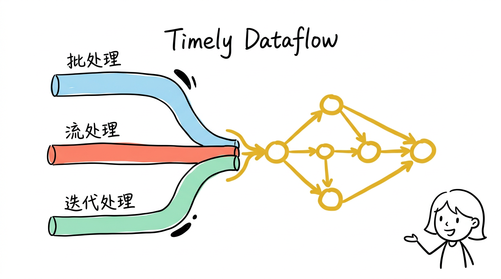
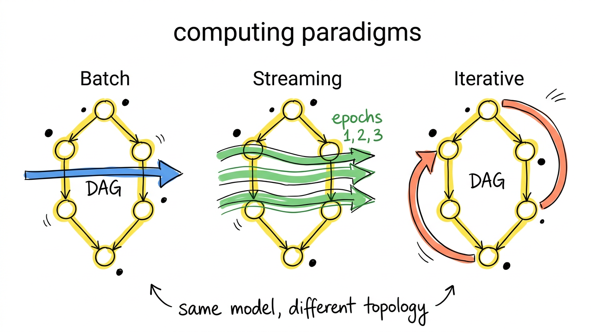
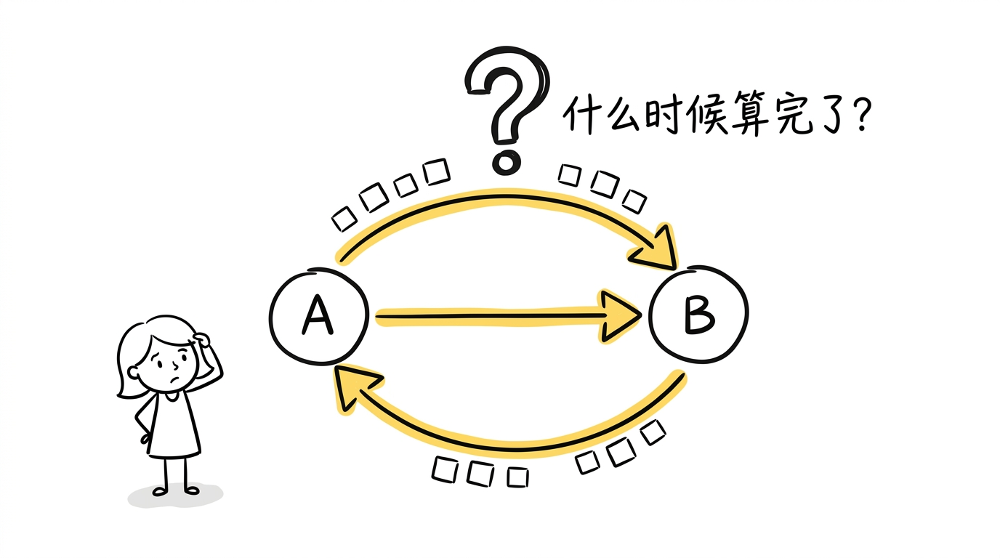
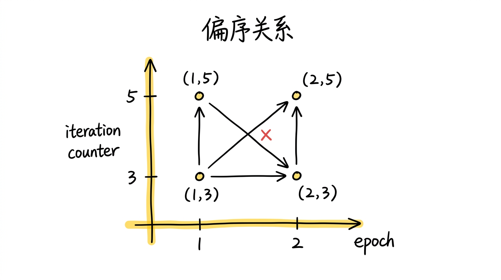
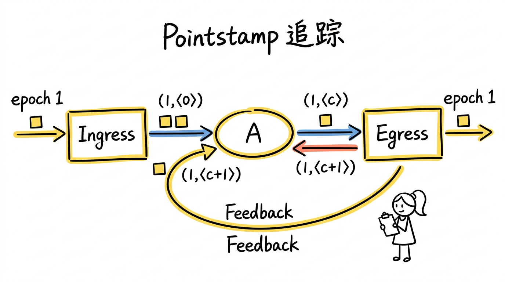
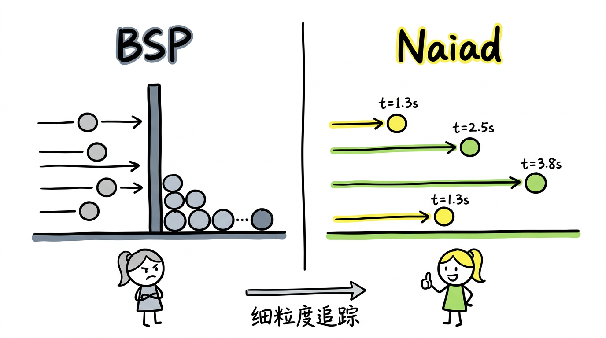

> 论文：*Naiad: A Timely Dataflow System*
> 作者：Derek G. Murray, Frank McSherry, Rebecca Isaacs 等（Microsoft Research）
> 发表：SOSP 2013（Best Paper Award）

这是系列文章的第一篇。整个系列将沿着一条技术演进路线展开：

1. **Timely Dataflow**（本篇）：用一个支持有环图的数据流模型，统一 batch、streaming 和 iterative 三种计算范式
2. [Differential Dataflow](/posts/differential-dataflow让计算只做增量/)：如何在 timely dataflow 之上实现通用的增量计算
3. [Materialize](/posts/materialize用-dataflow-构建实时-sql-数据库/)：如何用 dataflow 引擎构建一个实时 SQL 数据库

这些内容最初是三年前学习的，大概是 Flink 和 RisingWave 的口水战期间，出于好奇去读了 Naiad 和 Differential Dataflow 的论文。最近花了点时间重新整理，发上来做个记录。

---

## 为什么需要 Timely Dataflow

2013 年前后，大数据处理领域有三条清晰的技术路线，但它们各自只能覆盖一种计算范式：

**批处理系统**（MapReduce、Spark）：将数据分成批次处理，擅长大规模离线计算，但延迟在秒甚至分钟级别。即使只有一条新数据到来，也要等到一整批数据凑齐才能处理。

**流处理系统**（Storm、S4）：逐条处理数据，延迟低，但计算模型受限。最大的问题是它们难以支持**迭代计算**——图计算中的 PageRank、机器学习中的梯度下降都需要反复迭代直到收敛，而纯流处理系统的 DAG（有向无环图）不支持这种循环结构。

**图计算系统**（Pregel、GraphLab）：专门做迭代，但它们不擅长流处理和增量更新，迭代之间需要全局同步。

最终，实际生产中的数据管道往往变成这样：用 Storm 做实时预处理，用 Spark 做批量聚合，用 Pregel 做图计算——三套系统，三种编程模型，三组运维负担，还要处理它们之间的数据一致性。

**Naiad 的目标很直接：用一个统一的计算模型，同时支持 batch、streaming 和 iterative 计算，且延迟足够低。**

这个统一模型就是 timely dataflow。



---

## Timely Dataflow 计算模型

### 有向图，但可以有环

Dataflow 计算模型本身并不新鲜——计算被表达为一个有向图，节点是算子（operator），边是数据通道。数据从输入进入图，经过各个算子处理后，从输出流出。MapReduce 就是一种最简单的 dataflow：两个节点（Map 和 Reduce），一条边。

但传统 dataflow 系统要求图是**无环**的（DAG），这使得它们无法自然表达迭代计算。如果你想做 PageRank，只能在外部写一个循环，每次迭代手动将上一轮的输出喂回输入。

Timely dataflow 的核心区别是：**它允许图中存在环（cycle）**。迭代计算直接在图内完成——一个循环结构中的数据反复流过同一组算子，直到满足收敛条件后从循环中流出。

### 三种计算范式如何统一

有环图看起来只是一个小扩展，但它改变了模型的表达能力。下面来看三种范式如何自然映射到同一个 timely dataflow 图：

**Batch（批处理）**：一批数据作为一个 epoch 注入 dataflow 图。所有数据流过算子、完成处理后，系统输出这个 epoch 的完整结果。没有环，没有迭代，就是一次性执行的 DAG。等价于 MapReduce 或 Spark 的一次 job。

**Streaming（流处理）**：数据持续到来，每条（或每小批）数据作为一个新的 epoch 注入。Dataflow 图始终在运行，新数据到来时立即处理。不同 epoch 的数据可以在图中**流水线式地并行处理**——epoch 5 的数据在算子 A 处理的同时，epoch 4 的数据已经在算子 B 了。

**Iterative（迭代计算）**：数据在图的循环结构中反复流转。每一轮迭代对应循环计数器加 1。当一轮迭代不再产生新数据（收敛了），数据从循环中流出。无需像 BSP 模型那样在每轮之间做全局同步。

**这不是三种模式被硬塞进一个框架，而是它们本质上就是同一种计算模型在不同拓扑结构下的表现。** DAG 就是没有环的特殊情况，batch 就是只有一个 epoch 的特殊情况。



但这种统一带来了一个根本性的难题。

### 核心难题：什么时候算完了？

在 DAG 中，进度追踪是直觉化的——如果一个算子上游的所有消息都已到达，那它就可以安全地结束当前批次的处理。因为没有环，消息只会往一个方向流动，不会回头。

一旦有了环，情况就完全不同了。考虑一个迭代计算：算子 A 的输出经过算子 B 后可能会流回算子 A。那 A 怎么知道"时间 t 的所有消息已经到齐了"？B 可能还在产生新的消息，这些消息又会回到 A。而 A 的处理又可能触发 B 产生更多消息……

**在有环图中，一个算子无法通过简单计数来判断自己是否收到了所有消息。** 解决这个问题，是 Naiad 能够真正统一三种范式的前提——如果你无法判断某个时间点的计算是否完成，你就无法正确地输出结果，无法判断迭代是否收敛，也无法让不同 epoch 安全地并行。

Naiad 的回答是：一套精确的进度追踪协议。



### 时间戳设计

为了在有环图中追踪进度，Naiad 设计了一种层级化的时间戳结构：

$$t = (e, \langle c_1, c_2, \ldots, c_k \rangle)$$

- $e$ 是 **epoch**，表示第几批输入数据。你往系统里灌了三批数据，分别是 epoch 1、2、3。Epoch 是外部输入的逻辑时间，和迭代无关。
- $c_1, c_2, \ldots, c_k$ 是**循环计数器**，表示这批数据在循环中的第几轮迭代。每个循环嵌套对应一个计数器。

例如，一个没有循环的 dataflow 中，时间戳就是简单的 $(e)$。如果有一层循环嵌套，时间戳变成 $(e, \langle c_1 \rangle)$，表示"第 $e$ 批输入数据，在循环中的第 $c_1$ 轮迭代"。

**关键点：这些时间戳之间的关系是偏序（partial order），不是全序。**

什么意思？全序意味着任意两个元素都可以比较大小，就像自然数：3 一定小于 5。但偏序允许两个元素**不可比较**。

时间戳的比较规则是：$(e_1, \langle c_1 \rangle) \leq (e_2, \langle c_2 \rangle)$ 当且仅当 $e_1 \leq e_2$ **且** $c_1 \leq c_2$——**每个分量都必须 $\leq$**。来看几个例子：

- $(1, \langle 3 \rangle) < (1, \langle 5 \rangle)$：同一个 epoch，迭代 3 在迭代 5 之前。两个分量都 $\leq$，可比较。
- $(1, \langle 3 \rangle) < (2, \langle 5 \rangle)$：epoch $1 < 2$，迭代 $3 < 5$，两个分量都 $\leq$，可比较。
- $(1, \langle 5 \rangle)$ 和 $(2, \langle 3 \rangle)$：epoch $1 < 2$，但迭代 $5 > 3$。两个分量方向相反，谁也不"先于"谁，**不可比较**。

最后这种不可比较的情况正是偏序的意义所在——epoch 1 的第 5 轮迭代和 epoch 2 的第 3 轮迭代是**独立的计算**，系统可以**并行处理**它们，不需要等一个完成后再做另一个。这种跨 epoch 的流水线并行，是 Naiad 实现低延迟的关键来源之一。



---

## 进度追踪协议

进度追踪协议（Progress Tracking Protocol）是 Naiad 论文最核心的技术贡献。它回答了那个根本问题：**在有环图中，一个节点如何知道"时间 t 的所有消息都已到达"？**

### Pointstamp

协议的基本概念是 **pointstamp**，它是一个二元组：

$$\text{pointstamp} = (\text{timestamp}, \text{location})$$

- **timestamp** 是上面描述的 $(e, \langle c_1, c_2, \ldots \rangle)$ 形式的时间戳
- **location** 是图中的一个位置（某条边或某个节点）

一个 pointstamp $(t, l)$ 表示"在位置 $l$ 上，还可能出现时间戳为 $t$ 的消息"。系统追踪的就是所有**活跃的** pointstamp。

### Could-Result-In 关系

协议的核心机制是 **could-result-in** 关系。给定两个 pointstamp $(t_1, l_1)$ 和 $(t_2, l_2)$，如果 $(t_1, l_1)$ **could-result-in** $(t_2, l_2)$，意味着位置 $l_1$ 上时间戳为 $t_1$ 的消息经过处理后，**有可能**在位置 $l_2$ 产生时间戳为 $t_2$ 的消息。

这个关系由图的拓扑结构决定：

- **普通边**：消息沿边传递，时间戳不变。所以如果 $l_1 \to l_2$ 是一条普通边，那么 $(t, l_1)$ could-result-in $(t, l_2)$。
- **进入循环的边（ingress）**：时间戳增加一个新的循环计数器维度，初始值为 0。$(e, l_1)$ could-result-in $((e, \langle 0 \rangle), l_2)$。
- **循环反馈边（feedback）**：循环计数器加 1。$((e, \langle c \rangle), l_1)$ could-result-in $((e, \langle c+1 \rangle), l_2)$。
- **离开循环的边（egress）**：移除最内层的循环计数器维度。$((e, \langle c \rangle), l_1)$ could-result-in $(e, l_2)$。

通过沿着图的路径**传递**这些关系，系统可以判断：从任意 pointstamp 出发，未来可能产生哪些 pointstamp。

### Frontier（前沿）

有了 could-result-in 关系，系统维护一个全局的 **frontier**。直观地说，frontier 表示"时间线上还没有完成的最早的那些时间戳"。

更精确地说，系统中每个位置都有一个 frontier——一个时间戳的集合（称为 **antichain**），满足：

- 集合中任意两个时间戳互不可比较（都不是对方的"之前"）
- 任何未来可能出现的消息，其时间戳一定 $\geq$ 集合中的某个时间戳

当一个节点在位置 $l$ 上看到 frontier 推进到了 $t$，它就知道：**不会再有时间戳 $< t$ 的消息到达 $l$**。这时候，它可以安全地处理并输出时间 $t$ 之前的结果。

### Notification（通知）

Naiad 的算子可以请求在特定时间戳收到 **notification**（通知）。当 frontier 推进到某个时间戳之后，对应的通知被触发，告诉算子："时间 $t$ 的所有输入都已到齐，你可以产出最终结果了。"

例如，一个 `count` 算子需要等到时间 $t$ 的所有输入消息到齐后，才能输出该时间戳下的计数结果。它请求一个时间 $t$ 的通知，当收到通知时，输出 $(t, \text{count})$。

### 协议的运作方式

上面介绍了 pointstamp、could-result-in、frontier、notification 这些概念，但它们如何协同工作？让我们用一个具体的例子来看整个协议是如何运作的。

考虑一个带单层循环的 dataflow：算子 A 在循环中做迭代计算，每轮处理完后，一部分结果退出循环输出，一部分通过 Feedback 送回 A 继续迭代：



```
          epoch 1        (1,⟨0⟩)                   epoch 1
Input ──────────→[Ingress]─────→ [A] ────→[Egress]────────→ Output
                                  ↑   |
                            (1,⟨c+1⟩) (1,⟨c⟩)
                                  |   ↓
                                [Feedback]
```

图中标注了时间戳在各条边上如何变化：Ingress 为时间戳添加循环计数器维度，epoch 1 变为 $(1,\langle 0 \rangle)$；Feedback 将循环计数器加 1，$(1,\langle c \rangle)$ 变为 $(1,\langle c+1 \rangle)$；Egress 移除循环计数器维度，$(1,\langle c \rangle)$ 变为 epoch 1——循环外不再需要迭代信息。

协议追踪每个 pointstamp 的**活跃计数**（occurrence count），有两种东西会贡献计数：

- **未消费的消息**：一条时间戳为 $t$ 的消息停留在边 $l$ 上，pointstamp $(t, l)$ 的计数 +1。
- **Capability**（能力声明）：算子持有的一个令牌，表示"我还可能在时间戳 $t$ 上产生消息"，对应 pointstamp 的计数 +1。

为什么需要 capability？因为算子的行为对系统来说是黑盒——系统不知道一个算子收到消息后会不会产生输出、什么时候产生、产生在哪个时间戳上。所以系统需要算子**主动声明**自己的意图。

具体来说，当算子收到一条时间戳为 $t$ 的消息时，它同时获得一个时间戳为 $t$ 的 capability。只要它持有这个 capability，系统就认为"该算子可能在时间戳 $t$（或更晚的时间戳）上产生新消息"，因此不会推进 frontier。算子可以做三种操作：

1. **持有**：继续持有 capability，阻止 frontier 推进——比如一个聚合算子需要等齐同一时间戳的所有消息后才能输出，在此期间它必须持有 capability。
2. **降级**（downgrade）：将 capability 的时间戳推进到更晚的值。这告诉系统"我不会再在原来的时间戳上产生消息了，但可能在更晚的时间戳上产生"。系统可以推进原时间戳的 frontier。
3. **释放**（drop）：彻底放弃 capability，告诉系统"我不会再在这个时间戳上产生任何消息了"。对应 pointstamp 的活跃计数 -1。

**当一个 pointstamp 的活跃计数归零——既没有未消费的消息，也没有算子持有对应的 capability——系统就知道这个 pointstamp 不会再有新的事件了。**

#### 逐步追踪

下面追踪 epoch 1 的数据在这个 dataflow 中的完整生命周期。为了聚焦核心机制，我们省略 Input 和 Output 的细节，从数据进入循环开始。

**第 1 步：数据进入循环。**

Input 发送 3 条 epoch 1 的数据后，宣布"不会再发送 epoch 1 的数据"（即 Input 将自己的 capability 推进到 epoch 2）。Ingress 将这 3 条消息的时间戳从 epoch 1 转换为 $(1,\langle 0 \rangle)$，发往 A。

此时系统中的活跃 pointstamp：

| 位置 | 时间戳 | 类型 | 计数 |
|------|--------|------|------|
| Ingress → A 边 | $(1,\langle 0 \rangle)$ | 消息 | 3 |

A 还没有开始处理，也没有持有任何 capability。3 条消息停留在 A 的输入边上，每条贡献 1 个活跃计数。

**第 2 步：A 开始处理第 0 轮。**

A 从输入边取走 3 条消息（边上的活跃计数 -3），同时获得时间戳 $(1,\langle 0 \rangle)$ 的 capability（A 节点上的活跃计数 +1）。这个 capability 表示 A 还可能在 $(1,\langle 0 \rangle)$ 上产生输出。

| 位置 | 时间戳 | 类型 | 计数 |
|------|--------|------|------|
| 算子 A | $(1,\langle 0 \rangle)$ | capability | 1 |

注意：边上的 3 条消息消失了，但 A 的 capability 保持着活跃计数。从系统的角度看，$(1,\langle 0 \rangle)$ 仍然"活着"——A 随时可能产生新的消息。

**第 3 步：A 产生输出。**

A 处理完 3 条消息后，决定：
- 2 条已收敛，发往 Egress（时间戳仍为 $(1,\langle 0 \rangle)$）
- 1 条需要继续迭代，发往 Feedback（时间戳仍为 $(1,\langle 0 \rangle)$）

发送完毕后，**A drop 掉 $(1,\langle 0 \rangle)$ 的 capability**——它已经完成了这个时间戳上的所有工作。

| 位置 | 时间戳 | 类型 | 计数 |
|------|--------|------|------|
| A → Egress 边 | $(1,\langle 0 \rangle)$ | 消息 | 2 |
| A → Feedback 边 | $(1,\langle 0 \rangle)$ | 消息 | 1 |

A 的 capability 没了，A 上的活跃计数归零。那 $(1,\langle 0 \rangle)$ 是否彻底完成了？还不行——边上还有 3 条消息。

**第 4 步：Feedback 转发，时间戳递增。**

Feedback 取走边上的 1 条消息（A → Feedback 边上的计数 -1），将时间戳从 $(1,\langle 0 \rangle)$ 变为 $(1,\langle 1 \rangle)$，发到 A 的输入边。

| 位置 | 时间戳 | 类型 | 计数 |
|------|--------|------|------|
| A → Egress 边 | $(1,\langle 0 \rangle)$ | 消息 | 2 |
| Feedback → A 边 | $(1,\langle 1 \rangle)$ | 消息 | 1 |

这是一个关键时刻。**循环内部所有 $(1,\langle 0 \rangle)$ 的活跃计数都归零了**（A 的 capability 已 drop，Feedback 边上的消息已取走）。唯一剩下的 $(1,\langle 0 \rangle)$ 是 Egress 输入边上的 2 条消息——但 Egress 是循环的出口，不会将数据送回 A。

系统现在检查 could-result-in：**还有没有任何活跃 pointstamp，能在 A 处重新产生 $(1,\langle 0 \rangle)$？**

逐一排查所有到达 A 的路径：
- **Input → Ingress → A**？Input 已推进到 epoch 2，Ingress 不会再产生 $(1,\langle 0 \rangle)$。
- **Feedback → A**？Feedback 的变换规则是 $\langle c \rangle \to \langle c+1 \rangle$。目前 Feedback → A 边上唯一的消息是 $(1,\langle 1 \rangle)$，它经过 A 处理后，如果再反馈，只会变成 $(1,\langle 2 \rangle)$、$(1,\langle 3 \rangle)$……**永远回不到 $\langle 0 \rangle$**。

结论：**$(1,\langle 0 \rangle)$ 在 A 处永远不会再出现。A 的 frontier 从 $\{(1,\langle 0 \rangle)\}$ 推进到 $\{(1,\langle 1 \rangle)\}$。**

**第 5 步：第 1 轮迭代。**

A 取走 Feedback → A 边上的 1 条 $(1,\langle 1 \rangle)$ 消息，获得 $(1,\langle 1 \rangle)$ 的 capability。处理后发现这条数据也收敛了，发往 Egress，**不再发送任何消息到 Feedback**。A drop 掉 $(1,\langle 1 \rangle)$ 的 capability。

| 位置 | 时间戳 | 类型 | 计数 |
|------|--------|------|------|
| A → Egress 边 | $(1,\langle 0 \rangle)$ | 消息 | 2 |
| A → Egress 边 | $(1,\langle 1 \rangle)$ | 消息 | 1 |
| 循环内其他位置 | — | — | 全部为 0 |

**循环内没有任何活跃 pointstamp 了。** A 没有 capability，Feedback 边上没有消息，Ingress 不会再送入数据。没有任何东西能在循环内产生新的 pointstamp。

**Frontier 推进到 epoch 1 之后。** Egress 收到 notification：epoch 1 的所有迭代已完成，可以安全地输出 3 条最终结果（2 条来自迭代 0，1 条来自迭代 1）。

#### 两个关键观察

**系统不需要预先知道会迭代几轮。** 它不关心"迭代是否收敛"这个语义问题——它只追踪 pointstamp 的活跃计数。当某轮迭代不再产生反馈消息时，Feedback 边上的活跃计数自然归零，frontier 自然推进。迭代收敛是进度追踪的**结果**，而不是需要额外检测的条件。

**Feedback 边的时间戳递增是整个机制的关键。** 正是因为 Feedback 将 $\langle c \rangle$ 变为 $\langle c+1 \rangle$，系统才能区分"第 0 轮的消息"和"第 1 轮的消息"。如果 Feedback 不改变时间戳，$(1,\langle 0 \rangle)$ 的消息经过 Feedback 后还是 $(1,\langle 0 \rangle)$——could-result-in 关系会形成环，系统就**永远无法判断** $(1,\langle 0 \rangle)$ 是否已经处理完，因为"总是可能还有新的 $(1,\langle 0 \rangle)$ 从 Feedback 回来"。

#### 分布式实现

论文中的实际实现是分布式的——没有集中式协调器，而是每个 worker 维护一份全局 pointstamp 计数的副本。算子每次变更活跃计数（消费消息、发送消息、获取或 drop capability），都将变更广播给所有 worker。每个 worker 独立地根据汇总后的计数和 could-result-in 关系计算 frontier，判断哪些 notification 可以发出。

---

## 对比：为什么不用全局 Barrier？

在 Naiad 之前，处理迭代计算最常见的方法是 **BSP（Bulk Synchronous Parallel）** 模型，也就是 Pregel 的做法。BSP 在每轮迭代之间插入一个全局 barrier：所有 worker 必须完成当前轮次后，才能进入下一轮。

这意味着什么？**最慢的 worker 决定整体速度。** 即使 99% 的节点在迭代 5 就已经收敛了，也必须等待那 1% 的慢节点完成迭代 5 后才能一起进入迭代 6。

更进一步，BSP 是一个"一次性计算"的模型：加载数据，迭代到收敛，输出结果——没有"持续接收新输入"的概念。如果有新数据到来（比如图中新增了一条边），你只能等当前计算结束后重新启动一轮新的计算。这不是 barrier 的限制，而是模型本身就不支持在计算过程中注入新数据。

Naiad 的模型从一开始就不同。它将"输入批次"（epoch）和"迭代轮数"（循环计数器）编码到同一个时间戳中，使得系统可以在迭代的同时接收新的输入。Pointstamp 追踪是**细粒度**的——每个算子在每个时间戳上独立追踪进度。已经收敛的节点不需要等待未收敛的节点。当 epoch 1 的数据还在做第 3 轮迭代时，epoch 2 的数据已经可以进入第 0 轮迭代。$(1,\langle 3 \rangle)$ 和 $(2,\langle 0 \rangle)$ 是偏序下不可比较的两个时间戳，系统知道它们之间没有依赖关系，可以并行处理。



这种细粒度追踪不只是性能优化，更是**正确性保证**。在有环图中，如果没有精确的进度追踪：

- 你可能过早地认为"已经收齐了时间 t 的所有消息"，从而产生错误的输出
- 你可能过于保守地等待，导致不必要的延迟
- 你可能完全无法判断迭代是否已收敛

Naiad 的 could-result-in 关系从**图的拓扑结构**出发，数学上保证了：如果系统说"时间 t 之前不会再有新消息"，那就一定不会有。这个保证既不过于激进（不会遗漏消息），也不过于保守（不会做不必要的等待）。

### 论文中的性能数据

论文的实验验证了这种设计在实际场景中的效果。在一个运行迭代图计算（如 weakly connected components）的实验中，Naiad 在处理实时输入变更时的延迟在**毫秒级**，而同等任务上 Spark 的批处理延迟在**秒级**。在吞吐量方面，Naiad 在批处理模式下的性能与 Spark/DryadLINQ 相当，但在需要低延迟迭代更新的场景中优势显著——因为它不需要在每轮迭代之间做全局同步，也不需要将中间结果写入持久化存储。

---

## 从论文到实现：Rust 版 timely-dataflow

Naiad 论文的原始实现是用 C# 写的。论文作者之一 Frank McSherry 后来用 Rust 重新实现了 Naiad 的核心思想，这就是开源项目 [timely-dataflow](https://github.com/TimelyDataflow/timely-dataflow)。

值得一提的是 Rust 的所有权系统与 capability 机制的契合。在 Rust 实现中，capability 被具象化为一个 `Capability<T>` 类型——它是一个普通的 Rust 值，拥有所有权语义。当算子持有这个值时，对应 pointstamp 的活跃计数为正；当这个值被 drop（无论是显式释放还是离开作用域自动销毁），活跃计数自动减 1。这意味着进度追踪的正确性由编译器保证——你不可能"忘记释放 capability"，因为 Rust 的所有权机制会在值离开作用域时自动 drop 它。

这个 Rust 实现后来成为了 Differential Dataflow 和 Materialize 的底层基础设施，也是下两篇文章的技术起点。

---

## 小结

Timely dataflow 的核心贡献是**用一个计算模型统一了三种数据处理范式**。它的做法是将传统 DAG dataflow 扩展为支持有环图，使得 batch、streaming 和 iterative 计算都成为同一模型的不同实例。

让这种统一成为可能的关键机制是**进度追踪协议**——基于 pointstamp 和 could-result-in 关系，系统能够在有环图中精确判断"什么时候某个时间点的计算已经完成"。没有这个机制，有环图中的迭代无法收敛，流式数据无法正确输出，不同 epoch 也无法安全地并行。

但 timely dataflow 本身只解决了"何时完成"的问题，并不解决"如何避免重复计算"的问题。当输入数据变化时，timely dataflow 还是需要重新运行整个计算。

有了精确的进度追踪作为基础，我们能不能更进一步——构建一套**通用的增量计算框架**，当输入变化时只重新计算受影响的部分？

这正是下一篇文章的主题：[Differential Dataflow：让计算只做增量](/posts/differential-dataflow让计算只做增量/)。
