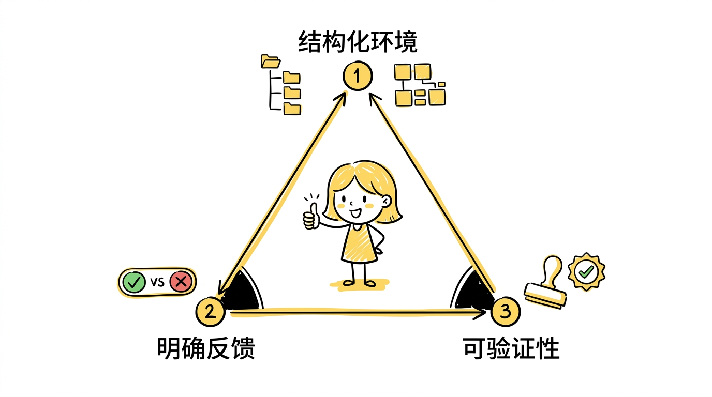
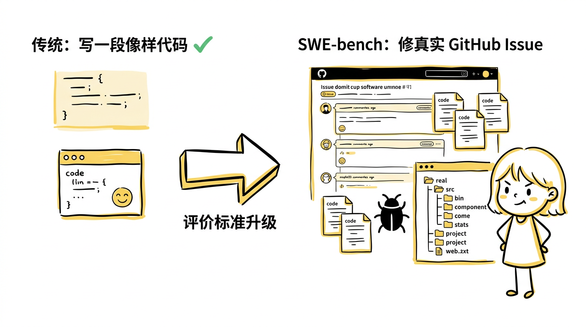
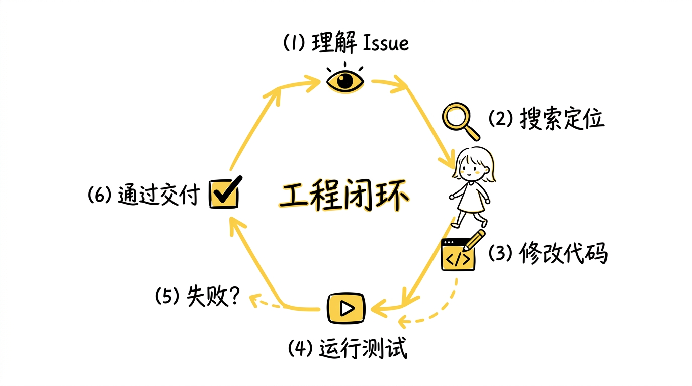
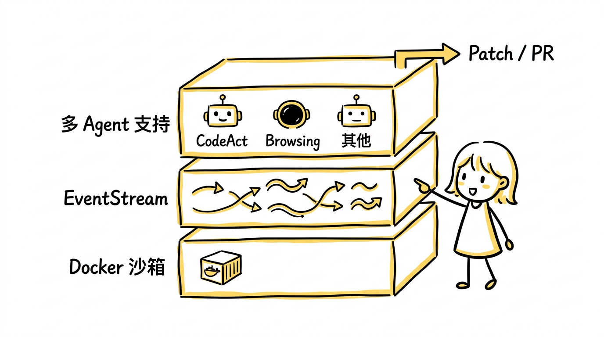
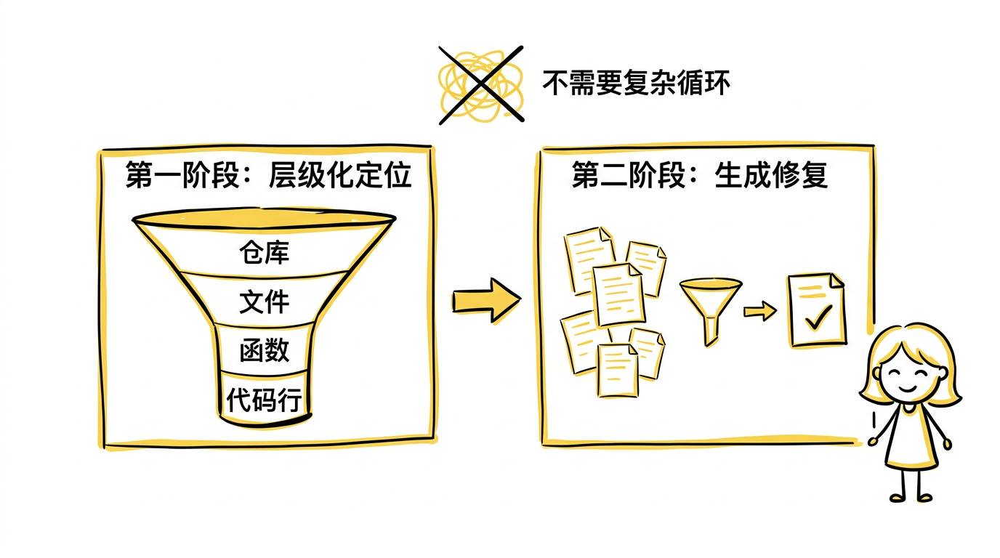
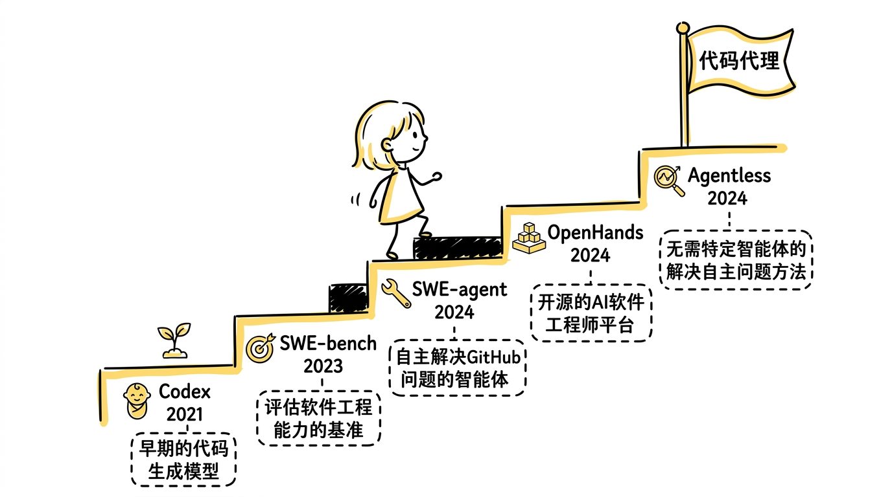
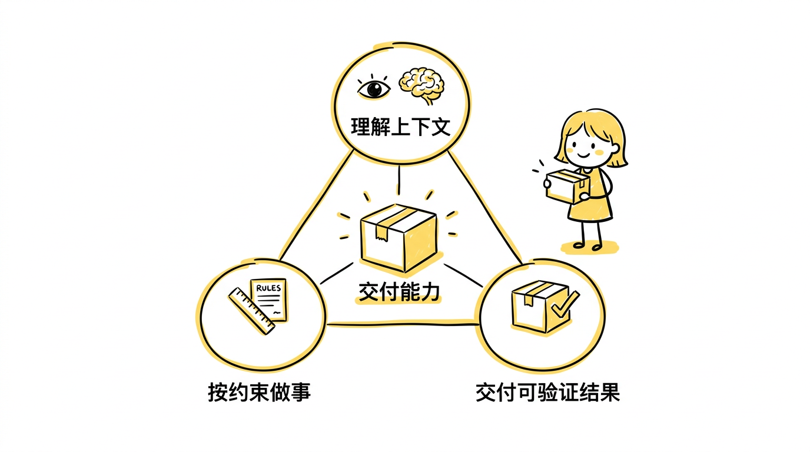

如果说 Agent 让人第一次意识到，大模型已经不只是"回答问题"，而开始能够"推进任务"，那么 Code Agent 则把这种感觉推到了一个非常具体、非常震撼的位置：

**AI 不只是会聊代码、会写代码，而是真的开始像一个能进入项目、理解上下文、动手修改、再自己验证结果的同事。**

这就是为什么很多人第一次真正被 agent 打到，不是在聊天场景，而是在代码场景。

因为到了这里，AI 的强不再只是抽象的"好像挺聪明"，而是变成了一种极其具体的工作体验：

- 它会找文件
- 它会读仓库
- 它会改代码
- 它会跑测试
- 它会根据报错继续修
- 它最后交付的不是一句建议，而是一份可验证的改动

所以，从 Agent 到 Code Agent，真正值得讲的，不是"AI 会不会写代码"，而是：

**为什么软件工程会成为 agent 最早爆发、也最像同事的一块场景。**

这条路线上有五篇关键论文，分别覆盖了从"会写代码"到"会在真实仓库里干活"再到"系统化平台"的完整演进。

---

## 一、Codex：代码生成能力的起点

> **论文：Evaluating Large Language Models Trained on Code**
> 作者：Mark Chen, Jerry Tworek, Heewoo Jun 等（OpenAI）
> 发表：2021 年

### 这篇论文做了什么

在真正的 code agent 出现之前，先发生了一件更基础的事：**语言模型先学会了写代码。**

OpenAI 在 GPT-3 的基础上，用从 GitHub 5400 万个公开仓库中收集的 159GB Python 代码做微调，训练出了 Codex 系列模型。论文同时提出了 **HumanEval** 基准——164 个手写编程题，每个题包含函数签名、文档字符串和若干单元测试，用于评估模型生成的代码是否能通过测试（即 **functional correctness**，功能正确性）。

### 核心贡献：证明代码是大模型的天然能力领域

关键实验结果：

- **GPT-3（175B）在 HumanEval 上的 pass@1 几乎为 0%**——即便参数量巨大，没有经过代码数据微调的模型几乎无法生成正确程序。
- **Codex-12B 的 pass@1 达到 28.8%**，pass@100（生成 100 个候选取最优）达到 **72.31%**。这意味着代码生成能力确实可以从大规模代码预训练中长出来。
- 论文还发现，代码能力随模型规模和训练数据量的增加呈现清晰的 scaling 趋势。

这篇论文回答了一个前置问题：**代码是不是一种足够适合被语言模型学习的"语言"？** 答案是肯定的。Codex 后来直接驱动了 GitHub Copilot 的上线，让数百万开发者第一次在 IDE 里体验到了 AI 代码补全。

### 但 code model 还不是 code agent

Codex 终究还是 code model，而不是 code agent。"会写一段代码"和"会在一个真实仓库里完成任务"之间，差得非常远：

- 对整个项目结构的理解
- 对问题描述和上下文约束的理解
- 对已有代码风格和模块关系的适应
- 对测试、构建、lint 结果的响应
- 对失败后的连续修正能力

code model 解决的是"代码生成"问题，而 code agent 要解决的是"软件工程执行"问题。

---

## 二、为什么代码场景会成为 agent 最先爆发的地方

在进入后面几篇论文之前，先回答一个整篇文章最核心的问题：如果只从直觉上看，写代码并不是最简单的工作。那为什么偏偏是这里，AI 最早开始像"同事"？

答案恰恰在于：

**软件工程虽然复杂，但它的环境特别结构化、反馈特别明确、结果特别容易验证。**

**结构化环境。** 代码库不是一团自然语言，它有文件树、模块边界、函数签名、类型约束、调用关系、配置和依赖。模型不是在一个完全模糊的任务空间里乱摸，而是在一个高度结构化的环境中工作。

**明确反馈。** 代码场景里，很多结果都不是模糊的"差不多行"，而是非常硬的信号——测试过没过、编译成没成、lint 报没报错、类型检查通没通过、程序运行结果对不对。agent 每做一步，都能清楚知道自己是不是走偏了。

**可验证性。** 很多知识工作里，"结果好不好"很难快速客观判定；而代码不同，它天然适合自动验收。

这三点合起来——**结构清晰、动作明确、反馈及时、验收客观**——让软件工程成为 agent 的理想爆发场。也是为什么 code agent 给人的感觉特别像同事：它不是只会说一些"像样的话"，而是在一个有真实约束和真实反馈的环境里持续做事。

---

## 三、SWE-bench：用真实 GitHub issue 重新定义评价标准

> **论文：SWE-bench: Can Language Models Resolve Real-World GitHub Issues?**
> 作者：Carlos E. Jimenez, John Yang, Alexander Wettig, Shunyu Yao, Karthik Narasimhan 等（Princeton University）
> 发表：2023 年

### 这篇论文做了什么

SWE-bench 把代码领域的评价标准彻底升级了。

在传统代码生成时代，评估问的是：这个函数能不能补完、这道编程题能不能写对、这段代码像不像参考答案。但 SWE-bench 问的是另一件更接近真实工程的问题：

**模型能不能解决真实 GitHub 仓库里的 issue？**

论文从 **12 个主流 Python 开源项目**（包括 Django、Flask、scikit-learn、matplotlib、sympy、requests 等）中收集了 **2,294 个真实任务实例**。每个实例包含：

- 一个真实的 GitHub issue 描述（bug 报告或 feature request）
- 对应时间点的完整仓库快照
- 开发者实际提交的修复 patch
- 用于验证修复是否正确的测试用例

### 核心贡献：把评价标准从"写得像"推进到"能不能修掉真实问题"

SWE-bench 的意义不只是一个更难的 benchmark，而是它改变了整个评价视角：

**模型面对的不再是"写一段像样代码"，而是"理解一个真实的软件工程问题并完成修复"。**

真实 issue 意味着：问题来自真实开发环境、代码库不是人为简化的小样本、任务往往需要跨文件理解、修改是否正确要靠真实测试来判断。

论文公布的初始结果非常有冲击力：

- **Claude 2 在完整 SWE-bench 上的解决率约为 4.8%**
- **GPT-4 的解决率约为 1.7%**（使用简单 prompting）

这些数字说明，即便是当时最强的模型，面对真实仓库级工程任务时，仅靠模型本身（没有 agent 框架）的成功率极低。这也直接催生了后续 SWE-agent 等 agent 系统的出现。

论文还推出了 **SWE-bench Lite**——一个 300 个任务的精选子集，用于更快速地评估和迭代 agent 系统。这个子集后来成为了 code agent 领域最常用的对比基准。

没有 SWE-bench 这一步，code agent 很容易只停留在"看起来很会写代码"的幻觉里。它把软件工程能力变成了可以明确比较、明确验证、明确追踪的目标。

---

## 四、SWE-agent：给模型一个合适的计算机接口

> **论文：SWE-agent: Agent-Computer Interfaces Enable Automated Software Engineering**
> 作者：John Yang, Carlos E. Jimenez, Alexander Wettig, Karthik Narasimhan, Shunyu Yao 等（Princeton University）
> 发表：2024 年

### 这篇论文做了什么

如果说 SWE-bench 给出了目标，那么 SWE-agent 真正给出了"怎么打"的雏形。

它最重要的洞察不是"换一个更大的模型"或"写一个更漂亮的 prompt"，而是：

**给模型一个合适的计算机接口（Agent-Computer Interface, ACI），让它真的能在仓库环境里工作。**

### 核心贡献：ACI——为 agent 设计的交互界面

论文提出了一个类似 UI/UX 设计的概念，但面向的不是人类用户，而是 LLM agent：**Agent-Computer Interface（ACI）**。

核心思想是：人类使用计算机时有 GUI 和 CLI，这些界面是为人类认知习惯设计的。但 LLM agent 有不同的特点——它擅长处理文本、受限于上下文窗口、需要明确的操作反馈。所以应该专门为 agent 设计一套接口。

SWE-agent 为此设计了一组定制命令：

- `open`：打开指定文件并显示内容
- `scroll_up` / `scroll_down`：在文件中翻页浏览
- `search_dir` / `search_file`：在目录或文件中搜索关键词
- `edit`：修改文件的指定行
- `create`：创建新文件

同时集成了**语法检查（linter）**——每次编辑后自动检查语法错误，如果有问题会立即反馈给 agent，防止提交有语法错误的代码。

### 关键结果

SWE-agent 搭配 GPT-4 在 SWE-bench 完整集上达到了 **12.47% 的解决率**——在当时是最高成绩。对比之下，没有 agent 框架的 GPT-4 直接 prompting 只有约 1.7%。

**同一个底模，从 1.7% 到 12.47%，差距来自 ACI 和 agent 循环的设计。** 这直接说明了一件事：agent 的强不只是模型参数更大，还取决于它和计算机环境之间的接口设计。

这个过程形成了一个清晰的工程闭环：

1. 先理解 issue
2. 在仓库中搜索定位相关代码
3. 做局部修改
4. 运行测试验证
5. 如果失败，根据报错调整
6. 重复这个过程，直到结果通过

这就是 code agent 和普通聊天模型的真正分界线。普通聊天模型更像一个"懂很多代码知识的人"；而 code agent 开始像一个"能真正进项目里干活的人"。

---

## 五、OpenHands：code agent 走向平台化

> **论文：OpenHands: An Open Platform for AI Software Developers as Generalist Agents**
> 作者：Xingyao Wang, Boxuan Li, Yufan Song 等（UIUC 等）
> 发表：2024 年（前身为 OpenDevin）

### 这篇论文做了什么

到 code agent 这一步，光看单个模型或单个 agent 实现已经不够了。因为 code agent 真正给人的震撼，很多时候不是来自某个底模突然变强了，而是来自一整套系统终于凑齐了。

OpenHands（前身叫 OpenDevin）把 code agent 明确当成一个**开源平台**来构建，而不只是一个模型能力展示。

### 核心贡献：标准化的 agent 系统架构

OpenHands 设计了一套完整的系统架构：

**EventStream 机制。** agent 和环境之间的所有交互（代码执行、文件操作、浏览器操作、用户消息）都被统一抽象成事件流。这使得不同类型的 agent 实现可以共享同一套环境接口。

**Docker 沙箱环境。** 每个任务在独立的 Docker 容器中运行，提供隔离的执行环境。agent 可以安装依赖、运行命令、修改文件，而不会影响宿主系统。

**多 agent 架构支持。** 平台不绑定某一种 agent 实现，而是支持多种架构——包括 CodeAct（用代码作为动作空间）、BrowsingAgent（浏览器操作）等——让研究者可以在同一个平台上对比不同的 agent 设计。

**完整的交付链。** 从接收任务、理解上下文、搜索代码、修改文件、运行测试，到最终生成 patch 或 PR，整个流程在平台内闭环完成。

### 为什么平台化很重要

一个让用户觉得"真像同事"的 code agent，背后往往同时依赖：

- 底层语言模型的理解与生成能力
- 文件和仓库访问接口
- 命令执行环境
- 测试与验证机制
- 中间状态管理
- 多轮任务工作流
- 最终交付形式（patch、commit、PR）

到了这个阶段，竞争重点已经不只是"谁模型更聪明"，而越来越变成：谁系统更完整、谁闭环更扎实、谁工具接得更顺、谁交付结果更可靠。

OpenHands 代表的是一种关键的认知升级：

**code agent 的竞争，本质上是系统工程竞争。**

---

## 六、Agentless：把 code agent 从神话拉回工程现实

> **论文：Agentless: Demystifying LLM-based Software Engineering Agents**
> 作者：Chunqiu Steven Xia, Yinlin Deng, Soren Dunn, Lingming Zhang（UIUC）
> 发表：2024 年

### 这篇论文做了什么

讲到 code agent，特别容易一路往热血方向写。Agentless 这篇论文的重要性在于，它提供了一个很宝贵的"降温视角"。

论文的核心质疑是：**复杂的 agent 架构（多轮循环、自主决策、工具调用）是否总是比更简单的方法更有效？**

### 核心贡献：用两步流水线替代复杂 agent 循环

Agentless 把软件工程任务拆成两个阶段，完全不使用 agent 循环：

**第一阶段：层级化定位（Localization）。** 给定一个 issue 描述，按层级逐步缩小范围：

1. 先让模型从整个仓库的文件结构中定位可能相关的**文件**
2. 再在这些文件中定位可能相关的**类或函数**
3. 最后精确到可能需要修改的**具体代码行**

每一步都是独立的 LLM 调用，不需要 agent 自主决定搜索策略。

**第二阶段：生成修复（Repair）。** 基于定位结果，让模型生成多个候选 patch，然后用测试用例对这些 patch 进行排序和过滤，选出最可能正确的修复。

### 最有冲击力的结论

Agentless 在 SWE-bench Lite 上达到了 **27.3% 的解决率**——**在当时与复杂的 agent 系统（如 SWE-agent 约 18%）相比不仅不逊色，甚至更高。**

这个结果的冲击力很大，因为它意味着：

- 没有 agent 循环
- 没有自主工具调用
- 没有多轮试错
- 只是结构化地拆解任务 + 多次 LLM 调用 + 测试排序

就已经达到了非常有竞争力的结果。而且这种方法**更简单、更便宜、更快、更可控**。

### 它真正提醒了什么

Agentless 不是在否定 agent，而是在拆解 agent 的能力来源：

**很多看起来像 agent 魔法的提升，到底有多少来自复杂的 scaffold 设计，有多少来自底模本身的进步，有多少来自任务的结构化分解？**

它逼着我们认真区分：

- 有些任务确实需要复杂 agent 的多轮循环
- 有些任务简单的流水线方法就够了
- 有些提升来自更好的检索和定位，而不是更复杂的多步规划
- 成本和复杂度并不总是值得的

所以更成熟的判断应该是：

**code agent 确实已经非常强，但它的强是"工程上可解释的强"——来自可验证环境、结构化任务、闭环反馈和合理系统设计，而不是"魔法式的无边界强"。**

---

## 七、五篇论文的技术轨迹

| 论文 | 年份 | 解决的核心问题 | 关键成果 |
|------|------|---------------|---------|
| Codex | 2021 | 代码能不能从预训练中学会 | HumanEval pass@1: 28.8%，驱动 GitHub Copilot |
| SWE-bench | 2023 | 如何评估真实工程能力 | 2,294 个真实 GitHub issue，GPT-4 仅解决 1.7% |
| SWE-agent | 2024 | 给模型什么样的接口才能干活 | ACI 设计，SWE-bench 解决率 12.47% |
| OpenHands | 2024 | code agent 如何平台化 | 标准化架构，多 agent 支持 |
| Agentless | 2024 | 是否一定需要复杂 agent | 两步流水线达到 27.3%（SWE-bench Lite） |

这五篇论文画出了一条清晰的递进线：

1. **先证明代码能力可以从预训练中长出来**（Codex）
2. **再用真实工程任务定义目标**（SWE-bench）
3. **再通过接口设计让模型真正进入仓库工作**（SWE-agent）
4. **再把 agent 做成可复用的系统平台**（OpenHands）
5. **最后认真拆解哪些提升来自 agent，哪些来自其他因素**（Agentless）

---

## 八、结论：Code Agent 让 AI 第一次具备了"交付能力"

如果把整个系列前面三篇连起来看，会发现有一条非常清楚的递进线：

- [从 GPT-1 到 GPT-3]()，讲的是生成能力怎么长出来
- [从 GPT-3 到 ChatGPT]()，讲的是生成能力怎么被塑造成助手
- [从 ChatGPT 到 Agent]()，讲的是助手怎么开始会做事
- 到了 Agent → Code Agent，这条线终于推进到了一个最具体、最有生产力感的位置：

**AI 开始具备交付能力。**

code agent 不只是给你建议、帮你想方案、告诉你可能怎么改，而是越来越能直接进入仓库工作、产出可检查的变更、跑验证、最终交付一个"可以被验收的结果"。

当一个系统开始具备这种能力时，"像同事"这件事就不再只是比喻，而会越来越像一个现实判断。因为在很多工作里，所谓同事感，本质上就是三件事：

- 理解上下文
- 按约束做事
- 交付可验证结果

Code Agent 之所以让人震撼，就是因为它第一次在一个高价值场景里，把这三件事同时做得有样子了。

## 一句话总结

从 Agent 到 Code Agent，真正发生的事不是"AI 突然学会了写代码"，而是：

**代码场景天然具备结构化环境、明确反馈和可自动验收标准，于是 agent 在这里第一次真正进入了"执行—验证—修复—交付"的工程闭环，也因此开始像同事一样干活。**
