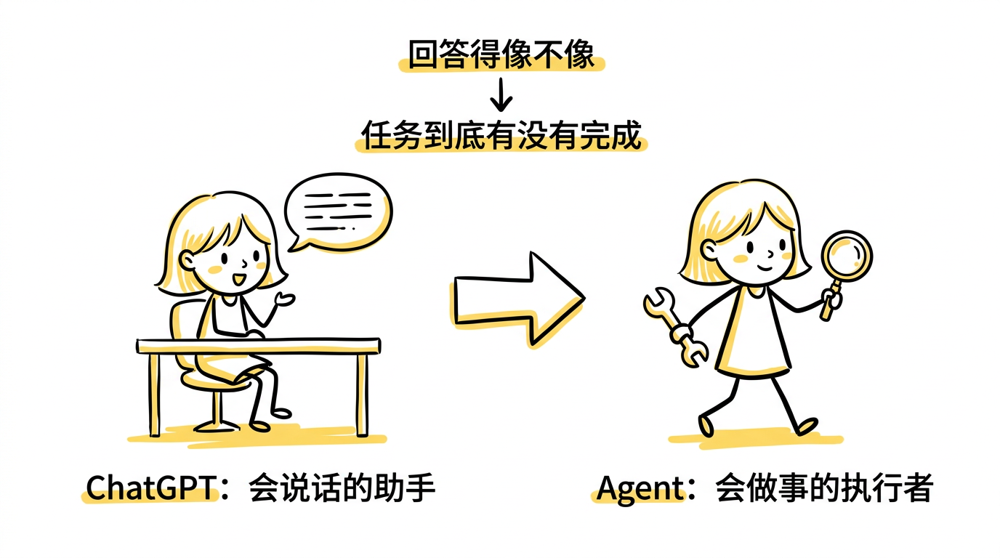
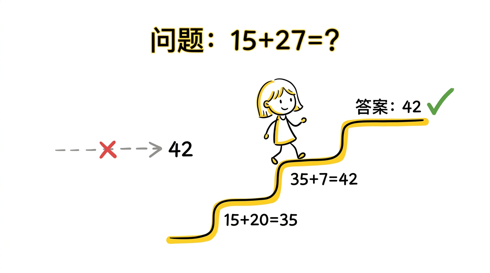
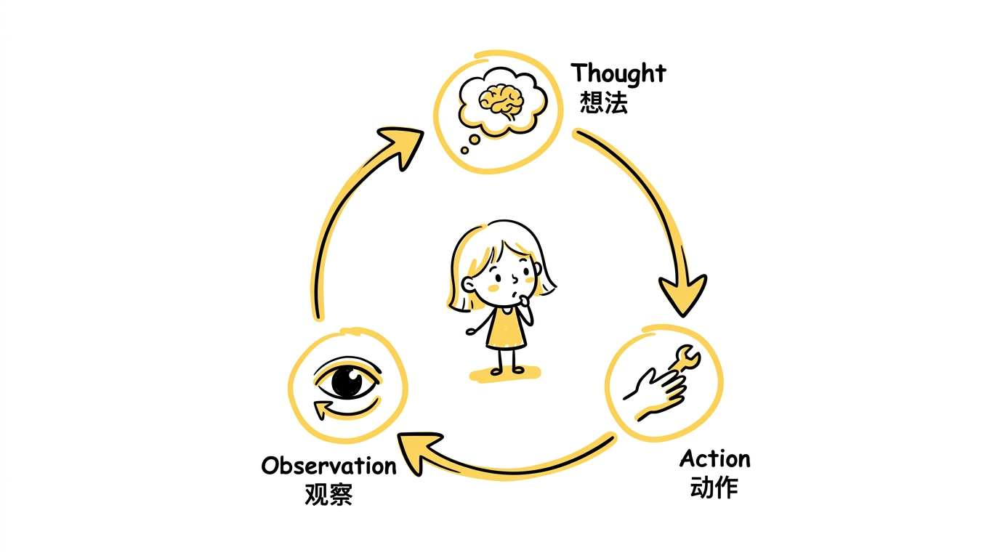
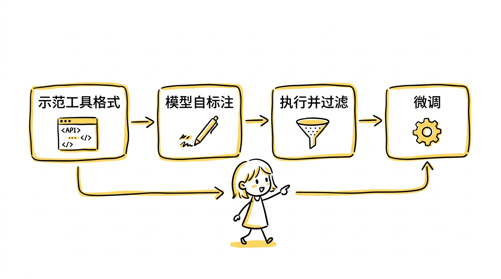
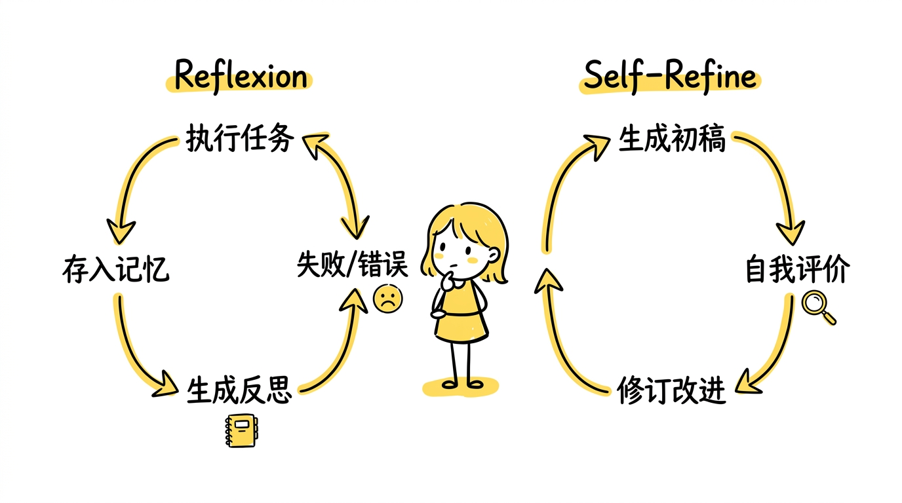
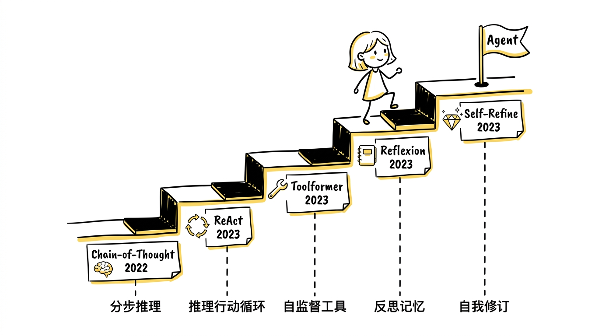
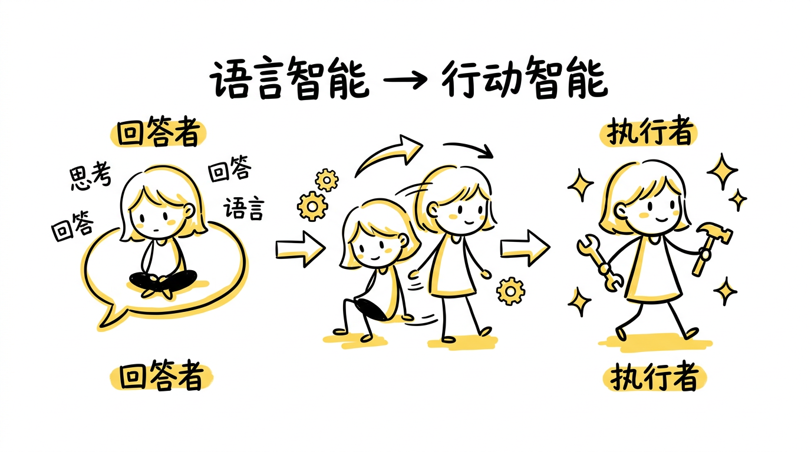

如果说 ChatGPT 让普通人第一次认真和 AI 对话，那么 Agent 则让越来越多人第一次认真考虑：AI 是不是已经不只是一个"回答问题的东西"，而开始变成一个"可以执行任务的东西"。

这两个阶段看起来很像，底层却差很多。

ChatGPT 最强的地方，是它能理解问题、组织语言、进行多轮交流，让人感觉自己面对的是一个"会说话的助手"。

但 agent 的目标已经不只是"把答案说好"，而是：

- 理解目标
- 决定下一步
- 调用工具
- 接收环境反馈
- 根据结果继续修正
- 最后把任务做完

也就是说，从 ChatGPT 到 Agent，真正发生的变化是：

**模型的评价标准，从"回答得像不像"变成了"任务到底有没有完成"。**

这条路线上有五篇关键论文，它们依次解决了一个越来越深的问题，合在一起构成了从"会回答"到"会做事"的完整技术轨迹。

> 在正式进入 agent 之前，还值得提一下以 o1 为代表的推理模型。它们更适合放在 Part 3 前面，而不是塞进 Part 2 主线，因为它们解决的核心问题不是"模型怎么更像助手"，而是"模型怎么更会拆步骤、更会想、更能在长链条任务里保持推理稳定"。也正是这类能力的增强，让后来的 agent 不再只是会调用工具的聊天机器人，而更像一个会持续推进任务的执行系统。

---

## 一、ChatGPT 为什么还不等于 Agent

> 关于 GPT-3 到 ChatGPT 的完整技术演进，可以参考[《从 GPT-3 到 ChatGPT：AI 为什么突然像助手了》]()。

理解 agent 的第一步，是先看清 ChatGPT 的边界。

ChatGPT 已经很强，它能解释概念、总结文本、生成代码、帮你写提纲、进行多轮追问。这让人非常容易产生一种错觉：它既然这么会说，是不是已经等于"会做事"了？

其实不是。因为很多真实任务，根本不是靠"说"就能完成的：

- 你问一个实时问题，模型需要去查
- 你让它完成复杂计算，模型需要工具验证
- 你让它操作文件、调用 API、整理数据，它需要真的执行动作
- 你让它在一个多步骤任务中不断修正，它需要读环境反馈而不是只靠记忆

纯聊天模型在这里会暴露一个明显的限制：

**它擅长语言交互，但不天然擅长与外部世界持续互动。**

ChatGPT 的能力很大程度上仍然是"语言空间里的能力"；而 agent 想做的，是把这些能力推进到"任务空间"和"环境空间"。

---

## 二、Chain-of-Thought Prompting：模型开始学会分步推理

> **论文：Chain-of-Thought Prompting Elicits Reasoning in Large Language Models**
> 作者：Jason Wei, Xuezhi Wang, Dale Schuurmans 等（Google Brain）
> 发表：2022 年

### 这篇论文做了什么

很多人一讲 agent，就直接跳到工具调用。其实在那之前，还有一个更基础的问题：**模型到底会不会把复杂任务拆成步骤。**

在数学题、逻辑题、符号推理题上，直接让模型输出最终答案，表现往往不稳定。原因并不神秘——有些问题不是一步到位能答出来的，正确答案依赖中间推导，如果模型没有显式展开过程，就更容易在中间跳步或出错。

CoT 的方法非常朴素：不是换模型结构，而是换提示方式。在 few-shot 示例中，不再只给"问题 → 答案"，而是给"问题 → 分步推理过程 → 最终答案"。让模型模仿这种"先推理，后回答"的输出模式。

### 核心贡献：把推理从隐性能力变成显式接口

论文在 GSM8K（小学数学）、SVAMP、AQuA 等多个推理基准上做了实验。关键发现：

- **在 PaLM 540B 上，CoT 将 GSM8K 的准确率从标准 prompting 的约 18% 提升到约 57%**——同一个模型，仅靠改变 prompt 格式就获得了三倍以上的提升。
- CoT 是一种**涌现能力（emergent ability）**：在小模型（如 10B 以下）上几乎没有效果甚至有害，但一旦模型规模足够大（约 100B+），效果就会显著涌现。
- 论文还探索了 **zero-shot CoT**：仅在 prompt 末尾加上"Let's think step by step"这句话，不需要任何示例，大模型就能自发展开推理过程。

### 为什么这对 agent 至关重要

这一步为 agent 打下了一个非常重要的前提。因为 agent 的核心不是"知道答案"，而是"知道当前该做哪一步"。

**不会分步想，就很难分步做。**

CoT 让行业更明确地看到了三件事：

1. 模型不是只能直接输出一个答案，它可以在 prompt 引导下把过程显式展开。
2. "把过程写出来"这件事本身，会显著提升复杂任务表现。
3. 推理能力不是纯粹黑箱的——它可以被提示方式强烈影响，是一种可调用、可观察的接口。

CoT 的局限也很清楚：模型写出了推理步骤，但还没有真正去调用工具、访问环境或执行动作。它更像"闭门思考"——可能想得很漂亮，但如果中间某个事实记错了，后面会一路错下去。这个问题，要等下一篇论文来解决。

---

## 三、ReAct：推理和行动合成一个循环

> **论文：ReAct: Synergizing Reasoning and Acting in Language Models**
> 作者：Shunyu Yao, Jeffrey Zhao, Dian Yu 等（Princeton University & Google Brain）
> 发表：2023 年

### 这篇论文做了什么

如果 CoT 解决的是"能不能分步推理"，那 ReAct 真正解决的就是：

**能不能把推理和行动合成一个循环。**

这几乎是 agent 范式最重要的变化之一。

ReAct 的核心直觉来自一个对称的观察：

- **光想不够**：CoT 的推理完全在模型内部进行，可能建立在错误记忆上一路想下去，无法自我纠正。
- **光做也不够**：没有推理引导的工具调用会很盲目——模型可能乱搜索、乱点击，却不知道自己为什么要做这些事。

所以更好的方式是：**边想边做，边做边根据结果继续想。**

### 核心贡献：Thought-Action-Observation 循环

论文定义了一种交替生成结构，每一步包含三个部分：

1. **Thought**（想法）：模型写出当前的推理，比如"我需要先查 X 的出生年份"
2. **Action**（动作）：模型发起一个具体操作，比如 `Search[X birthdate]`
3. **Observation**（观察）：环境返回动作结果，比如搜索引擎返回的页面内容

模型根据 Observation 更新思路，生成下一个 Thought，决定下一个 Action——如此循环，直到任务完成。

论文在四类任务上做了实验：

- **HotpotQA**（多跳问答）：需要跨多个文档推理才能回答的问题。ReAct 通过交替搜索和推理，显著降低了幻觉率。
- **FEVER**（事实验证）：判断一个声明是否能被 Wikipedia 支持或反驳。
- **ALFWorld**（文本交互游戏）：在虚拟家庭环境中执行复杂指令，如"把一个热的苹果放在桌上"。ReAct 的成功率比纯行动方法高出显著幅度。
- **WebShop**（网页购物模拟）：根据用户需求在模拟电商网站上搜索并购买合适商品。

实验发现，**ReAct 在需要与外部信息交互的任务上显著优于纯 CoT**，因为推理可以指引行动方向，而行动结果又反过来纠正推理中的错误假设。

### 为什么这是 agent 的分水岭

这就是后来几乎所有 agent 都在模仿的基本结构——**agent loop** 的雏形：

1. 理解当前任务
2. 形成一个局部判断
3. 执行一个动作
4. 观察动作结果
5. 根据新结果更新下一步思路

它的重要性在于，它第一次把大模型从"回答系统"明显推向"执行系统"。在这之后，模型就不再只是一个把输入变成输出的黑箱，而更像一个会在环境中不断调整行为的决策者。同时，因为每一步的 Thought 和 Action 都被显式展开，agent 的行为变得**可观察、可解释、可调试**。

---

## 四、Toolformer：模型学会自己决定何时调用工具

> **论文：Toolformer: Language Models Can Teach Themselves to Use Tools**
> 作者：Timo Schick, Jane Dwivedi-Yu, Roberto Dessì 等（Meta AI）
> 发表：2023 年

### 这篇论文做了什么

即便有了 ReAct 的推理-行动循环，如果模型还是不知道什么时候该调用工具、该调用哪个工具，它仍然不够强。

**Toolformer 要解决的问题非常直接：语言模型能不能自己学会在合适的时候调用外部工具？**

这篇论文的方法非常有代表性。它不是简单给模型硬编码一堆工具调用模板，也不是靠人工标注大量"这里该调工具"的数据，而是设计了一套**自监督标注流程**，让模型自己学会在什么地方插入工具调用。

### 核心贡献：自监督的工具使用学习

论文基于 GPT-J（6.7B 参数）做实验，具体流程分四步：

**第一步：示范工具调用格式。** 先给模型少量示例，展示工具调用的 API 格式，比如 `[Calculator(3*7+5)]` 或 `[Search("population of France")]`。

**第二步：让模型自己标注。** 在大量普通文本上，让模型自己决定在哪些位置插入工具调用——也就是说，模型自己判断"这个地方如果能调用计算器/搜索引擎/翻译器，可能会有帮助"。

**第三步：执行并过滤。** 真的去执行这些工具调用，拿到结果。然后用一个关键的过滤标准：**如果插入工具调用的结果降低了后续文本的困惑度（perplexity），就保留这条标注；否则就丢弃。** 这意味着模型只保留那些"真的有帮助"的工具调用。

**第四步：微调。** 用过滤后的数据对模型做微调，让它在推理时自然地在合适位置生成工具调用。

论文测试了五种工具：计算器、问答系统、搜索引擎、翻译系统和日历。结果发现，经过训练的 Toolformer 在不降低语言建模能力的前提下，在需要工具的下游任务上显著优于原始模型——**一个 6.7B 的 Toolformer 在某些工具相关任务上甚至超过了更大的 GPT-3（175B）**。

### 为什么它是真正的分水岭

Toolformer 的意义不只是"模型能调用工具"，而是它改变了工具调用的性质：

**工具使用从外部工程拼接，变成了模型行为的一部分。**

在此之前，工具调用更多是系统层面的事——由外部代码判断什么时候该查什么。Toolformer 则让模型自己内化了这种判断。这为后来 OpenAI 的 Function Calling、各类 agent 框架的工具调用机制提供了重要的直觉基础。

因为纯聊天模型的边界是：只能依赖训练时学到的知识，遇到实时问题容易过时，遇到精确计算容易出错，遇到外部状态变化无法感知。而工具调用一旦接上，模型突然就有了全新的能力维度——能查实时信息、能做精确计算、能检索文档、能访问外部系统状态。

**工具不是一个附加功能，而是把模型从"封闭文本系统"推进成"开放任务系统"的关键。**

---

## 五、Reflexion 与 Self-Refine：agent 学会从失败中修正自己

光有推理和工具也还不够。因为很多任务不是"调用一次工具就结束"——模型可能第一次推理就错了，可能第一次动作就失败了，可能拿到结果后发现前面的假设不成立。

这就是 Reflexion 和 Self-Refine 这两篇论文的核心议题：**agent 的强，不只来自"第一下有多聪明"，更来自"失败后能不能修正自己"。**

### Reflexion：从失败中提取语言化经验

> **论文：Reflexion: Language Agents with Verbal Reinforcement Learning**
> 作者：Noah Shinn, Federico Cassano, Ashwin Gopinath 等（Northeastern University & MIT）
> 发表：2023 年

Reflexion 的核心创新是一种**不更新模型参数的"强化学习"**——它把反思本身变成上下文的一部分：

1. Agent 执行一次完整的任务尝试
2. 如果失败，获取环境反馈（比如测试不通过、答案错误）
3. 模型根据反馈生成一段**自然语言反思**，总结"这次错在哪里、下次应该注意什么"
4. 把这段反思存入一个**记忆缓冲区（memory buffer）**
5. 下一轮尝试时，把之前的反思作为额外上下文注入 prompt，让模型避免重复犯错

这很像人在做复杂任务时的反思模式：上次错在这一步 → 这个工具不能这样用 → 下次先检查这个约束。

论文在三类任务上验证了效果：

- **HumanEval（代码生成）**：Reflexion 将 pass@1 从基线的约 80% 提升到 **91%**，多轮反思让模型能根据测试失败信息修正代码。
- **AlfWorld（序列决策）**：在虚拟环境中执行多步骤任务，Reflexion 通过积累任务经验显著提升了成功率。
- **HotpotQA（多跳问答）**：通过反思之前的错误搜索策略，改善了信息检索质量。

### Self-Refine：围绕当前输出持续打磨

> **论文：Self-Refine: Iterative Refinement with Self-Feedback**
> 作者：Aman Madaan, Niket Tandon, Prakhar Gupta 等（CMU）
> 发表：2023 年

如果说 Reflexion 更偏"从失败中总结经验，避免跨轮次犯同样的错"，那 Self-Refine 更偏另一种模式：**围绕当前输出反复打磨。**

Self-Refine 的流程非常清楚，用**同一个大模型**完成三个角色：

1. **Generator（生成者）**：先生成一个初稿
2. **Critic（评价者）**：对初稿给出具体反馈，指出哪里不够好
3. **Refiner（修订者）**：根据反馈修改初稿，产出新版本

这个"生成 → 反馈 → 修订"的循环可以重复多轮，直到输出质量趋于稳定。全程不需要额外的监督数据或外部反馈，模型自己评价自己并改进。

论文在 7 类不同任务上做了测试，包括情感转换、对话回复、代码优化、数学推理、首字母缩写生成等。结果显示，**经过迭代修订，输出质量在多数任务上提升了 5%–20%**，且在部分任务上经过 2-3 轮迭代即可收敛到较好结果。

### 两篇论文的关系和共同意义

两者的角度不同，但它们共同推动了 agent 的一个关键能力——**迭代**：

| | Reflexion | Self-Refine |
|---|---|---|
| 核心机制 | 跨轮次反思，记忆化经验 | 单轮次内反复打磨 |
| 反馈来源 | 外部环境（测试结果、任务成败） | 模型自身（自评自改） |
| 类比 | "从失败中吸取教训" | "对草稿反复修改" |
| 是否更新参数 | 否（存入记忆缓冲区） | 否（纯推理时迭代） |

"能否迭代"恰恰决定了模型到底像不像一个真正做事的人。因为真实工作里，很多高质量结果从来都不是一次生成的，而是：先试一次 → 看结果 → 调整 → 再继续试。agent 越来越强，不只是因为它更会回答，而是因为它越来越像一个会持续修正、持续推进、持续靠近目标的系统。

---

## 六、五篇论文的技术轨迹

到这里，可以看清楚从 ChatGPT 到 Agent 的完整演进逻辑：

| 论文 | 年份 | 解决的核心问题 | 关键能力 |
|------|------|---------------|---------|
| Chain-of-Thought | 2022 | 模型能不能分步推理 | 显式多步推理 |
| ReAct | 2023 | 推理和行动能不能合成循环 | Thought-Action-Observation 循环 |
| Toolformer | 2023 | 模型能不能自主决定调用工具 | 自监督工具使用 |
| Reflexion | 2023 | 失败后能不能从经验中修正 | 语言化反思记忆 |
| Self-Refine | 2023 | 输出能不能通过自我反馈持续改进 | 生成-评价-修订循环 |

**从 ChatGPT 到 Agent，真正变化的往往不是"一个模型 able to do more"，而是模型被放进了一个完全不同的工作流里。**

在 ChatGPT 工作流里，典型模式是：用户提问 → 模型回答 → 用户追问 → 模型再回答。

而在 agent 工作流里，模式变成了：用户给目标 → 模型拆任务 → 模型决定是否需要工具 → 模型调用动作 → 环境返回结果 → 模型根据结果继续推理 → 多轮执行后交付结果。

评价体系也跟着变了。聊天模型更像在比语言是否自然、回答有没有帮助、像不像一个好助手。而 agent 更像在比任务拆解对不对、工具选择对不对、中间回退能力强不强、最后任务有没有完成。

实际上，并不是模型一下子跨物种了，而是：

- 推理被显式化了（CoT）
- 推理和行动被统一了（ReAct）
- 工具被接进来了（Toolformer）
- 失败修正机制开始形成了（Reflexion + Self-Refine）

这四件事叠加起来，模型就开始从"回答者"变成"执行者"。

---

## 七、结论：从"语言智能"到"行动智能"的过渡

如果 GPT-3 到 ChatGPT 讲的是"模型怎么从会生成变成像助手"，那 ChatGPT 到 Agent 讲的就是：

**模型怎么从"像助手"变成"会做事"。**

这个阶段最核心的变化，不是模型更会说，而是它终于开始具备这些能力的组合：

- 会拆复杂任务（CoT）
- 会在中间步骤里将推理和行动交替进行（ReAct）
- 会借助外部工具扩展自身边界（Toolformer）
- 会根据失败经验修正下一轮尝试（Reflexion）
- 会对当前输出反复打磨逼近更好结果（Self-Refine）

这几件事合在一起，才构成了今天大家说的 agent 感。

所以 agent 不是一个简单的"加了插件的聊天机器人"，也不是一个"更长答案的 ChatGPT"。它真正代表的是一种新的系统形态：

**语言模型不再只负责表达，而开始负责决策、协调和执行。**

## 一句话总结

从 ChatGPT 到 Agent，真正发生的事不是"模型突然有了手脚"，而是：

**研究者先把大模型的多步推理能力显式调出来，再把推理和行动组织成循环，再让模型学会调用工具、利用反馈、持续修正，最终让它从会回答的问题机器，变成了会推进任务的执行系统。**
