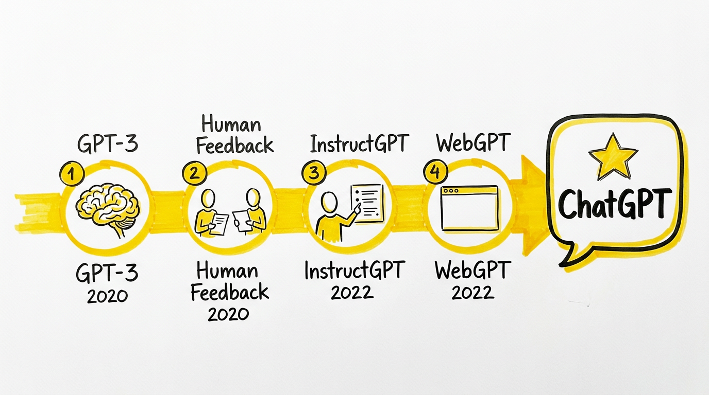
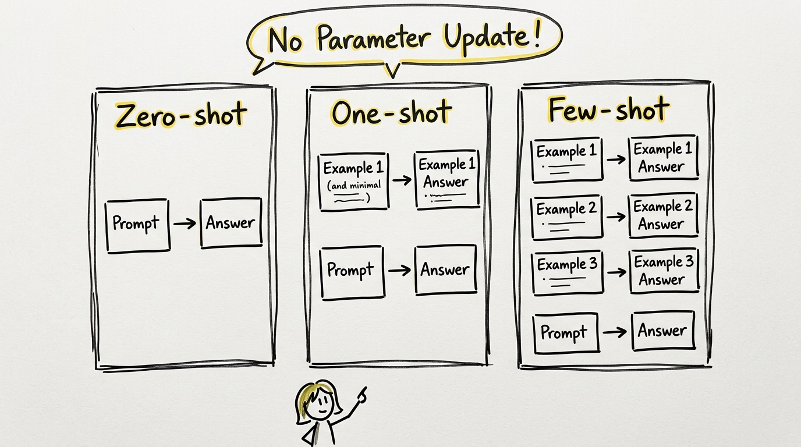
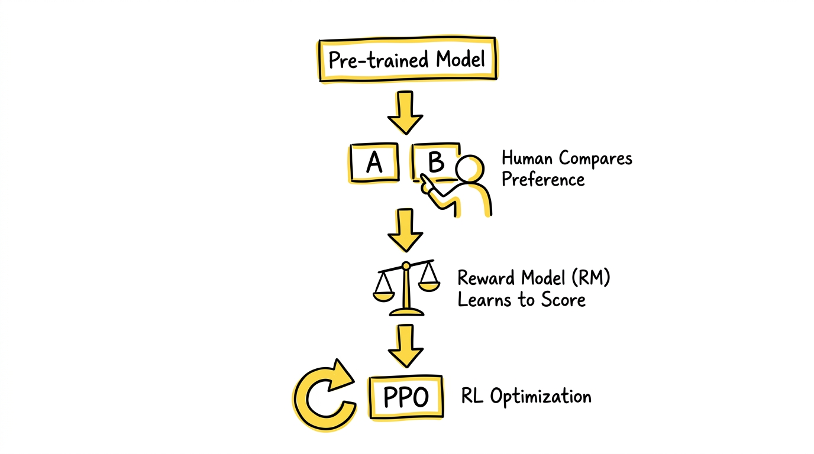
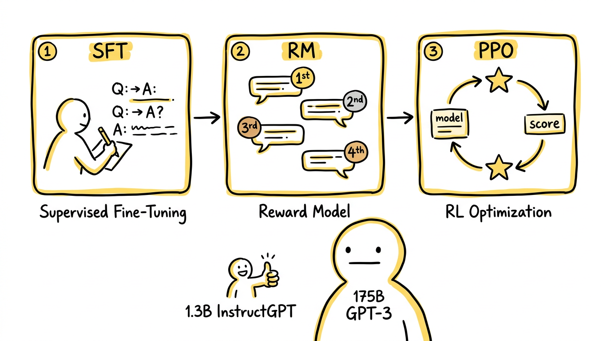
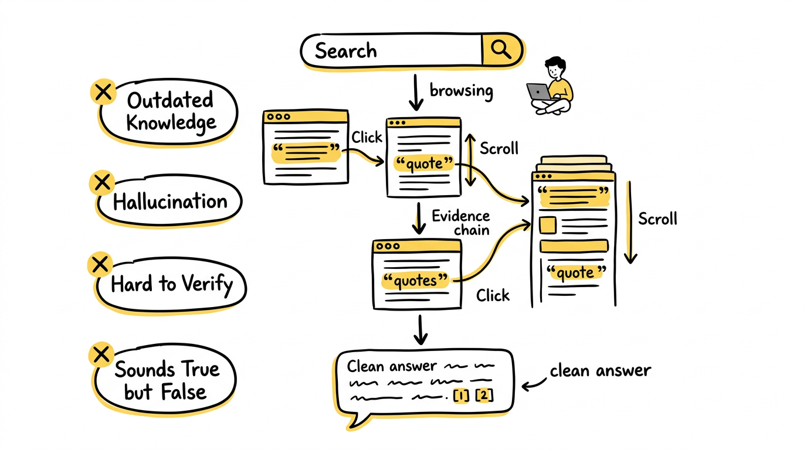
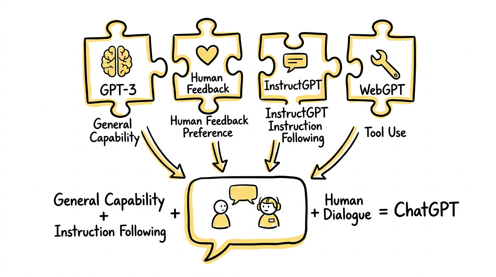

如果说 GPT-3 让整个行业第一次意识到，大模型已经不只是一个研究玩具，而是一个具备通用能力的系统，那么 ChatGPT 则让更多普通人第一次真切感受到：AI 不只是会写一段像样的文字，它开始像一个能配合你完成任务的助手。

很多人会把这段变化理解成"GPT-3 再升级了一点"。但如果真想把这段历史讲清楚，就会发现这不是一句"模型更大了"能解释的。

从 GPT-3 到 ChatGPT，真正发生的变化是：

**模型的核心问题，从"能力够不够强"变成了"能力能不能以人类喜欢的方式被调用、被约束、被组织出来"。**

也就是说，GPT-3 和 ChatGPT 之间的差距，不主要是"有没有能力"，而是"这些能力有没有被塑造成一个可用助手"。

这条路线上有四篇关键论文，它们各自解决了一个不同层面的问题，合在一起几乎就能拼出 GPT-3 到 ChatGPT 的完整技术轨迹。

---

## 一、GPT-3：通用能力的起点

> **论文：Language Models are Few-Shot Learners**
> 作者：Tom Brown, Benjamin Mann, Nick Ryder 等（OpenAI）
> 发表：2020 年

### 这篇论文做了什么

GPT-3 训练了一个 1750 亿参数的自回归语言模型，使用了约 300B token 的混合语料（包括 Common Crawl 过滤后数据、WebText2、Books 语料和 Wikipedia）。论文同时训练了从 1.25 亿到 1750 亿共 8 个不同规模的模型，用于观察能力如何随规模变化。

### 核心贡献：in-context learning

GPT-3 真正震撼行业的地方，不只是参数量，而是它把一种全新的任务适配方式做成了明确的现象——**in-context learning**。

在 GPT-3 之前，让模型"学会一个任务"的标准做法仍然是：收集任务数据 → 微调模型 → 评估表现。而 GPT-3 改变了这件事：

- 任务说明可以写在 prompt 里（zero-shot）
- 示例可以直接放在上下文里（one-shot / few-shot）
- 模型在这一轮推理中就能临时适配任务模式，无需更新任何参数

论文在翻译、问答、完形填空、算术推理等数十个任务上测试了这种能力，发现 few-shot 场景下 GPT-3 已经可以接近甚至超越一些经过专门微调的小模型。更关键的是，这种能力随模型规模增长而显著提升——越大的模型，越能从上下文示例中学到东西。

### 它已经证明了什么

GPT-3 证明了三件事：

1. 语言模型可以在不更新参数的情况下完成大量不同任务。
2. 少量示例本身就是一种任务接口，prompt 可以替代微调。
3. 同一个模型可以在翻译、问答、摘要、补全、简单推理等大量任务间复用。

如果只看能力上限，GPT-3 已经是一个非常强的通用文本系统。

### 但它还不是助手

问题也正出在这里。GPT-3 是强大的"通用文本系统"，却还不是一个成熟的"通用助手系统"。

因为 GPT-3 的训练目标始终是"预测下一个 token"，它的默认行为更接近续写，而不是服务。这会带来几个真实的问题：

- 用户在提问，但模型不一定真正把它当成"任务请求"
- 用户想要一个直接回答，模型却可能展开成一段像网页正文的文字
- 用户需要诚实和边界感，模型却可能一本正经地胡说
- 用户期待稳定风格，模型却可能时而像助手、时而像论坛帖子、时而像说明文档

这说明一个关键事实：

**通用能力出现了，不等于产品可用性也自动出现。**

GPT-3 解决的是"模型能不能做很多事"，但还没有解决"模型能不能按用户真正想要的方式做这些事"。

---

## 二、Learning to Summarize from Human Feedback：把人类偏好变成可训练的目标

> **论文：Learning to Summarize from Human Feedback**
> 作者：Nisan Stiennon, Long Ouyang, Jeff Wu 等（OpenAI）
> 发表：2020 年

### 为什么这篇论文容易被忽略但非常关键

很多人讲 GPT-3 到 ChatGPT，会直接跳到 InstructGPT。但中间有一个非常重要的技术预演，就是这篇论文。

它要解决的问题非常具体：当任务目标本身很难形式化时，能不能直接用人类偏好来训练模型？

传统监督学习的前提是：你有唯一的"标准答案"，模型去拟合这个答案。但很多生成任务没有唯一标准答案。比如一段摘要到底算不算"好"，要看是否忠实原文、是否简洁、是否抓住重点、是否自然可读——这些标准很难直接写成一个简单的损失函数。

### 核心贡献：RLHF 路线的原型

这篇论文在摘要任务上跑通了后来被称为 RLHF（Reinforcement Learning from Human Feedback）的完整路线，几乎成了后续所有人类反馈训练的标准模板：

**第一步：先有一个初始模型。** 基于预训练模型做监督微调，让它具备基础的摘要生成能力。

**第二步：让人类比较输出优劣。** 不是让人类从零写标准答案，而是让标注者比较同一输入的两个候选摘要，判断哪个更好。这一步非常关键——"比较"通常比"从零写最优答案"更容易、更稳定、成本更低。

**第三步：训练奖励模型（Reward Model）。** 根据人类偏好比较数据，训练一个 RM，去预测"哪种输出更符合人类偏好"。

**第四步：用强化学习优化生成模型。** 以 RM 的评分作为奖励信号，用 PPO 算法优化原模型，使其更倾向产出高奖励的输出。

论文发现，经过 RLHF 训练的模型生成的摘要，在人类评估中显著优于单纯用监督学习训练的模型，甚至在某些场景下接近人类撰写的摘要质量。

### 它为什么对 ChatGPT 这么重要

因为 ChatGPT 的核心不是单纯"更会生成"，而是"更符合人类偏好"。而"符合人类偏好"恰恰很难靠普通监督学习直接搞定。

这篇论文提前证明了三件事：

1. 人类偏好是可以被系统性收集的。
2. 偏好可以训练成一个可量化的奖励模型。
3. 奖励模型可以反过来通过强化学习优化生成模型。

**它把模糊的"人类喜欢什么"，变成了可训练的机器目标。** 虽然它聚焦的只是摘要这一个任务，但它验证的方法论，直接成了后来 InstructGPT 和 ChatGPT 的训练基础。

---

## 三、InstructGPT：把续写器训练成助手

> **论文：Training Language Models to Follow Instructions with Human Feedback**
> 作者：Long Ouyang, Jeff Wu, Xu Jiang 等（OpenAI）
> 发表：2022 年

### 这篇论文要解决什么

如果 GPT-3 的问题是"像续写器，不像助手"，那 InstructGPT 要解决的就是：

**怎么把一个强大的续写器，重新训练成一个更听用户话的助手。**

这听起来像产品包装，实际上是很硬的训练问题。GPT-3 在预训练阶段学到的是海量互联网文本分布，它会学到很多知识、模式和表达方式，但它不会天然知道：什么叫"有帮助的回答"、什么叫"不要跑题"、什么叫"当不知道时要承认不知道"、什么叫"简洁但完整地完成任务"。

### 核心贡献：三阶段后训练流程

InstructGPT 把"Learning to Summarize"验证过的 RLHF 方法，从单一摘要任务推广到了通用指令遵循场景，形成了后来几乎成为行业标准的三阶段后训练模板。

**第一阶段：监督微调（SFT）。** OpenAI 雇佣了约 40 名标注者，收集了大量"用户指令—理想回答"示例。输入不再是普通文本，而是一个请求、一个任务、一个问题；输出不再是自然延续，而应该是一个直接、清楚、有帮助的回答。用这些数据对 GPT-3 做监督微调，让模型先学会基本的"助手格式"——**先让模型知道，它现在是在帮一个人完成任务。**

**第二阶段：训练奖励模型（RM）。** 针对同一个用户请求，让模型生成 4-9 个候选回答，再让标注者对这些回答进行排序。基于排序数据训练一个 6B 参数的奖励模型，学习预测"人类更喜欢哪个回答"。这一步把人类偏好显式编码进了一个可优化的目标函数。

**第三阶段：PPO 强化学习优化。** 用奖励模型给主模型的输出打分，再通过 PPO 算法优化主模型，使其更倾向产出高奖励的回答。同时加入 KL 散度约束，防止模型为了迎合奖励模型而偏离预训练分布太远。

### 最有冲击力的结论

这篇论文一个非常出名的发现是：

**经过 RLHF 训练的 1.3B InstructGPT，在人类评估中有时会比原始 175B 的 GPT-3 更受偏好。**

这意味着：一个小 100 多倍的模型，仅仅因为经过了后训练对齐，就能在用户体验上超过未经对齐的巨型模型。

这件事的冲击很大，因为它说明：**后训练和对齐不只是锦上添花，而是能根本性地改变实际体验。** 模型的"好用程度"不完全由参数量决定，训练目标的对齐同样关键。

### 它改变了什么

- **从"会生成"到"会遵循指令"**：GPT-3 需要比较会写 prompt 的人才能调用好；InstructGPT 开始让普通用户用自然表达也能得到合理的回答。
- **从"统计上合理"到"偏好上合意"**：传统语言建模优化的是"什么文本最可能出现"；InstructGPT 优化的是"什么回答更符合用户期待"。
- **优化目标变了**：以前是 $P(\text{next token} \mid \text{context})$，现在还要加上 $R_{\text{human}}(\text{response})$。

严格来说，ChatGPT 并没有一篇公开的完整技术主论文。所以在学术叙事里，**InstructGPT 往往就是最接近"ChatGPT 技术来源"的那篇论文。**

---

## 四、WebGPT：模型不只要会说，还要会查

> **论文：WebGPT: Browser-assisted Question-Answering with Human Feedback**
> 作者：Reiichiro Nakano, Jacob Hilton, Saurav Kadavath 等（OpenAI）
> 发表：2022 年

### 这篇论文做了什么

WebGPT 把语言模型和一个受限浏览器环境结合起来。模型不再只是坐在原地硬答，而是可以执行一系列浏览器操作：

- 发起搜索查询（Search）
- 点击搜索结果链接（Click）
- 在页面中上下滚动阅读（Scroll）
- 引用页面中的相关段落（Quote）
- 基于检索到的证据组织最终回答（Answer）

论文在 ELI5（Explain Like I'm 5）这个长文本问答数据集上做了实验。他们先用人类演示数据做行为克隆（模仿人类的搜索-浏览-回答流程），再用 RLHF 进一步优化模型的检索和回答质量。

### 核心贡献：把问答从纯生成推进到"搜索-证据-回答"

WebGPT 最重要的贡献，是把"回答问题"从纯语言生成，推进成了一种有明确证据链的工作流程：先查资料、找到证据、再基于证据组织回答。

这说明 OpenAI 在那个阶段已经不满足于"让模型说得更像助手"，而是在探索一件更深的事：

**一个真正可靠的助手，不应该只会说，还应该会查。**

为什么这件事重要？因为只靠参数记忆做问答，会遇到几个根本性的问题：

- 知识可能过时（训练数据有截止日期）
- 细节可能记错（模型会"幻觉"）
- 模型可能把似是而非的话说得很像真的
- 用户很难验证来源和依据

论文发现，经过训练的 WebGPT 生成的带引用回答，在人类评估中有时能达到甚至超过人类在 ELI5 上撰写的回答质量。更重要的是，因为每个回答都附带了来源引用，可验证性大幅提升。

### 它对后续发展的影响

WebGPT 虽然不是 ChatGPT 本身，但它提前暴露出一条后来越来越重要的路线：

**模型能力不只来自参数本体，也来自它能不能连接到外部工具和信息世界。**

这条线在后来的发展中不断延伸：ChatGPT Plugins、Browsing 模式、函数调用（Function Calling），以及更广泛的 Agent 和工具调用（Tool Use）范式，都可以追溯到 WebGPT 提前验证的思路。

所以 GPT-3 到 ChatGPT 的过渡，不只是一个"对齐故事"，也是一个"模型如何更像真实助手工作方式"的故事。

---

## 五、为什么说 ChatGPT 的爆发，本质上是"能力被重新组织"了

到这里，你会发现，ChatGPT 的出现并不是凭空增加了一种全新智能，而是把前面几步已经出现的东西重新组织起来了：

| 论文 | 年份 | 解决的问题 |
|------|------|-----------|
| GPT-3 | 2020 | 通用能力是否存在 |
| Learning to Summarize | 2020 | 人类偏好能否变成训练目标 |
| InstructGPT | 2022 | 通用能力能否被对齐成助手 |
| WebGPT | 2022 | 助手能否连接外部工具和证据 |

到了 ChatGPT，这些东西第一次被合成成了一个大众一用就懂的产品形态。

聊天框并不是这场革命里最深的技术部分，却是最重要的产品接口。因为它让用户不需要理解什么是 few-shot、什么是奖励模型、什么是强化学习、什么是监督微调。

用户只会感受到一件事：

**这个系统不像以前的语言模型那样只会生成文本，而是真的在配合我。**

这就是 ChatGPT 成为分水岭的原因。不是因为它第一次拥有全部能力，而是因为它第一次把"通用能力 + 指令跟随 + 人类偏好 + 对话交互"组合成了一个稳定、直接、人人能用的体验。

---

## 六、结论：ChatGPT 不是"更强一点的 GPT-3"，而是"被重新对齐过的 GPT-3"

如果一定要把这段历史压缩成一句话：

**GPT-3 让模型拥有了通用能力，ChatGPT 则让这种通用能力第一次以"助手"的形态稳定呈现出来。**

GPT-3 到 ChatGPT 之间最本质的变化，不是参数表里某一列数字多了多少，而是训练目标变了。

以前的目标是：

- 让模型尽可能学会互联网文本分布

后来的目标变成：

- 让模型理解用户请求（SFT）
- 按人类偏好组织回答（RM + PPO）
- 在需要时借助外部工具获取证据（Tool Use）
- 尽量成为一个可协作、可接受、可直接使用的助手

也正因为如此，ChatGPT 才不只是一个模型版本，而像是一次产品形态和训练范式的共同拐点。

## 一句话总结

从 GPT-3 到 ChatGPT，真正发生的事不是"模型突然会聊天了"，而是：

**研究者先用 GPT-3 把通用能力做出来，再通过指令微调、人类反馈和工具增强，把这种能力重新塑造成了一个更听话、更有帮助、更像助手的系统。**
