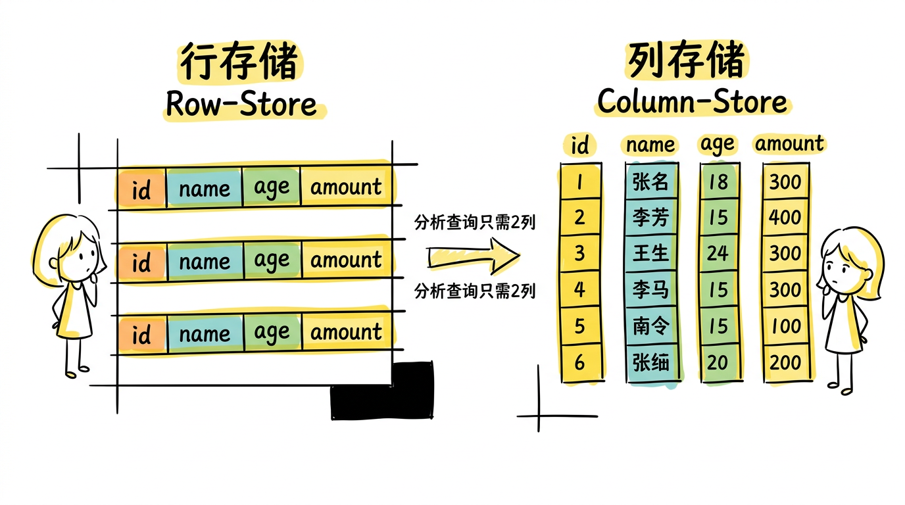
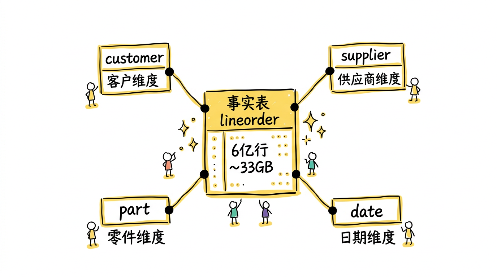
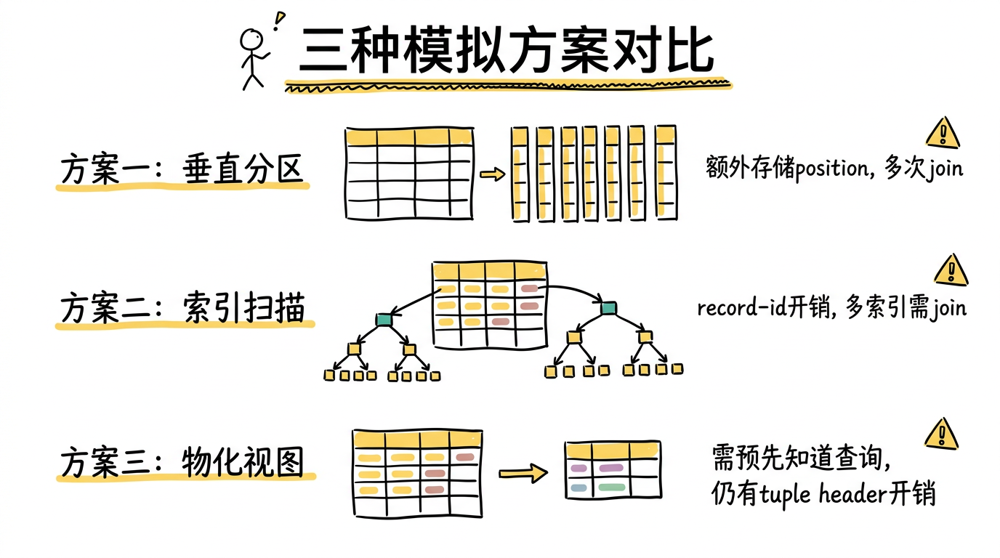
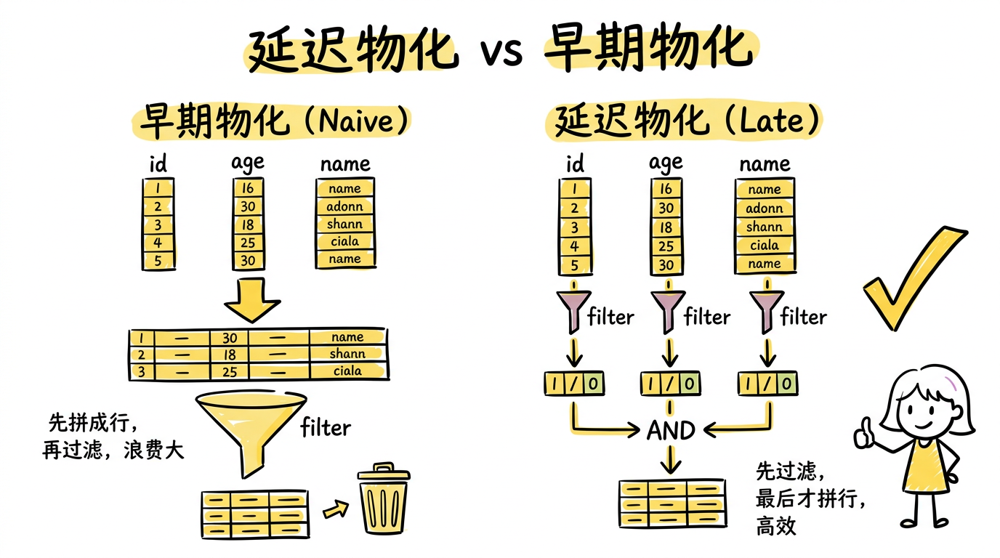
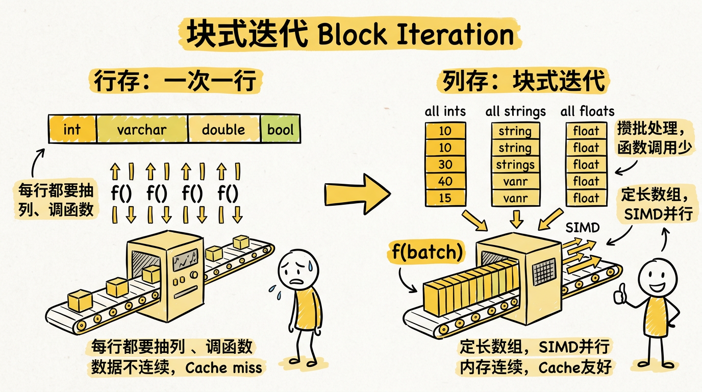
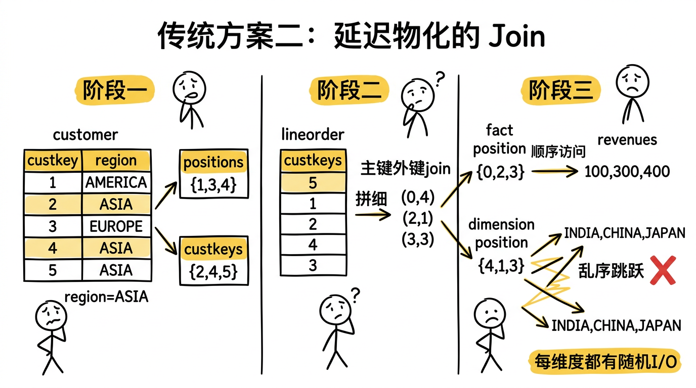
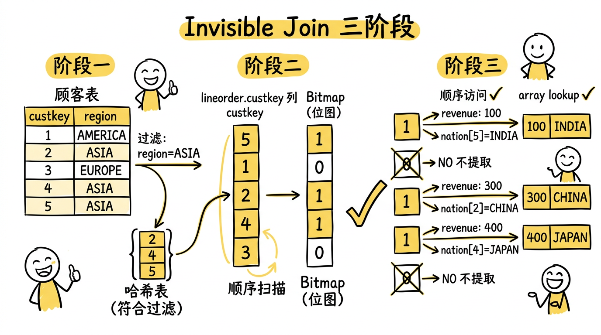
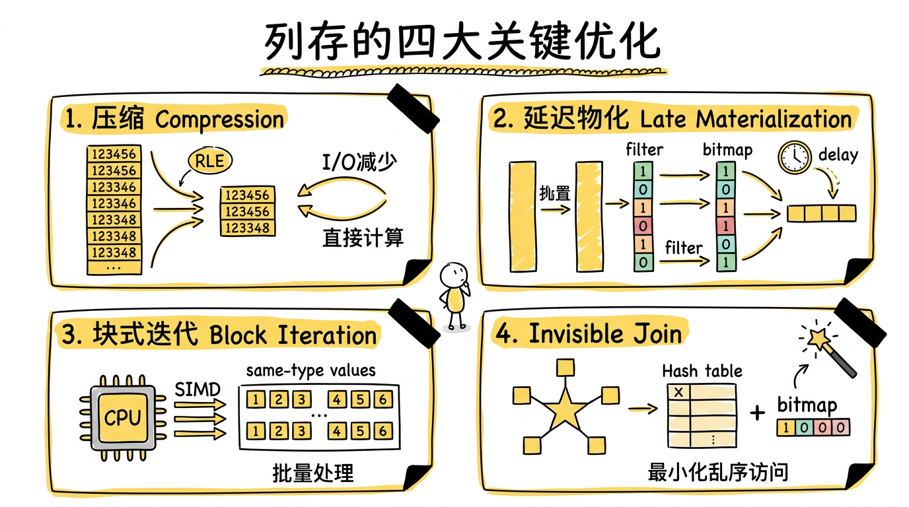
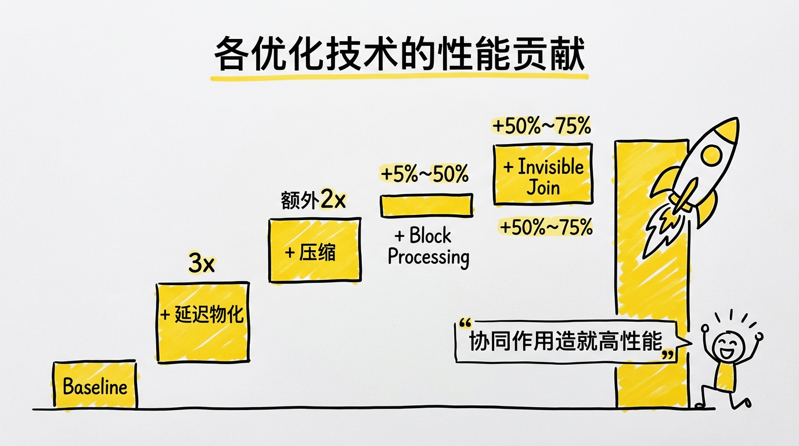

> 论文：*Column-Stores vs. Row-Stores: How Different Are They Really?*
> 作者：Daniel J. Abadi, Samuel R. Madden, Nabil Hachem
> 发表：SIGMOD 2008

## 一个经久不衰的问题

在数据库领域，有一个看似简单的设计决策：**数据应该按行存储还是按列存储？**

传统的关系型数据库（如 MySQL、PostgreSQL、Oracle）都是行存储（row-store）——一行数据的所有列在磁盘上连续存放。这在事务处理（OLTP）场景下非常高效，因为一次插入或查询通常涉及一整行。

但在数据分析（OLAP）场景下，情况截然不同。一个典型的分析查询可能是："计算 2024 年所有订单的总金额"——它只需要 `order_date` 和 `amount` 两列，却不得不把每行中其他几十列数据也从磁盘读出来。这就是巨大的 I/O 浪费。

列存储（column-store）应运而生：同一列的数据在磁盘上连续存放，只读需要的列，天然适合分析场景。MonetDB、C-Store（后来的 Vertica）、Sybase IQ 等系统证明了列存在 OLAP 上的强大性能。



但这就引出了一个关键问题：**列存的性能优势，究竟是来自"只读需要的列"带来的 I/O 减少，还是来自列存系统中查询引擎的一系列优化技术？** 如果是前者，那么在行存数据库中也可以实现"只读需要的列"——比如把一张宽表垂直拆分成每列一张窄表，或者为每列建索引走 index-only scan 绕过原始宽表。这些方式都能避免读取不需要的列，那是不是就能达到列存的性能？

Abadi 等人在 2008 年发表的这篇论文，用严谨的实验回答了这个问题。结论是：**并不是。如果没有查询引擎上其他几个优化措施的配合，仅仅减少 I/O 并不能达到列存的性能。**

## 实验设置

### 对比系统

论文选择了两个系统进行对比：

- **C-Store**：MIT 开发的列存数据库原型系统，后来商业化为 Vertica。
- **System X**：一个"知名商业行存数据库"（论文未透露具体名称），拥有位图索引、物化视图等高级特性。值得注意的是，System X 作为商业系统实际上比 C-Store 更加成熟。

### 基准测试

论文使用了 **Star Schema Benchmark（SSBM）**，这是 Pat O'Neil 对 TPC-H 的改造版本，更贴近真实的数据仓库场景。它的核心是一个典型的星型模型：

- 一张 **事实表**（lineorder）：6 亿行，约 33GB
- 多张 **维度表**（customer, supplier, part, date）

SSBM 包含 13 个查询，分为 4 组（Q1-Q4），每组查询涉及的维度表数量和过滤后返回的数据量逐步递进——从简单的单表过滤到多表 join 加聚合。



## 在行存上模拟列存

论文的第一个核心贡献是：**在行存数据库上尝试了多种模拟列存的方案**，看它们能否缩小与真正列存的差距。

### 方案一：垂直分区（Vertical Partitioning）

最直觉的方式——为表的每一列都创建一个两列的窄表，每个窄表包含该列的值和行的 position。这样查询时只需读取需要的窄表，再通过 position 做 join。

**问题**：
- 每个窄表都要额外存储 position 列，造成存储膨胀
- 需要将多个窄表在 position 上做 join 来重构行，带来额外开销
- 行存储引擎中每行的 tuple header 开销（在 System X 中每行约 24 字节）在窄表中被放大——原本一行摊一次的 header 开销，现在每列都要摊一次

### 方案二：只用索引（Index-Only Plans）

为每一列创建一个索引，包含 `<record-id, value>`。查询时通过"仅索引扫描"（index-only scan）直接从索引中获取列数据，绕过主表。

**问题**：
- 索引中每个条目仍然带有指向原始行的 record-id（每个 6 字节）以及索引页的元数据开销
- 当需要从多个索引中获取数据时，仍需在 record-id 上做 join
- 索引虽然带来了一定程度的有序性，但并非专门为列式扫描优化

### 方案三：物化视图（Materialized Views）

为每个查询预先创建一个只包含所需列的物化视图——将要查询的列直接变成一张物化视图，这样可以直接访问指定的列，也没有上面两种方法显式存储 position/record-id 的开销。

**问题**：
- 需要为每个查询预先创建视图，现实中不可行
- 即便如此，仍然存在 tuple header 等行存固有开销
- 这实际上是行存能做到的最理想情况——它假设我们提前知道所有查询，现实中不可能为每个查询都定制一个物化视图

### 小结



## 列存的四大关键优化

论文的第二个核心贡献是：**识别并量化了列存系统中四项关键优化技术各自的性能贡献。**

### 1. 压缩（Compression）

列存天然适合压缩，因为同一列的数据类型相同、值域相近，相邻值之间往往高度相似。压缩带来两个层面的好处：

**减少 I/O**：不管是从硬盘把数据读入内存，还是从内存把数据读入 CPU cache，更小的数据量意味着更少的传输。

**直接在编码后的数据上计算**：比如采用 RLE 编码，`1, 1, 1, 2, 2` 被编码为 `1×3, 2×2`。计算 sum 时，执行引擎可以直接在压缩后的数据上计算（`1*3 + 2*2 = 7`），而不需要先解压再计算。这是行存难以复制的——因为行存的压缩是以行为单位，无法在压缩状态下做列级操作。

值得注意的是，一般列排序后才会有更高的压缩率——排序使得相邻值更容易重复，RLE 等编码的效果更好。

### 2. 延迟物化（Late Materialization）

#### 什么是物化

为了能够把底层存储格式（面向 Column 的）跟用户查询表达的意思（Row）对应上，在一个查询的生命周期的某个时间点，一定要把数据转换成 Row 的形式，这在 Column-Store 里面被称为**物化（Materialization）**。

**延迟物化**就是把这个物化的时机尽量拖延到整个查询生命周期的后期。

以一个具体的查询为例：

```sql
SELECT name
FROM person
WHERE id > 10
  AND age > 20
```

**早期物化（Naive 做法）**：从文件系统读出 `id`、`age`、`name` 三列的数据，马上物化成一行行的 person 数据，然后应用两个过滤条件 `id > 10` 和 `age > 20`，过滤完之后从数据里面抽出 `name` 字段作为最终结果。

**延迟物化的做法**：先不拼出行式数据，直接在 Column 数据上分别应用两个过滤条件，得到满足条件的两个 bitmap，然后两个 bitmap AND 一下，得到同时满足两个条件的最终 bitmap；最后再拿着这个 bitmap 对 `name` 字段进行提取，得到最终结果。

#### 延迟物化的优点

1. **减少了要拼接的列**：避免了不必要的物化开销。如果第一个过滤条件已经排除了 90% 的行，后续只需处理 10% 的数据。
2. **保留压缩优势**：进行物化需要将列进行解压缩，这样之前提到的直接在压缩后数据上计算的优势就没了。延迟物化让数据尽量保持在压缩态。
3. **Cache 友好**：不会因为不需要的列污染了 Cache line。
4. **保留 Block Iteration 的优势**：如果早期物化把多列拼成行，一行里混合了 int、varchar、double 等不同类型，整行长度不固定，无法当作数组进行批量处理。而延迟物化让数据保持在列格式下——同一列的类型相同（比如 `age` 列全是 4 字节的 int），可以当作定长数组访问，Block Iteration 和 SIMD 才能发挥作用。



### 3. 块式迭代（Block Iteration）

传统行存的执行引擎使用"一次一行"（tuple-at-a-time）的迭代器模型：对于每条数据，都要从 Row 数据里面抽取出需要的 column，然后调用相应的函数去处理。

列存使用**块式迭代**——将数据进行攒批操作，一次性处理多条数据：
- 函数调用次数大幅降低
- 如果列是定长的，就可以以数组的方式对数据进行访问，从而利用现代 CPU 的 SIMD（Single Instruction Multiple Data）指令实现并行化执行
- 数据在内存中连续排列，对 CPU 缓存极为友好

虽然行存也可以实现块式迭代（一次传递多行），但列存的块式迭代更加高效，因为传递的是**同一类型的值数组**，数据是定长的可能性更大，更容易利用 SIMD 优化。

#### 小结



### 4. Invisible Join（该论文提出的新技术）

SSBM 的查询涉及大量星型 schema 上的 join：事实表与多张维度表做等值连接。在讨论 invisible join 之前，先看两种传统的 join 方案。

#### 传统方案一：按 Selectivity 排序 Join

按过滤条件的选择性从大到小对表进行 join。例如：

```sql
SELECT ...
FROM customer AS c, lineorder AS lo
WHERE lo.custkey = c.custkey
  AND c.region = 'ASIA'
```

因为 `c.region = 'ASIA'` 能过滤更多的数据，所以先对 customer 和 lineorder 进行 join，然后通过 `c.region` 进行 filter。以此类推处理其他维度表。

**问题**：一开始就做了 JOIN，享受不了延迟物化的各种优化。

#### 传统方案二：延迟物化的 Join

用延迟物化的思路来做 join——先不进行 JOIN，而是先过滤，再用 position 来延迟提取数据。用一个具体例子来说明，假设查询为：

```sql
SELECT c.nation, lo.revenue
FROM customer AS c, lineorder AS lo
WHERE lo.custkey = c.custkey
  AND c.region = 'ASIA'
```

**第一步：在维度表上过滤，拿到满足条件的 position 和主键。**

customer 表：

| pos | custkey | nation | region |
|-----|---------|--------|---------|
| 0 | 1 | USA | AMERICA |
| 1 | 2 | CHINA | ASIA |
| 2 | 3 | FRANCE | EUROPE |
| 3 | 4 | JAPAN | ASIA |
| 4 | 5 | INDIA | ASIA |

过滤 `region = 'ASIA'` 后，得到满足条件的 position：{1, 3, 4}，对应的主键 custkey：{2, 4, 5}。

**第二步：用维度表的主键跟事实表的外键做 join，得到 position pair。**

lineorder 事实表：

| pos | custkey | revenue |
|-----|---------|---------|
| 0 | 5 | 100 |
| 1 | 1 | 200 |
| 2 | 2 | 300 |
| 3 | 4 | 400 |
| 4 | 3 | 500 |

扫描事实表的 custkey 列，看哪些能和 {2, 4, 5} join 上，得到 position pair：

| 事实表 pos | custkey | 维度表 pos |
|-----------|---------|-----------|
| 0 | 5 | 4 |
| 2 | 2 | 1 |
| 3 | 4 | 3 |

**第三步：用 position pair 提取最终数据。**

- 从事实表提取 `lo.revenue`：按事实表 pos {0, 2, 3} 访问 → 顺序基本有序 → 100, 300, 400
- 从维度表提取 `c.nation`：按维度表 pos {4, 1, 3} 访问 → **乱序跳跃** → INDIA, CHINA, JAPAN

**问题就在这里**：提取维度表列值时，访问顺序是 pos 4, 1, 3——完全是随机跳跃的。如果有多个维度表都需要提取列值，每个维度表都会有这样的随机 I/O，性能很差。



#### Invisible Join：延迟物化 + 最小化乱序

Invisible join 的核心思想是**将 join 看作是在 join 列上的过滤**。沿用上面同一组数据，看 invisible join 怎么做：

```sql
SELECT c.nation, lo.revenue
FROM customer AS c, lineorder AS lo
WHERE lo.custkey = c.custkey
  AND c.region = 'ASIA'
```

**阶段一：在维度表上 apply 过滤条件，构建 hash table。**

过滤 customer 表 `region = 'ASIA'`，得到满足条件的 custkey 集合 {2, 4, 5}，构建 hash table。

**阶段二：扫描事实表外键列，生成 bitmap。**

顺序扫描 lineorder 的 custkey 列，逐个探测 hash table，生成 bitmap：

| 事实表 pos | custkey | 在 hash table 中? | bitmap |
|-----------|---------|------------------|--------|
| 0 | 5 | YES | 1 |
| 1 | 1 | NO | 0 |
| 2 | 2 | YES | 1 |
| 3 | 4 | YES | 1 |
| 4 | 3 | NO | 0 |

得到事实表的 bitmap：**[1, 0, 1, 1, 0]**。

如果有多个维度表（如还有 supplier、date），每个维度表独立产生一个 bitmap，最后所有 bitmap 做 AND 运算，得到同时满足所有条件的最终 bitmap。

**阶段三：用最终 bitmap 提取数据。**

bitmap 为 1 的事实表行是 {0, 2, 3}：

- 提取 `lo.revenue`：按事实表 pos {0, 2, 3} 顺序访问 → 100, 300, 400 ✓ **顺序访问**
- 提取 `lo.custkey`：按事实表 pos {0, 2, 3} 顺序访问 → 5, 2, 4 ✓ **顺序访问**
- 用 custkey **值**去 customer 表查找 `c.nation`：nation[5]=INDIA, nation[2]=CHINA, nation[4]=JAPAN

最后一步对维度表的访问，如果维度表的主键是从 1 开始的连续整数（这是 common case），那么用 custkey 值直接作为数组下标访问 → 快速的 **array lookup**。

**对比传统方案二，为什么 invisible join 更好？**

两者对维度表的访问模式其实类似——都需要用某种索引去维度表取值。invisible join 的优势不在于单次访问更快，而在于整体流程的改进：

|  | 传统延迟物化 Join | Invisible Join |
|--|-----------------|----------------|
| 中间结果 | 需要存储和维护 position pair | 只需一个 bitmap，更紧凑 |
| 多维度场景 | 每个维度依次 join，每步都产生 position pair 并做随机提取 | 各维度独立生成 bitmap，AND 后**一次性**提取 |
| 提取的行数 | 每步提取满足**部分**条件的行，数量多 | 只提取满足**所有**条件的行，数量少得多 |

核心收益在最后一点：由于所有维度的 bitmap 先做了 AND，最终要提取的行数远少于传统方案。行数少意味着维度表的相关数据更容易放进 L2 cache，即使访问模式是随机的，在 cache 内的随机访问也很快。

#### 流程一览



#### Between-Predicate Rewriting

至此，invisible join 和传统的延迟物化 join 没有本质区别——阶段二仍然是用事实表的外键去 hash table 里 probe。作者进一步提出了 **between-predicate rewriting**，在特定条件下完全消除 hash lookup。

作者观察到，对于 star schema join 有一种 common case：维度表的数据在进行常量条件过滤后，满足条件的主键通常是**连续的**。

沿用上面的例子。假设 date 维度表的 datekey 采用 `YYYYMMDD` 格式，过滤 `year >= 1992 AND year <= 1997` 后，满足条件的 datekey 恰好是一段连续范围 19920101 ~ 19971231：

**原来的做法（hash probe）**：构建一个 hash table，插入 datekey {19920101, 19920102, ..., 19971231}，然后扫描事实表的 orderdate 列，每个值都去 hash table 里查一次。

**Between-predicate rewriting**：既然满足条件的 key 是连续的 19920101 ~ 19971231，那 join 条件就等价于一个范围过滤：

```
lo.orderdate >= 19920101 AND lo.orderdate <= 19971231
```

直接对事实表的 orderdate 列做范围比较即可，不需要构建 hash table，也不需要 hash 计算。范围比较只是两次整数大小比较，比 hash lookup 快得多。

**如果主键不连续怎么办？** 比如过滤后剩下的 custkey 是 {2, 5, 7, 12, 15}，不是一段连续范围，没法直接做 between 改写。解决方法是通过 dictionary encoding 将这些值重新按序编码：

| 原始 custkey | 编码后 |
|-------------|-------|
| 2 | 0 |
| 5 | 1 |
| 7 | 2 |
| 12 | 3 |
| 15 | 4 |

同时对事实表的外键列也做同样的编码转换。这样编码后的值就是连续的 0 ~ 4，又可以做 between-predicate 改写了。

### 小结



## 实验结果

### 行存模拟 vs 真正列存

论文的实验结果中有两组关键对比：

**对比一：RS（MV）vs CS** — 在行存中使用物化视图（最优方案）和真正的列存进行比较。即使物化视图已经做到了只读查询需要的列（reduce I/O），行存仍然和列存有不少差距。虽然这与系统本身实现有关，但仍能说明问题——因为 System X 作为商业系统实际上比 C-Store 更成熟。

**对比二：CS vs CS（row-mv）** — 在列存系统 C-Store 中，把查询需要的几列提前拼成行的形式存储（比如查询只用 `custkey`、`revenue`、`orderdate` 三列，就把这三列按行拼在一起存成一个物化视图）。这样数据也只包含需要的列，I/O 量和原生列存一样少，但因为数据按行存放，列存的压缩、延迟物化、块式迭代等优化就都用不上了。实验结果是 CS（row-mv）性能远不如原生列存。这说明 **reduce I/O 并不是列存系统的核心优势**——列存的优势主要来自查询引擎层面的优化。

在行存的几种模拟方案中，只有物化视图的性能相对较好，因为 MV 可以做到只读查询需要的列。其他模拟手段（垂直分区、仅索引扫描）反而会因为额外开销而降低性能。

### 各优化技术的性能贡献

论文通过逐步添加优化，量化了每项优化的贡献（从右到左依次叠加）：

| 优化组合 | 性能提升 |
|---------|---------|
| 延迟物化 | **3 倍** |
| + 压缩 | 额外 **2 倍** |
| + Block Processing | 额外 **5% ~ 50%** |
| + Invisible Join | 额外 **50% ~ 75%** |

一个重要结论：**没有任何单一优化能解释列存的全部优势——是这些优化的协同作用造就了列存的高性能。** 而这些优化又深度依赖于列式的物理存储布局，因此无法简单地移植到行存系统中。



## 核心启示

Column-Store 的优势不止在于它的存储格式，查询引擎层的各种优化同样关键。受限于 Row-Store 本身的存储格式，即使在查询引擎层添加了上述各种优化，效果也不会很好。

列存的成功是从存储布局、压缩方案、查询执行、join 策略到结果物化的**端到端协同设计**。真正的系统创新往往需要打破抽象边界，让各层协同优化，而不是在某一层上做局部改进。

## 后续影响

这篇 2008 年的论文对数据库领域产生了深远影响：

- **列存成为分析数据库的标配**：今天几乎所有主流分析数据库（ClickHouse、DuckDB、Apache Doris、StarRocks、Snowflake、BigQuery、Redshift）都采用列式存储。由于它们的"卓越性能"，已经成长为主导数据仓库/OLAP 市场。
- **列式文件格式的兴起**：Apache Parquet 和 ORC 等列式文件格式成为大数据生态的事实标准，即使在 Hadoop/Spark 等非数据库系统中也广泛使用。
- **向量化执行引擎**：论文中讨论的块式迭代思想发展为现代数据库中的向量化执行引擎（如 DuckDB 的向量化执行、Velox 引擎），成为 OLAP 性能优化的核心技术。
- **HTAP 系统的兴起**：一些数据库开始同时支持行存和列存（如 TiDB 的 TiFlash、SQL Server 的列存索引），针对不同工作负载使用不同的存储格式。

从 2008 年到今天，列存已经从一个学术界的研究方向变成了工业界的标准实践。而这篇论文的贡献在于：它不仅证明了列存确实更好，更重要的是**解释了为什么更好**——这种理解帮助后续的系统设计者知道应该在哪些方向上继续优化。
