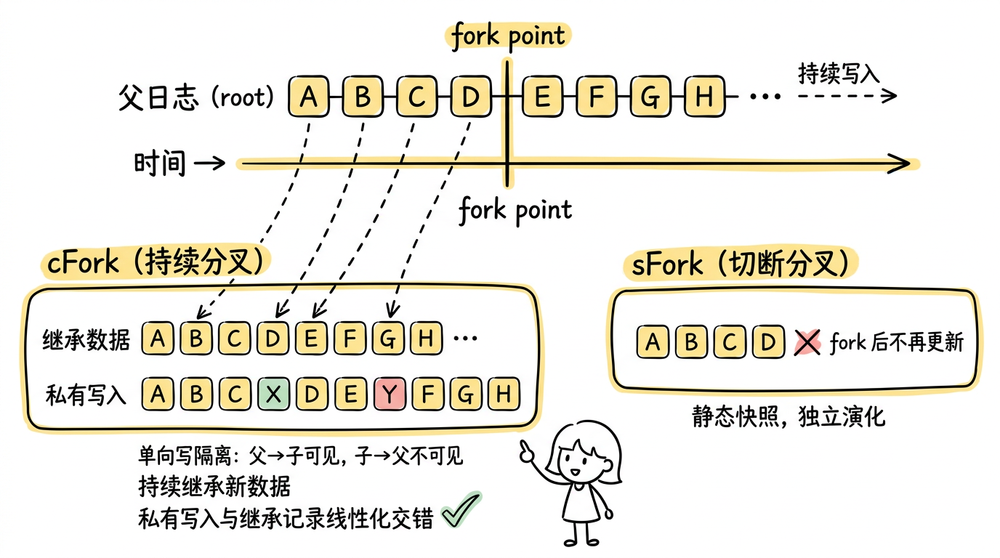
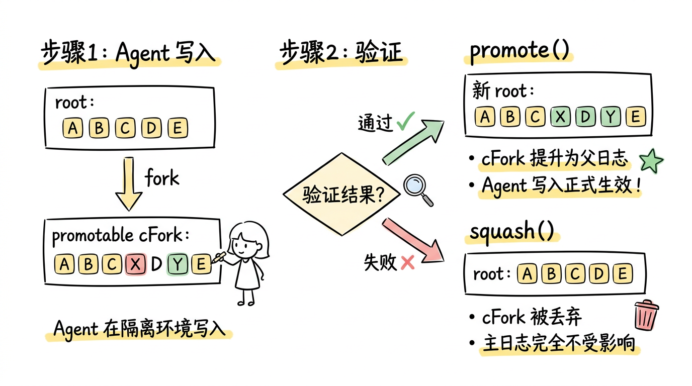
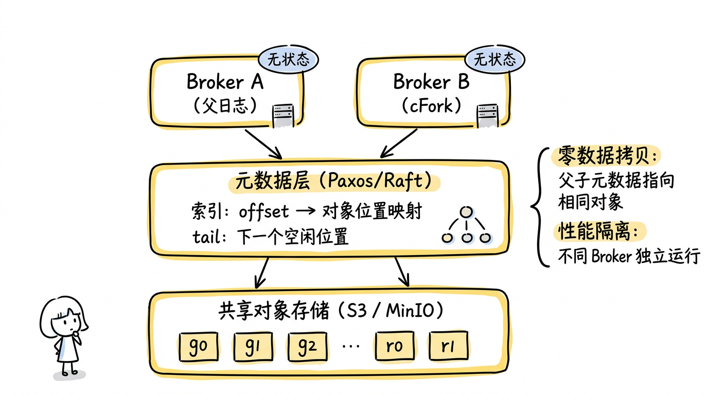
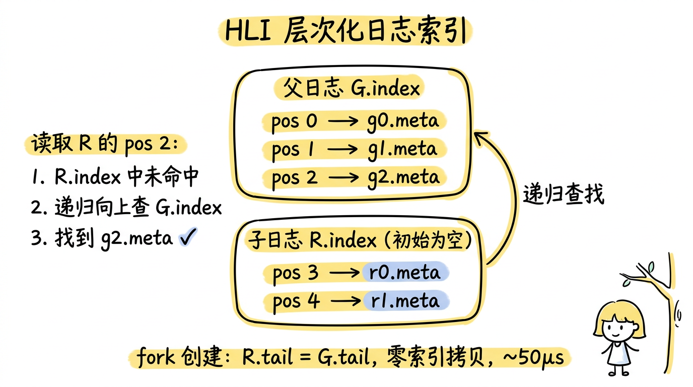
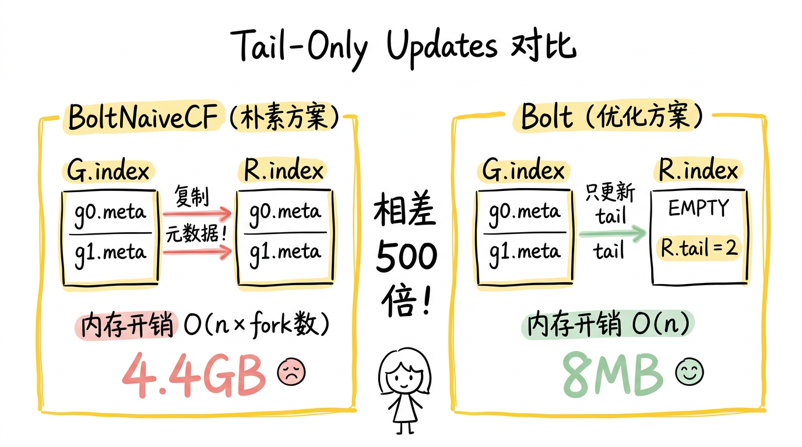
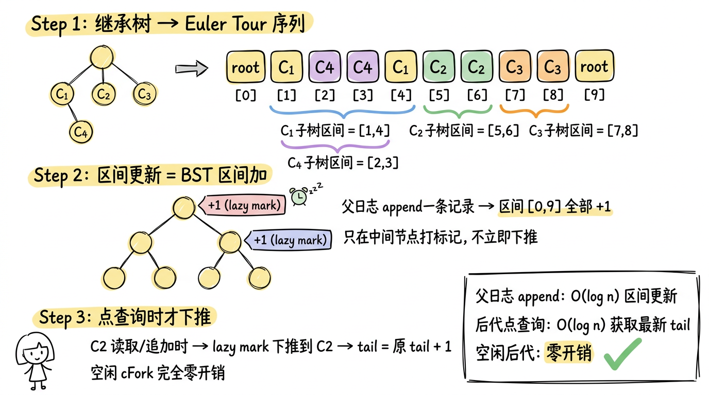

> 本文基于伊利诺伊大学厄巴纳-香槟分校（UIUC）研究团队的论文 [AgileLog: A Forkable Shared Log for Agents on Data Streams](https://arxiv.org/pdf/2604.14590) 梳理总结而成。

## 一、引言：一个被忽视的基础设施缺口

在现代数据基础设施中，共享日志（Shared Log）是一个不起眼但极其关键的角色。Kafka、Pulsar、Redpanda——这些我们耳熟能详的流数据平台，其底层核心都是一个共享日志：上游 producer 将数据按序写入，下游 consumer 按需消费处理。这套架构支撑着实时分析、欺诈检测、搜索索引、ML 推理等无数关键应用，已经稳定运行了十多年。

然而，一个新的变量正在打破这种平衡：**AI Agent**。

随着 LLM 推理能力的飞速提升，AI Agent 已经不再满足于被动地接收指令。它们开始主动与数据系统交互——读取流数据来理解业务上下文，生成分析查询来回答 ad-hoc 问题，甚至直接向流中写入处理结果。Confluent、Redpanda、Lenses.io 等主流流平台都已经通过 MCP（Model Context Protocol）等机制为 Agent 提供了读写流数据的能力。

问题是：**现有的流系统是为"行为可预测的固定程序"设计的，而不是为"探索性的、可能犯错的、大量并发的 AI Agent"设计的。** 当数十个 Agent 同时在 Kafka 上执行探索性查询时，你的生产级消费者的延迟可能悄然飙升 14 倍。当一个 Agent 因为 LLM 幻觉写入了错误数据时，下游所有依赖这条流的应用都会受到影响。

来自 UIUC 的研究团队在这篇论文中提出了一个观点：**共享日志，这个流数据系统的核心存储抽象，需要支持创建自身的隔离分叉（fork）。** 基于这一观察，他们设计了 AgileLog——一种新型的可分叉共享日志抽象，并构建了名为 Bolt 的系统实现。

---

## 二、问题与动机：Agent 不是"又一个客户端"

要理解 AgileLog 的价值，首先需要理解 AI Agent 与传统流数据消费者之间的本质差异。

### 2.1 传统应用 vs. AI Agent

传统的流数据应用——比如一个 Flink job 或一个 Kafka consumer——是程序员预先编写好的固定逻辑。它的行为是确定的：读取哪些 topic、如何处理记录、写入什么输出，都在代码中写死。运维团队可以精确预估它的资源消耗和访问模式。

AI Agent 则完全不同。它的行为是由 LLM 在运行时动态决定的：

- **探索性**：Agent 不会沿着一条固定路径执行。它可能先探测流的 schema，然后采样几条记录来理解数据格式，接着尝试一种分析方法，发现不理想后再尝试另一种。一个简单的"分析过去 24 小时的异常"指令，可能触发十几轮与流系统的交互。
- **不确定性**：LLM 的推理并非百分百准确。Agent 生成的写入可能包含错误数据，它选择的查询路径可能效率低下，它对 schema 的推断可能有偏差。
- **高并发**：构建和部署 Agent 的门槛远低于编写传统流处理程序。一个组织可能同时运行数十个甚至上百个 Agent，每个都在同一套流基础设施上执行各自的探索任务。

### 2.2 三大核心问题

论文从这些差异中提炼出三个现有流系统无法解决的核心问题：

**问题一：性能隔离（Performance Isolation）**

Agent 的探索性工作负载和生产级工作负载共享同一套基础设施。在 Kafka 这样的传统架构中，consumer 和 producer 共享同一组 broker 的 CPU、内存和磁盘 I/O。当多个 Agent 同时执行大量随机读取和探索性查询时，生产级消费者——比如一个延迟敏感的欺诈检测管道——会因为资源争抢而性能急剧下降。

这不是一个理论问题。论文在实验中展示了具体数据：在 Kafka 上，当 Agent 分析任务与延迟敏感型工作负载同时运行时，后者的端到端延迟均值升高 **14 倍**，p99 延迟升高 **130 倍**。

**问题二：写入安全（Safe Handling of Agentic Writes）**

LLM 可能产生不准确的输出，这意味着 Agent 的写入天然带有风险。如果一个负责内容审核的 Agent 将错误的标注结果直接写入输出流，所有下游消费者都会受到影响。

更复杂的是，Agent 天然具有多路径探索的需求。比如在内容审核场景中，多个 sub-agent（各使用不同的 LLM）可能同时分析同一条输入，产生不同的审核结果。系统需要支持在隔离环境中并行探索这些路径，最终选出最佳结果并整合到主流中。

当前的流系统没有提供这种"先隔离写入 → 验证 → 再整合"的机制。Agent 要么直接写入主流（危险），要么写入一个完全独立的临时流（但这样就失去了与主流数据的上下文关联）。

**问题三：真实数据沙盒（Realistic Sandboxes）**

编码和测试 Agent 需要沙盒环境来注入测试事件、验证流处理器行为。当前的做法是创建完全独立的合成数据流进行测试，但这种方式缺乏真实性——合成数据无法复现生产数据中的时序模式和边界情况。

以欺诈检测测试为例：Agent 生成的合成欺诈交易必须交织在真实交易流中才有意义，因为检测模型需要参考历史交易模式来判断。但当前没有任何流系统能创建"既隔离于生产流、又能看到真实生产数据"的沙盒。

---

## 三、使用场景：Agent 如何与流数据交互

论文梳理了五类具体的 Agent 使用场景，这些场景不是假想的，而是来自对 Confluent、Redpanda、Lenses.io 等平台实际支持的 agentic 功能的分析。

### 3.1 Agentic 数据分析

场景：让非程序员用自然语言与流数据"对话"。Agent 可以构建实时仪表盘、回答窗口化查询、计算时序指标，处理类似"过去 24 小时最热门的商品是什么"这样的 ad-hoc 问题。

Agent 的工作模式是迭代式的：先探测流的内容和 schema，采样记录理解数据结构，然后执行分析。这涉及多轮与流系统的交互，每一轮都可能探索不同的分析路径。

对系统的需求：仪表盘需要**持续获取新记录**；ad-hoc 查询只需**访问特定时间点**的数据。

### 3.2 实时上下文获取

场景：agentic 应用需要流数据作为实时决策上下文。比如 Agent 驱动的订单履行系统需要实时库存状态，Agent 会迭代地探测和读取流来构建所需上下文。

对系统的需求：必须能看到**最新的、持续更新的**数据。

### 3.3 Agentic 流处理

场景：LLM Agent 充当流处理器，特别适合非结构化、异构数据。典型例子是内容审核 Agent——对输入流中的每条内容调用 LLM 判断是否违规，将结果写入输出流。

对系统的需求：Agent **既读又写**流数据，写入需要经过验证后才能影响下游。

### 3.4 流应用编码与测试

场景分两部分。编码 Agent 用 LLM 生成流处理应用程序，开发过程中需反复读取流来推断 schema 和调试代码。测试 Agent 生成测试事件注入流中，验证流处理器在各种边界情况（迟到事件、格式错误、重复记录）下的行为。

对系统的需求：测试事件必须**与真实数据交错**（以获得时序上下文），但**不能污染生产流**。

### 3.5 场景与设计的映射

这些场景自然映射到了 AgileLog 提供的不同 fork 原语。在展开详细设计之前，先简要介绍四种 fork 类型：

- **cFork（Continuous Fork，持续分叉）**：子日志持续继承父日志的新数据，像一面"活镜子"。适合需要实时数据的场景。
- **sFork（Severed Fork，切断分叉）**：fork 后父子完全断开，子日志是父日志在某个时间点的静态快照。适合历史查询和 what-if 分析。
- **promotable cFork**：一种特殊的 cFork，Agent 在上面写入的数据经过验证后，可以通过 promote 操作整合到父日志中，成为正式数据。
- **non-promotable cFork**：普通的 cFork，Agent 的写入永远是私有的，不会影响父日志。适合测试等场景。

| 场景           | 读/写 | 需要实时数据？ | 对应的 Fork 类型 |
|--------------|-----|---------|---|
| 数据分析（仪表盘）    | 只读  | 是       | cFork（持续读） |
| 数据分析（ad-hoc） | 只读  | 否       | sFork（快照读） |
| 实时上下文        | 只读  | 是       | cFork |
| 流处理（需验证）     | 读写  | 是       | promotable cFork + promote |
| 多路径探索        | 读写  | 是       | 多个 promotable cFork |
| 测试           | 读写  | 是       | non-promotable cFork |
| What-if 分析   | 读写  | 否       | sFork |

论文的论证逻辑非常清晰：每一个设计决策都有对应的真实场景作为支撑，而不是凭空构造的抽象。

---

## 四、AgileLog 抽象设计：给共享日志加上 fork()

### 4.1 核心接口

AgileLog 在传统共享日志的 append/read 接口之上，增加了四个关键操作：

```
interface AgileLog:
    // 传统接口
    Position append(Record r);
    List<Record> read(Position from, Position to);
    // Fork 操作
    AgileLog cFork(promotable = false);   // 创建持续分叉
    AgileLog sFork(optional Position past);  // 创建切断分叉
    bool promote();   // 将 cFork 提升为父日志
    void squash();    // 删除分叉
```

### 4.2 Continuous Fork：论文最核心的创新

传统数据库中的 fork 语义很简单：fork 之后父子断开，各自独立演化。但这对流数据场景不够用——流数据是持续流入的，一个在 fork 上运行仪表盘查询的 Agent，必须继续看到 fork 之后父日志上的新数据，否则仪表盘就冻结了。

AgileLog 的 Continuous Fork（cFork）解决了这个问题：

1. **持续继承**：cFork 不仅共享 fork 之前的历史数据，还**持续继承**父日志 fork 之后的所有新增记录。子日志像一面"活镜子"，实时反映父日志的更新。
2. **私有写入**：cFork 可以追加自己的记录，这些记录对父日志和父日志的消费者不可见。
3. **线性化交错**：cFork 上的私有写入与从父日志继承的记录按线性顺序交错。也就是说，如果父日志在时刻 T 追加了记录 A，cFork 在时刻 T+1 追加了私有记录 X，那么在 cFork 上读到的顺序是 ...A, X...。
4. **单向写隔离**：父→子可见（继承），子→父不可见（隔离）。这与传统 fork 的双向隔离形成对比。

用一张图来对比 cFork 和 sFork 的区别：



*图：cFork 持续分叉 vs sFork 切断分叉 —— cFork 像一面"活镜子"持续继承父日志新数据，并支持私有写入与继承记录线性化交错；sFork 在 fork point 切断后成为静态快照。*

这种语义精确地满足了测试场景的需求：Agent 在 cFork 上注入合成的欺诈交易，这些合成数据自然地与真实交易流交错，形成一个逼真的测试环境，同时完全不影响生产流。

### 4.3 Promote：从隔离到整合

cFork 提供了隔离，但有些场景需要将 Agent 的写入最终反映到主流上。AgileLog 的 promote 操作实现了这一点：

1. Agent 在一个标记为 promotable 的 cFork 上执行写入
2. 写入经过验证（人工审核或自动化检查）
3. 验证通过后调用 promote()，该 cFork 成为新的父日志
4. 如果验证失败，调用 squash() 丢弃

为什么不直接写临时日志再 append 到主流？因为临时日志无法提供**有状态的验证**——验证往往需要看到 Agent 的写入与主流原有记录交错后的完整上下文。cFork 天然提供这种上下文。

Promote 的工作流程如下图所示：



*图：Promote 从隔离到整合的三步流程 —— Agent 在 promotable cFork 上写入后经过验证，通过则 promote() 提升为新的父日志，失败则 squash() 丢弃，主日志始终不受影响。*

但 promotable cFork 带来一个值得注意的代价：**在 cFork 存活期间，父日志上超过 fork point 的位置不允许读取。** 原因是 promote 会在 fork point 之后插入 Agent 的写入，导致已有记录的位置编号发生变化——如果消费者在 promote 之前读取了位置 4 的记录 E，promote 之后 E 可能跑到了位置 5，之前拿到的索引就失效了。

这意味着 promotable cFork 存活期间，父日志的下游消费者实际上被"冻结"在 fork point，无法看到任何新数据。论文在供应链 Agent 的实验中也坦承了这一点：消费者吞吐量在 cFork 存活期间出现明显下降，直到 promote 或 squash 之后才解除阻塞并快速追赶。因此，promotable cFork 的设计隐含一个前提：**验证周期应该尽量短**，否则冻结窗口会对生产消费者造成可感知的影响。论文也提到，一旦 Agent 经过充分验证变得可信，可以让它直接写主流来规避这一限制。

### 4.4 Severed Fork：经典语义的补充

除了 cFork，AgileLog 也提供传统的 sFork（severed fork）：fork 后父子完全断开。sFork 支持从过去的某个偏移量创建，适用于时间点查询和 what-if 分析等不需要实时数据的场景。

---

## 五、Bolt 系统实现：四项关键技术

AgileLog 是抽象，Bolt 是实现。Bolt 面临的核心工程挑战是：如何让 fork 同时满足**廉价**（创建延迟低）、**隔离**（不影响父日志性能）和**可扩展**（支持大量并发 fork）三个要求。

### 5.1 设计洞察：Diskless 架构是天然的 Fork 基座

Bolt 的第一个关键洞察是选择**无本地磁盘的共享日志架构**（Diskless Architecture）作为基础。

传统的共享日志（如 Kafka）使用有状态的 broker，数据存储在 broker 的本地磁盘上。在这种架构上实现 fork，要么复制数据（昂贵且慢），要么在同一 broker 上共享数据（引入资源争抢，破坏性能隔离）。

无盘架构将存储和计算分离：

- **Broker 无状态**：不存储任何数据在本地磁盘
- **共享对象存储**（如 AWS S3、MinIO）：存储实际数据对象
- **元数据层**：基于 Paxos/Raft 的容错服务，维护日志索引（从位置 offset 到对象存储中数据位置的映射）和 tail（下一个空闲位置）



*图：Bolt 的 Diskless 架构 —— Broker 无状态，数据存储在共享对象存储，元数据层维护索引映射。父日志与 fork 的元数据指向相同存储对象实现零数据拷贝，运行在不同 Broker 实现性能隔离。*

这种架构为 fork 提供了天然优势：子日志的元数据可以直接指向父日志在共享存储上的**相同对象**，实现零数据拷贝。而 fork 被分配到独立的 broker 上服务，由于 broker 无状态且对象存储可弹性扩展，父子之间的性能隔离自然达成。

### 5.2 层次化日志索引（Hierarchical Log Index, HLI）

即使不复制数据，复制元数据也可能很慢。一个包含 2500 万条记录的日志，其元数据索引的复制需要约 100ms——对于需要快速创建大量 fork 的 Agent 场景来说，这是不可接受的。

Bolt 的解决方案是**完全不复制元数据**。它利用了日志的一个关键特性：日志是 append-only 的，fork point 之前的索引条目永远不会改变。因此，子日志可以直接**指向**父日志的索引，而不是复制它。

具体来说，HLI 的工作方式是：

1. 创建 fork 时，子日志 C 的索引初始化为空 map，tail 设为父日志 P 的当前 tail
2. C 上的新增 append 记录在 C 自己的索引中记录
3. 读取时，如果请求的位置在 C 的索引中有记录，直接返回；否则递归查找父日志 P 的索引

以下图为例，子日志 R 是从父日志 G 创建的 cFork：



*图：HLI 递归查找机制 —— 子日志 R 的索引初始为空，读取继承位置时向上递归查父日志 G 的索引；fork 创建只需设置 R.tail = G.tail，零索引拷贝，延迟仅 ~50μs。*

Fork 创建时只需设置 R.tail = G.tail，不复制任何索引条目。这使得 fork 创建变成了一个常数时间操作（~50μs），与日志长度无关。

### 5.3 Tail-Only Updates：实现持续继承的关键

cFork 的核心语义是持续继承父日志的新记录。一种朴素的实现（论文称为 BoltNaiveCF）是：每当父日志 P 追加一条新记录时，同步更新所有后代 D 的索引和 tail。但这有两个严重问题：

- 每条记录的元数据被插入到 n 个索引中（n 为 fork 数量），内存开销线性增长
- 更新所有后代在父日志的 append 关键路径上，直接拉高 append 延迟

Bolt 的关键观察是：**要让后代"看到"父日志的新记录，只需更新后代的 tail，而不需要复制索引条目。** tail 的更新告诉后代"父日志有新数据了"，而具体的元数据可以在读取时通过 HLI 的递归查找从父日志索引中获取。



*图：朴素方案 BoltNaiveCF 在父日志 append 时同步复制元数据到所有后代索引，内存开销 O(n × fork数) 达 4.4GB；Bolt 只更新后代 tail 而不复制索引条目，读取时通过 HLI 递归查找，内存开销降至 O(n) 仅 8MB，相差 500 倍。*

这完全消除了元数据复制：每条记录的元数据只存储在它最初被 append 的那个日志的索引中。

### 5.4 Lazy Tail Tree（LTT）：从 O(n) 到 O(log n)



*图：LTT 的逻辑层是继承树（父子关系），物理层是 Euler Tour 的平衡 BST。Euler Tour 的关键性质使子树映射为连续区间，支持 lazy propagation 的 O(log n) 区间更新和点查询，确保 1000 个 cFork 下父日志 append 吞吐量无退化。*

即使只更新 tail，如果每次父日志 append 都主动遍历所有后代逐一更新 tail，开销仍然是 O(n)。Bolt 的解决方案是 Lazy Tail Tree（LTT）：**父日志 append 时不主动通知任何后代，只在后代真正需要时才计算其最新 tail。**

LTT 的核心是将继承树的 **Euler Tour**（DFS 进出序列）存储在一棵平衡 BST 中。Euler Tour 有一个关键性质：任意节点的子树在序列中对应一段**连续区间**。

这样，"通知 root 所有后代 tail +1"就变成 BST 上的一次区间更新 [0,9]。BST 通过 **lazy propagation** 实现：不真正遍历所有节点，而是在中间节点打标记，只在后续访问到具体 cFork 时才向下推送。大多数 cFork 在大多数时候是空闲的，标记一直挂着，零开销。

最终效果：无论有多少 cFork，父日志 append 的额外开销都是 O(log n)，且空闲 cFork 完全不产生任何代价。

### 5.5 Promote 的元数据实现

Promote 将一个 cFork 提升为父日志。Bolt 通过元数据操作实现这一点，无需任何数据拷贝：将 cFork 中 fork point 之后的元数据条目复制到父日志中，替换对应位置的条目。

由于只需复制 fork point 之后（而非整个历史）的元数据，这是一个合理的设计选择——fork 的存活时间通常较短，积累的元数据量有限。实验显示 promote 延迟仅为 10-100μs。

---

## 六、实验评测：数字说话

论文在 CloudLab 集群上进行了全面评测，使用 xl170 节点、9 个 MinIO 存储节点、3 副本元数据层。以下是关键结果：

### 6.1 Fork 创建延迟

Bolt 的 fork 创建延迟恒定在 ~50μs，与日志长度无关。对比方案 BoltMetaCpy（复制元数据的变体）在日志包含 2500 万条记录时需要 ~100ms，慢了三个数量级。

更重要的是，BoltMetaCpy 在创建 fork 时会阻塞父日志的 append 操作（因为元数据复制占用了元数据层的资源），导致父日志吞吐量在 fork 创建期间明显下降。Bolt 则完全没有这个问题。

### 6.2 性能隔离

论文设计了一个延迟敏感型工作负载（lc-workload），模拟生产级消费者：追加记录并读取尾部最新记录。

**与 Kafka 对比**：当 Agent 分析任务同时运行时，Kafka 上 lc-workload 的延迟因 broker 资源争抢而退化 2.5 倍。在 Bolt 上，由于 Agent 在独立 broker 上操作 sFork，lc-workload 完全不受影响。

**cFork 写入隔离**：即使有一个 cFork 以 13KOps/s 的速度追加记录，父日志上 lc-workload 的端到端延迟（均值和 p99）也完全不受影响。

### 6.3 多 Fork 可扩展性

在单个根日志上创建 0、10、100 个 cFork 时，根日志的 append 吞吐量-延迟曲线几乎完全重合——即使 100 个 cFork 都在持续继承新记录，也没有性能退化。

扩展到 32 个根日志（模拟 Kafka 多 partition 场景），每个根日志创建 0、10、100 个 cFork，结果同样稳定。这验证了 LTT 惰性传播机制的有效性。

### 6.4 元数据内存开销

维护 1000 个 cFork（根日志包含 100 万条记录）时：

- BoltNaiveCF（朴素方案）：**4.4GB**——因为每条记录的元数据被复制到所有后代索引中
- Bolt：**仅 8MB**——因为 tail-only updates 完全消除了元数据复制

相差超过 500 倍。

### 6.5 三个真实 Agent 应用

论文构建了三个基于 LLM（Gemini 2.5 Pro）的真实 Agent 应用来验证 AgileLog 的端到端价值：

**IoT 分析 Agent（sFork）**：在 IoT 传感器数据流上执行"查找前 100 万条记录中的异常"任务。Agent 创建 sFork，在上面自由执行多轮探索性查询。在 Bolt 上，同时运行的生产工作负载完全不受影响；在 Kafka 上，Agent 查询执行阶段的生产工作负载延迟均值升高 14 倍，p99 升高 130 倍。

**流处理测试 Agent（non-promotable cFork）**：测试一个 5ms 滚动窗口的聚合流处理器。Agent 在 cFork 上注入各种边界测试用例（迟到事件、格式错误、重复记录），测试事件与真实数据自然交错。即使测试与生产工作负载同时运行，生产延迟也无任何退化。cFork 天然提供了带有真实数据上下文的沙盒环境。

**供应链管理 Agent（promotable cFork + promote/squash）**：Agent 监控订单流，主动生成补货事件。它在 promotable cFork 上写入补货事件，系统运行下游消费者的副本来验证这些事件的正确性。验证通过后 promote，失败则 squash。当 Agent 犯错（注入了格式错误的事件）时，Bolt 通过 cFork 隔离避免了下游消费者的崩溃；而在 Kafka 上，错误事件直接写入主流，导致下游应用崩溃。

---

## 七、总结

### 7.1 优点

**问题定义精准且时机恰当。** 论文抓住了 AI Agent 与数据系统交互这一趋势的关键基础设施缺口。随着 MCP 等协议的普及，Agent 操作流数据已经从"未来展望"变成了"当下现实"。论文的贡献不是发明一个新的 Agent 框架，而是指出底层存储抽象需要进化——这是一个更深层、更持久的洞察。

**设计抽象优雅。** cFork 的"单向写隔离 + 持续继承 + 线性化交错"语义不是简单地将数据库 fork 搬到流场景，而是深入分析了流数据的特性后设计的新抽象。特别是 continuous fork 的概念，在已有的 forkable 系统（数据库、对象存储、lakehouse）中并无直接先例。

**diskless 洞察精妙。** 选择无盘架构作为 fork 的实现基座，不是一个显而易见的决定。论文系统性地论证了为什么传统的有状态 broker 架构和镜像方案都不适合，然后展示了无盘架构如何自然地提供零数据拷贝和性能隔离。

**工程实现扎实。** HLI、tail-only updates、LTT 三项技术逐层递进地解决了 fork 创建延迟、持续继承、多 fork 可扩展性三个挑战。Euler Tour + BST + lazy propagation 的组合看似复杂，但每一步都有明确的动机和量化的收益。

### 7.2 局限性与开放问题

**Promotable cFork 会冻结父日志的消费者。** 如前文所述，promotable cFork 存活期间，父日志上 fork point 之后的读取被阻塞，下游消费者实质上被暂停。论文的实验也证实了这会导致吞吐量下降。这要求 promotable cFork 的生命周期尽可能短——快速写入、快速验证、快速 promote 或 squash。但对于需要复杂验证（比如人工审核、长时间运行有状态消费者来检查正确性）的场景，这个冻结窗口可能难以接受。

**Promote 语义是单一且排他的。** 当多个 promotable cFork 竞争时，只有第一个成功 promote 的会胜出，其余被 squash。这对于"从多条路径中选最优"的场景足够了，但不支持更复杂的合并语义——比如将多个 Agent 的互补写入合并到主流中。论文承认了这一点，指出更通用的 merge 语义不保持 linearizable ordering，且当前的用例不需要。

**读取延迟的递归开销。** HLI 的递归查找意味着深层嵌套的 fork 在读取继承记录时需要多次递归。不过论文评测显示 7 层深度时元数据查找仅慢 5.2%（约 2μs），对客户端感知的毫秒级延迟影响可忽略。

### 7.3 更广阔的视角

这篇论文属于一个更大的趋势：**数据系统需要为 AI Agent 重新设计。** 数据库领域（Dolt、Neon）在做 database branching，对象存储（Tigris）在做 bucket forking，lakehouse（Databricks 等）在做 agentic lakehouse。AgileLog 将这一趋势推进到了流数据的核心存储层。

---

AgileLog 论文的核心贡献是一个清晰的洞察：**当 AI Agent 成为流数据系统的一等公民时，底层的共享日志抽象必须进化——它需要学会 fork。** 论文不仅提出了这个洞察，还通过 cFork 这一新型抽象和 Bolt 系统的精巧实现，展示了如何在不牺牲性能的前提下实现廉价、隔离、可扩展的 fork。
