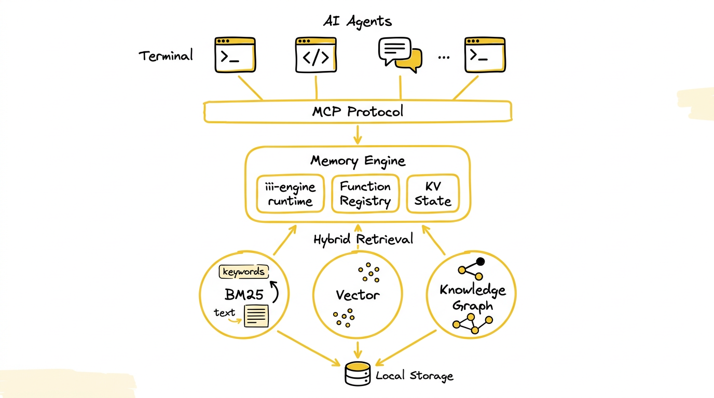
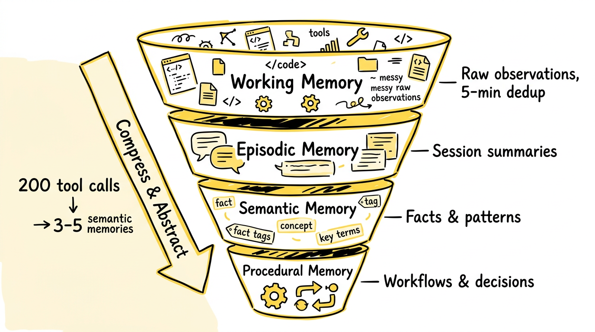
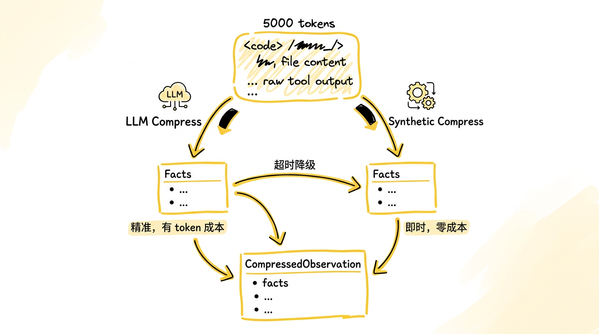
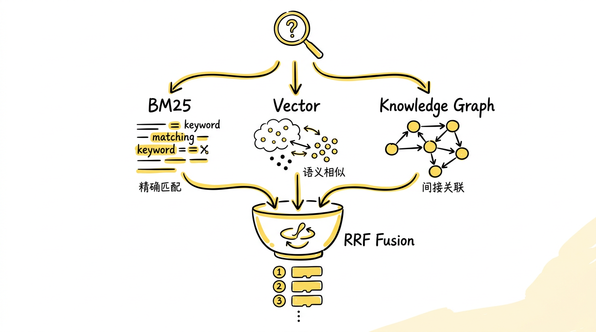
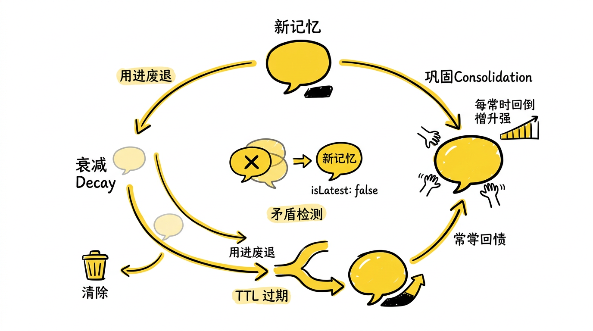

# 当 AI Agent 有了记忆：AgentMemory，一个为编程智能体设计的持久记忆引擎

## 从一个真实问题说起

你用 Claude Code 花了三个小时重构了一个复杂的认证模块。你告诉它项目的架构约定，哪些目录放什么代码，错误处理的偏好，测试的写法。它表现得很好，完全理解了你的意图。

第二天你开了一个新会话，它把这一切全忘了。

你需要重新解释项目结构，重新说明编码偏好，重新描述昨天的上下文。如果你不说，它可能做出和昨天完全矛盾的决策——比如用一种不同的错误处理模式，或者修改一个你昨天刚确定不要动的文件。

这不是个别现象。每一个使用 AI 编程助手的开发者都在经历这件事。每个会话都是一张白纸。Agent 没有记忆。

目前的解决方案大多是手动的。CLAUDE.md 文件本质上是一个静态的 prompt 注入——你手写一份说明文档，每次会话都塞进上下文窗口。它能解决一部分问题，但随着项目迭代，这个文件要么越来越长（token 开销线性增长），要么过时失效（没人记得更新）。240 条观察记录之后，一个典型的 CLAUDE.md 就超过 22,000 token 了，大部分是噪声。

更深层的问题是：这不应该是人类的工作。Agent 自己产生了大量的上下文——它读了哪些文件，做了什么决策，遇到了什么错误，最终采用了哪种方案——这些信息本来就在工具调用的输入输出里。如果有一个系统能自动捕获、压缩、索引这些信息，并在下一次会话中精准地召回相关记忆，开发者就不需要当 Agent 的"外部记忆"了。

AgentMemory 就是为了解决这个问题而生的。


*图：没有持久记忆的 Agent，每次新会话都是一张白纸——昨天的理解、决策和偏好全部归零。*

---

## 一个最小的例子：感受差异

在展开设计之前，先来感受一下有记忆和没记忆的区别。

**没有 AgentMemory** 的时候，每次会话都是独立的：

```
[Session 1] 你: "用 jose 库做 JWT 验证，不要用 jsonwebtoken"
Agent: (完成了实现)

[Session 2] 你: "给 API 加个鉴权中间件"
Agent: import jsonwebtoken from 'jsonwebtoken'  // 用错了库
你: "不对，我们用的是 jose"
Agent: "抱歉，让我改一下..."
```

**有 AgentMemory** 的时候，Session 1 的工具调用会被自动捕获：Agent 读了 `package.json`（看到了 jose 依赖），写了 `src/middleware/auth.ts`（用 jose 实现 JWT），你的偏好被提取为一条语义记忆。当 Session 2 开始时，AgentMemory 的 `memory_recall` 自动召回相关上下文：

```
[Session 2 开始] AgentMemory 注入:
- 项目使用 jose 进行 JWT 验证（来源: Session 1, 强度: 8/10）
- auth 中间件位于 src/middleware/auth.ts（来源: Session 1）
- 认证模式: Bearer token + jose jwtVerify（来源: Session 1）

你: "给 API 加个鉴权中间件"
Agent: import { jwtVerify } from 'jose'  // 正确
```

这不只是"记住了一个库名"。AgentMemory 记住的是结构化的事实——哪个文件负责什么，项目用了哪些技术栈，你做过什么决策，甚至 Agent 上次犯了什么错。这些记忆经过压缩、索引、衰减，以最小的 token 开销注入到新会话的上下文中。

---

## What：AgentMemory 是什么

一句话：**AgentMemory 是一个自托管的持久记忆引擎，它自动捕获 AI 编程智能体的工具调用，将其压缩为结构化记忆，并通过混合检索在未来的会话中精准召回。**

它不是一个向量数据库，不是一个 RAG 框架，也不是一个 prompt 管理工具。它是一个**完整的记忆系统**——从数据捕获到压缩存储，从索引构建到检索融合，从单 Agent 到多 Agent 协调，从会话级到项目级的记忆管理。

技术上，AgentMemory 是一个运行在 iii-engine 之上的 TypeScript 服务。iii-engine 是一个轻量级的分布式运行时，提供函数注册、KV 状态管理、HTTP/WebSocket 触发器、分布式追踪等原语。AgentMemory 在其之上注册了 123 个函数、34 个状态域、53 个 MCP 工具，构成了一个完整的记忆引擎。整个系统零外部依赖——不需要 PostgreSQL，不需要 Redis，不需要 Qdrant，`npx @agentmemory/agentmemory` 启动即可。



*图：AgentMemory 的分层架构 —— 顶层多种 Agent 通过 MCP 协议和生命周期钩子接入，中间是基于 iii-engine 的记忆引擎，底层是 BM25 + 向量 + 知识图谱的混合检索，所有数据本地持久化。*

三个关键词定义了 AgentMemory 的独特性：

- **自动捕获**：通过 12 个生命周期钩子（SessionStart、PostToolUse、Stop 等）自动从 Agent 的工具调用中提取观察，不需要用户手动记录
- **混合检索**：BM25 关键词搜索 + 向量语义搜索 + 知识图谱实体遍历，用 Reciprocal Rank Fusion 融合三路结果
- **Agent 无关**：支持 Claude Code、Cursor、Codex CLI、Gemini CLI、Cline、Windsurf 等 12+ 种 Agent，通过 MCP 协议统一接入

---

## Why：为什么现有方案不够

### CLAUDE.md：静态文件扛不住动态世界

CLAUDE.md（或类似的 `.cursorrules`、`AGENTS.md`）是目前最常见的 Agent 记忆方案。它的本质是一个手工维护的静态文件，每次会话时整体注入上下文窗口。

问题在于，这种方案的 token 开销与信息量线性增长，且没有选择性。240 条观察之后，一个 CLAUDE.md 会膨胀到 22,000+ token。但某次会话可能只需要其中 5% 的信息——你在改认证模块，不需要看数据库迁移的记录。静态文件做不到按需召回。

而且，维护这个文件本身就是负担。你在 Session 1 里做了一个架构决策，得记得手动把它写进 CLAUDE.md。你不会记得的。结果就是这个文件要么过时，要么遗漏，要么两者兼有。

AgentMemory 的做法是**自动捕获 + 按需召回**。Agent 的每一次工具调用（读文件、写代码、执行命令）都被 PostToolUse 钩子捕获，压缩为结构化的观察记录，索引到混合搜索引擎中。下一次会话时，系统根据当前查询的语义，从数千条记忆中精准召回最相关的 5-10 条，token 开销控制在约 1,900 token——不到 CLAUDE.md 的十分之一。

### 向量数据库 + RAG：检索不是记忆

另一种常见思路是用向量数据库做 RAG。把会话历史切成 chunk，嵌入后存进 Qdrant 或 Pinecone，每次会话时用 query 做语义检索。

这种方案解决了"按需召回"的问题，但遗漏了记忆系统的其他维度：

**没有压缩**。一次工具调用的原始输出可能是 5,000 token 的文件内容，但真正有价值的信息是"这个文件实现了 JWT 验证，用的是 jose 库"——30 个 token。如果你把原始输出直接嵌入，检索到的内容里 99% 是噪声。AgentMemory 用 LLM 或合成压缩把每条观察压缩为结构化的事实列表（facts）、关键概念（concepts）和重要性评分（importance 1-10），信噪比提升一个数量级。

**没有衰减**。人类记忆会遗忘，这不是缺陷，是特性。三个月前的一次 debug 经历，如果之后再也没被提起，它的重要性应该自然降低。向量数据库不会做这件事——一条记录存进去就永远在那里，和新记录有同等的检索权重。AgentMemory 实现了基于 Ebbinghaus 遗忘曲线的记忆衰减：频繁被召回的记忆强度增加，长期未被访问的记忆自动淡出，矛盾的记忆被新版本取代。

**没有结构**。向量检索是一维的——给你最相似的 K 条记录。但记忆是有结构的。"auth.ts 使用了 jose 库"和"jose 库实现了 JWT 验证"和"JWT 验证是认证模块的核心"之间存在图关系。当你搜索"认证"时，你需要的不只是包含"认证"这个词的记录，还有通过实体关系链接到认证概念的所有相关记忆。AgentMemory 的知识图谱检索通过 BFS 遍历提供了这个能力。

**外部依赖**。Qdrant、Pinecone、pgvector——每一个都是你需要部署、维护、付费的外部服务。AgentMemory 的向量索引是内存中的，BM25 索引是本地的，知识图谱是 KV 存储的。零外部依赖，一个命令启动。

### mem0 / MemGPT：不同的权衡

mem0 和 Letta（前身 MemGPT）是两个有影响力的 AI 记忆项目。

mem0 提供了一个记忆 API 层，支持向量 + 图检索。但它依赖外部存储（Qdrant 或 pgvector），且没有 Agent 生命周期的自动捕获——你需要手动调用 API 来存储和检索记忆。它更像一个通用的记忆存储服务，而不是一个与编程 Agent 深度集成的记忆引擎。

MemGPT/Letta 走了另一条路：它把记忆管理放进了 Agent 的推理循环本身，让 LLM 自己决定何时存储、何时检索。这很优雅，但有一个根本问题——它需要 LLM 调用来驱动记忆操作，token 开销显著。而且它是一个完整的 Agent 运行时，不是一个可以插入已有 Agent 的记忆层。

AgentMemory 的定位不同：它是一个**外挂式记忆引擎**，通过 MCP 协议和生命周期钩子无侵入地接入任何 Agent。不改 Agent 代码，不换 Agent 运行时。你用 Claude Code 还是 Cursor 还是 Codex CLI，AgentMemory 都是同一个服务，通过标准化的 MCP 接口提供记忆能力。

---

## How：AgentMemory 怎么做到的

### 四层记忆模型：从神经科学到工程实现

AgentMemory 的记忆架构不是凭空设计的，它借鉴了认知科学中关于人类记忆的分层模型。



*图：四层记忆流水线 —— 200 次工具调用的原始观察（~50,000 token）经过压缩、提取、固化，最终沉淀为 3-5 条持久记忆（~1,900 token），每一层都在做信息的抽象和浓缩。*

**工作记忆**是最底层，对应 Agent 的原始工具调用。当 Agent 读了一个文件、写了一段代码、执行了一个命令，PostToolUse 钩子会捕获工具名、输入、输出，生成一条 `RawObservation`。这些观察有一个 5 分钟的去重窗口——如果 Agent 在短时间内多次读同一个文件，只会保留一条。去重用 SHA-256 哈希实现，避免重复存储。

**情景记忆**是对单次会话的压缩。当会话结束时（Stop 钩子触发），系统把这个会话的所有观察压缩为一个摘要——发生了什么，做了哪些决策，最终结果是什么。这就像你回忆"上周二那次 debug"时记住的不是每一行代码，而是"发现了认证模块的一个竞态条件，用互斥锁修复了"。

**语义记忆**是从多次会话中提取的持久事实。"这个项目用 jose 做 JWT 验证"、"数据库迁移脚本在 db/migrations/ 目录下"、"团队偏好函数式风格"——这些不属于某一次会话，它们是跨会话的知识。系统通过 `mem::consolidate`（巩固）操作，把相关的观察合成为长期记忆，并赋予强度评分（strength 1-10）。

**程序记忆**是最高层的抽象——工作流模式和决策模板。"每次改 API 接口都要同步更新 OpenAPI spec"、"遇到类型错误先检查 tsconfig 的 strict 配置"。这些是从多次观察中归纳出的行为模式。

这四层不是独立的桶，而是一条流水线。数据从工作记忆流向程序记忆，每一层都在做压缩和抽象。最终，一次包含 200 个工具调用的会话可能只留下 3-5 条语义记忆和 1-2 条程序记忆，token 开销从数万压缩到不足两千。

每条记忆还携带完整的溯源信息。`Memory` 类型的 `sessionIds` 字段记录了这条记忆来自哪些会话，`version` 字段跟踪演化历史（当一条新记忆取代旧记忆时，旧版本被标记为 `isLatest: false`）。你可以追溯任何一条记忆的来源，这在团队协作场景下尤其重要。

### 压缩：从 5000 token 到 30 token



*图：压缩的两条路径 —— LLM 压缩提取结构化事实（更精准，有 token 成本），合成压缩用规则提取关键词（即时完成，零成本），两者输出同一类型，下游透明。LLM 超时时自动降级到合成路径。*

记忆系统的核心不是存储，是压缩。一次 `PostToolUse` 捕获的原始数据可能是这样的：

```json
{
  "toolName": "Read",
  "toolInput": { "file_path": "src/middleware/auth.ts" },
  "toolOutput": "// JWT verification middleware\nimport { jwtVerify } from 'jose'\n..."
  // ... 5000 token 的文件内容
}
```

AgentMemory 提供两种压缩路径：

**LLM 压缩**（`AGENTMEMORY_AUTO_COMPRESS=true`）：把原始观察发给 LLM，用 XML schema 约束输出格式，提取结构化的事实：

```json
{
  "type": "file_read",
  "title": "Read JWT auth middleware",
  "facts": [
    "auth.ts implements JWT verification using jose library",
    "uses jwtVerify() for token validation",
    "extracts user ID from token payload"
  ],
  "concepts": ["JWT", "jose", "authentication", "middleware"],
  "files": ["src/middleware/auth.ts"],
  "importance": 7
}
```

**合成压缩**（默认，零 token 开销）：不调用 LLM，而是用 Porter 词干提取、关键词抽取、工具名推断等规则来生成摘要。质量比 LLM 低，但完全免费且瞬时完成。

两种路径都输出同一个 `CompressedObservation` 类型，下游的索引和检索逻辑对压缩方式透明。系统还实现了弹性降级——如果 LLM provider 超时或触发限流，自动回退到合成压缩，不丢数据。

### 混合检索：三路信号的融合



*图：三路检索信号的融合 —— BM25 负责精确关键词匹配，向量检索负责语义相似度，知识图谱通过实体 BFS 遍历发现间接关联，三路排名经 RRF（k=60）融合后输出最终结果，每个会话最多贡献 3 条。*

这是 AgentMemory 技术上最有意思的部分。记忆的检索不是单一的向量相似度搜索，而是三路信号的融合。

**BM25 关键词检索**是第一路信号。它基于经典的词频-逆文档频率模型，用 Porter 词干提取做 tokenization。值得注意的是，AgentMemory 的 BM25 实现对多语言做了专门的处理——支持希腊语、西里尔字母、希伯来语、阿拉伯语、拉丁重音字符，以及 CJK（中日韩）分词（通过 Jieba 和 tiny-segmenter）。它还内置了同义词扩展：搜索"auth"会同时匹配"authentication"和"JWT"。

BM25 的优势是**精确匹配**。当你搜索"jose library"时，包含这个确切词组的记忆会被高权重召回。这是向量检索做不好的——向量模型可能认为"jose library"和"JWT validation package"语义相似，但如果你就是在找这个特定的库名，BM25 更可靠。

**向量语义检索**是第二路信号。它把查询和所有记忆嵌入到同一个向量空间，用余弦相似度排序。这解决了 BM25 的短板——语义等价但措辞不同的记忆。你搜"认证"，能召回包含"auth"、"鉴权"、"JWT 验证"的记忆。

AgentMemory 支持 6 种嵌入 provider，按优先级自动检测：

| Provider | 模型 | 维度 | 成本 |
|----------|------|------|------|
| Local (@xenova/transformers) | all-MiniLM-L6-v2 | 384 | 免费，离线 |
| OpenAI | text-embedding-3-small | 1536 | $0.02/1M token |
| Gemini | gemini-embedding-001 | 768-3072 | 有免费额度 |
| Voyage AI | voyage-code-3 | 1024 | 代码优化 |
| Cohere | embed-english-v3.0 | 1024 | 有试用额度 |
| OpenRouter | 代理任意模型 | 可变 | 可变 |

一个精妙的细节是**维度守卫**（Dimension Guard）：如果某条记忆的嵌入维度和当前 provider 的维度不匹配（比如你从 OpenAI 换到了本地模型），系统会跳过这条记忆的向量检索，而不是让错误的余弦相似度污染结果。这条记忆仍然可以通过 BM25 被召回。

**知识图谱检索**是第三路信号。系统从观察中提取实体（文件、技术、模式、人名）和关系（`auth.ts --implements--> JWT validation --uses--> jose`），构建一个知识图谱。检索时，先从查询中提取实体，然后做 1-2 跳的 BFS 遍历，找到所有关联实体对应的记忆。

图谱检索的价值在于**间接关联**。你搜"安全"，BM25 和向量可能召回了"JWT 验证"，图谱遍历进一步找到了"jose 库的版本升级"和"CORS 配置"——这些记忆不包含"安全"这个词，语义距离也不近，但通过实体关系链接到了安全概念。

三路信号用 **Reciprocal Rank Fusion (RRF)** 融合：

```
score(memory) = w_bm25 × 1/(k + rank_bm25)
              + w_vector × 1/(k + rank_vector)
              + w_graph × 1/(k + rank_graph)
```

其中 `k=60` 是 RRF 的平滑参数。默认权重 `w_bm25=0.4, w_vector=0.6`（图谱权重隐式为 0.3）。RRF 的优势在于它融合的是**排名**而不是分数——不同检索引擎的分数分布和数值范围差异很大，直接加权不稳定。用排名来融合则避免了这个校准问题。

最后还有一个**会话多样性**约束：每个会话最多贡献 3 条检索结果。这防止了一个特别长的会话（比如一次 6 小时的重构）主导所有检索结果。

### 生命周期钩子：无侵入的数据捕获

AgentMemory 不改 Agent 的代码。它通过 12 个生命周期钩子从外部监听 Agent 的行为：

| 钩子 | 触发时机 | 捕获内容 |
|------|----------|----------|
| SessionStart | 会话开始 | 项目路径、工作目录 |
| PostToolUse | 工具调用完成 | 工具名、输入、输出 |
| PostToolUseFailure | 工具调用失败 | 错误信息、堆栈 |
| Stop | 会话即将结束 | 触发摘要生成、图谱提取 |
| SubagentStart/Stop | 子 Agent 启动/完成 | 子任务描述、结果 |

其中最核心的是 **PostToolUse**——这是记忆数据的主要来源。每次 Agent 读文件、写代码、执行命令，这个钩子都会被触发。捕获的原始数据经过三道处理：

1. **隐私过滤**：自动剥离 API 密钥、密码、`<private>` 标签包裹的内容
2. **去重**：SHA-256 哈希对比最近 5 分钟内的观察，跳过重复的
3. **图片提取**：如果工具输出包含图片数据，单独存储并设置配额管理

处理后的数据进入压缩 → 索引 → 存储的流水线。整个过程对 Agent 透明——Agent 不知道也不需要知道有一个记忆系统在后台工作。

钩子的传输有两种方式：对于 Claude Code 等支持 CLI 钩子的 Agent，通过 `plugin/` 目录下的 npm 脚本实现；对于支持 MCP 的 Agent，通过 MCP Server 的 53 个工具暴露记忆功能。两种方式最终都汇入同一个 `mem::observe` 端点。

### 记忆衰减与巩固：对抗无限增长



*图：记忆的生命周期 —— 新记忆进入系统后，被频繁召回的记忆强度上升（巩固），长期未访问的记忆强度自然衰减（Ebbinghaus 曲线），矛盾的旧记忆被新版本取代，低于阈值的记忆在下一轮巩固周期中被清除。*

记忆系统面临一个根本性的矛盾：你希望记住足够多的信息，但上下文窗口是有限的，存储也是有限的。如果只做加法不做减法，系统最终会被噪声淹没。

AgentMemory 用三种机制对抗增长：

**TTL 过期**：每条记忆可以设置 `forgetAfter` 时间戳。对于临时性的上下文（比如"正在做 feature-x 分支的开发"），系统会自动设置过期时间。到期后记忆从索引中移除。

**Ebbinghaus 衰减**：借鉴了间隔重复（spaced repetition）的理念。每次一条记忆被检索召回，它的强度会增加。长期未被访问的记忆，强度自然降低。当强度低于阈值时，记忆进入"可遗忘"状态，在下一次巩固周期中可能被清除。这模拟了人类记忆的核心特征——用进废退。

**矛盾检测**：当一条新记忆和已有记忆的 Jaccard 相似度超过 0.9 但内容不同时，系统识别为矛盾。新记忆取代旧记忆，旧版本被标记为 `isLatest: false` 保留在历史中。例如，Session 1 记录了"项目用 Express 做 HTTP 服务"，Session 5 记录了"项目迁移到了 Fastify"——后者会取代前者成为当前事实。

**巩固（Consolidation）** 是与衰减相反的操作。它把多条相关的低层级观察合成为一条高层级记忆。例如，三个不同会话中分别出现了"改了 auth.ts 的 JWT 验证"、"修复了 auth.ts 的 token 过期处理"、"给 auth.ts 加了刷新 token 逻辑"，巩固后会生成一条语义记忆："src/middleware/auth.ts 是项目的核心认证模块，实现了 JWT 验证、token 过期处理和刷新 token 逻辑"。

### 记忆槽位：可编辑的固定上下文

除了自动管理的记忆外，AgentMemory 还提供了一套**记忆槽位（Memory Slots）** 机制（`AGENTMEMORY_SLOTS=true`）。这是自动记忆和手动配置的折中方案。

| 槽位 | 作用域 | 容量 | 用途 |
|------|--------|------|------|
| persona | 全局 | 1000 字符 | Agent 角色定义 |
| user_preferences | 全局 | 2000 字符 | 编码风格偏好 |
| project_context | 项目 | 3000 字符 | 架构、构建命令 |
| pending_items | 项目 | 2000 字符 | 未完成的 TODO |
| guidance | 项目 | 1500 字符 | 下次会话的建议 |
| session_patterns | 项目 | 1500 字符 | 反复出现的行为模式 |

槽位既可以手动编辑，也可以开启自动反思（`AGENTMEMORY_REFLECT=true`）。自动反思会在会话结束时扫描本次观察，自动更新相关槽位——比如把新发现的 TODO 追加到 `pending_items`，把本次涉及的文件更新到 `project_context`。

这个设计有意思的地方在于，它用**固定容量的槽位**解决了 CLAUDE.md 无限膨胀的问题。每个槽位有字符上限，超出时系统会压缩旧内容而不是无限追加。你得到的是一个始终保持紧凑的项目画像，而不是一份越来越长的历史记录。

### 多 Agent 协调：租约、信号与网格同步

当多个 Agent 同时在一个项目上工作时（比如一个 Claude Code 实例在写代码，一个 Codex CLI 实例在跑测试），记忆系统需要解决协调问题。

**租约（Leases）** 实现了互斥访问。当一个 Agent 开始处理某个 Action 时，它通过 `mem::lease-acquire` 获取租约，其他 Agent 看到这个 Action 被锁定就会跳过。租约有 TTL（默认 10 分钟），超时自动释放，防止 Agent 崩溃导致死锁。

**信号（Signals）** 实现了 Agent 间通信。一个 Agent 发现了 bug，可以通过 `mem::signal-send` 通知其他 Agent。信号是点对点的，消费后删除。

**网格同步（Mesh Sync）** 实现了多实例的数据复制。如果你在两台机器上分别运行了 AgentMemory 实例，可以通过 `mem::mesh-sync` 在它们之间同步记忆、Action 和知识图谱。冲突解决策略是 Last-Write-Wins，基于 `updatedAt` 时间戳。

---

## 设计决策与权衡

### 为什么选 iii-engine 而不是自建运行时

AgentMemory 选择在 iii-engine 上构建，而不是从零搭建一个 Express + Redis + PostgreSQL 的服务。这个决策的代价是引入了一个不太知名的运行时依赖，好处是获得了一系列开箱即用的基础设施：

- 函数注册和路由——不用写 Express 路由
- KV 状态管理——不用部署 Redis
- 分布式追踪——不用配置 Prometheus + Jaeger
- Cron 调度——`iii worker add iii-cron` 一行命令添加定时任务
- 多实例同步——`iii worker add iii-pubsub` 添加发布订阅

如果自建运行时，这些基础设施每一项都是一个独立的工程问题。iii-engine 提供了一个统一的抽象层，让 AgentMemory 的代码可以专注于记忆逻辑本身。

### 为什么默认不开启 LLM 压缩

`AGENTMEMORY_AUTO_COMPRESS` 默认是 `false`，这意味着默认使用合成压缩（基于规则的关键词提取）而不是 LLM 压缩。

这是一个务实的权衡。LLM 压缩的质量显著高于合成压缩——它能提取语义层面的事实和关系，而不只是关键词。但它有三个问题：

1. **成本**：每次 PostToolUse 触发一次 LLM 调用，一个活跃的开发会话可能产生数百次工具调用
2. **延迟**：LLM 调用增加了每次观察的处理时间，可能拖慢 Agent 的响应
3. **依赖**：需要配置 LLM provider 的 API key

默认关闭 LLM 压缩意味着 AgentMemory 的基线体验是零成本、零配置的。合成压缩虽然粗糙，但配合 BM25 索引仍然能提供有意义的检索能力。用户可以根据需要手动开启 LLM 压缩来获得更高质量的记忆。

### 为什么用 RRF 而不是学习排序

混合检索的融合策略有很多选择：加权求和、学习排序（Learning to Rank）、RRF。AgentMemory 选择了 RRF，因为它不需要训练数据。

学习排序需要大量的 `(query, relevant_docs)` 标注对来训练一个排序模型。对于一个自托管的、隐私优先的记忆系统，这些标注数据不存在——每个用户的记忆内容完全不同。RRF 是一个无参数（或近似无参数，只有一个 `k=60` 的平滑常数）的融合方法，它只假设"排名靠前的结果更可能相关"，对不同检索引擎的分数分布不做任何假设。

在 AgentMemory 的自评测试中，混合检索在 LongMemEval-S（ICLR 2025）上达到了 95.2% 的 R@5 召回率。这个数字说明 RRF 这种简单策略在记忆检索场景下已经足够好了。

---

## 什么时候用 AgentMemory，什么时候不用

**适合的场景**：你日常使用 AI 编程助手（Claude Code、Cursor、Codex CLI 等）；你的项目有一定规模，上下文不可能在一次会话中全部给出；你需要跨会话的连续性——今天的决策明天不应该被推翻；你在团队中使用多个 Agent，需要它们共享上下文。

**不适合的场景**：你只是偶尔用一下 AI 助手做简单问答（没有足够的观察来构建有意义的记忆）；你的项目很小，CLAUDE.md 就能覆盖所有上下文；你对数据隐私有极端要求，不能接受任何形式的本地存储（虽然 AgentMemory 是自托管的，但它确实在磁盘上持久化了会话数据）；你需要的是代码搜索而不是会话记忆（那是另一类工具的领域）。

一个值得关注的数字：AgentMemory 每次会话注入的记忆上下文约 1,900 token，不到一个膨胀后的 CLAUDE.md 的十分之一。由于默认使用合成压缩和本地嵌入，日常运行不产生额外的 LLM 调用开销。

---

## 回到开头

AI 编程助手正在变成开发者的日常工具。但"每次会话都是白纸"这个问题，像一堵透明的墙，限制了它们真正成为协作者的可能性。

你不会接受一个每天早上都失忆的同事。你也不应该接受一个每次会话都失忆的 Agent。

AgentMemory 做的事情，是在 Agent 和项目之间建立一层持久的、结构化的、可检索的记忆。它自动捕获 Agent 的行为轨迹，压缩为结构化的事实和模式，通过三路混合检索在未来的会话中精准召回。记忆会衰减、会巩固、会演化，就像人类的记忆一样。

它的核心主张很简单：**AI Agent 的记忆不应该是人类的负担。** 不应该是你手动维护的一个 markdown 文件，不应该是每次会话开头的一段复制粘贴。它应该是自动的、精准的、低成本的。工具应该记住和它一起工作过的人，而不是每次都像初次见面。
