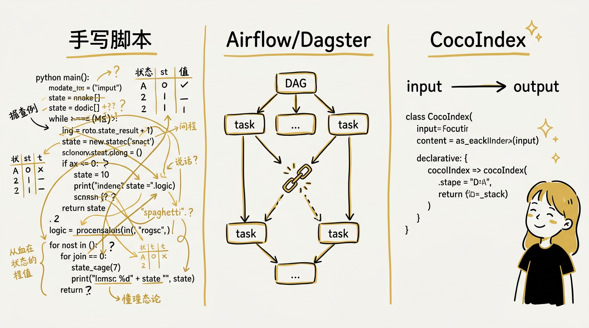
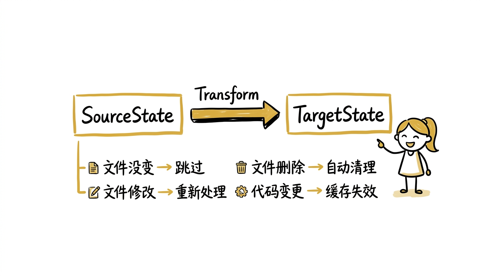
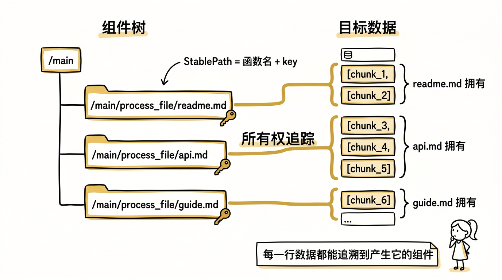
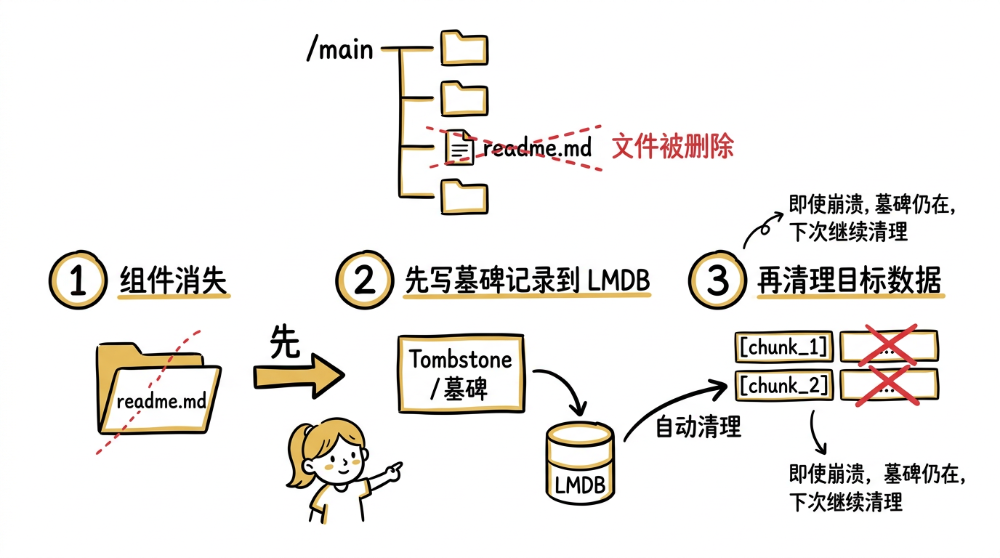
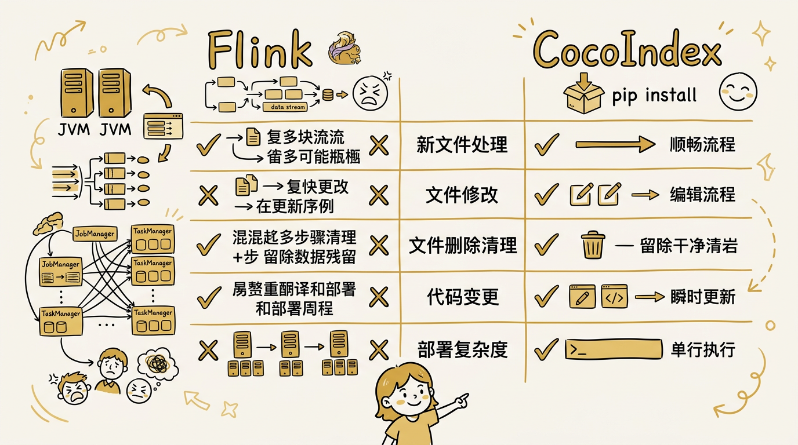

# 当 AI Agent 需要新鲜上下文：CocoIndex，一个声明式增量数据索引框架

## 从一个真实问题说起


假设你在一家中型技术公司工作，团队在搭一个面向客户的 Support Agent。公司的产品文档、FAQ、故障排查指南分散在 Confluence、Google Docs 和一个 Git 仓库里，总共几千篇，每周都在更新。客户的问题五花八门：用的是业务术语而不是技术关键词（"为什么我的订单消失了"而不是 `soft_delete`），涉及跨文档的上下文（计费规则在一篇文档里，退款流程在另一篇），有时候是模糊的概念性提问（"你们支持多租户吗"）。这种场景下 grep 和关键词搜索基本没用——用户的用词和文档里的术语对不上。

技术方案是 RAG：把所有文档分块（chunk），生成向量嵌入（embedding），存入向量数据库。客户提问时，用语义相似度检索最相关的块，拼入 LLM 的上下文窗口生成回答。

第一版很快就跑起来了。但问题马上来了。

产品文档不是静态的。新功能上线要加文档，旧功能下线要归档，故障排查指南随着事故复盘不断补充。每天有几十次更新。产品经理刚更新了退款政策，但 Agent 回答客户的还是上周的版本——因为索引是昨晚定时任务全量重建的。客户按照过时的步骤操作，发现不对，投诉升级。更糟的是，全量重建要处理几千篇文档，调用嵌入 API 花费不少钱和时间，你不敢跑太频繁。

好，你决定做增量更新。于是你开始在 Python 脚本里加逻辑：记录每个文件的 mtime，跟上一次比较，只处理变化的文件。听起来简单？接着你发现一篇已下线功能的文档被归档删除了，但它对应的 chunks 还留在向量数据库里，Agent 继续引用已经不存在的功能来回答客户——这些"幽灵数据"比没有数据更危险。你得追踪每个文件产生了哪些 chunks，删除文件时把对应的 chunks 也删掉。然后你发现，改了 chunk 大小之后，所有文件都应该重新分块——但 mtime 没变，你的增量逻辑跳过了它们。

于是你开始加版本号、加 hash、加状态数据库。一周之后你发现，你写的增量同步逻辑比你的业务逻辑还复杂，而且还有 bug。

这个问题不是你的能力问题。它是一个系统性的缺失：**当数据在持续变化，而你需要让下游的索引始终保持新鲜，谁来帮你管理这个"源 → 目标"的同步？**

传统的 ETL 工具（Airflow、Dagster）是面向批处理的——定时全量跑，每次重头来过。CDC 工具（Debezium）面向数据库行级变更，但它不理解你的应用逻辑——它不知道一篇文档变了之后，应该重新分块、重新嵌入、删除旧 chunks、插入新 chunks。自己写增量逻辑？那就是上面描述的痛苦。

CocoIndex 就是为了解决这个问题而生的。

---

## 一个最小的例子：感受差异



在展开 CocoIndex 的设计之前，先看一个最小任务：把一个目录下的 Markdown 文件分块、生成嵌入、存入 PostgreSQL（pgvector），并在文件变化时保持同步。

**手写 Python 脚本**的做法是：扫描目录，对每个文件读取内容，调用分块函数，对每个 chunk 调用嵌入模型，写入数据库。要做增量，你得自己维护一张状态表，记录每个文件的 hash 和它产生的 chunk IDs。文件修改时，查出旧 chunks 删除，插入新 chunks。文件删除时，查出并删除它的所有 chunks。代码改了 chunk 策略时……你的状态表不知道这件事，只能手动清库重跑。

**用 Airflow/Dagster** 好一些：你可以把分块、嵌入、写入定义成 DAG 的 task，加上调度和重试。但增量的核心问题没变——你仍然需要自己在 task 里写"哪些文件变了"的判断逻辑，仍然需要自己管理"文件删除时清理下游数据"的关联。DAG 管的是任务编排，不是数据同步。

**CocoIndex** 的写法是声明式的：

```python
@coco.fn(memo=True)
async def process_file(file, table):
    text = await file.read_text()
    for chunk in RecursiveSplitter().split(text, chunk_size=2000):
        table.declare_row(
            text=chunk.text,
            embedding=await embedder.embed(chunk.text),
        )

@coco.fn
async def main(sourcedir):
    table = await postgres.mount_table_target(PG, "docs")
    table.declare_vector_index(column="embedding")
    await coco.mount_each(process_file, localfs.walk_dir(sourcedir).items(), table)

coco.App(coco.AppConfig(name="docs"), main, sourcedir="./docs").update_blocking()
```

注意这段代码里**没有任何增量逻辑**。没有 mtime 比较，没有状态表，没有 "if changed then reprocess"。你只是声明了"每个文件应该产生哪些 chunks"，CocoIndex 引擎自动处理剩下的一切：

- 文件没变？`memo=True` 让函数直接跳过，不重新执行
- 文件修改了？只重新处理这个文件，旧 chunks 自动删除，新 chunks 自动插入
- 文件被删了？它的组件（component）不再存在，引擎自动清理它拥有的所有目标状态
- 代码改了（比如 chunk_size 从 2000 改成 1000）？函数的代码 hash 变了，memo 缓存失效，所有文件自动重新处理

三者的本质区别不在代码量，而在于**谁负责维护"源到目标"的一致性**。手写脚本和 DAG 工具把这个责任推给了开发者；CocoIndex 把它收进了引擎。你只需要声明"目标应该长什么样"，引擎负责让现实和声明保持一致。这就像 React 之于前端——你声明 UI 应该是什么状态，框架负责最小化地更新 DOM。

---

## What：CocoIndex 是什么

一句话：**CocoIndex 是一个声明式增量数据索引框架，让你用"声明目标状态"的方式构建数据管道，引擎自动处理增量同步、缓存失效和数据清理。**

它的核心主张印在项目首页上：**Your agents deserve fresh context.** 你的 AI Agent 值得拥有新鲜的上下文。

技术上，CocoIndex 是一个 Python API + Rust 引擎的混合体。用户面对的是 Python 的 async/await 接口，底层是一个由多个 Rust crate 构成的增量计算引擎，通过 PyO3 暴露 Python 绑定。Rust 层处理组件树管理、memo 指纹计算、状态持久化（LMDB）、目标状态协调（reconciliation）这些计算密集的核心逻辑；Python 层负责用户函数、连接器（connector）、嵌入模型调用这些需要灵活性的部分。

这个架构选择和我们之前分析过的 Daft 类似——计算密集用 Rust，灵活性留给 Python——但解决的问题完全不同。Daft 是一个查询引擎，优化的是"一次计算如何尽可能快"；CocoIndex 是一个索引框架，优化的是"连续多次计算之间如何尽可能少做"。

三个关键词定义了 CocoIndex 的独特性：

- **声明式**：你不写"如果文件变了就重新处理"的命令式逻辑，你只声明"每个文件应该产生什么目标数据"，引擎自动做 diff 和 reconciliation
- **增量**：通过 memo 指纹（hash(inputs) + hash(code)）和组件所有权追踪，只重新处理变化的数据，跳过不变的部分
- **全链路**：从源数据变更检测、函数级缓存、到目标状态的 create/update/delete，整条链路由引擎统一管理

---

## Why：传统方案哪里不够

### 批处理太慢、太贵

最朴素的做法是定时全量重建索引：每隔几小时扫描所有文件，重新分块，重新嵌入，重新写入。

这在数据量小的时候可以接受，但随着规模增长，成本曲线是陡峭的。假设你有 10000 个文档，每次全量重建需要调用嵌入模型处理所有 chunks——即使其中 99.9% 没有变化。如果你用的是付费嵌入 API（OpenAI、Cohere），每次全量重建的费用和延迟都是线性增长的。更关键的是延迟：全量重建可能需要几十分钟到几小时，这意味着你的 Agent 在这段时间里使用的是过时的上下文。

对于 AI Agent 来说，上下文的新鲜度直接影响决策质量。一个正在帮用户排查 bug 的 coding agent，如果它查到的代码索引还是两小时前的版本，它可能会基于已经被修复的代码给出错误的建议。

### 自建增量逻辑很脆弱

很多团队的第一反应是"加一层缓存"：记录每个文件的 hash，变了才重新处理。但真正的增量同步远比这复杂：

**删除问题**：文件被删除了，你怎么知道它在向量数据库里留下了哪些 chunks？你需要一张映射表，记录 `file → [chunk_ids]`。但如果你的分块逻辑变了（比如 chunk_size 从 2000 改成 1000），同一个文件产生的 chunk 数量变了，旧的映射关系就失效了。

**代码变更问题**：你改了嵌入模型从 `MiniLM` 换成 `BGE`，所有 chunks 都应该重新嵌入。但你的增量逻辑只看文件的 mtime 或 content hash——文件没变，它不会触发重新处理。你需要把"代码版本"也纳入缓存 key，但手动管理这个 key 极其容易遗漏。

**级联问题**：一个文件变了，它的 chunks 变了，但如果你还有一层"跨文件去重"或"跨文件关系图"，变化会沿着依赖链传播。手写这种级联失效逻辑几乎不可能正确。

这些问题不是 corner case——它们是任何认真做增量的系统都会遇到的核心难题。CocoIndex 把这些复杂度收进了框架。

### 现有工具解决的是不同的问题

**Airflow / Dagster** 是工作流编排工具。它们管的是"任务 A 完成后触发任务 B"，不管"任务 A 的输入数据有哪些行变了"。你可以在 Airflow 的 task 里写增量逻辑，但框架本身不会帮你。

**Debezium / CDC 工具** 解决的是"数据库行级变更捕获"。它们能告诉你数据库表里哪些行变了，但它们不理解你的应用逻辑。"一行文档变了"→"需要重新分块、重新嵌入、删除旧 chunks、插入新 chunks"这条链路，CDC 不管。

**LlamaIndex / LangChain** 提供了 RAG 的构建块（splitter、embedder、retriever），但它们本质上是库（library），不是框架（framework）。它们帮你做了一次性的 indexing，但不帮你管理"当源数据变化时，如何最小化更新索引"。

CocoIndex 填的是这个空白：**一个在应用逻辑层面理解"源 → 变换 → 目标"关系的增量同步引擎。**

---

## How：CocoIndex 怎么做到的

### 核心模型：TargetState = F(SourceState)



CocoIndex 的整个设计围绕一个等式：

```
TargetState = Transform(SourceState)
```

你的代码 `Transform` 是一个纯函数（或者说，一个可被 memo 的函数）——给定相同的输入，产生相同的输出。CocoIndex 引擎的职责是：当 `SourceState` 变化时，以最小的代价让 `TargetState` 重新等于 `Transform(SourceState)`。

这个模型的优雅之处在于，它把所有的增量复杂度从用户代码中移除了。用户只需要写那个 `Transform` 函数——声明目标应该长什么样——引擎负责 diff、cache、reconciliation。

### 组件树与所有权追踪



这是 CocoIndex 最核心的设计，也是它能"自动清理幽灵数据"的根本原因。为了讲清楚，先从用户代码出发，看看引擎在背后做了什么。

回到前面那个最小例子：

```python
@coco.fn(memo=True)
async def process_file(file, table):
    text = await file.read_text()
    for chunk in RecursiveSplitter().split(text, chunk_size=2000):
        table.declare_row(text=chunk.text, embedding=await embedder.embed(chunk.text))

@coco.fn
async def main(sourcedir):
    table = await postgres.mount_table_target(PG, "docs")
    await coco.mount_each(process_file, localfs.walk_dir(sourcedir).items(), table)
```

假设 `sourcedir` 下有三个文件：`readme.md`、`api.md`、`guide.md`。当你调用 `app.update_blocking()` 时，引擎内部发生了什么？

#### 第一步：构建组件树

每一个 `@coco.fn` 函数的调用都会创建一个**组件（Component）**。`mount_each` 对文件列表的每个元素调用 `process_file`，所以会创建三个子组件。每个组件有一个**稳定路径**（StablePath），由函数名 + 元素的 key 拼成：

```
/main                           ← main() 创建的根组件
├── /main/process_file/readme.md    ← mount_each 为 readme.md 创建的子组件
├── /main/process_file/api.md       ← mount_each 为 api.md 创建的子组件
└── /main/process_file/guide.md     ← mount_each 为 guide.md 创建的子组件
```

路径里的 key（`readme.md`、`api.md`）来自文件名，不是数组下标。这很重要：即使文件列表的顺序变了（比如新加了一个文件排在前面），每个文件对应的组件路径不变。这和 React 列表渲染时给每个元素加 `key` 是同一个思路。

#### 第二步：执行函数，记录"谁产生了什么"

每个子组件执行 `process_file` 函数。假设 `readme.md` 分成了 2 个 chunk，`api.md` 分成了 3 个 chunk，`guide.md` 分成了 1 个 chunk。每次调用 `table.declare_row(...)` 时，引擎在内部记录：**这一行是哪个组件声明的**。

执行完成后，引擎在 LMDB 中存储了一张所有权表，大概长这样：

```
组件路径                          拥有的目标状态（数据库行）
──────────────────────────────────────────────────────────
/main/process_file/readme.md  → [chunk_1, chunk_2]
/main/process_file/api.md     → [chunk_3, chunk_4, chunk_5]
/main/process_file/guide.md   → [chunk_6]
```

这张表就是所有权的核心——**每一行数据都能追溯到产生它的那个组件**。

#### 第三步：文件被删了，会发生什么？



现在用户删除了 `readme.md`。下一次 `app.update_blocking()` 时：

1. `main()` 重新执行，`mount_each` 遍历当前文件列表，只有 `api.md` 和 `guide.md` 了，**不再为 `readme.md` 创建子组件**。

2. 引擎比较"这次有哪些子组件"和"上次有哪些子组件"：

   ```
   上次：[readme.md, api.md, guide.md]
   这次：[api.md, guide.md]
   差异：readme.md 消失了
   ```

3. 引擎查所有权表，找到 `/main/process_file/readme.md` 拥有 `[chunk_1, chunk_2]`。

4. 引擎向 PostgreSQL 发送 `DELETE FROM docs WHERE id IN (chunk_1, chunk_2)`。

5. 清理所有权表中 `/main/process_file/readme.md` 的条目。

**整个过程中用户没有写任何删除逻辑。** 引擎的推理链条是：文件不存在了 → 组件不再被创建 → 组件拥有的数据应该被删除。这就是"所有权追踪"的全部含义。

#### 第四步：文件被修改了呢？

如果 `api.md` 被修改了（比如加了一段内容），流程是这样的：

1. `mount_each` 仍然为 `api.md` 创建子组件，路径还是 `/main/process_file/api.md`。
2. `memo=True` 检查发现文件内容的 hash 变了，缓存失效，`process_file` 重新执行。
3. 重新分块后，`api.md` 现在产生了 4 个 chunk（之前是 3 个）。函数声明了 `[chunk_3', chunk_4', chunk_5', chunk_7]`。
4. 引擎比较本次声明和上次存储的目标状态，做 diff：

   ```
   上次：[chunk_3, chunk_4, chunk_5]
   这次：[chunk_3', chunk_4', chunk_5', chunk_7]
   操作：UPDATE chunk_3→chunk_3', UPDATE chunk_4→chunk_4',
         UPDATE chunk_5→chunk_5', INSERT chunk_7
   ```

5. 所有权表更新为新的 chunk 列表。

而 `guide.md` 没变，memo 指纹匹配，`process_file` 根本不执行，它的 chunks 也不会被碰。

#### 为什么要用墓碑（Tombstone）？

上面第三步"删除 readme.md 的 chunks"描述的是理想情况。但如果删除到一半进程崩溃了怎么办？比如 chunk_1 已经删了，chunk_2 还没删。

CocoIndex 的做法是：发现组件消失后，**不立即执行删除，而是先写一条墓碑记录到 LMDB**。墓碑的意思是"这个组件需要被清理"。然后再根据墓碑执行实际的删除操作。如果删除中途崩溃，墓碑还在，下次重启时引擎会重新扫描墓碑，继续未完成的清理。

墓碑是整个机制的崩溃恢复安全网——确保不会因为进程崩溃而留下"删了一半"的脏数据。

### Memo 指纹：不只是输入 hash

CocoIndex 的缓存机制比简单的 "input hash → output" 更精细。当你在函数上标注 `@coco.fn(memo=True)` 时，引擎计算的 memo 指纹包含两部分：

1. **输入指纹**：函数参数的 hash
2. **代码指纹**：函数本身的 hash（通过 `logic_tracking` 机制）

这意味着：

- 文件内容没变 → 输入指纹不变 → 跳过执行（即使你重启了进程）
- 文件内容变了 → 输入指纹变了 → 重新执行
- 你改了 `chunk_size` 参数 → 代码指纹变了 → **所有文件重新执行**
- 你换了嵌入模型 → 嵌入模型注册为 `ContextKey` 且 `detect_change=True` → 相关指纹变化 → 重新嵌入

第三点尤其重要。传统的缓存只看输入数据，不看处理逻辑。你换了模型但数据没变，缓存命中，索引没更新——这是一个隐蔽的 bug。CocoIndex 通过把代码纳入指纹来避免这类问题。

指纹的持久化使用 LMDB——一个嵌入式键值数据库。LMDB 的特点是读性能极高（无锁，mmap），非常适合"频繁检查缓存是否命中"的场景。指纹以组件路径为 key 存储，即使进程重启，缓存依然有效。

### 目标状态协调（Reconciliation）

当一个组件执行完成后，它声明的目标状态需要和"上一次运行的目标状态"做对比，产生具体的数据库操作。这个过程叫 reconciliation：

```
本次声明的行          上次存储的行          操作
─────────────────────────────────────────────────
row(id=1, v="new")   row(id=1, v="old")   → UPDATE
row(id=2, v="hello") （不存在）             → INSERT
（不存在）            row(id=3, v="stale")  → DELETE
```

这个 diff 发生在引擎内部，不需要用户参与。用户的代码只有 `declare_row(...)`——声明"这一行应该存在且内容是这样的"。至于它是新增、修改还是不变，引擎自动判断。

Reconciliation 还支持**附件（Attachments）**的概念。比如 `table.declare_vector_index(column="embedding")` 声明了一个向量索引——这个索引是表的附件，当表的数据变化时，附件也会相应更新。

### 崩溃恢复：重启等于一次增量更新

一个自然的问题是：CocoIndex 进程挂了或者重启了怎么办？

答案是：**重启之后的行为和正常的增量更新完全一致，不需要任何特殊的恢复流程。** 这是因为所有关键状态都持久化在 LMDB 中：

- **Memo 指纹**在 LMDB 里 → 重启后引擎遍历所有组件，逐一检查指纹。文件没变的，指纹匹配，直接跳过；文件变了的，指纹不匹配，重新处理。和正常增量更新的逻辑完全一样。
- **所有权索引**在 LMDB 里 → 引擎知道哪些目标状态属于哪个组件，不会因为重启而丢失这层关系。
- **墓碑**在 LMDB 里 → 如果上一次运行中途崩溃，一个组件的删除操作只执行了一半（比如墓碑写入了但目标状态还没清理），重启后 GC 扫描会发现这个墓碑，继续执行未完成的清理。
- **StablePath 是内容派生的** → 同一个文件无论在哪次运行中，都会产生相同的组件路径，memo 缓存自然命中。

换句话说，CocoIndex 没有"冷启动"和"热运行"的区别。每次 `update()` 调用都是同一个流程：遍历组件树 → 检查指纹 → 跳过没变的 → 处理变了的 → reconcile 目标状态 → 清理墓碑。第一次运行是"全部都是新的"，重启后是"大部分都命中缓存"，逻辑路径完全相同。这种设计的好处是**没有额外的恢复代码路径**——恢复就是正常运行，不存在"恢复模式的 bug"这种东西。

### 上下文与资源管理

AI 管道中有些资源是全局共享的——数据库连接池、嵌入模型实例、配置参数。CocoIndex 用 `ContextKey[T]` 和 `@coco.lifespan` 来管理这些资源：

```python
PG_DB = coco.ContextKey[asyncpg.Pool]("db")
EMBEDDER = coco.ContextKey[SentenceTransformerEmbedder]("embedder", detect_change=True)

@coco.lifespan
async def setup(builder: coco.EnvironmentBuilder):
    async with asyncpg.create_pool(DATABASE_URL) as pool:
        builder.provide(PG_DB, pool)
        builder.provide(EMBEDDER, SentenceTransformerEmbedder("all-MiniLM-L6-v2"))
        yield
```

`detect_change=True` 是一个精妙的设计：它告诉引擎"这个资源的值会影响计算结果"。如果你把嵌入模型从 `MiniLM` 换成 `BGE`，`EMBEDDER` 的变化会被检测到，所有依赖它的组件的 memo 指纹会失效，触发重新计算。而数据库连接池 `PG_DB` 设为 `detect_change=False`（默认值），因为换一个数据库连接不应该导致重新嵌入。

### Live 模式：从批处理到持续同步

CocoIndex 不止于一次性的批处理。当源数据支持变更通知时（比如文件系统的 inotify、Kafka 的消费组），CocoIndex 可以进入 **Live 模式**——持续监听变化，增量更新。

```python
files = localfs.walk_dir(sourcedir, live=True)  # 声明源支持 live watch
```

```bash
cocoindex update -L main  # -L 启用 live 模式
```

在 Live 模式下，引擎不会在处理完所有文件后退出，而是保持运行，监听文件系统事件。当一个文件被修改时，只有对应的组件被重新执行，其他组件的缓存不受影响。这让你的索引可以在亚秒级别保持新鲜。

### Rust 引擎：为什么不是纯 Python

CocoIndex 的增量逻辑——指纹计算、组件树遍历、状态存储、reconciliation——全部在 Rust 层实现。这不是"用 Rust 重写就更快"的教条，而是有具体的技术原因：

**指纹计算是热路径**。每次运行时，引擎需要对所有组件计算 memo 指纹来决定是否跳过。这涉及大量的 hash 计算（blake2）和 LMDB 查询。在 10000 个文件的场景下，纯 Python 实现的开销可能比实际的数据处理还大，抵消了增量的收益。

**组件树管理需要精确的内存控制**。组件树用弱引用（weak reference）追踪子组件的存活状态，用 RAII 管理组件的生命周期——组件被 drop 时自动触发清理。这些模式在 Rust 中是零成本的，在 Python 中则依赖 GC 和 `__del__`，不可靠且有性能开销。

项目的 benchmark 数据印证了这一点：在 10000+ 文件的语料库上，Rust 引擎比纯 Python 实现快 **30-80 倍**。CPU 密集型工作负载（指纹计算、状态对比）的加速比高达 80 倍，I/O 密集型工作负载（文件读取、数据库写入）也有 17-23 倍的提升。

### 连接器生态：不止向量数据库

CocoIndex 的目标状态不限于向量数据库。它提供了 17+ 种连接器，覆盖了 AI 应用常见的后端：

| 类别 | 连接器 |
|------|--------|
| 关系数据库 | PostgreSQL、SQLite、Doris |
| 向量数据库 | pgvector、Qdrant、LanceDB、Turbopuffer |
| 图数据库 | Neo4j、FalkorDB、SurrealDB |
| 消息队列 | Kafka、Apache Iggy |
| 对象存储 | Amazon S3、Google Drive、OCI Object Storage |
| 本地文件 | localfs（支持 watch） |

这意味着你可以用同一个声明式模型构建不同类型的索引：向量搜索索引、知识图谱、全文搜索表、甚至 Kafka 消息流——增量同步的逻辑对所有后端都是一样的。

---

## 什么时候用 CocoIndex，什么时候不用

**适合的场景**：

- 你在构建 RAG 应用，需要让知识库索引随源数据保持同步
- 你的源数据持续变化（代码仓库、文档库、Slack、邮件），不想每次全量重建
- 你的数据管道涉及昂贵的操作（嵌入生成、LLM 调用），希望只在必要时执行
- 你需要同时维护多种目标（向量数据库 + 知识图谱 + 搜索索引），希望它们保持一致
- 你需要 Live 模式，让索引在亚秒级别保持新鲜

**不适合的场景**：

- 一次性的数据分析或探索（你只需要跑一次，不需要增量）——直接用 Pandas / Polars
- 大规模的多模态数据批处理（百万张图片的分类、转码）——Daft 或 Ray Data 更合适，它们的执行引擎针对吞吐量优化
- 纯实时流处理（毫秒级延迟的事件处理）——Flink / Kafka Streams 更合适
- 简单的 CRUD 同步（数据库表到表的复制）——CDC 工具（Debezium）更直接

一个有趣的对比：**Daft 和 CocoIndex 解决的是数据管道的两个不同维度的问题**。Daft 优化的是单次执行的效率——如何让一次全量处理尽可能快（流水线并行、资源隔离、filter 下推）。CocoIndex 优化的是多次执行之间的效率——如何让连续的增量更新尽可能少做（memo 缓存、组件所有权、reconciliation）。它们不冲突，甚至可以互补——你可以在 CocoIndex 的处理函数里使用 Daft 来高效处理每一批数据。

---

## 为什么不用 Flink



这是一个值得认真回答的问题。Flink 也在做"数据变了 → 更新下游"的事情，而且它是一个久经生产验证的系统。CocoIndex 做的事情，Flink 能不能做？

**技术上可以，但你会一直在和框架的设计意图对着干。**

Flink 的核心抽象是**事件流上的有状态计算**——无限的事件序列，每条事件触发一次算子执行，状态在 checkpoint 中持久化。CocoIndex 的核心抽象是**源到目标的声明式同步**——有限但持续变化的数据集，声明目标应该长什么样，引擎负责 diff 和 reconciliation。

这两个抽象层次的差异，在以下几个具体场景中会变得非常明显：

### 文件修改

Flink 的 `FileSource` 是面向"新文件出现"设计的（append-only 语义）。一个文件被修改了，`FileSource` 默认不会重新读取它。你需要自己写 Custom Source，定期扫描文件的 mtime 或 content hash，发现变化后重新发出整个文件内容。这不是不行，但你已经在 Flink 里重新造一个文件变更检测系统了。

CocoIndex 的 `localfs.walk_dir(live=True)` 原生支持文件修改检测，配合 `memo=True`，只有内容真正变化的文件才会触发重新处理。

### 文件删除 → 清理下游

这是最拧巴的地方。假设文件 A 之前产生了 5 个 chunks 写入了向量数据库，现在文件 A 被删除了。

在 Flink 里，你需要：

1. 自己检测文件被删了——`FileSource` 不管删除事件，你得自己写扫描逻辑
2. 在 Keyed State 里查出文件 A 对应哪 5 个 chunk ID——你得自己维护这个映射
3. 对每个 chunk 发一条 retraction / DELETE 事件到下游
4. 下游 sink 收到 DELETE 事件后执行数据库删除——你得在 sink 里写处理删除的逻辑

每一步都要你自己写。而在 CocoIndex 里，文件对应的组件不再被 mount，它"拥有"的目标状态自动被清理。零行代码。

### 代码逻辑变更

你把 `chunk_size` 从 2000 改成 1000。在 Flink 里：

- 停掉 job
- 判断是否能从 savepoint 恢复（大概率不行，因为算子逻辑变了，state schema 可能不兼容）
- 清空下游数据库
- 从头重跑整个 job

Flink 的 state 是为**运行时连续性**设计的（checkpoint、savepoint），不是为**逻辑变更后的缓存失效**设计的。CocoIndex 的 code hash 让这变成一件自动的事——逻辑变了，指纹变了，缓存失效，只重新处理需要的部分。

### 操作成本

为了"监听 5000 个文件，增量更新向量数据库"这个需求，Flink 需要一个 JVM 集群（JobManager + TaskManager，至少也得一个 standalone 进程）。CocoIndex 是 `pip install cocoindex` + 一个 Python 进程。

### 总结

| 场景 | Flink | CocoIndex |
|------|-------|-----------|
| 新文件出现 → 处理 | 原生支持 | 原生支持 |
| 文件修改 → 重新处理 | 自己写 Custom Source | 自动（memo 失效） |
| 文件删除 → 清理下游 | 自己写 retraction 链路 | 自动（所有权清理） |
| 代码逻辑变了 → 重新计算 | 停 job、清数据、重跑 | 自动（code hash 失效） |
| 部署复杂度 | JVM 集群 | pip install + 单进程 |

Flink 的强项在别处：高吞吐的事件流处理、毫秒级延迟的实时计算、复杂的窗口聚合和流式 JOIN。这些 CocoIndex 做不了。但在"持续变化的数据集 → 保持下游索引新鲜"这个特定问题上，Flink 的抽象层次太低了——你要手动实现的增量逻辑，比你的业务逻辑还多。

---

## 回到开头

几千篇产品文档，每天几十次更新，Support Agent 的索引需要保持新鲜——这个问题的本质是"源到目标"的持续同步。

CocoIndex 做的事情，是把这个同步逻辑从你的代码中抽走：组件所有权让你不用写清理逻辑，memo 指纹让你不用写缓存逻辑，代码 hash 让你不用担心逻辑变更后缓存过期，reconciliation 让你不用写 INSERT/UPDATE/DELETE 判断，Live 模式让你不用写文件监听和增量触发。

你只需要声明"每个文件应该产生什么数据"，其余的交给引擎。

这就是 CocoIndex 的核心主张：**索引管道不应该比业务逻辑更难写。** 或者用它自己的话说——**Your agents deserve fresh context.**

前端开发者花了十年时间，从手动操作 DOM 走到了 React 的声明式模型。数据管道正在经历类似的演进：从手写增量逻辑，到声明目标状态。CocoIndex 是这条路上的一个值得关注的尝试。

---

## Takeaway

1. **增量的核心难题不是"检测变化"，而是"清理过时数据"。** 检测哪些文件变了（比对 mtime / hash）相对简单。真正难的是：文件删了，它下游产生的 chunks 怎么找到并删掉？代码逻辑改了，哪些缓存该失效？这些关联关系的维护才是手写增量逻辑最容易出 bug 的地方。CocoIndex 用组件所有权追踪解决了前者，用 code hash 纳入 memo 指纹解决了后者。

2. **"声明目标状态"和"编写同步逻辑"是两种本质不同的编程模型。** 前者只说"结果应该是什么样"，后者要说"如果 A 变了就做 X，如果 B 删了就做 Y，如果代码改了就做 Z"。后者的分支数量随场景复杂度指数增长。CocoIndex 的价值在于让你只写前者，把后者收进框架。这和 React（声明 UI 状态 vs 手动操作 DOM）、SQL（声明查询意图 vs 手写遍历逻辑）是同一个演进方向。

