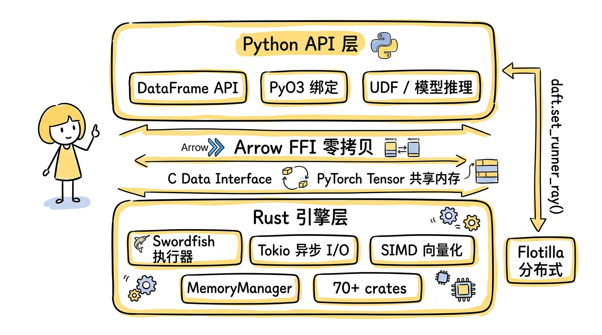
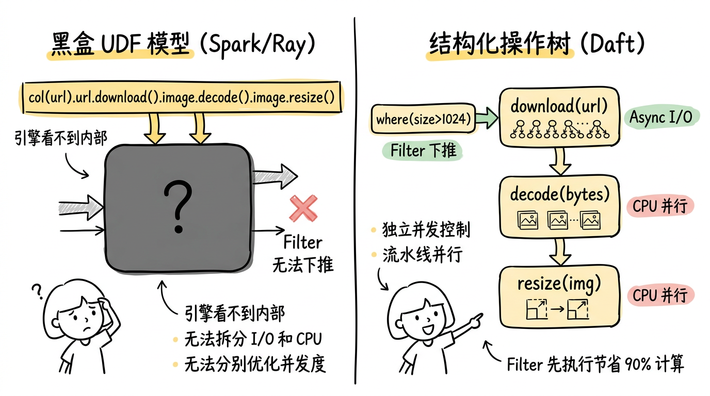
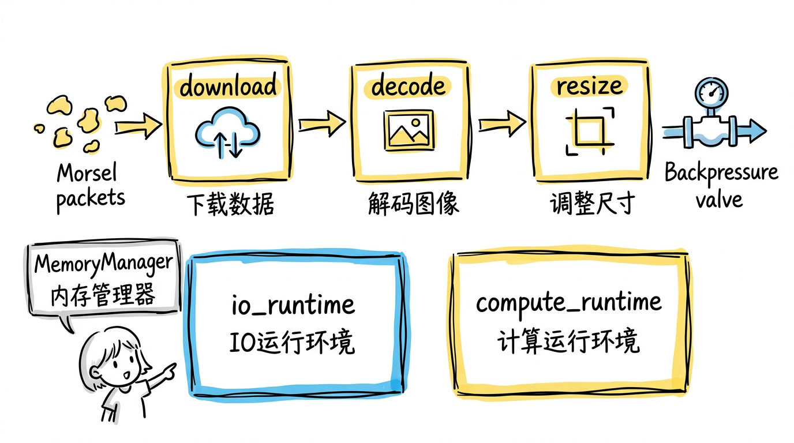
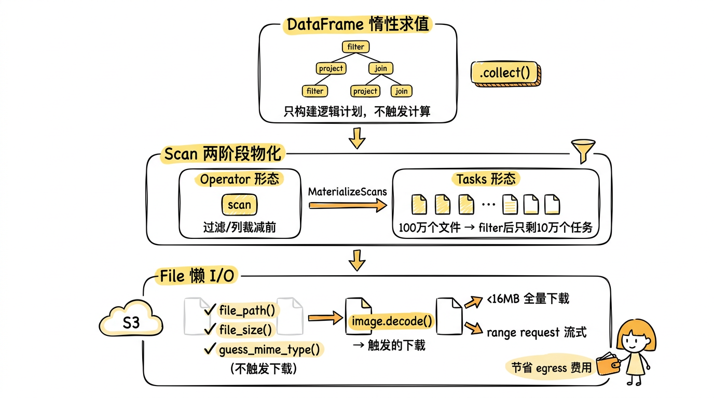
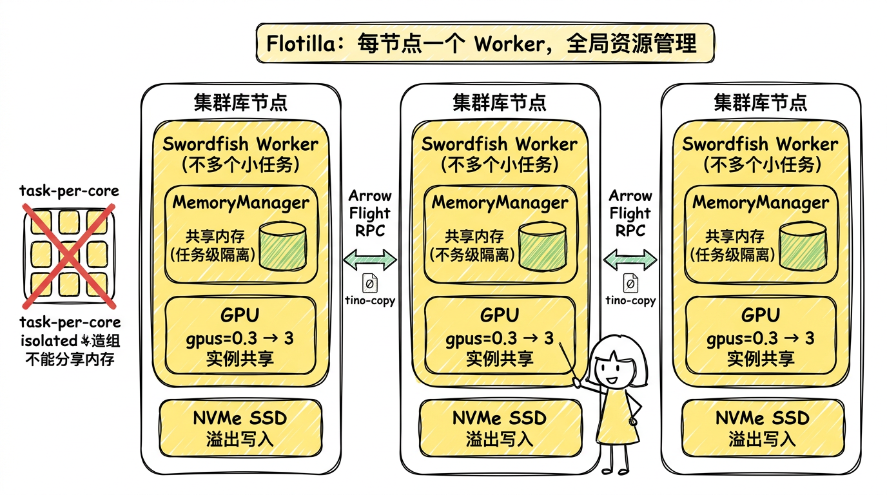

# 当 AI 遇上数据管道：Daft，一个多模态时代的数据引擎

## 从一个真实问题说起

假设你在一家 AI 公司工作。你的日常可能是这样的：从 S3 上拉取 100 万张图片做去重和清洗，为训练数据集构建嵌入索引；或者拿 10 万份 PDF 做 OCR 提取，灌进 RAG 管道；又或者对一批音频文件跑 Whisper 转录，再用 LLM 做摘要。

这些任务有一个共同点：数据不是整齐的表格，而是图片、音频、视频、PDF 这些"非结构化"格式；处理过程不是简单的 filter 和聚合，而是下载、解码、模型推理、嵌入生成的混合体；规模从笔记本上的 1000 条原型到生产环境的数十亿条。

用 Pandas？10 万张图就 OOM 了。用 Spark？JVM 启动慢，UDF 里的 PyTorch 模型和 JVM 进程之间来回序列化，效率极低。自己写 Python 脚本？可以，但你得手动管 batch 大小、并发数、内存上限、GPU 分配、断点续传……写到最后，你发现你在造一个分布式调度框架。

这个问题不是你的问题。它是工具的问题。

过去十年，数据引擎的演进——从 MapReduce 到 Spark 到 Polars——一直围绕着一个核心假设：**数据是表格**。行和列，数字和字符串，聚合和 JOIN。这些引擎为这类工作负载做了极致的优化。

但 AI 时代的数据管道长得不一样。它的输入是图片、音频、PDF，它的核心操作是下载、解码、嵌入、推理、去重，它的规模跨越笔记本和集群。传统工具的假设不成立了。

Daft 就是为了解决这个问题而生的。

---

## 一个最小的例子：感受差异

在展开 Daft 的设计之前，先用一个最小的任务来直观感受三种工具的区别：从 S3 上读取一批图片 URL，下载图片，解码后做 resize，写回 Parquet。

**PySpark** 的写法大致是这样的：你需要定义一个 UDF，在 UDF 里用 `requests` 下载、用 `PIL` 解码和 resize，然后把结果序列化成字节数组返回。Spark 引擎看到的是一个黑盒 Python 函数——它不知道里面有网络 I/O，不知道有 CPU 密集的图像解码，更不知道 resize 之后的图片已经是统一尺寸。它只能以 JVM 的分区粒度把整个函数丢给 Python worker 执行，数据在 JVM 和 Python 之间来回序列化。

**Ray Data** 好一些：它是 Python 原生的，没有 JVM 序列化开销。你可以用 `map_batches` 写一个批处理函数来完成同样的事。但问题是类似的——引擎看到的仍然是一个用户函数，它不理解函数内部的结构。你需要自己决定 batch size，自己管理并发数，自己处理 OOM。如果你想让下载和解码并行，你得自己用 `asyncio` 或线程池来实现。

**Daft** 的写法是声明式的：`col("url").url.download().image.decode().image.resize(224, 224)`。这不是语法糖——这行表达式会被解析成一棵表达式树，优化器看得见每一步操作的语义。它会自动把 `url.download()`（I/O 密集，异步）和 `image.decode()`（CPU 密集，同步）拆成独立的 pipeline stage；自动把 `image.resize()` 的结果提升为连续内存的 `FixedShapeImage`；自动让 I/O 和 CPU 在不同的线程池上重叠执行。你不需要写任何并发代码。

三者的本质区别不在语法繁简，而在于**引擎能看见多少**。Spark 和 Ray Data 看到的是一个黑盒函数，只能整体调度；Daft 看到的是一棵结构化的操作树，可以拆分、重排、分别优化。这就像手写 `for` 循环做 join 和让 SQL 引擎优化 `JOIN` 的区别——不是写法问题，是抽象层次的差距。

---

## What：Daft 是什么

一句话：**Daft 是第一个把多模态数据操作——下载、解码、嵌入、推理——当作可优化的查询算子来处理的 DataFrame 引擎。**

它不是又一个 Pandas 替代品。Polars 和 DuckDB 已经把"表格数据的单机分析"做到了极致，Daft 无意在这个赛道上竞争。它瞄准的是一个不同的问题：**当你的数据不只是行和列，你的操作不只是 SELECT 和 GROUP BY，而是 download、decode、embed、classify、deduplicate 的时候，谁来帮你高效地跑？**

技术上，Daft 是一个 Python API + Rust 引擎的混合体。用户面对的是熟悉的 DataFrame 接口，底层是约 70 个 Rust crate 构成的执行引擎，通过 PyO3 暴露 Python 绑定，通过 Apache Arrow FFI 实现 Rust 和 Python 之间的零拷贝数据交换。不需要 JVM，不需要 Scala，`pip install daft` 就能用。

这里的架构选择值得展开说一下。Spark 选择了 JVM 作为运行时，获得了成熟的分布式生态，但也背上了 GC 停顿和 Python ↔ JVM 序列化的包袱——每次 UDF 调用都要把数据从 JVM 搬到 Python 进程再搬回来。Polars 选择了纯 Rust，性能极好但锁死在单机。Daft 走了一条中间路线：**计算密集的部分用 Rust（SIMD 向量化、Tokio 异步 I/O），灵活性需要的部分留给 Python（UDF、模型推理），两者之间用 Arrow 的 C Data Interface 做零拷贝桥接**。这意味着一个 PyTorch 张量和 Daft 的内部数据结构可以共享同一块内存，没有序列化开销。



*图：Daft 的混合架构 —— Python API 通过 Arrow FFI 与 Rust 引擎零拷贝交互，计算密集逻辑在 Rust 层执行，灵活性留给 Python。*

三个关键词定义了 Daft 的独特性：

- **多模态**：Image、Embedding、Tensor、File 是 Daft 类型系统里的一等公民，不是用 Python 对象塞进 object 列的 hack
- **流式执行**：数据不需要全量载入内存，而是以小批次在 pipeline 里流动
- **笔记本到集群**：同一份代码，一行 `daft.set_runner_ray()` 切换到分布式

---

## Why：传统工具哪里不够

### 引擎看不见 AI 操作

在 Spark 或 Polars 里，当你写一个 UDF 把 URL 下载成图片再跑模型，引擎看到的只是一个黑盒函数。它不知道这个函数里有网络 I/O，有 CPU 密集的图像解码，有 GPU 密集的模型推理。它没法分别控制这三步的并发度，没法在 I/O 等待时去做 CPU 计算，更没法在 filter 掉一行之后跳过对它的下载和推理。

这不是小问题。AI 管道的成本结构和传统 ETL 完全不同：一次 GPU 推理的开销可能是一次 filter 的 1000 倍。如果你的 filter 能淘汰 90% 的行，但引擎因为看不懂你的 UDF 而把推理放在了 filter 前面，你就白白浪费了 90% 的 GPU 算力。

Daft 的做法完全不同。它的查询优化器**理解** AI 操作的语义。

想象一下 SQL 引擎怎么处理 `SELECT * FROM t WHERE id > 100 JOIN ...`——它知道先 filter 再 JOIN 更高效，因为它理解这两个操作的语义和代价模型。Daft 对 AI 操作做了同样的事。它的函数系统区分了两种函数类型：同步的 `ScalarUDF`（如 image_decode，CPU 密集）和异步的 `AsyncScalarUDF`（如 url_download，I/O 密集）。异步函数还会声明自己的最优 batch size（比如"我一次并发 64 个连接最高效"），优化器据此把一个大投影拆成多个独立的 pipeline stage，每个 stage 有独立的并发度和资源分配。

举个具体的例子。用户写了这样一行表达式：

```python
col("url").url.download().image.decode().image.resize(224, 224)
```

在 Spark 或 Ray Data 里，这会被当成一个整体的黑盒函数执行——引擎给你一行 URL，你还回来一张处理好的图片，中间发生了什么引擎完全不知道。但 Daft 的优化器会把它拆成三个独立的投影节点：

```
用户写的：  Project(resize(decode(download(url))))

优化器拆成：
  Project₃: resize(decoded_img)          ← CPU 密集，Rayon 多核并行
    ↑
  Project₂: decode(raw_bytes)            ← CPU 密集，batch size 大一些更高效
    ↑
  Project₁: download(url)                ← I/O 密集，64 个异步并发连接
    ↑
  Scan: 读取 URL 列表
```

拆分之后，每个 stage 是一个独立的 pipeline 节点，有自己的并发策略：`download` 用异步 I/O 跑 64 个并发连接，不占 CPU；`decode` 和 `resize` 用 Rayon 线程池做多核并行，不等网络。三个 stage 通过异步 channel 串联，**同一时刻 stage 1 在下载第 N+2 批，stage 2 在解码第 N+1 批，stage 3 在 resize 第 N 批**——这就是流水线并行。



*图：传统引擎把下载-解码-resize 当成一个黑盒 UDF 整体调度；Daft 的优化器将其拆分为独立的 pipeline stage，分别控制 I/O 和 CPU 并发，还能把 filter 下推到 download 之前。*

如果你在前面加了一个 `where(col("size") > 1024)`，优化器还会进一步把这个 filter 推到 `download` 之前。最终只有通过 filter 的行才会触发网络请求。这种优化在黑盒 UDF 模型下是做不到的——引擎看不见 UDF 内部的 download 操作，自然也无法把 filter 推到它前面。

更关键的是，由于这些操作不再是黑盒，优化器可以做传统 filter pushdown：如果你的管道里有一个 filter，Daft 会确保 filter 先执行，只有通过的行才会触发后续的下载和推理。在大规模场景下，这意味着你可能只需要处理 10% 的数据，另外 90% 连一次网络请求都不会发。

### 数据不再只是表格

打开 Pandas 的 dtype 列表，你会看到 int64、float32、string、datetime……但没有 Image，没有 Embedding，没有 Tensor。这不是 Pandas 的疏忽——它设计的时候，数据就是表格。

但今天的 AI 管道里，一行数据可能是一张图片、一段音频、一个 PDF。你需要对图片做 resize，对音频做重采样，对 PDF 做 OCR。用传统工具，你只能把这些东西塞进 Python object 列，引擎完全帮不上忙——不知道每行有多大、不知道怎么序列化、不知道怎么做向量化操作。

Daft 的类型系统原生支持这些数据类型。这不是语法糖——它深刻地影响了物理存储层的设计。

以图片为例。Daft 有两种图片类型：`Image`（变形，每张图尺寸可能不同）和 `FixedShapeImage`（定形，所有图一样大）。当你对一批图片做 `resize(224, 224)` 时，如果指定了目标模式（比如 RGB），Daft 会自动将存储格式从 `Image` 提升为 `FixedShapeImage`。这不只是类型标注的变化——物理上，数据从"每张图一个变长 buffer + 独立的宽高通道元数据"变成了"一整块连续内存的 FixedSizeList"。这带来了三个好处：后续图像操作的缓存局部性更好；查询高度/宽度/通道数变成 O(1) 的元数据操作而不是逐行扫描；最重要的是，**转成 PyTorch Tensor 是零拷贝的**——内存布局已经就是 Tensor 需要的 (H, W, C) 排列方式。

在图像的内存管理上，Daft 还做了一个精巧的设计：CowImage，即 Copy-on-Write 图像缓冲区。当图像从 Arrow buffer 中读出时，CowImage 直接借用（borrow）底层内存，不做任何拷贝。只有当操作确实需要修改像素数据（比如 resize 或 crop）时，才会触发一次复制。这意味着"读取 → 传递 → 过滤"这条路径上的图像数据可以完全零拷贝地流过管道，只有真正需要变换的那些行才会分配新内存。

### 规模跨度太大

数据科学家的日常是这样的：先在笔记本上拿 1000 条数据验证想法，确认可行后放到生产环境跑 1 亿条。这两个阶段之间，传统工具要求你换一套技术栈——从 Pandas 换到 Spark，从本地文件换到 HDFS，从 Python 脚本换到 Airflow DAG。

Polars 和 DuckDB 在单机上很快，但它们就是单机。Spark 能分布式，但你得搭集群、配资源、忍受 PySpark 的序列化开销。

Daft 的答案是：同一份代码，换一行配置就能从笔记本扩展到集群。不是"API 兼容"的那种——是字面意义上的同一份 .py 文件。这背后是一个统一的逻辑计划层：用户写的所有 DataFrame 操作先构建成一棵逻辑计划树，经过优化器处理后，交给 Runner 接口执行。NativeRunner 在本地跑 Swordfish 引擎，RayRunner 在集群上跑 Flotilla 调度器，但它们共享同一棵优化后的逻辑计划。

---

## How：Daft 怎么做到的

### 流式执行引擎 Swordfish：Push 模型 vs Pull 模型



*图：Swordfish 采用 push-based morsel-driven 模型，I/O 操作和 CPU 操作在独立的 Tokio runtime 上执行，通过异步 channel 串联形成流水线并行，配合 MemoryManager 的 permit 机制实现全局背压。*

传统引擎（包括早期的 Daft 自身）的执行模型是 Volcano 式的 pull：下游算子向上游"拉"数据，一个阶段全部处理完、物化到内存或磁盘，再拉下一个阶段的数据。这对分析查询足够了，但对 AI 管道是灾难——图片解码后体积膨胀几十倍，如果一个阶段全部物化，内存直接爆炸。

Swordfish 选择了 push-based 的 morsel-driven 模型。"Morsel"是数据的最小调度单位（默认 128K 行），source 算子主动把 morsel 推给下游，下游处理完再推给更下游。算子之间用 Tokio 的异步 MPSC channel 连接，每个算子是一个独立的 async task。

这个设计的关键在于 `tokio::select!` 宏——每个算子的事件循环同时监听两件事：上游 channel 是否有新数据到达，以及自己的计算任务是否完成。哪个先就绪就先处理。这让 I/O 和 CPU 的重叠不是通过额外的线程管理实现的，而是 Rust async 运行时天然提供的。

更进一步，I/O 操作和 CPU 操作在不同的 Tokio runtime 上执行——`io_runtime` 专门处理网络请求和磁盘读写，`compute_runtime` 专门处理向量化计算和图像解码。两个线程池物理隔离，互不争抢。这意味着即使 100 个并发下载请求把 I/O 线程池打满，也不会影响 CPU 线程池上正在运行的图像解码任务。

背压是整个流式模型的安全阀。当下游算子变慢（比如 GPU 推理成了瓶颈），它消费 channel 的速度下降，channel buffer 逐渐填满，上游算子在 `send().await` 上自然阻塞。但 Daft 的背压不止于此——`MemoryManager` 实现了一个基于 permit 的内存分配协议：每个算子在分配内存前必须申请 permit，permit 不足时异步等待。permit 用 RAII 管理，算子完成后自动释放并唤醒等待者。这意味着即使所有 channel 都没满，如果系统总内存接近上限，新任务也会被暂停。这是一种**全局的、协作式的内存安全**，不依赖操作系统的 OOM killer。

这个流式模型还催生了一个自然的扩展：**Dynamic Batching**（动态批次）。不同操作对 batch size 的最优值截然不同——图片解码希望大 batch 来摊平 Rayon 线程池的调度开销，而 url_download 希望小 batch 来控制并发连接数。Daft 的执行引擎允许每个算子声明自己偏好的 batch size，运行时根据内存压力和操作类型自动调整，用户无需手动调参。

一个值得一提的细节：Daft 团队在开发过程中发现，batch size 不是越大越好。v0.7.5 引入了一个回退——流式 Parquet reader 把小 batch 拼成了约 500K 行的大 batch，结果聚合查询反而慢了 2.7 倍。根因是超出了 AMD EPYC 处理器的 512KB L2 缓存。修复后保持 batch 在 L2 缓存友好的范围内，性能才恢复。这说明 Daft 的优化不只停留在"用 Rust 重写"的层面——它在 CPU 微架构级别做了对齐。

Swordfish 的效果有多明显？Daft 团队的一个观测性博客记录了一个真实案例：把一个单体 Python UDF（内含下载、解码、裁剪、resize、推理五步操作）拆成 Daft 原生表达式后，性能从 60 秒降到 24 秒——3 倍加速，而且不是因为算法变了，纯粹是因为引擎能看见每一步并分别调度了。

### AI 感知的查询优化器：不是传统的规则引擎

Daft 的优化器是一个多阶段的规则引擎，但它和传统数据库的优化器有一个本质区别：**它感知 AI 操作的异构特性**。

传统优化器处理的算子——filter、project、join、aggregate——在计算代价上是相对均匀的，都是 CPU 密集的向量化操作。但 AI 管道里的算子代价差异巨大：一个 `url_download` 可能需要 100ms 的网络等待，一个 `image_decode` 需要 1ms 的 CPU 计算，一个 LLM 推理需要 500ms 的 GPU 时间。如果把它们混在一个投影里执行，引擎没法分别控制它们的资源分配。

Daft 的解法是一组叫 `SplitUDFs` 和 `SplitGranularProjection` 的优化规则。它们在逻辑计划层面把一个包含多种操作的投影节点拆成多个独立节点，每个节点对应一种资源特征。拆分的依据是函数的类型标记：实现了 `AsyncScalarUDF` trait 的函数（如 url_download）被隔离到异步执行节点，这些函数会声明自己的 `preferred_batch_size`（典型值是最大连接数 × 批次系数），优化器据此控制每个 stage 的并发度。

这组规则被故意安排在优化流水线的后期——先让传统的 filter pushdown、projection pushdown 做完它们的工作，再拆分 UDF。这个顺序至关重要：如果先拆分再下推，UDF 节点会干扰 filter 的下推路径，导致过滤操作无法到达 scan 层。先下推再拆分，则确保了**filter 被推到最底部 → 数据量最小化 → UDF 只在存活行上执行**这个最优顺序。

优化器还有一个针对 LLM 推理的专属优化：`SplitVLLM`。当检测到管道中使用了 vLLM 推理时，优化器会把推理操作提取成专门的 `VLLMProject` 节点，启用 Dynamic Prefix Bucketing——把共享相同 system prompt 前缀的请求分到同一 batch，复用 KV cache，使 LLM 批推理时间减半。这种优化只有在引擎层面才能做到——用户写的 UDF 看不到跨行的 prompt 结构。

值得一提的是，Daft 在传统分析查询上也没有放松。比如 Parquet 文件读取在 v0.7.5 实现了行组级别的并行——一个大 Parquet 文件不再整体串行读取，而是把内部的行组拆开，多个行组同时读、同时解码，这一项优化就带来了 5 倍加速。Daft 的野心不只是多模态——它想在所有工作负载上都做到一流。

### 全链路懒加载：从 DataFrame 到文件系统



*图：Daft 的三层懒加载 —— DataFrame 层面惰性构建逻辑计划，Scan 层面在 filter/projection pushdown 后才物化为最小化扫描任务，File 层面仅在真正需要内容时才触发下载，小于 16MB 全量下载，大文件流式 range request。*

Daft 对"延迟执行"的理解比大多数框架更彻底。它不只是 DataFrame 层面的懒求值（调用 `.collect()` 才触发计算），而是从 API 层到文件系统层的全链路设计。

最上层是 DataFrame 的惰性求值：所有操作只构建逻辑计划树，不触发计算。

中间层是 Scan 的两阶段物化。Daft 的 `ScanState` 有两种形态：`Operator`（只有一个扫描算子的定义）和 `Tasks`（具体的扫描任务列表）。优化器的 `MaterializeScans` 规则被故意安排在所有 filter/projection pushdown 之后执行。这意味着：先把过滤条件推到 scan 层，先裁掉不需要的列，最后才生成最小化的具体扫描任务。如果你 100 万个文件里只有 10 万个通过了 filter，那 Daft 只会生成 10 万个扫描任务，而不是 100 万个。

最底层是 `daft.File` 类型的懒 I/O。当你用 `daft.from_files("s3://bucket/images/")` 读入 100 万个文件时，Daft 不会下载任何一个文件。它创建的只是一组轻量引用。你可以用 `file_path()`、`file_size()`、`guess_mime_type()` 做元数据过滤——这些操作不触发真正的 I/O。其中 `guess_mime_type()` 的实现特别有意思：它不看文件扩展名（不可靠），而是读文件头几个字节的 magic bytes 来判断类型，只需要一次极小的 range request。

只有当你真正需要文件内容时（比如调用 `image.decode()`），Daft 才会去下载。而且下载策略也是自适应的：小于 16MB 的文件全量下载到内存，大文件用 HTTP range request 流式读取，通过 `BufReader` 按需获取数据块。

这三层懒加载串联起来的效果是：在大规模场景下，S3 的 egress 流量（也就是你的钱）只花在了真正需要的数据上。

### 分布式架构 Flotilla：为什么不是一个 core 一个 task



*图：Flotilla 每个节点运行一个 Swordfish worker，由 worker 统一管理整台机器的内存和 GPU 资源，支持动态分配和共享，而非 task-per-core 的静态切分。节点间通过 Arrow Flight RPC 零拷贝交换数据。*

当数据量超过单机极限时，Daft 可以通过 Ray 扩展到集群。但它的分布式架构（代号 Flotilla）做了一个和 Ray Data 截然不同的设计选择：**每个节点只运行一个 Swordfish worker，而不是每个 core 一个 task。**

这个决策的背景是多模态数据的特性。表格数据里，每行大小基本一致——一行可能几百字节，可预测。但多模态数据完全不是：一张缩略图几 KB，一张 4K 原图几十 MB，一段视频几百 MB。在 Ray 的 task-per-core 模型下，每个 task 独立管内存，一个 task 分到几张大图就可能 OOM，同时同节点其他 task 的内存大量空闲。task 之间无法借用彼此的内存。

Flotilla 的解法是：一个节点一个 worker，由 worker 统一管理整台机器的所有资源。Swordfish 引擎的 `MemoryManager` 在节点级别做全局的内存分配——不是 task 级别的。这意味着一个正在做图像解码的操作和一个正在做模型推理的操作可以共享同一台机器的内存池，按实际需求动态分配，而不是提前静态切分。

GPU 资源也是同理。声明 `gpus=0.3` 意味着一块 GPU 上可以运行 3 个推理实例，由 worker 级别的调度器控制并发。这比 Ray 的"一个 task 锁一块 GPU"的模型灵活得多，尤其对那些推理计算量小但需要 GPU 的轻量模型（比如 CLIP 嵌入）。

节点间的数据交换（shuffle）走 Apache Arrow Flight RPC 协议——基于 gRPC 的零拷贝数据传输。对于超出内存的中间数据，Flotilla 支持直接溢写到 NVMe SSD，而不是走 Ray 的 Object Store（后者需要额外的序列化开销）。

实测结果是：在图像分类（80 万张 ImageNet）、音频转录（11 万个 Whisper 文件）、文档嵌入（1 万个 PDF）、视频目标检测（1000 个视频）四个基准测试上，Daft 比 Ray Data 快 2-7 倍，比 Spark 快 4-18 倍。更重要的是可靠性——Daft 在所有测试中零 task 失败，而 Ray Data 和 Spark 都出现了 OOM 和 task 重试。

---

## 什么时候用 Daft，什么时候不用

**适合 Daft 的场景**：你的数据是多模态的（图片、音频、视频、PDF）；你的管道涉及下载、解码、嵌入生成、模型推理、去重等异构操作；你的数据在云存储上且规模不小；你需要从原型无缝扩展到生产。

**不适合的场景**：小于 1GB 的纯表格分析（Polars 在单机表格查询上仍然更快）；交互式 SQL 探索（DuckDB 的嵌入式体验更好）；纯实时流处理（Flink/Kafka Streams 更合适）。

一些真实的数字：Amazon 用 Daft 管理 EB 级 Parquet 数据，年省 4 万年 EC2 vCPU 时间；Essential AI 用 Daft 处理 24 万亿 token 的训练数据，7 天零崩溃；Together AI 的 100TB+ 文本去重管道获得了 10 倍加速；Sourcetable 用 Daft 做 AI 电子表格的核心引擎，16 个月零 bug。

---

## 回到开头

100 万张图片的去重和分类，10 万份 PDF 的 OCR 和嵌入，24 万亿 token 的训练数据清洗——这些任务的共同点是：数据是多模态的，操作是异构的，规模是弹性的。

Daft 做的事情，是让引擎理解这些操作：filter 下推让你只处理需要的文件，I/O 和 CPU 的运行时隔离让下载不阻塞计算，permit 级的内存背压让你不用担心 OOM，类型系统的自动提升让数据在管道中零拷贝地流动，节点级的资源管理让 GPU 不被浪费。同一份代码在笔记本上跑 1000 条调试，在集群上跑 10 亿条生产。

这就是 Daft 的核心主张：**多模态数据管道不应该比 SQL 查询更难写。**

传统数据引擎用了二十年让 `SELECT ... JOIN ... GROUP BY` 变得高效和易用。Daft 想为 `download → decode → embed → deduplicate → write` 做同样的事。工具应该适应工作负载，而不是反过来。
