本文内容来自于论文：[A Deep Dive into Common Open Formats for Analytical DBMSs](https://www.vldb.org/pvldb/vol16/p3044-liu.pdf)

## 压缩和编码

在深入理解列存格式之前，我们需要先理解一下压缩和编码。数据存储/处理系统通常都需要减少原始数据的大小，以减少数据在磁盘&内存中占用的空间，并且减少 IO 次数。压缩和编码则是减少原始数据的大小的重要技术。但是注意的是，这也是一种取舍，因为这意味着读数据的时候，需要耗费额外的 CPU 时间对数据进行解压缩/编码。

### 压缩

这种算法不理解数据本身，简单地将数据当作一个字节流，可以对各种类型的数据进行压缩，具有很强的通用性，但是比较消耗 CPU，典型的压缩算法有：GZIP，Snappy 等。

### 编码

这种算法可以理解为一种更轻量的压缩，CPU 消耗不高的同时也能一定程度上对数据进行比较好的压缩。同时是对特定类型的数据进行编码，以达到压缩的效果。一些编码算法甚至可以允许计算引擎直接在编码过的数据进行查询。

比较经典的编码算法有：

#### 位打包编码（Bit-Packed Encoding）

其分为如下步骤：

1: 分析数值范围: 找到所有数值中的最大值

2: 计算最小位宽: 确定表示最大值所需的最少位数

3: 消除前导零: 移除所有数值中不必要的零位

4: 紧凑存储: 将多个数值打包到一个字节中

#### 字典编码（Dictionary Encoding）

它维护一个字典，在编码的时候把要编码的字符串转换成字典里面这个字母对应的下标，而解码的时候则从这个下标还原成原来的字符。对于低基数字符串类型的列可以有效压缩。

#### Run-Length Encoding（行程编码）

一组资料串"AAAABBBCCDEEEE"，由4个A、3个B、2个C、1个D、4个E组成，经过变动长度编码法可将资料压缩为4A3B2C1D4E。

其优点在于将重复性高的资料量压缩成小单位；然而，其缺点在于─若该资料出现频率不高，可能导致压缩结果资料量比原始资料大，例如：原始资料"ABCDE"，压缩结果为"1A1B1C1D1E"（由5个单位转成10个单位）。

#### Dictionary-RLE

字典编码的基础上，对字典的 Key 使用 Run-Length Encoding，通常有更好的压缩效果。

## 列存

不管是 Arrow，Parquet，还是 ORC 列存，都遵循如下的一个结构：

表的所有数据首先被水平切分成若干个 RowBatch，每个RowBatch 包含多行。每个 RowBatch 再按照 列 进行切分成多个 Chunks，每列的数据对应一个 Chunk，Chunk 从第一列到最后一列按顺序摆放。

然后会有个 metadata 来记录 RowBatch 的信息，包括 RowBatch 的 location，长度，压缩算法等，通常在文件的 footer，只需要读文件的 footer 就可以定位到 RowBatch，然后把这个 RowBatch 读出来。

### Arrow

Arrow 是一种内存列存数据格式，和文件列存格式 Parquet，ORC 互补；具有如下的特性：

- 访问相同 chunked column 内的 entry 具有 O(1) 的复杂度，原理是：

- 对于定长的数据类型，在内存中占用固定的长度，访问第 n 个entry，可以直接计算出偏移量，比如对于 int 类型（占 4 个字节），直接从 offset 为 n \* 4 开始访问就可以

- 对应变长的数据类型，比如 String 类型，维护一个 offset 数组，查询offset 数据得到其偏移量

- 每个entry在内存中连续摆放，迭代 entry 高效

Arrow Feather 是 arrow 在磁盘上的存储格式，与 arrow 在内存中的格式一样，但是支持 Zstd，LZ4 压缩以减少在磁盘上的空间。

### [Parquet](https://parquet.apache.org/docs/file-format/metadata/)

Parquet 的结构如下所示：

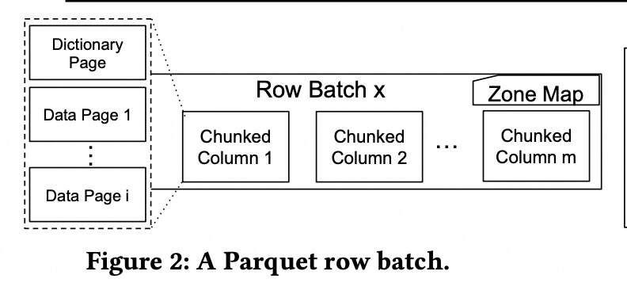

一个 row batch 的一个 chunked column 被划分成了多个 Data Page；“Page的拆分，主要是从编码和压缩的角度，进行拆分，以page为单位进行压缩编码，也可以认为一定程度上起到了内存和CPU上用量的控制”。每个 DataPage 采用 dictionary encoding，如果 dictionary 变得很大的话，就使用 [Plain encoding](https://github.com/apache/parquet-format/blob/master/Encodings.md#plain-plain--0)

文件 footer 还包含每个 row batch 的统计信息（Zone Map），比如 min，max，null值的数量等；利用这些统计信息，可以进行 data skipping，避免读取不必要的数据。

### [ORC](https://orc.apache.org/specification/ORCv2/)

ORC 的结构如下所示：

ORC 的一个 strip 就是一个 RowBatch，每个 Strip 都包含一个 Index Data，Row Data，Stripe Footer。

IndexData：列的 min/max 值，bloom filter 等； 列在 RowGroup 的起始位置和偏移量。

Row Data：存储具体的数据

Strip Footer：

- 每一列的编码信息；

- stream 的 location。在存储上，一列由多个stream 组成，比如对于 Integer 列和 String 列，其表示如下：

┌─────────────────────────────────────┐

│ Column 1 (Integer): │

│ ├─ PRESENT Stream (null 标记) │

│ └─ DATA Stream (实际编码过后数据) │

├─────────────────────────────────────┤

│ Column 2 (String): │

│ ├─ PRESENT Stream (null 标记) │

│ ├─ Dictionary data (字典数据) │

| ├─ Dictionary length (字典长度） │

│ └─Encoded row data (实际编码过后数据) │

└─────────────────────────────────────┘

File footer：strip 的location；每个strip 的行数；列的类型，列在 file level 的统计信息 ，min/max/sum 等；

Postscipt：compression 信息

### 编码的区别

如下是三种列存在默认编码格式的区别：

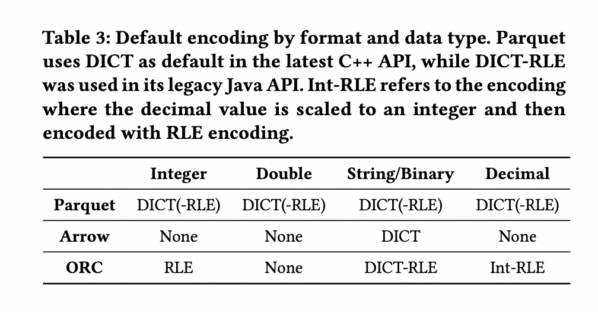

值得注意的是 parquet v2 支持指定不同的 encoding 格式；[https://issues.apache.org/jira/browse/PARQUET-601](https://issues.apache.org/jira/browse/PARQUET-601)

## 列存 Benchmark 结果比较

### 压缩率比较

#### 只使用编码

在数据集上，对数据只使用编码算法，得到的结果如下表所示：

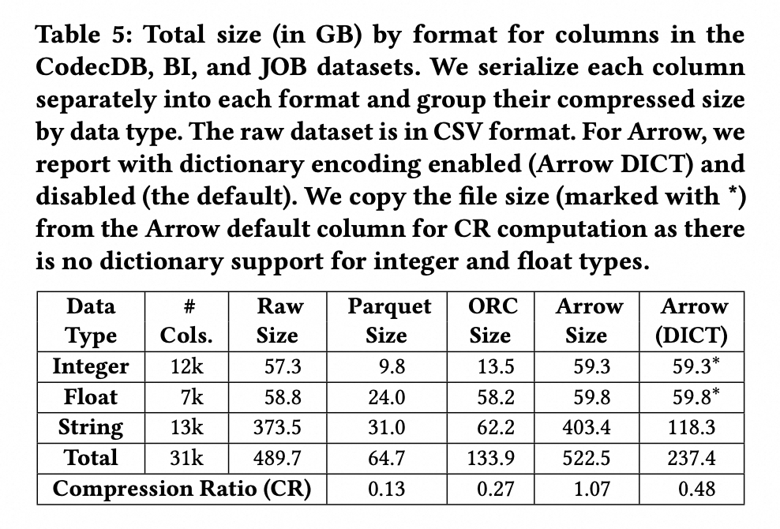

总体来看：Parquet > ORC > Arrow-DICT > Arrow

对于该结果的解释如下：

- Arrow 没有任何编码，且有 metadata 的开销，比如对于 String 类型的数据而言，需要额外记录一下 String 的长度，所以压缩率最差

- Arrow-DICT 采用了字典编码，在 String 类型的数据能很好的压缩，所以比 Plain Arrow 的压缩率高

- ORC 在 Integer 类型和 Float 类型上使用 RLE 编码，在 benchmark 数据集上效果一般

- Parquet 使用 DICT-RLE 编码，在 benchmark 数据集上压缩率最高

#### 使用编码 + 压缩

基于 TPC-DS 数据集进行测试。测试不使用压缩算法和使用不同的压缩算法下不同列格式的压缩率。

对于 Integer 类型，压缩率如下所示：

对于 Integers 类型，无压缩，只编码的情况下，ORC 压缩效果更好。原因是 ORC总是使用 RLE，在 TPC-DS 数据集 Integers 类型数据表现更好，而 Parquet 使用 DICT 编码，表现会更差。但是使用了压缩的话，表现都差不多。

对于 Double 类型，压缩率如下所示：

Parquet 的表现会更好，原因是对于Doubles， ORC 不进行编码，Parquet 则使用 DICT 编码。

对于 String 类型，压缩率如下所示：

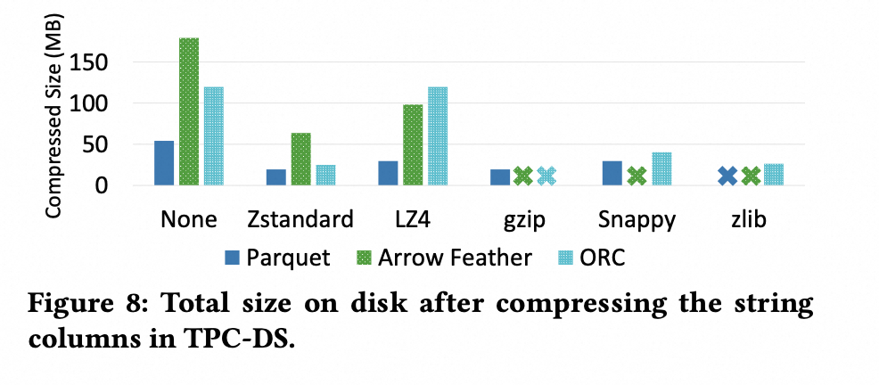

虽然 Parquet 和 ORC 都使用 DICT 编码，但是 Parquet 的表现依然要比 ORC 更好，原因如下：

- ORC 的 Stripe 的 Size 更小，需要更多的 Dictionary

- ORC 的 Stripe 的 Size 更小，相比于 Parquet 较大的 RowGroup，更容易会退到 plain 编码

结论：虽然 Parquet 和 ORC 在不同的数据集，不同列类型上表现各不相同，但综合看下来，Parquet 的压缩率最好。

### 压缩/解压的时间

#### 压缩

基于 TPC-DS 数据集，将内存格式 Arrow 分别序列化成文件格式 Parquet，ORC，Arrow Feather 格式，结果如下图所示：

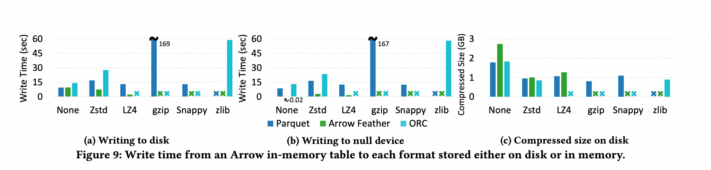

- Arrow Feather 压缩时间最短，但是压缩后的 size 会更大，因为其没有 encoding；

- Parquet 和 ORC 压缩后的 size 差不多，但是 Parquet 的 压缩时间比较短，论文认为是因为 Parquet 对 Arrow 有更好的支持，“arrow 和 parquet share same codebase and data structures”

#### 解压

将文件格式 Parquet，ORC，Arrow Feather 格式从文件中反序列成内存格式 Arrow，其结果如下所示：

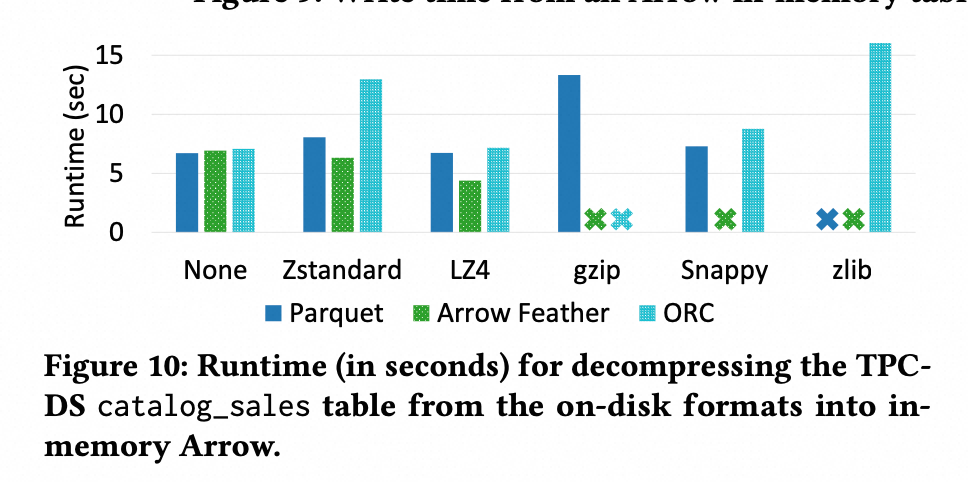

- LZ4所需的时间更少，因为它需要更少的 Disk IO（文件更小），相对于其他解压缩算法，提供了较快的解压

- Arrow 总是更快，因为它没有encoding；ORC 最慢，论文认为 ORC 更慢的原因是压缩的配置，比如 block size，buffer size等导致的

从文件中反序列成内存格式 Arrow 会有 Disk IO 的干扰，论文排除 Disk IO 干扰（直接从内存中反序列成 Arrow 格式），得到如下的结果：

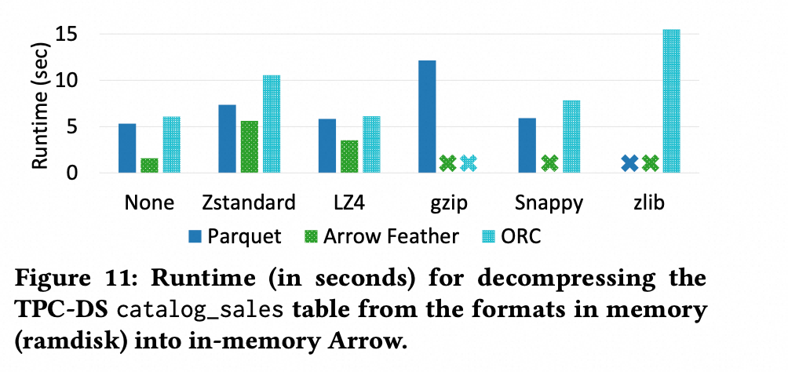

可以看到，在所有的 Case 下， 都会变得更快。特别是对于没有压缩的 Arrow 格式而言。

但是同时也可以看到，对于有压缩的 case，排除 Disk IO 并没有带来很大的提升，因为此时瓶颈在于 CPU，而不是从磁盘 Load 数据

### 列访问效率的比较

#### 列裁剪 projection

基于 TPC-DS 数据集，对于Integers 类型和 Doubles 类型的列，其裁剪的 benchmark 结果如下所示：

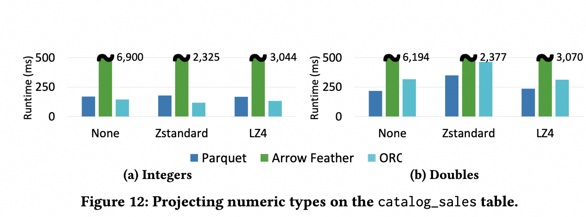

- 对于 Integers，ORC 效率最高，因为它使用 RLE 编码，有更高的压缩率，因此需要更少的IO

- Parquet 使用 DICT，效率较差，有额外的 Dict 加载 开销，decoding 也需要 lookup dict。

- Arrow Feather 最差，需要先 load 所有列到内存，然后再在内存进行列裁剪

而对于 String 类型的列，其裁剪的 benchmark 结果如下所示：

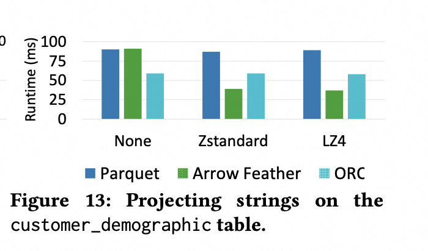

对于 String，Arrow 反而更好；String下，Parquet 和 ORC 压缩效率没那么高，对 disk io 的 reduce 并不是决定性的，但是 parquet 和 orc 又带来了 decoding 开销；而 arrow 没有任何decoding 开销，效率更高；

#### 列 Filter

基于 TPC-DS 数据集，对于Integers 类型和 Doubles 类型的列进行过滤（过滤谓词可以过滤掉 35% ～ 70% 左右的数据），其 benchmark 结果如下所示：

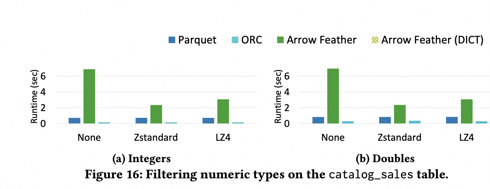

因为大部分时间都在 load 数据，filter 的时间占比很少，所以 parquet 和 orc 的性能更好。

在 String 类型上进行过滤，并且排除 load 数据的干扰（这个表很小，可以排除掉 load 数据的干扰），其 benchmark 结果如下所示：

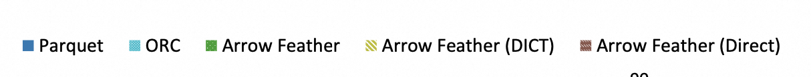

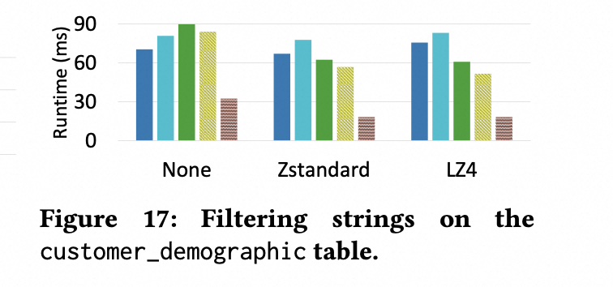

Arrow Feather 性能最好，因为没有 decoding。parquet 性能比 orc 好，因为 orc 需要将一批数据 load 到内存，有额外的 string 的 copy。而 parquet 是流式api，可以避免 load 将被过滤掉的数据到内存。

另外一个实验是测试“过滤谓词的过滤率” 对耗时的影响。论文的步骤是构造一个 bit vector 来表示是否 select 出了数据，然后将列的数据 load 到内存，对数据 apply 这个 bit vector。其 benchmark 结果如下所示：

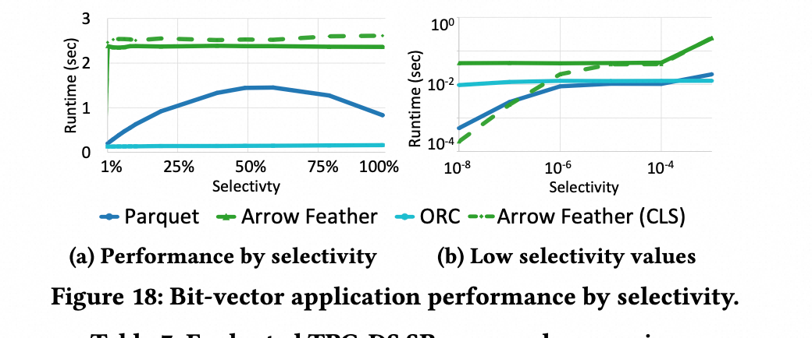

- Arrow 和 ORC 耗时不会随着 selectivity（用来评估多少数据被 select 出来） 的变化而变化，因为都是 load 一批数据到内存，然后 apply bit vector；

- 而 Parquet 是流式读取数据，只有apply bit vector 上的才会 decode 数据；所以耗时随着 selectivity 的不同而会有差异；当 selectivity 为 50%，耗时最多，论文的解释是为 50% 的时候，分支预测的错误为最大 “the point at which the largest number of branch mispredictions occur.”

- 当 selectivity 较大的时候，ORC 的耗时更少；ORC 耗时更少的原因是 ORC 有专门的内存表示格式， ORC 的批量加载数据的机制更适合高 selectivity 场景。但是当 selectivity 较小的时候，Parquet 的耗时更少，因为 Parquet 需要 decode 更少的数据；

### 在 TPC-DS数据集上执行子表达式求值 （Project & Filter）的效率

基于 TPC-DS 数据集和 Query，执行若干联合 Project 和 Filter 的查询语句，其 benchmark 结果如下所示：

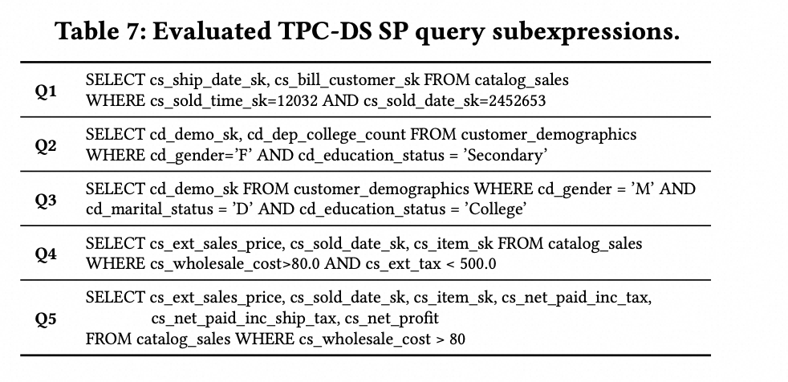

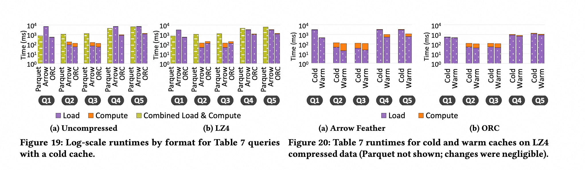

- ORC 的性能最好：

- 加载文件到内存的效率更高

- smaller row batch 带来更高的 data skipping；但是会带来更多的空间开销

- 对于Arrow， load 文件到内存的效率最低；但是当 Arrow 使用压缩的话，效率有所提升，会比 parquet 效率高点；

## 列存上的高级优化手段

### Arrow 上的优化

- Filter 下推到 Encoded data 上

直接在编码后的数据上进行 filter。Arrow 会对 String 类型数据进行 Dict 编码，于是，过滤条件中的 String 常量可以直接 look up 一下这个 Dict，找到被编码后的 Int 值，然后直接用这个 Int 值在编码后的数据上进行过滤。

- [Gandiva](https://github.com/apache/arrow/tree/main/cpp/src/gandiva)

Arrow 社区的一个子项目，是一个 LLVM-based 的 执行 backend，包含向量化等优化

- Data skipping

修改 Arrow Feather 的 api 来支持 chunk-level skipping

### Parquet 上的优化

- 避免转成 Arrow 内存格式

以 Parquet 原生的内存表示直接将 Parquet 加载到内存中，而不是再转成 Arrow 的内存格式

- 直接在编码后的数据在进行查询，即 Filter 下推到 Encoded data 上

- 使用 SIMD 指令来处理

基于以上的优化，论文分别做了采用不同优化技术的对照实验，结果如下所示：

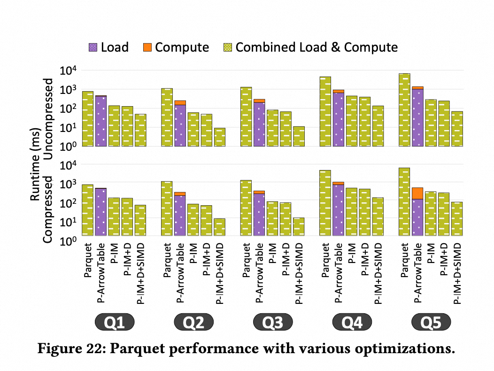

其中

- Parquet：不使用任何优化，直接使用 Paruqet 的流式 API

- P-ArrowTable：将 parquet 加载成 arrow 格式

- P-IM： Parquet 原生的内存表示

- P-IM+D：P-IM & 支持直接处理编码后的数据

- P-IM+D+SIMD：P-IM+D & 支持 simd 来进行处理

可以看到使用了这些优化技术后，性能有所提升。

## 总结

每种列存格式都有各自的取舍，在不同的工作负载下表现各异，没有一种格式能在所有场景下胜出：

| 评估维度 | 最佳格式 | 核心优势 |
|---------|---------|---------|
| 压缩率 | Parquet | 编码与压缩机制最完善，压缩率最高 |
| 压缩时间 | Arrow Feather | 无需编码，压缩速度最快 |
| 解压缩时间 | Arrow Feather | 无需编码，解压速度最快 |
| 列裁剪 | ORC & Parquet | 读取时可直接跳过不需要的列 |
| 列谓词过滤 | ORC | 专有的内存格式使文件加载更高效，适合高选择率的过滤场景 |
| 子表达式求值（Project + Filter） | ORC | 专有的内存格式加载效率高，且更细粒度的 data skipping 进一步减少无效数据读取 |

因此，构建现代 OLAP 系统需要综合考虑磁盘格式、内存格式和查询引擎三者的协同设计。

PS：之前听过一个分享说 Parquet 已经成为事实标准，但是我一直很想知道为什么Parquet就成为事实标准，可以一起交流一下。
